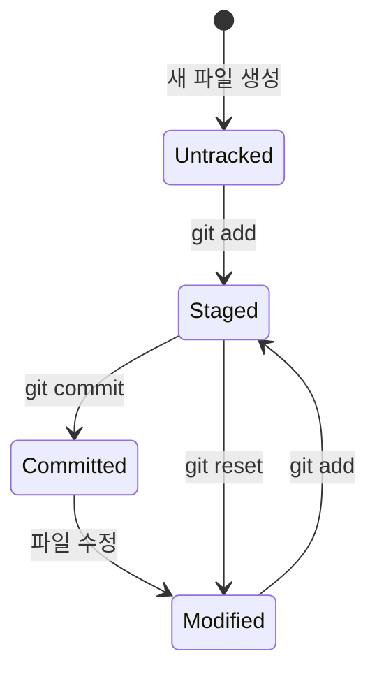
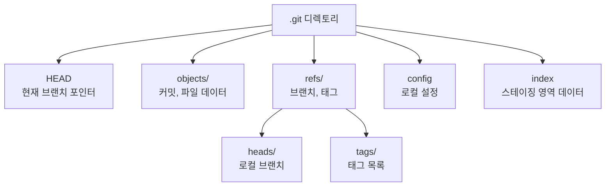

# 첫 번째 저장소

> git init, 작업 디렉토리·스테이징·저장소의 3단계 구조

## 개요

이제 진짜 Git을 써볼 차례입니다! 이 섹션에서는 `git init`으로 저장소를 만들고, Git이 파일을 관리하는 핵심 구조인 **3단계 영역**을 이해합니다. 이 구조를 이해하면 이후 모든 Git 명령어가 자연스럽게 이해됩니다.

**선수 지식**: [설치와 초기 설정](./02-install-setup.md)에서 Git 설치 및 `user.name`/`user.email` 설정 완료
**학습 목표**:
- `git init`으로 새 저장소를 만들 수 있다
- 작업 디렉토리, 스테이징 영역, 저장소의 역할을 설명할 수 있다
- `.git` 디렉토리의 의미를 이해한다

## 왜 알아야 할까?

Git의 3단계 구조는 **Git을 이해하는 가장 중요한 열쇠**입니다. "왜 `add`를 하고 나서 `commit`을 따로 해야 하지?"라는 의문, 한 번쯤 가져보셨죠? 이 구조를 알면 그 이유가 명확해지고, 앞으로 배울 모든 명령어가 퍼즐 맞추듯 딱 들어맞게 됩니다.

## 핵심 개념

### git init — 저장소 만들기

> 💡 **비유**: `git init`은 **빈 노트를 새로 펼치는 것**과 같습니다. 아직 아무것도 기록하지 않았지만, 이 순간부터 모든 변경 사항을 기록할 준비가 된 거예요.

`git init`은 현재 디렉토리를 Git 저장소로 초기화합니다. 실행하면 숨겨진 `.git` 디렉토리가 생성되는데, 이곳에 Git이 관리하는 모든 데이터가 저장됩니다.

```bash
# 새 프로젝트 폴더 만들기
mkdir my-first-repo
cd my-first-repo

# Git 저장소로 초기화
git init
```

```output
Initialized empty Git repository in /Users/you/my-first-repo/.git/
```

```bash
# .git 디렉토리 확인 (숨겨진 파일 보기)
ls -la
```

```output
total 0
drwxr-xr-x   3 you  staff   96  2 15 10:00 .
drwxr-xr-x  10 you  staff  320  2 15 10:00 ..
drwxr-xr-x   9 you  staff  288  2 15 10:00 .git
```

> ⚠️ **흔한 오해**: "`.git` 폴더를 삭제하면 파일이 사라진다" — 아닙니다. `.git`을 삭제하면 **Git의 버전 이력만 사라지고**, 작업 디렉토리의 파일은 그대로 남아 있습니다. 하지만 모든 커밋 기록이 영구적으로 삭제되니 절대 함부로 하지 마세요!

### Git의 3단계 구조

Git에서 파일이 커밋되기까지는 세 개의 영역을 거칩니다. 이것이 Git을 이해하는 **가장 핵심적인 개념**입니다.

> 💡 **비유**: 온라인 쇼핑에 비유해 볼까요?
> - **작업 디렉토리** = 쇼핑몰에서 물건을 구경하는 단계 (파일을 수정하는 곳)
> - **스테이징 영역** = 장바구니 (커밋에 포함할 파일을 골라 담는 곳)
> - **저장소** = 결제 완료 (확정된 변경 사항이 영구 기록되는 곳)
>
> 장바구니에 담았다고 바로 결제되지 않듯, `add`했다고 바로 커밋되지 않습니다!

**1. 작업 디렉토리 (Working Directory)**

실제로 파일을 편집하는 공간입니다. 여러분의 프로젝트 폴더 자체가 작업 디렉토리예요. 여기서 파일을 만들고, 수정하고, 삭제합니다.

**2. 스테이징 영역 (Staging Area / Index)**

커밋에 포함시킬 변경 사항을 **미리 골라두는 공간**입니다. `git add` 명령어로 파일을 이곳에 올립니다. "이번 커밋에는 이 파일들만 포함시키겠다"고 선택하는 과정이죠.

**3. 저장소 (Repository / .git directory)**

`git commit`으로 확정된 스냅샷이 영구 저장되는 공간입니다. `.git` 디렉토리 안에 모든 커밋 이력이 보관됩니다.

이 흐름을 정리하면:

> 📊 **그림 1**: Git의 3단계 구조와 명령어 흐름


> **파일 수정** → `git add` → **스테이징** → `git commit` → **저장소에 기록**

### 파일의 상태 변화

Git에서 파일은 네 가지 상태 중 하나에 놓입니다:

> 📊 **그림 2**: 파일 상태 변화 흐름




| 상태 | 영문 | 설명 |
|------|------|------|
| 추적 안 됨 | Untracked | Git이 아직 모르는 새 파일 |
| 수정됨 | Modified | 추적 중인 파일이 변경됨 |
| 스테이징됨 | Staged | 다음 커밋에 포함될 준비 완료 |
| 커밋됨 | Committed | 저장소에 안전하게 기록됨 |

```bash
# 새 파일 만들기 — 아직 Untracked
echo "# My First Project" > README.md

# 파일 상태 확인
git status
```

```output
On branch main

No commits yet

Untracked files:
  (use "git add <file>..." to include in what will be committed)
	README.md

nothing added to commit but untracked files present (use "git add" to track)
```

```bash
# 스테이징 영역에 추가 — Staged
git add README.md

git status
```

```output
On branch main

No commits yet

Changes to be committed:
  (use "git rm --cached <file>..." to unstage)
	new file:   README.md
```

```bash
# 커밋 — Committed
git commit -m "프로젝트 초기화: README 추가"
```

```output
[main (root-commit) a1b2c3d] 프로젝트 초기화: README 추가
 1 file changed, 1 insertion(+)
 create mode 100644 README.md
```

### .git 디렉토리 들여다보기

`.git` 안에는 어떤 것들이 있을까요? 지금은 전부 이해할 필요 없지만, 대략적인 구조를 알아두면 좋습니다:

> 📊 **그림 3**: .git 디렉토리 내부 구조




```bash
# .git 내부 구조 확인
ls .git/
```

```output
HEAD        config      description hooks       info        objects     refs
```

| 항목 | 역할 |
|------|------|
| `HEAD` | 현재 브랜치를 가리키는 포인터 |
| `config` | 이 저장소의 로컬 설정 |
| `objects/` | 커밋, 파일 내용 등 모든 데이터 |
| `refs/` | 브랜치, 태그 등의 참조 |

> 💡 **알고 계셨나요?**: `.git` 디렉토리의 이 구조는 2005년 Git이 처음 만들어진 이후 근본적으로 바뀌지 않았습니다. Linus Torvalds의 초기 설계가 그만큼 탄탄했다는 뜻이죠. 더 깊은 내부 구조는 [Git 내부 구조](../09-history-internals/05-git-internals.md)에서 자세히 다룹니다.

## 실습: 직접 해보기

처음부터 끝까지 따라해 봅시다:

```bash
# 1. 프로젝트 폴더 만들기
mkdir git-practice
cd git-practice

# 2. Git 저장소 초기화
git init

# 3. 파일 만들기
echo "Hello, Git!" > hello.txt
echo "# Git Practice" > README.md

# 4. 상태 확인 (두 파일 모두 Untracked)
git status

# 5. hello.txt만 스테이징
git add hello.txt

# 6. 상태 다시 확인 (hello.txt는 Staged, README.md는 여전히 Untracked)
git status

# 7. README.md도 스테이징
git add README.md

# 8. 첫 커밋!
git commit -m "첫 번째 커밋: hello.txt와 README 추가"

# 9. 커밋 기록 확인
git log
```

```output
commit a1b2c3d4e5f6... (HEAD -> main)
Author: 홍길동 <gildong@example.com>
Date:   Sat Feb 15 10:30:00 2026 +0900

    첫 번째 커밋: hello.txt와 README 추가
```

> 🔥 **실무 팁**: `git add .`은 현재 디렉토리의 모든 변경 파일을 한 번에 스테이징합니다. 편리하지만, 의도하지 않은 파일(임시 파일, 비밀 키 등)이 포함될 수 있으니 `git status`로 먼저 확인하는 습관을 들이세요.

## 흔한 오해와 팁

> ⚠️ **흔한 오해**: "스테이징 영역은 불필요한 단계다" — 스테이징이 있어서 **하나의 작업 세션에서 여러 논리적 커밋을 분리**할 수 있습니다. 예를 들어 버그를 고치면서 동시에 새 기능도 추가했다면, `git add`로 관련 파일만 골라서 각각 별도의 커밋으로 만들 수 있죠.

> 💡 **알고 계셨나요?**: 스테이징 영역의 공식 이름은 "Index"입니다. Git 내부 코드에서는 "index"라고 부르고, `.git/index` 파일에 저장됩니다. "Staging Area"는 개념을 이해하기 쉽도록 나중에 붙은 별명이에요.

## 핵심 정리

| 개념 | 설명 |
|------|------|
| `git init` | 현재 디렉토리를 Git 저장소로 초기화 |
| 작업 디렉토리 | 파일을 실제로 편집하는 공간 |
| 스테이징 영역 | 커밋에 포함할 변경 사항을 골라두는 중간 단계 |
| 저장소 (.git) | 커밋된 스냅샷이 영구 저장되는 공간 |
| `git status` | 파일의 현재 상태를 확인하는 명령어 |

## 다음 섹션 미리보기

저장소를 만들고 첫 커밋까지 해봤습니다! 다음 섹션 [커밋의 기본](./04-commit-basics.md)에서는 `add`, `commit`, `status`, `log` 명령어를 더 깊이 파고들어, 능숙하게 변경 사항을 기록하는 법을 배웁니다.

## 참고 자료

- [Pro Git Book — Git 기초: 저장소 만들기](https://git-scm.com/book/ko/v2/Git%EC%9D%98-%EA%B8%B0%EC%B4%88-Git-%EC%A0%80%EC%9E%A5%EC%86%8C-%EB%A7%8C%EB%93%A4%EA%B8%B0) - `git init`과 `git clone`의 공식 설명
- [Git 공식 문서 — git-init](https://git-scm.com/docs/git-init) - `git init`의 모든 옵션
- [Git Internals: Understanding the Staging Area](https://www.developernation.net/blog/git-internals-part-3-understanding-the-staging-area-in-git/) - 스테이징 영역의 내부 동작 원리
