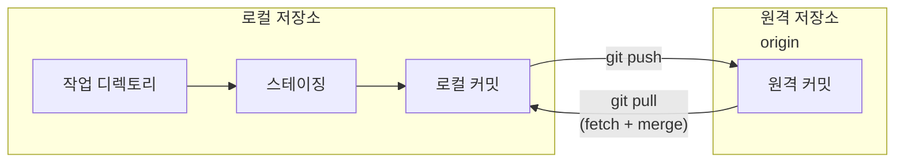
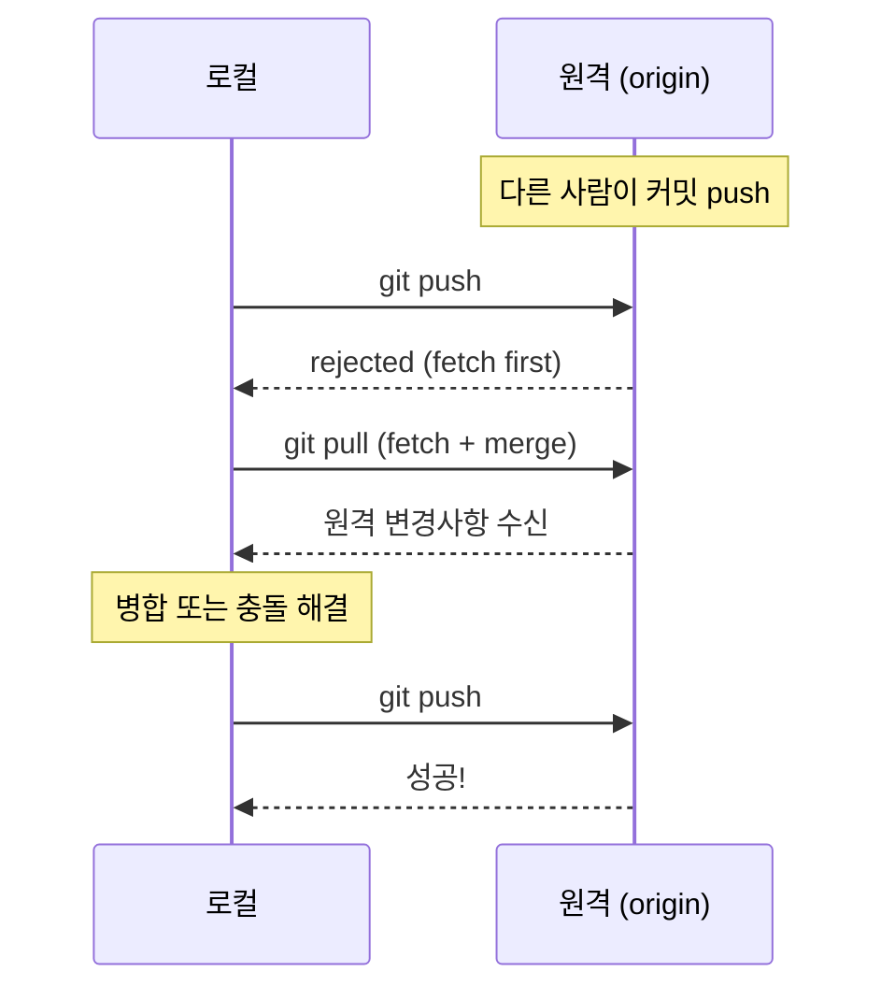
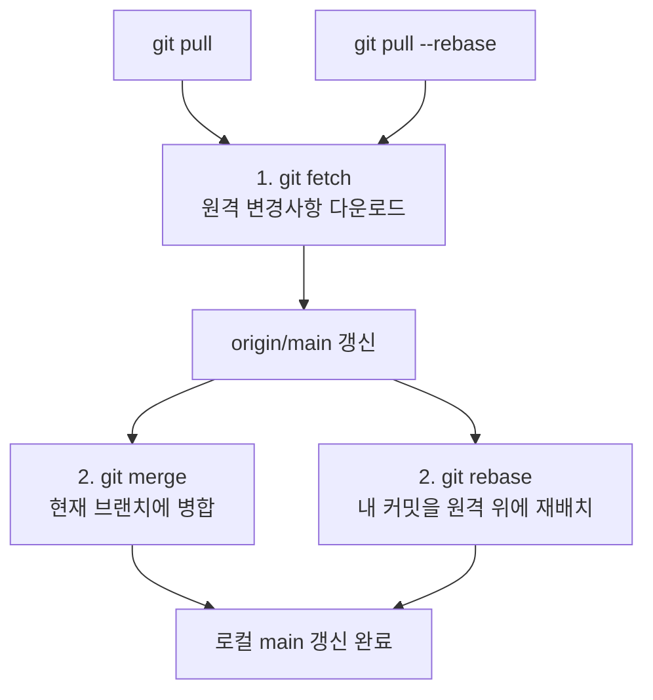
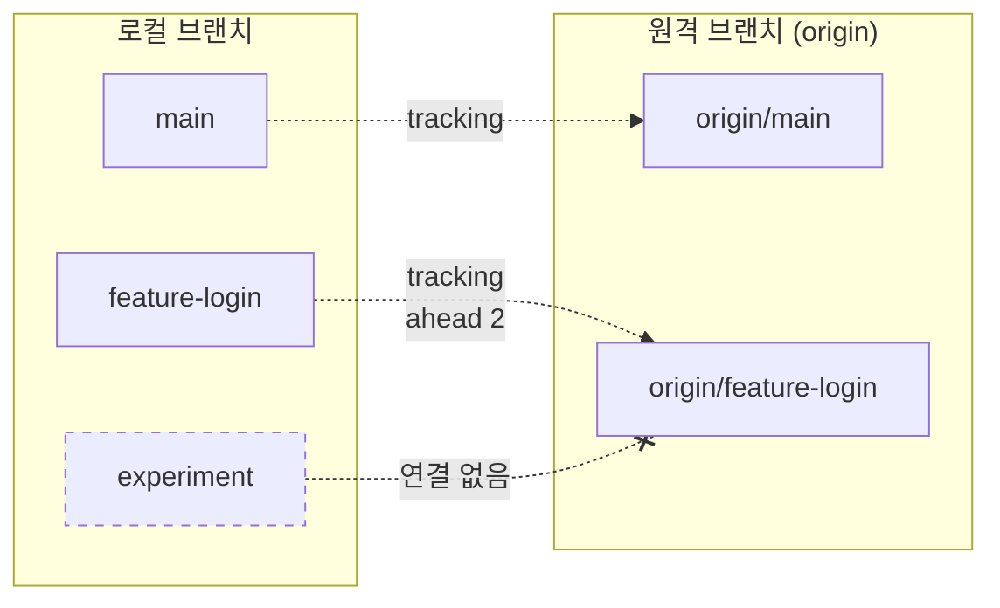
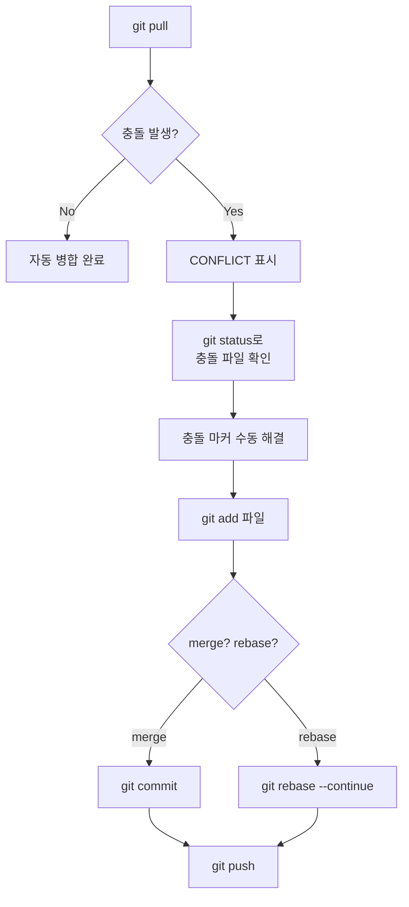

# push와 pull

> 원격 동기화, tracking branch, pull 충돌 해결

## 개요

원격 저장소를 연결하고, clone이나 fork로 코드를 가져왔습니다. 이제 가장 중요한 단계 — **변경사항을 주고받는 방법**을 배울 차례입니다. `push`로 내 코드를 올리고, `pull`로 다른 사람의 코드를 받아오는 것이 원격 작업의 핵심이거든요.

**선수 지식**: [원격 저장소 개념](./01-remote-concept.md), [clone과 fork](./02-clone-fork.md)
**학습 목표**:
- `git push`와 `git pull`의 동작 원리를 이해한다
- tracking branch(추적 브랜치)의 개념과 설정 방법을 안다
- pull 시 발생하는 충돌을 해결할 수 있다
- push가 거부되는 상황에 대처할 수 있다

## 왜 알아야 할까?

> 📊 **그림 1**: push와 pull의 전체 흐름




`push`와 `pull`은 **매일 수십 번 사용하는 명령어**입니다. "코드 올려놨어", "최신 코드 받아와"라는 대화가 곧 push와 pull이죠. 하지만 단순해 보이는 이 명령어도 tracking branch, fast-forward, 충돌 같은 개념을 모르면 예상치 못한 에러 앞에서 멘붕에 빠지기 쉽습니다.

## 핵심 개념

### 개념 1: git push — "내 작업을 올리기"

> 💡 **비유**: push는 **편지를 우체통에 넣는 것**과 비슷합니다. 내가 쓴 편지(커밋)를 우체통(원격 저장소)에 넣으면, 다른 사람들이 그 편지를 받아볼 수 있게 되죠.

`git push`는 로컬 브랜치의 커밋을 원격 저장소에 전송합니다.

```bash
# 기본 push (현재 브랜치를 origin에 push)
git push

# 원격과 브랜치를 명시적으로 지정
git push origin main

# 처음 push할 때 — tracking 관계 설정 (-u 또는 --set-upstream)
git push -u origin feature-login
```

`-u` 플래그가 중요합니다. 이것을 한 번 설정하면, 이후에는 `git push`만 입력해도 어디로 보낼지 Git이 알고 있습니다.

```bash
# -u 설정 전
git push origin feature-login  # 매번 origin과 브랜치명을 적어야 함

# -u 설정 후
git push  # 끝! Git이 알아서 origin/feature-login에 push
```

#### push가 거부되는 경우

원격에 내가 모르는 새 커밋이 있으면 push가 거부됩니다:

```bash
git push
```

```error
To https://github.com/username/project.git
 ! [rejected]        main -> main (fetch first)
error: failed to push some refs to 'https://github.com/username/project.git'
hint: Updates were rejected because the remote contains work that you do
hint: not have locally. Integrate the remote changes
hint: (e.g., 'git pull ...') before pushing again.
```

이 에러가 뜨면 **pull을 먼저** 해야 합니다. 원격의 변경사항을 받아서 합친 후에 push할 수 있어요.

> 📊 **그림 5**: push 거부 시 해결 흐름




> ⚠️ **흔한 오해**: "push가 안 되면 `--force`를 쓰면 된다" — 절대 안 됩니다! `--force`는 원격의 커밋을 **덮어써버리기** 때문에 다른 팀원의 작업이 사라질 수 있습니다. 정말 불가피한 경우에만 `--force-with-lease`를 사용하세요.

```bash
# ⚠️ 위험! 원격의 커밋을 덮어씀 — 팀 프로젝트에서 사용 금지!
git push --force

# 비교적 안전 — 내가 마지막으로 fetch한 이후 원격에 새 커밋이 없을 때만 허용
git push --force-with-lease
```

### 개념 2: git pull — "다른 사람의 작업 받아오기"

> 💡 **비유**: pull은 **우편함에서 편지를 꺼내 읽는 것**입니다. 다른 사람이 보낸 편지(커밋)를 가져와서 내 작업과 합치는 거죠.

`git pull`은 실은 **두 가지 작업을 한 번에** 합니다:

> 📊 **그림 2**: git pull = fetch + merge




1. `git fetch` — 원격의 변경사항을 다운로드
2. `git merge` — 다운로드한 변경사항을 현재 브랜치에 병합

```bash
# 기본 pull
git pull

# 원격과 브랜치를 명시
git pull origin main
```

#### pull의 두 가지 모드: merge vs rebase

기본적으로 `git pull`은 **merge** 방식으로 동작합니다. 하지만 rebase 방식도 선택할 수 있어요:

```bash
# merge 방식 (기본) — 머지 커밋이 생길 수 있음
git pull

# rebase 방식 — 히스토리가 깔끔한 일직선
git pull --rebase
```

| 방식 | 결과 | 장점 | 단점 |
|------|------|------|------|
| `git pull` (merge) | 머지 커밋 생성 가능 | 히스토리가 정확 | 커밋 그래프가 복잡해질 수 있음 |
| `git pull --rebase` | 내 커밋을 원격 위에 재배치 | 히스토리가 깔끔 | 충돌 해결이 커밋마다 필요할 수 있음 |

```bash
# pull 기본 모드를 rebase로 변경 (전역 설정)
git config --global pull.rebase true
```

> 🔥 **실무 팁**: 많은 팀에서 `pull.rebase true`를 기본 설정으로 사용합니다. 불필요한 머지 커밋이 줄어들어 히스토리가 깔끔해지거든요. 단, rebase에 익숙하지 않다면 [Rebase 기초](../08-advanced-branch/01-rebase.md)를 먼저 학습하세요.

### 개념 3: Tracking Branch (추적 브랜치)

> 💡 **비유**: tracking branch는 **나비와 실**과 비슷합니다. 로컬 브랜치(나비)와 원격 브랜치(꽃)를 실로 연결해두면, push/pull할 때 어디로 가야 할지 자동으로 알 수 있죠.

tracking branch는 특정 원격 브랜치를 **자동으로 따라가도록 설정된 로컬 브랜치**입니다.

> 📊 **그림 3**: Tracking Branch 관계




```bash
# tracking 관계 확인
git branch -vv
```

```output
* main           a1b2c3d [origin/main] Initial commit
  feature-login  e4f5g6h [origin/feature-login: ahead 2] Add login page
  experiment     i7j8k9l 로컬 실험 (tracking 없음)
```

- `[origin/main]` — origin/main을 추적 중, 동기화됨
- `[origin/feature-login: ahead 2]` — origin보다 2개 커밋 앞서 있음 (push 필요)
- tracking 없음 — 원격과 연결 안 됨

```bash
# 기존 브랜치에 tracking 설정
git branch --set-upstream-to=origin/feature-login feature-login

# 줄임 형태
git branch -u origin/feature-login

# 원격 브랜치를 기반으로 로컬 브랜치 만들기 (자동 tracking)
git switch -c feature-login origin/feature-login

# 원격 브랜치와 이름이 같으면 더 간단하게
git switch feature-login
```

마지막 명령어가 편리한데, 로컬에 `feature-login`이 없지만 `origin/feature-login`이 있으면 Git이 자동으로 tracking을 설정해줍니다.

### 개념 4: pull 시 충돌 해결

pull 중 같은 파일의 같은 부분을 수정했다면 충돌이 발생합니다:

> 📊 **그림 4**: pull 충돌 해결 프로세스




```bash
git pull
```

```error
Auto-merging app.py
CONFLICT (content): Merge conflict in app.py
Automatic merge failed; fix conflicts and then commit the result.
```

해결 방법은 [충돌 해결](../03-branch/04-conflict.md)에서 배운 것과 동일합니다:

```bash
# 1. 충돌 파일 확인
git status

# 2. 충돌 마커를 찾아서 수동 해결
# <<<<<<< HEAD (내 변경)
# =======
# >>>>>>> origin/main (원격 변경)

# 3. 해결 후 스테이징
git add app.py

# 4. 머지 커밋 완성
git commit

# 5. 해결된 상태를 원격에 push
git push
```

rebase 모드(`git pull --rebase`) 중 충돌이 발생하면:

```bash
# 충돌 해결 후
git add app.py

# ⚠️ commit이 아니라 --continue!
git rebase --continue

# 또는 rebase 자체를 취소
git rebase --abort
```

### 개념 5: push/pull 실전 패턴

#### 아침에 출근하면 (하루 시작)

```bash
# 최신 코드 받아오기
git switch main
git pull

# 작업 브랜치 갱신
git switch feature-work
git rebase main
```

#### 작업 완료 후 (하루 마무리)

```bash
# 커밋 후 push
git add .
git commit -m "Add search feature"
git push
```

#### 새 브랜치로 처음 push할 때

```bash
# -u로 tracking 설정과 push를 동시에
git push -u origin feature-new
```

## 실습: 직접 해보기

```bash
# 1. 실습 환경 구성 (두 개의 작업공간으로 협업 시뮬레이션)
mkdir -p /tmp/push-pull-practice
cd /tmp/push-pull-practice

# 원격 저장소 (bare)
mkdir remote.git
cd remote.git && git init --bare && cd ..

# 개발자 A 작업공간
git clone remote.git dev-a
cd dev-a
echo "# 프로젝트" > README.md
git add . && git commit -m "초기 커밋"
git push -u origin main
cd ..

# 개발자 B 작업공간
git clone remote.git dev-b

# 2. 개발자 A가 변경
cd dev-a
echo "기능 A 추가" > feature.txt
git add . && git commit -m "기능 A 추가"
git push
cd ..

# 3. 개발자 B가 pull로 변경사항 받기
cd dev-b
git pull
cat feature.txt  # "기능 A 추가" 확인!

# 4. 동시 수정 → 충돌 시뮬레이션
echo "B가 수정한 내용" > feature.txt
git add . && git commit -m "B의 수정"
cd ..

cd dev-a
echo "A가 다시 수정한 내용" > feature.txt
git add . && git commit -m "A의 재수정"
git push
cd ..

# 5. B가 push 시도 → 거부됨!
cd dev-b
git push  # ← 에러 발생!

# 6. pull 후 충돌 해결
git pull
# 충돌 해결 후:
echo "A와 B의 내용을 합침" > feature.txt
git add feature.txt
git commit -m "충돌 해결"
git push  # 이제 성공!
```

## 더 깊이 알아보기

### push의 기본 동작이 바뀐 역사

Git 초기에는 `git push`의 기본 동작이 **모든 브랜치를 한꺼번에 push**하는 `matching` 모드였습니다. `git push`를 실행하면 로컬과 원격에 같은 이름의 브랜치가 있는 것을 전부 push했죠. 이 때문에 "의도하지 않은 브랜치까지 push돼 버렸다!"는 사고가 자주 발생했습니다.

Git 2.0(2014년)부터 기본 동작이 `simple` 모드로 바뀌었습니다. 현재 체크아웃된 브랜치만, 그것도 tracking이 설정된 원격 브랜치에만 push하도록 변경된 거예요. 훨씬 안전해진 셈이죠.

```bash
# push 기본 동작 확인
git config --global push.default
```

```output
simple
```

| 모드 | 동작 |
|------|------|
| `simple` (기본) | 현재 브랜치를 같은 이름의 원격 브랜치에만 push |
| `current` | 현재 브랜치를 같은 이름으로 push (tracking 무관) |
| `upstream` | 현재 브랜치를 tracking 중인 원격 브랜치에 push |
| `matching` | 이름이 같은 모든 브랜치를 push (구 기본값) |

> 💡 **알고 계셨나요?**: `push.default` 설정이 `matching`에서 `simple`로 바뀔 때, Git은 약 2년(1.x → 2.0)에 걸쳐 경고 메시지를 표시하며 사용자에게 전환을 준비시켰습니다. 이렇게 신중한 전환 과정을 거친 것은 수많은 개발자의 워크플로우에 영향을 미치는 변경이었기 때문이에요.

## 흔한 오해와 팁

> ⚠️ **흔한 오해**: "`git pull`은 항상 안전하다" — 그렇지 않습니다! pull은 fetch + merge이므로, 예상치 못한 머지 커밋이 생기거나 충돌이 발생할 수 있습니다. 중요한 작업 중에는 `git fetch` 후 변경사항을 먼저 확인하고, 그 다음 merge 또는 rebase하는 것이 더 안전합니다. 이 방법은 다음 섹션 [fetch와 remote 관리](./04-fetch-remote.md)에서 자세히 다룹니다.

> 🔥 **실무 팁**: `git push -u origin HEAD`를 사용하면 현재 브랜치 이름을 직접 타이핑하지 않아도 됩니다. `HEAD`가 현재 브랜치를 자동으로 가리키거든요. 긴 브랜치 이름일 때 특히 편리합니다.

> 🔥 **실무 팁**: `git config --global push.autoSetupRemote true`를 설정하면 새 브랜치를 처음 push할 때 `-u` 없이도 자동으로 tracking이 설정됩니다. Git 2.37 이상에서 사용 가능합니다.

## 핵심 정리

| 명령어 | 설명 |
|--------|------|
| `git push` | 로컬 커밋을 원격에 전송 |
| `git push -u origin <브랜치>` | push + tracking 관계 설정 |
| `git pull` | 원격 변경사항을 가져와서 병합 (fetch + merge) |
| `git pull --rebase` | 원격 변경사항 위에 내 커밋을 재배치 |
| `git branch -vv` | tracking 관계와 ahead/behind 상태 확인 |
| `git branch -u origin/<브랜치>` | tracking 관계 수동 설정 |
| `git push --force-with-lease` | 안전한 강제 push (최후의 수단) |
| `push.autoSetupRemote true` | 새 브랜치 push 시 자동 tracking 설정 |

## 다음 섹션 미리보기

`git pull`이 fetch + merge라고 했는데, 그러면 `fetch`만 따로 하면 뭐가 다를까요? 다음 섹션 [fetch와 remote 관리](./04-fetch-remote.md)에서는 **fetch와 pull의 차이**, 다중 remote 관리, 그리고 원격 브랜치를 더 세밀하게 추적하는 방법을 알아봅니다.

## 참고 자료

- [Pro Git Book — Working with Remotes](https://git-scm.com/book/en/v2/Git-Basics-Working-with-Remotes) - push/pull 공식 가이드
- [Git 공식 문서 — git-push](https://git-scm.com/docs/git-push) - push 명령어 전체 옵션
- [Git 공식 문서 — git-pull](https://git-scm.com/docs/git-pull) - pull 명령어 전체 옵션
- [Pro Git Book — Remote Branches](https://git-scm.com/book/en/v2/Git-Branching-Remote-Branches) - tracking branch 동작 원리
