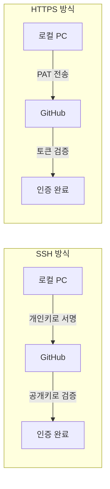
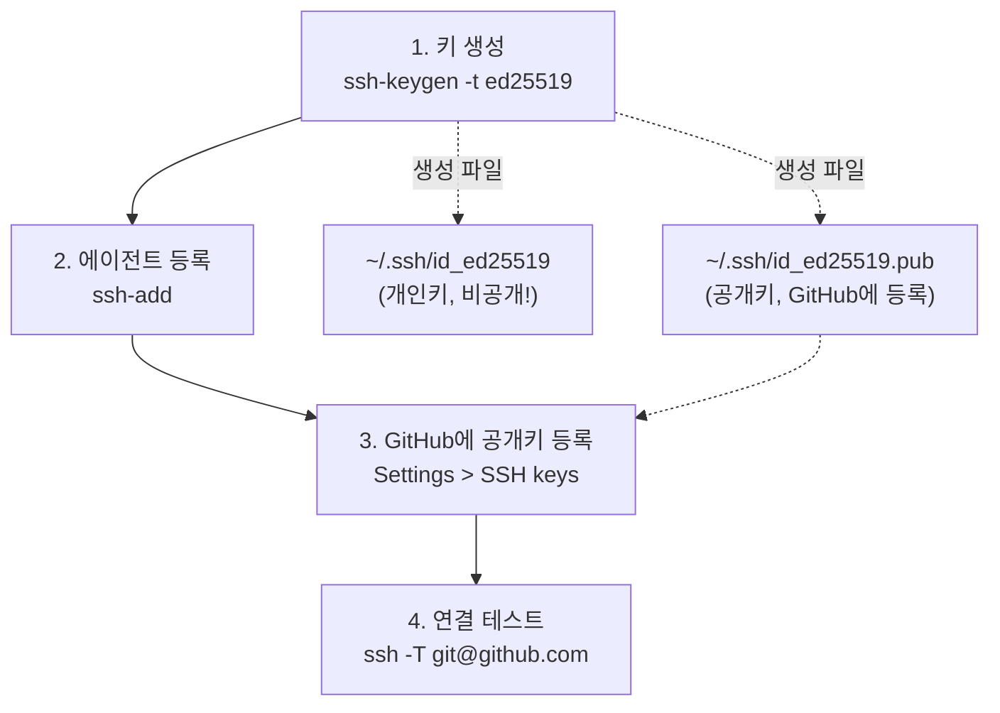
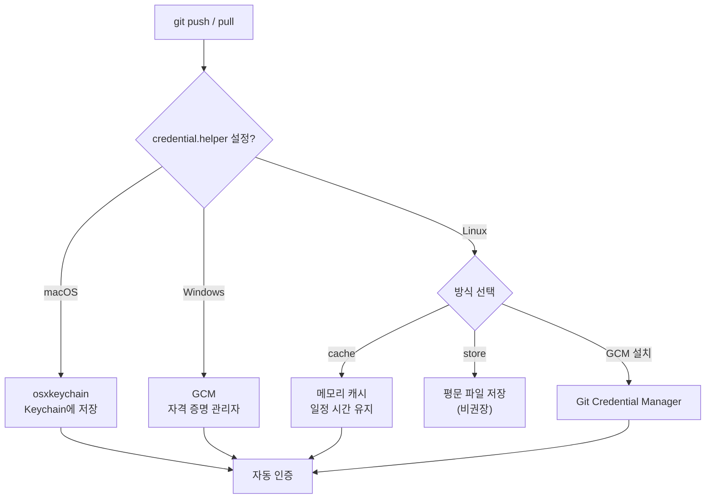
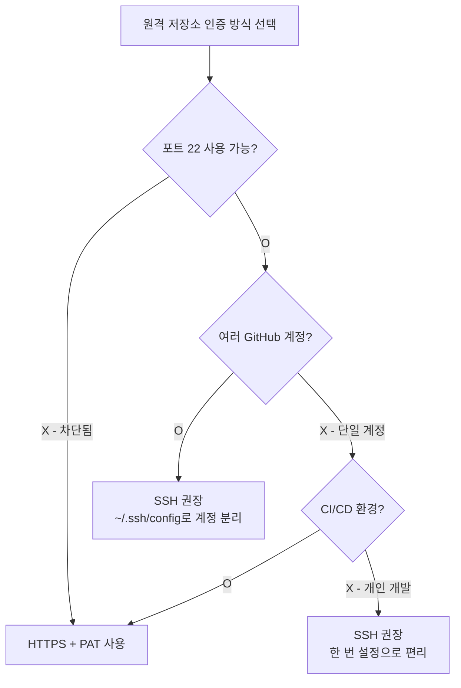

# SSH와 인증

> SSH 키 생성과 등록, HTTPS 토큰, Credential Manager

## 개요

원격 저장소와 소통하는 방법을 배웠는데, 매번 push/pull 할 때마다 비밀번호를 입력하는 건 꽤 번거롭죠? 이번 섹션에서는 **한 번 설정하면 비밀번호 없이 안전하게 원격과 통신하는 방법**을 배웁니다. SSH 키와 HTTPS 토큰, 두 가지 인증 방식의 차이와 설정법을 알아봅시다.

**선수 지식**: [원격 저장소 개념](./01-remote-concept.md), [push와 pull](./03-push-pull.md)
**학습 목표**:
- SSH 키를 생성하고 GitHub에 등록할 수 있다
- HTTPS Personal Access Token(PAT)을 발급하고 사용할 수 있다
- Credential Manager로 인증 정보를 안전하게 저장할 수 있다
- SSH와 HTTPS 중 상황에 맞는 방식을 선택할 수 있다

## 왜 알아야 할까?

GitHub은 2021년 8월부터 **비밀번호 기반 인증을 완전히 폐지**했습니다. 이제 원격 저장소에 접근하려면 SSH 키 또는 토큰(PAT)을 반드시 설정해야 합니다. "왜 push가 안 되지?" 하면서 비밀번호를 여러 번 입력하는 초보자의 대부분이 바로 이 인증 설정을 빠뜨린 경우예요.

## 핵심 개념

### 개념 1: SSH vs HTTPS — 두 가지 연결 방식

> 📊 **그림 1**: SSH와 HTTPS 인증 흐름 비교




> 💡 **비유**: SSH는 **전용 비밀 통로**와 같습니다. 한 번 열쇠(SSH 키)를 만들어 등록하면, 그 뒤로는 열쇠만 가지고 자유롭게 드나들 수 있죠. HTTPS는 **매번 신분증(토큰)을 보여주는 정문**과 비슷합니다. 다만 Credential Manager를 쓰면 신분증을 지갑에 넣어두고 자동으로 보여주게 할 수 있어요.

| 비교 항목 | SSH | HTTPS |
|-----------|-----|-------|
| **URL 형태** | `git@github.com:user/repo.git` | `https://github.com/user/repo.git` |
| **인증 방식** | 공개키/개인키 쌍 | Personal Access Token (PAT) |
| **초기 설정** | 키 생성 + GitHub 등록 | 토큰 발급 + Credential 저장 |
| **이후 사용** | 비밀번호 입력 불필요 | Credential Manager로 자동화 가능 |
| **방화벽** | 22번 포트 (차단될 수 있음) | 443번 포트 (거의 항상 열림) |
| **추천 상황** | 개인 개발 환경, 자주 push/pull | 회사 네트워크, CI/CD, 공유 환경 |

### 개념 2: SSH 키 생성과 등록

> 📊 **그림 2**: SSH 키 설정 4단계 프로세스




#### 1단계: SSH 키 생성

```bash
# Ed25519 알고리즘으로 SSH 키 생성 (현재 권장)
ssh-keygen -t ed25519 -C "your_email@example.com"
```

```console
Generating public/private ed25519 key pair.
Enter file in which to save the key (/Users/you/.ssh/id_ed25519):
Enter passphrase (empty for no passphrase):
Enter same passphrase again:
Your identification has been saved in /Users/you/.ssh/id_ed25519
Your public key has been saved in /Users/you/.ssh/id_ed25519.pub
```

- **파일 경로**: 기본값(Enter)을 권장합니다
- **passphrase**: 보안을 위해 설정하는 것을 권장합니다. 비워두면 편하지만, 키가 유출되면 바로 악용될 수 있어요

> 💡 **알고 계셨나요?**: Ed25519는 2011년에 Daniel J. Bernstein 교수가 설계한 타원 곡선 암호화 알고리즘입니다. 기존의 RSA보다 **키가 짧고, 빠르고, 더 안전**합니다. RSA 4096비트 키보다 Ed25519 256비트 키가 동등하거나 더 높은 보안을 제공하면서, 크기는 수십 분의 1이에요.

```bash
# Ed25519를 지원하지 않는 구형 시스템이라면 RSA 사용
ssh-keygen -t rsa -b 4096 -C "your_email@example.com"
```

#### 2단계: SSH 에이전트에 키 등록

```bash
# macOS / Linux
eval "$(ssh-agent -s)"
ssh-add ~/.ssh/id_ed25519
```

macOS에서는 Keychain에 연동하면 재부팅 후에도 유지됩니다:

```bash
# macOS — Keychain에 passphrase 저장
ssh-add --apple-use-keychain ~/.ssh/id_ed25519
```

macOS에서 SSH config 파일을 설정하면 자동으로 키를 로드합니다:

```bash
# ~/.ssh/config 파일 생성 또는 편집
Host github.com
    AddKeysToAgent yes
    UseKeychain yes
    IdentityFile ~/.ssh/id_ed25519
```

```bash
# Windows (Git Bash)
eval "$(ssh-agent -s)"
ssh-add ~/.ssh/id_ed25519
```

#### 3단계: GitHub에 공개키 등록

```bash
# 공개키 내용 복사
# macOS
pbcopy < ~/.ssh/id_ed25519.pub

# Windows
clip < ~/.ssh/id_ed25519.pub

# Linux
cat ~/.ssh/id_ed25519.pub
# 출력된 내용을 수동 복사
```

GitHub 웹사이트에서:
1. **Settings** → **SSH and GPG keys** → **New SSH key**
2. Title에 식별 가능한 이름 입력 (예: "MacBook Pro 2024")
3. Key에 복사한 공개키 붙여넣기
4. **Add SSH key** 클릭

또는 GitHub CLI로:

```bash
# GitHub CLI로 SSH 키 등록
gh ssh-key add ~/.ssh/id_ed25519.pub --title "MacBook Pro 2024"
```

#### 4단계: 연결 테스트

```bash
ssh -T git@github.com
```

```output
Hi username! You've been successfully authenticated, but GitHub does not provide shell access.
```

이 메시지가 뜨면 성공입니다! 이제 SSH URL로 push/pull할 수 있어요.

```bash
# SSH URL로 clone
git clone git@github.com:username/project.git

# 기존 HTTPS를 SSH로 변경
git remote set-url origin git@github.com:username/project.git
```

### 개념 3: HTTPS + Personal Access Token (PAT)

SSH가 차단된 네트워크이거나, 간단한 설정을 원할 때 HTTPS + PAT 조합을 사용합니다.

#### PAT 발급 (GitHub)

1. GitHub → **Settings** → **Developer settings** → **Personal access tokens** → **Tokens (classic)**
2. **Generate new token** 클릭
3. 이름, 만료일, 권한(scope) 설정:
   - `repo` — 저장소 접근 (가장 기본)
   - `workflow` — GitHub Actions 관련
   - `read:org` — 조직 정보 읽기
4. **Generate token** → 토큰 복사 (이 화면에서만 확인 가능!)

```bash
# HTTPS URL로 clone할 때 토큰 사용
git clone https://github.com/username/project.git
# Username: your-username
# Password: ghp_xxxxxxxxxxxxxxxxxxxx (PAT 입력)
```

> ⚠️ **흔한 오해**: "GitHub 비밀번호를 입력하면 된다" — 2021년 8월부터 GitHub은 비밀번호 인증을 **완전히 폐지**했습니다. Password에는 반드시 PAT(Personal Access Token)를 입력해야 합니다. 일반 비밀번호를 입력하면 인증 오류가 발생해요.

#### Fine-grained PAT (권장)

GitHub은 2022년부터 더 세밀한 권한 관리가 가능한 **Fine-grained Personal Access Token**을 제공합니다:

- 특정 저장소에만 접근 허용
- 읽기/쓰기 권한 분리
- 자동 만료 설정
- 조직 단위 승인 가능

```bash
# GitHub CLI로 인증하면 토큰 관리가 더 편리
gh auth login
```

```console
? What account do you want to log into? GitHub.com
? What is your preferred protocol for Git operations? HTTPS
? Authenticate Git with your GitHub credentials? Yes
? How would you like to authenticate GitHub CLI? Login with a web browser
```

### 개념 4: Credential Manager — 인증 정보 저장

> 📊 **그림 3**: OS별 Credential Manager 동작 방식




매번 토큰을 입력하지 않으려면 Credential Manager를 설정합니다.

#### macOS — Keychain

```bash
# macOS 기본 credential helper 설정
git config --global credential.helper osxkeychain
```

처음 한 번 토큰을 입력하면 macOS Keychain에 저장되어, 이후로는 자동 인증됩니다.

#### Windows — Git Credential Manager

Windows에 Git을 설치하면 **Git Credential Manager (GCM)**가 함께 설치됩니다:

```bash
# Windows — Git Credential Manager (기본 설치됨)
git config --global credential.helper manager
```

GCM은 Windows 자격 증명 관리자에 토큰을 안전하게 저장합니다.

#### Linux — 캐시 또는 저장소

```bash
# 메모리에 일정 시간 캐시 (기본 15분)
git config --global credential.helper cache

# 캐시 시간 변경 (예: 8시간 = 28800초)
git config --global credential.helper 'cache --timeout=28800'
```

```bash
# Git Credential Manager 설치 (Linux에서도 사용 가능)
# https://github.com/git-ecosystem/git-credential-manager 참조
```

> 🔥 **실무 팁**: Linux에서 `credential.helper store`를 사용하면 토큰이 **평문(plain text)**으로 `~/.git-credentials`에 저장됩니다. 보안에 민감한 환경에서는 사용하지 마세요. 대신 GCM이나 `cache`를 권장합니다.

### 개념 5: SSH와 HTTPS 중 어떤 것을 선택할까?

> 📊 **그림 4**: SSH vs HTTPS 선택 가이드




**SSH를 선택하세요**:
- 개인 개발 머신에서 주로 작업
- 한 번 설정하면 오래 사용할 환경
- 포트 22가 차단되지 않은 네트워크

**HTTPS를 선택하세요**:
- 회사 방화벽이 SSH(22번 포트)를 차단
- CI/CD 파이프라인이나 서버 환경
- 여러 GitHub 계정을 사용하는 경우
- 빠르게 설정하고 싶을 때

```bash
# 현재 remote URL 프로토콜 확인
git remote -v

# HTTPS → SSH 전환
git remote set-url origin git@github.com:username/project.git

# SSH → HTTPS 전환
git remote set-url origin https://github.com/username/project.git
```

> 🔥 **실무 팁**: 같은 컴퓨터에서 **개인 GitHub 계정과 회사 GitHub 계정**을 동시에 쓰는 경우, SSH가 편리합니다. `~/.ssh/config`에 호스트별로 다른 키를 지정할 수 있거든요:

```bash
# ~/.ssh/config — 다중 GitHub 계정 설정
Host github.com
    HostName github.com
    User git
    IdentityFile ~/.ssh/id_ed25519_personal

Host github-work
    HostName github.com
    User git
    IdentityFile ~/.ssh/id_ed25519_work
```

```bash
# 개인 계정 저장소
git clone git@github.com:personal/project.git

# 회사 계정 저장소 (github-work 호스트 사용)
git clone git@github-work:company/project.git
```

## 실습: 직접 해보기

```bash
# 1. 현재 SSH 키 확인
ls -la ~/.ssh/

# 2. SSH 키 생성 (없는 경우)
ssh-keygen -t ed25519 -C "your_email@example.com"

# 3. SSH 에이전트 시작 및 키 추가
eval "$(ssh-agent -s)"
ssh-add ~/.ssh/id_ed25519

# 4. 공개키 확인
cat ~/.ssh/id_ed25519.pub

# 5. GitHub 연결 테스트
ssh -T git@github.com

# 6. 기존 저장소 URL 확인
cd your-project
git remote -v

# 7. HTTPS에서 SSH로 전환 (선택)
# git remote set-url origin git@github.com:username/project.git

# 8. credential helper 설정 확인
git config --global credential.helper
```

## 더 깊이 알아보기

### GitHub의 인증 방식 변천사

GitHub의 인증 역사를 돌아보면 보안에 대한 기준이 어떻게 높아졌는지 볼 수 있습니다:

- **2008~2020**: 비밀번호(username + password)로 HTTPS 인증. 편리했지만, 비밀번호 유출 시 계정 전체가 위험
- **2020년 11월**: GitHub이 비밀번호 인증 폐지를 예고
- **2021년 8월 13일**: HTTPS에서 비밀번호 인증을 **완전히 폐지**. PAT 또는 SSH 키만 허용
- **2022년**: Fine-grained PAT 도입으로 더 세밀한 권한 관리 가능
- **2023~현재**: Passkey(FIDO2) 지원 추가, SSH 서명 커밋 지원 확대

이 변화의 배경에는 수많은 비밀번호 유출 사고가 있었습니다. 특히 2020년 npm(JavaScript 패키지 레지스트리)에서 일어난 유출 사고 이후, GitHub은 인증 강화에 속도를 냈습니다.

> 💡 **알고 계셨나요?**: SSH 프로토콜은 1995년 핀란드 헬싱키 공과대학교의 Tatu Ylönen이 발명했습니다. 당시 대학 네트워크에서 패스워드 스니핑 공격이 발생하자, 안전한 원격 접속 방법을 만들기 위해 개발한 것이죠. 이 프로토콜이 30년이 지난 지금도 Git 인증의 핵심 수단으로 쓰이고 있다니 놀랍습니다.

## 흔한 오해와 팁

> ⚠️ **흔한 오해**: "SSH 키는 컴퓨터마다 하나만 만들면 된다" — 아닙니다! 용도별로 다른 키를 만드는 것이 보안상 좋습니다. 개인 GitHub, 회사 GitHub, 서버 접속 등에 각각 다른 키를 사용하면, 하나가 유출되어도 나머지는 안전합니다.

> 🔥 **실무 팁**: `ssh -T git@github.com`으로 연결이 안 되면, 먼저 `ssh -vT git@github.com`으로 디버그 모드를 실행하세요. `-v` 옵션이 연결 과정을 상세히 보여줘서 어디서 문제가 발생했는지 파악할 수 있습니다.

> ⚠️ **흔한 오해**: "PAT는 비밀번호와 같다" — PAT는 비밀번호보다 **훨씬 안전**합니다. 특정 권한만 부여할 수 있고, 만료 기간을 설정할 수 있으며, 필요할 때 개별 토큰만 취소할 수 있거든요. 비밀번호 하나가 전체 계정을 대표하는 것과는 차원이 다릅니다.

## 핵심 정리

| 개념 | 설명 |
|------|------|
| SSH 키 (Ed25519) | 공개키/개인키 쌍으로 비밀번호 없이 인증 |
| PAT | GitHub Personal Access Token, HTTPS 인증에 사용 |
| Fine-grained PAT | 저장소별, 권한별 세밀한 토큰 |
| Credential Manager | 인증 정보를 OS 보안 저장소에 저장 |
| `ssh-keygen -t ed25519` | Ed25519 SSH 키 생성 |
| `ssh -T git@github.com` | GitHub SSH 연결 테스트 |
| `git remote set-url` | 원격 URL 변경 (SSH ↔ HTTPS 전환) |
| `~/.ssh/config` | 호스트별 SSH 키 설정 (다중 계정) |

## 다음 섹션 미리보기

Ch4 원격 저장소의 모든 기초를 마쳤습니다! 원격 개념, clone과 fork, push와 pull, fetch, 그리고 인증까지 배웠죠. 이제 로컬과 원격을 자유롭게 오갈 수 있는 기본기가 완성되었습니다. 다음 챕터 [Ch5. GitHub 시작하기](../05-github-start/01-github-account.md)에서는 **GitHub 플랫폼 자체를 제대로 활용하는 방법** — 프로필 꾸미기, 저장소 생성, GitHub CLI, 마크다운 작성법을 알아봅니다.

## 참고 자료

- [GitHub Docs — SSH로 연결](https://docs.github.com/en/authentication/connecting-to-github-with-ssh) - SSH 키 설정 공식 가이드
- [GitHub Docs — PAT 생성](https://docs.github.com/en/authentication/keeping-your-account-and-data-secure/managing-your-personal-access-tokens) - 토큰 발급 공식 가이드
- [Pro Git Book — Git on the Server](https://git-scm.com/book/en/v2/Git-on-the-Server-The-Protocols) - Git 프로토콜(SSH/HTTPS/Git) 비교
- [Git Credential Manager](https://github.com/git-ecosystem/git-credential-manager) - 크로스 플랫폼 인증 관리 도구
