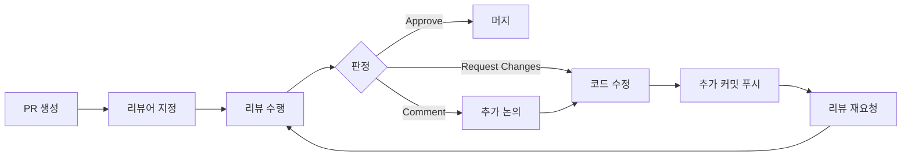
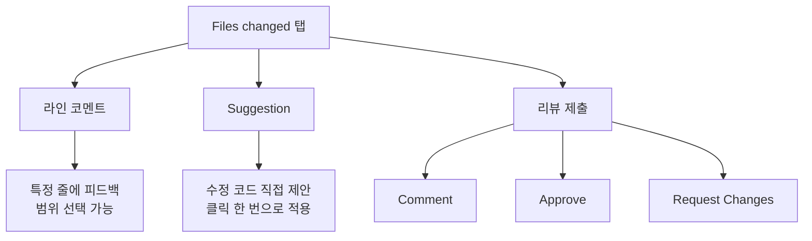
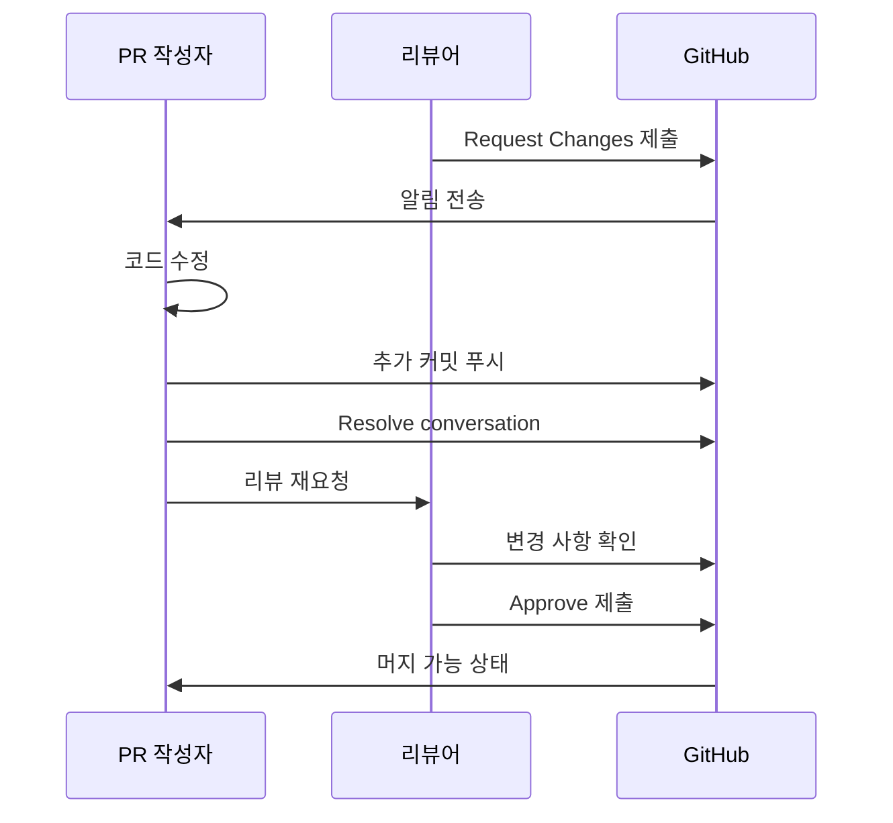

# 코드 리뷰

> 리뷰 요청, 라인 코멘트, Approve/Request Changes

## 개요

PR을 만들었다면 다음 단계는 **코드 리뷰**입니다. 리뷰는 단순히 "코드 틀린 데 찾기"가 아니에요. 팀의 코드 품질을 높이고, 지식을 공유하며, 버그를 사전에 잡는 **협업의 핵심 과정**이죠. 이번 섹션에서는 GitHub에서 코드 리뷰를 요청하고, 수행하고, 피드백에 대응하는 전체 과정을 배웁니다.

**선수 지식**: [PR 워크플로우](./01-pr-workflow.md)에서 배운 PR 생성 방법
**학습 목표**:
- 리뷰를 요청하고 수행하는 방법을 안다
- 라인 코멘트와 Suggestion을 활용할 수 있다
- Approve, Request Changes, Comment의 차이를 이해한다
- 건설적인 리뷰 에티켓을 익힌다

## 왜 알아야 할까?

> 📊 **그림 1**: 코드 리뷰의 전체 흐름




코드 리뷰 없이 바로 머지하면 어떻게 될까요? 당장은 빠르겠지만, 버그가 프로덕션에 배포되고, 팀원 아무도 그 코드를 이해하지 못하는 상황이 벌어집니다. 구글의 연구에 따르면 코드 리뷰는 **버그의 약 60%를 사전에 발견**할 수 있다고 해요.

하지만 리뷰의 진짜 가치는 버그 발견만이 아닙니다. 주니어는 시니어의 리뷰를 통해 배우고, 시니어는 주니어의 코드를 통해 새로운 관점을 얻습니다. 코드 리뷰는 **팀 전체의 성장 도구**입니다.

## 핵심 개념

### 개념 1: 리뷰 요청하기

> 💡 **비유**: 코드 리뷰는 **원고 교정**과 비슷합니다. 작가가 글을 쓴 후 편집자에게 보내면, 편집자가 오타를 잡고, 문장을 다듬고, "이 부분은 독자가 헷갈릴 수 있어요"라고 피드백하죠. 코드 리뷰도 똑같습니다 — 작성자(author)가 코드를 쓰고, 리뷰어(reviewer)가 확인하고 개선점을 제안합니다.

PR을 만들 때 또는 만든 후에 리뷰어를 지정할 수 있습니다:

```bash
# PR 생성 시 리뷰어 지정
gh pr create --reviewer alice,bob

# 이미 만든 PR에 리뷰어 추가
gh pr edit 42 --add-reviewer alice,org/backend-team

# 리뷰어 변경
gh pr edit 42 --remove-reviewer bob --add-reviewer charlie
```

리뷰어로 **개인**뿐 아니라 **팀**도 지정할 수 있습니다. `org/backend-team`처럼 쓰면 팀 멤버 중 한 명(또는 설정에 따라 여러 명)에게 리뷰 요청이 갑니다.

### 개념 2: 리뷰 수행하기

> 💡 **비유**: 코드 리뷰를 수행하는 것은 **건축 감리**와 비슷합니다. 건물을 지은 후 감리사가 설계도대로 지었는지, 안전 기준을 충족하는지, 개선할 점은 없는지 꼼꼼히 확인하죠. 코드 리뷰어도 마찬가지로 코드가 요구사항대로 작동하는지, 보안이나 성능에 문제가 없는지, 더 나은 방법은 없는지를 점검합니다.

리뷰어는 PR의 "Files changed" 탭에서 코드 변경 사항을 확인합니다. 여기서 세 가지 도구를 사용할 수 있어요.

> 📊 **그림 2**: 리뷰어의 세 가지 도구




**1) 라인 코멘트**

코드의 특정 줄에 댓글을 달 수 있습니다. 줄 번호 옆의 `+` 버튼을 클릭하면 됩니다. 여러 줄을 드래그하면 범위 코멘트도 가능해요.

```bash
# CLI에서 PR의 변경 사항 확인
gh pr diff 42

# 전체 diff를 브라우저에서 보기
gh pr view 42 --web
```

**2) Suggestion (제안)**

단순 댓글 대신 **코드 수정을 직접 제안**할 수 있습니다. 리뷰어가 Suggestion을 달면, PR 작성자는 클릭 한 번으로 제안된 코드를 적용할 수 있어요.

GitHub 웹에서 코멘트 입력 시 `suggestion` 코드 블록을 사용합니다:

> **Suggestion 작성 방법**:
> 1. 리뷰 코멘트 입력란에서 **±** 버튼 클릭 (또는 직접 입력)
> 2. ` ```suggestion ` 블록 안에 수정할 코드 작성
> 3. 예: "이 변수명이 더 명확할 것 같아요:" 라고 쓴 뒤
> 4. suggestion 블록 안에 `const userLoginCount = getLoginCount(userId);` 입력

PR 작성자는 "Apply suggestion" 버튼을 누르면 해당 줄이 자동으로 수정됩니다. 여러 Suggestion을 한 번에 묶어서 적용하는 "Batch" 기능도 있어요.

> 🔥 **실무 팁**: Suggestion은 리뷰에서 가장 유용한 기능 중 하나입니다. "이렇게 바꾸면 좋겠다"고 말만 하는 것보다, 실제 코드를 제안하면 작성자가 바로 적용할 수 있어 시간이 절약됩니다.

**3) 리뷰 제출**

댓글을 모두 달았으면 리뷰를 제출합니다. 세 가지 옵션이 있습니다:

| 옵션 | 의미 | 언제 사용하나? |
|------|------|---------------|
| **Comment** | 일반 의견 (승인도 거절도 아님) | 가벼운 피드백, 질문, 참고 사항 |
| **Approve** | 코드 승인 — 머지해도 좋다 | 코드에 문제 없다고 판단될 때 |
| **Request Changes** | 수정 요청 — 고쳐야 머지 가능 | 반드시 고쳐야 할 문제가 있을 때 |

```bash
# CLI에서 리뷰 제출
# 승인
gh pr review 42 --approve --body "깔끔하네요! 좋습니다 👍"

# 수정 요청
gh pr review 42 --request-changes --body "SQL 인젝션 취약점이 있습니다. PreparedStatement를 사용해주세요."

# 일반 코멘트
gh pr review 42 --comment --body "전체적으로 좋은데, 몇 가지 제안이 있습니다."
```

### 개념 3: 리뷰 피드백에 대응하기

> 📊 **그림 3**: 리뷰 피드백 대응 순서




리뷰를 받았으면 이제 피드백에 대응할 차례입니다.

**수정 후 추가 커밋 푸시**:

```bash
# 리뷰어의 피드백에 따라 코드 수정
git add src/login.js
git commit -m "Address review: use PreparedStatement"
git push
```

새 커밋을 푸시하면 PR에 자동으로 반영됩니다. 리뷰어는 새로 추가된 커밋만 따로 확인할 수도 있어요.

**대화 해결(Resolve conversation)**:

각 댓글 스레드에는 "Resolve conversation" 버튼이 있습니다. 피드백을 반영한 후 눌러주면 해당 스레드가 접히면서 정리됩니다.

**리뷰 재요청**:

수정을 마쳤으면 리뷰어에게 다시 확인을 요청합니다. GitHub 웹에서 리뷰어 이름 옆의 🔄 아이콘을 클릭하면 돼요.

> ⚠️ **흔한 오해**: "리뷰 피드백을 반영할 때 force push로 커밋을 깔끔하게 정리해야 한다" — 리뷰 중에는 **force push를 피하세요**. 기존 커밋을 덮어쓰면 리뷰어가 이전에 본 코드와 새 코드의 차이를 확인할 수 없습니다. 추가 커밋으로 수정하고, 머지할 때 squash하는 것이 좋습니다.

### 개념 4: 리뷰 에티켓

코드 리뷰는 기술적 행위이자 **커뮤니케이션**입니다. 좋은 리뷰 문화가 팀의 분위기를 좌우합니다.

**리뷰어를 위한 에티켓**:

- **먼저 큰 그림을 파악하세요**: 줄 단위 지적 전에 전체 설계가 맞는지 확인
- **질문 형태로 피드백하세요**: "이거 틀렸어" 대신 "이 부분은 X 방식이 더 적합하지 않을까요?"
- **심각도를 표시하세요**: `nit:` (사소한 스타일), `important:` (반드시 수정), `question:` (궁금한 점)
- **좋은 코드도 칭찬하세요**: "이 부분 깔끔하네요!" 한마디가 동기 부여가 됩니다
- **24시간 내에 응답하세요**: 리뷰 지연은 팀의 가장 큰 병목 중 하나입니다

**작성자를 위한 에티켓**:

- **PR을 올리기 전에 셀프 리뷰하세요**: 본인의 diff를 먼저 점검
- **피드백에 감사하세요**: 리뷰어는 시간을 내서 코드를 봐주는 겁니다
- **방어적으로 반응하지 마세요**: 피드백은 코드에 대한 것이지, 사람에 대한 것이 아닙니다
- **동의하지 않으면 이유를 설명하세요**: "그건 안 돼요" 대신 "이 방식을 선택한 이유는 X 때문입니다"

## 실습: 코드 리뷰 체험하기

```bash
# 1. 테스트 PR 체크아웃 (다른 사람의 PR을 로컬에서 확인)
gh pr checkout 42

# 2. 코드 확인 후 리뷰 제출
gh pr review 42 --approve --body "코드 확인했습니다. 깔끔하네요!"

# 3. 또는 수정 요청
gh pr review 42 --request-changes --body "다음 사항을 수정해주세요:
1. 변수명 loginCnt → loginCount로 변경
2. 에러 처리 추가 필요"

# 4. PR 댓글 달기 (리뷰가 아닌 일반 댓글)
gh pr comment 42 --body "질문이 있어요: 이 기능은 모바일에서도 테스트했나요?"

# 5. PR의 리뷰 상태 확인
gh pr checks 42
```

```output
All checks were successful
0 failing, 1 successful, and 0 pending checks

✓  ci/test  1m 23s  https://github.com/...
```

```bash
# 6. PR의 상세 상태 보기
gh pr status
```

```output
Relevant pull requests in user/my-project

Current branch
  #42  Add login feature [feature/add-login]
   - Checks passing - Review approved

Created by you
  #42  Add login feature [feature/add-login]
   - Checks passing - Review approved
```

## 더 깊이 알아보기

### 코드 리뷰의 역사

코드 리뷰의 역사는 1970년대로 거슬러 올라갑니다. IBM의 Michael Fagan이 1976년에 발표한 **"Fagan Inspection"**이 최초의 체계적인 코드 리뷰 방법론이었어요. 당시에는 코드를 인쇄해서 회의실에 모여 한 줄씩 검토하는 방식이었습니다.

GitHub의 리뷰 시스템도 처음부터 지금의 모습은 아니었습니다. 초기에는 PR에 댓글을 달 수 있을 뿐이었고, **Approve/Request Changes** 기능은 2016년에야 추가되었습니다. 라인 코멘트는 비교적 초기부터 있었지만, 여러 줄을 선택하는 범위 코멘트는 나중에 추가되었고, **Suggestion** 기능은 2018년에 도입되었어요.

> 💡 **알고 계셨나요?**: 2025년 GitHub Copilot이 코드 리뷰 기능을 정식 출시했습니다. PR의 리뷰어로 `@copilot`을 지정하면, AI가 코드를 분석하고 잠재적 버그, 보안 취약점, 성능 문제를 자동으로 지적합니다. 물론 사람의 리뷰를 완전히 대체하지는 않지만, 1차 필터 역할로 활용하는 팀이 늘고 있어요.

## 흔한 오해와 팁

> ⚠️ **흔한 오해**: "시니어만 코드 리뷰를 할 수 있다" — 전혀 아닙니다! 주니어도 코드 리뷰에 참여해야 합니다. "이 코드가 이해가 안 돼요"라는 피드백 자체가 코드의 가독성 문제를 알려주는 귀중한 신호예요. 리뷰는 경력에 관계없이 **모든 팀원이 참여**하는 것이 건강한 문화입니다.

> 🔥 **실무 팁**: 리뷰를 시작하기 전에 "Start a review"를 클릭해서 **배치 모드**로 댓글을 작성하세요. 개별 댓글을 하나씩 제출하면 PR 작성자에게 알림이 폭탄처럼 갑니다. 배치 모드에서 댓글을 모아뒀다가 한 번에 제출하면 작성자도 한 번에 확인할 수 있어 훨씬 효율적이에요.

> 🔥 **실무 팁**: 리뷰 세션은 **60~90분**을 넘기지 마세요. 연구에 따르면 그 이후로는 집중력이 떨어져 리뷰 품질이 급격히 낮아집니다. 큰 PR은 나눠서 리뷰하는 것이 좋아요.

## 핵심 정리

| 개념 | 설명 |
|------|------|
| 리뷰어 지정 | `gh pr create --reviewer` 또는 `gh pr edit --add-reviewer` |
| 라인 코멘트 | 코드의 특정 줄에 대한 피드백 |
| Suggestion | 수정 코드를 직접 제안 — 클릭 한 번으로 적용 가능 |
| Approve | 코드 승인 — 머지 가능 |
| Request Changes | 수정 요청 — 반드시 수정 후 머지 |
| Comment | 일반 의견 — 승인/거절 없음 |
| 배치 리뷰 | "Start a review"로 댓글을 모아서 한 번에 제출 |
| `nit:` / `important:` | 피드백 심각도 접두사 |

## 다음 섹션 미리보기

코드 리뷰를 배웠으니, 이제 PR을 **관리하는 기술**을 익힐 차례입니다. [PR 관리](./03-pr-management.md)에서는 PR에서 충돌을 해결하는 법, 작업 중인 코드를 공유하는 Draft PR, 그리고 Squash/Rebase/Merge Commit 세 가지 머지 전략의 차이를 알아봅니다.

## 참고 자료

- [GitHub Docs — PR 리뷰 요청](https://docs.github.com/en/pull-requests/collaborating-with-pull-requests/proposing-changes-to-your-work-with-pull-requests/requesting-a-pull-request-review) - 리뷰 요청 공식 가이드
- [GitHub Docs — PR 리뷰하기](https://docs.github.com/en/pull-requests/collaborating-with-pull-requests/reviewing-changes-in-pull-requests/reviewing-proposed-changes-in-a-pull-request) - 리뷰 수행 공식 가이드
- [GitHub Docs — Suggestion 활용](https://docs.github.com/en/pull-requests/collaborating-with-pull-requests/reviewing-changes-in-pull-requests/incorporating-feedback-in-your-pull-request) - Suggestion 기능 가이드
- [Google Engineering Practices — 코드 리뷰](https://google.github.io/eng-practices/review/) - 구글의 코드 리뷰 가이드라인
