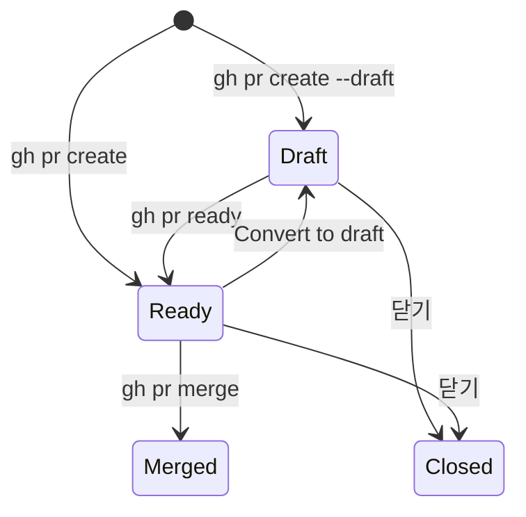
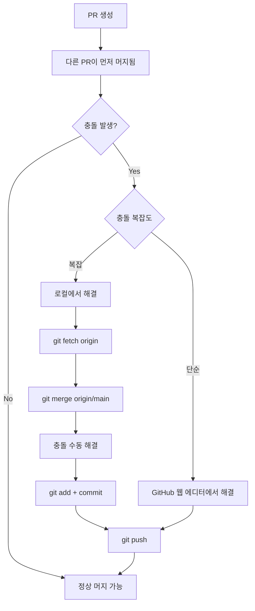
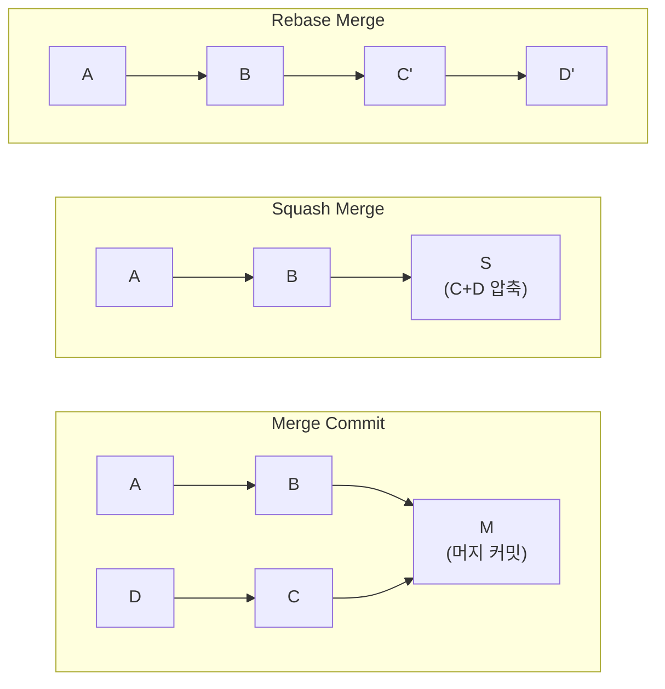
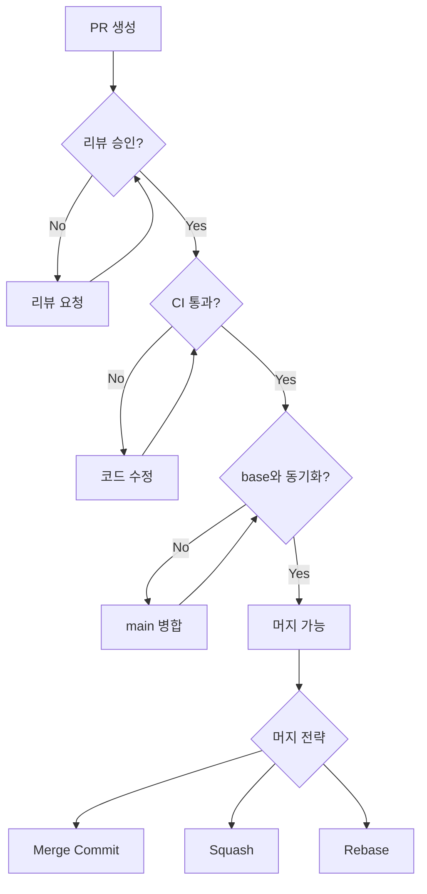

# PR 관리

> 충돌 해결, Draft PR, Merge 전략(Squash/Rebase/Merge Commit)

## 개요

PR을 만들고 리뷰까지 받았는데, 갑자기 충돌이 발생하거나, 어떤 방식으로 머지해야 할지 고민되는 상황 — 한 번쯤 겪게 됩니다. 이번 섹션에서는 PR을 만든 후 머지까지의 **관리 기술**을 배웁니다. Draft PR, 충돌 해결, 그리고 세 가지 머지 전략의 차이를 확실히 이해해봅시다.

**선수 지식**: [코드 리뷰](./02-code-review.md)에서 배운 리뷰 프로세스, [브랜치 병합](../03-branch/03-merge.md)의 merge 개념
**학습 목표**:
- Draft PR의 용도와 활용법을 안다
- PR에서 발생한 충돌을 해결할 수 있다
- Squash, Rebase, Merge Commit 세 가지 전략의 차이를 이해하고 선택할 수 있다
- 브랜치 보호 규칙의 기본을 안다

## 왜 알아야 할까?

PR을 "만들고 끝"이 아닙니다. 리뷰를 기다리는 동안 `main` 브랜치에 다른 변경이 들어가면 충돌이 생길 수 있고, 머지 방식에 따라 히스토리가 완전히 달라집니다. **머지 전략 하나로 git log가 깔끔해질 수도, 엉망이 될 수도 있어요.** PR 관리 스킬은 팀의 히스토리 품질을 좌우하는 중요한 기술입니다.

## 핵심 개념

### 개념 1: Draft PR — 작업 중 미리 공유하기

> 📊 **그림 1**: Draft PR의 상태 전이




> 💡 **비유**: Draft PR은 **초안 공유**와 같습니다. 보고서를 완성하기 전에 "아직 초안인데, 방향이 맞는지 한번 봐주세요"라고 공유하는 것처럼, 코드가 완성되기 전에 팀의 피드백을 미리 받을 수 있습니다.

Draft PR은 **머지 준비가 안 된 PR**입니다. 일반 PR과 달리 다음과 같은 특징이 있어요:

| 특징 | 일반 PR | Draft PR |
|------|---------|----------|
| 머지 가능 | ✅ | ❌ (Ready 전환 필요) |
| CODEOWNERS 자동 리뷰 요청 | ✅ | ❌ |
| CI/CD 실행 | ✅ | ✅ (확인용으로 실행됨) |
| 리뷰 요청 | 가능 | 가능 (수동 지정 시) |

```bash
# Draft PR 생성
gh pr create --draft \
  --title "WIP: Add payment module" \
  --body "아직 작업 중입니다. 전체 설계 방향에 대한 피드백 부탁드립니다."

# Draft → Ready 전환 (작업 완료 후)
gh pr ready 42
```

```output
Pull request #42 is marked as ready for review
```

```bash
# Ready → Draft로 되돌리기 (추가 작업이 필요할 때)
# GitHub 웹에서 PR 사이드바 → "Convert to draft" 클릭
```

Draft PR을 활용하면 좋은 상황:
- 설계 방향에 대한 **초기 피드백**이 필요할 때
- CI가 통과하는지 **미리 확인**하고 싶을 때
- 장기 작업의 **진행 상황을 공유**할 때

### 개념 2: PR 충돌 해결

> 📊 **그림 2**: PR 충돌 해결 흐름




PR을 올린 후 다른 사람의 PR이 먼저 머지되면, 같은 파일을 수정한 경우 **충돌(conflict)**이 발생합니다. GitHub에서 "This branch has conflicts that must be resolved"라는 메시지가 나타나죠.

**방법 1: GitHub 웹 에디터** (단순한 충돌)

GitHub에서 "Resolve conflicts" 버튼이 활성화되면 웹에서 바로 해결할 수 있습니다. 충돌 마커(`<<<<<<<`, `=======`, `>>>>>>>`)를 직접 편집하고 "Mark as resolved" → "Commit merge"를 클릭하면 됩니다.

단, 복잡한 충돌(바이너리 파일, 파일 삭제/이름 변경 등)은 웹에서 해결할 수 없어요.

**방법 2: 로컬에서 해결** (복잡한 충돌)

```bash
# 1. 최신 main 가져오기
git fetch origin

# 2. 내 브랜치로 이동
git switch feature/my-branch

# 3. main을 내 브랜치에 병합
git merge origin/main
```

```error
Auto-merging src/config.js
CONFLICT (content): Merge conflict in src/config.js
Automatic merge failed; fix conflicts and then commit the result.
```

```bash
# 4. 충돌 파일 확인
git status
```

```output
Unmerged paths:
  both modified:   src/config.js
```

```bash
# 5. 에디터에서 충돌 해결 후
git add src/config.js
git commit -m "Resolve merge conflict with main"

# 6. 푸시하면 PR에 자동 반영
git push
```

> 🔥 **실무 팁**: 충돌을 예방하는 가장 좋은 방법은 **main을 자주 동기화하는 것**입니다. 장기 작업 브랜치에서는 주기적으로 `git merge origin/main`을 해서 차이를 줄이세요.

### 개념 3: 세 가지 Merge 전략

PR을 머지할 때 GitHub은 세 가지 방식을 제공합니다. 이 선택에 따라 **커밋 히스토리의 모양이 완전히 달라집니다**.

> 💡 **비유**: 세 가지 머지 전략을 일기장에 비유해볼게요.
> - **Merge Commit**: 일기장에 "오늘 Chapter 3을 합쳤다"라는 메모를 추가하면서, 원래 노트 내용도 전부 보존
> - **Squash Merge**: 여러 날의 메모를 하나의 깔끔한 요약으로 합쳐서 일기장에 기록
> - **Rebase Merge**: 메모들을 날짜순으로 일기장 마지막에 이어 붙이되, 합쳤다는 흔적은 남기지 않음

**1) Merge Commit (기본)**

모든 커밋을 보존하면서 **머지 커밋 하나**를 추가합니다.

```bash
gh pr merge 42 --merge
```

히스토리 결과:

> **main**: ... → A → B → **M (Merge commit)** ← feature 브랜치의 C, D 커밋 포함

- 장점: 전체 히스토리가 보존됨, 언제 어떤 브랜치가 합쳐졌는지 명확
- 단점: 머지 커밋이 많아지면 히스토리가 복잡해짐

**2) Squash Merge (가장 인기)**

PR의 모든 커밋을 **하나의 커밋으로 압축**해서 머지합니다.

```bash
gh pr merge 42 --squash
```

히스토리 결과:

> **main**: ... → A → B → **S (squashed commit)** — feature의 C, D가 하나로 합쳐짐

- 장점: `main` 히스토리가 깔끔, 커밋 하나 = PR 하나
- 단점: 세부 커밋 히스토리가 사라짐 (PR에서는 여전히 볼 수 있음)

**3) Rebase Merge**

PR의 각 커밋을 `main` 위에 **하나씩 다시 적용**합니다. 머지 커밋 없이 **일직선** 히스토리가 됩니다.

```bash
gh pr merge 42 --rebase
```

히스토리 결과:

> **main**: ... → A → B → **C' → D'** — feature의 커밋이 리베이스되어 이어짐

- 장점: 완벽한 선형 히스토리
- 단점: 커밋 해시가 변경됨, 각 커밋이 독립적으로 깔끔해야 함

**어떤 전략을 선택할까?**

> 📊 **그림 3**: 세 가지 Merge 전략 히스토리 비교




| 상황 | 추천 전략 |
|------|-----------|
| 대부분의 기능 브랜치 | **Squash Merge** — 깔끔하고 관리 쉬움 |
| 커밋 하나하나가 의미 있는 경우 | **Rebase Merge** — 세부 히스토리 보존 |
| 릴리스 브랜치 머지, 전체 기록이 중요한 경우 | **Merge Commit** — 완전한 히스토리 |

> 💡 **알고 계셨나요?**: 2025년 기준으로 SaaS 팀에서 가장 많이 사용하는 머지 전략은 **Squash Merge**입니다. `main`의 각 커밋이 하나의 PR에 대응하므로, `git log`가 깔끔하고 `git bisect`로 문제를 찾기도 쉽거든요.

### 개념 4: 브랜치 보호 규칙

> 📊 **그림 4**: 브랜치 보호 규칙이 적용된 PR 머지 흐름




프로젝트에서 `main` 브랜치에 아무나 직접 푸시할 수 있으면 위험하겠죠? **브랜치 보호 규칙(Branch Protection Rules)**을 설정하면 이를 방지할 수 있습니다.

주요 설정 항목:

| 규칙 | 설명 |
|------|------|
| **Require pull request reviews** | 최소 N명의 승인 없이 머지 불가 |
| **Require status checks** | CI 테스트 통과 필수 |
| **Require branches to be up to date** | base 브랜치와 동기화 필수 |
| **Require linear history** | Squash 또는 Rebase만 허용 (머지 커밋 금지) |
| **Restrict who can push** | 특정 사람/팀만 직접 푸시 가능 |

```bash
# 브랜치 보호 규칙은 GitHub 웹에서 설정하거나 gh CLI로 확인
# Settings → Branches → Add branch protection rule

# 보호된 브랜치에 직접 push 시도하면:
git push origin main
```

```error
remote: error: GH006: Protected branch update failed for refs/heads/main.
remote: error: Required status check "ci/test" is expected.
```

> 💡 **알고 계셨나요?**: GitHub은 최근 **Rulesets**이라는 새로운 시스템을 도입했습니다. 기존 Branch Protection Rules의 진화 버전으로, 여러 규칙을 동시에 적용하고, 규칙을 삭제하지 않고 비활성화(Evaluate 모드)할 수 있어요. 신규 프로젝트에서는 Rulesets 사용을 권장합니다.

### 개념 5: Auto-Merge

리뷰 승인을 받았지만 CI가 아직 돌고 있을 때, **Auto-Merge**를 켜두면 모든 조건이 충족되는 순간 자동으로 머지됩니다.

```bash
# Auto-Merge 활성화
gh pr merge 42 --auto --squash
```

```output
✓ Pull request #42 will be automatically merged via squash when all requirements are met
```

```bash
# Auto-Merge 취소
gh pr merge 42 --disable-auto
```

Auto-Merge가 동작하려면:
- 저장소 설정에서 Auto-Merge가 활성화되어 있어야 함
- 브랜치 보호 규칙이 설정되어 있어야 함 (조건을 자동 확인하려면 규칙이 필요)

## 실습: Merge 전략 비교해보기

```bash
# 1. 실습 브랜치 생성 & 여러 커밋 만들기
git switch -c feature/merge-test
echo "line 1" > test.txt && git add test.txt && git commit -m "Add line 1"
echo "line 2" >> test.txt && git add test.txt && git commit -m "Add line 2"
echo "line 3" >> test.txt && git add test.txt && git commit -m "Add line 3"

# 2. 푸시 & PR 생성
git push -u origin feature/merge-test
gh pr create --title "Test merge strategies" --body "3개의 커밋으로 머지 전략 테스트"

# 3. 각 전략별 머지 결과 확인 (실제로는 하나만 선택)
# Squash: 3개 커밋 → 1개로 합쳐져서 main에 기록
gh pr merge --squash --delete-branch

# 4. main의 히스토리 확인
git switch main && git pull
git log --oneline -5
```

```output
a1b2c3d (HEAD -> main) Test merge strategies (#1)
e4f5g6h Previous commit
```

3개였던 커밋이 1개로 깔끔하게 합쳐진 것을 확인할 수 있습니다.

## 더 깊이 알아보기

### Merge Queue — 대규모 팀의 머지 자동화

활발한 프로젝트에서는 여러 PR이 동시에 머지 대기 중이라 문제가 생길 수 있어요. PR A와 PR B가 각각 CI를 통과했지만, **둘이 동시에 머지되면 호환 문제**가 생기는 경우죠.

**Merge Queue**는 이 문제를 해결합니다. PR들을 대기열에 넣고, 순서대로 임시 브랜치를 만들어 호환성을 테스트한 후 머지해요. GitHub Enterprise Cloud이나 공개 저장소에서 사용할 수 있습니다.

## 흔한 오해와 팁

> ⚠️ **흔한 오해**: "Rebase가 Squash보다 항상 좋다" — 아닙니다. Rebase Merge는 각 커밋이 독립적으로 빌드 가능하고 의미가 있을 때만 빛납니다. 대부분의 기능 브랜치에서는 `WIP`, `fix typo`, `address review` 같은 커밋이 섞여 있어서 Squash가 더 깔끔해요.

> 🔥 **실무 팁**: 팀에서 머지 전략을 통일하세요. 혼용하면 히스토리가 일관성 없이 지저분해집니다. GitHub 저장소 설정에서 **허용할 머지 방식을 제한**할 수 있어요: Settings → General → Pull Requests에서 원하는 방식만 체크하면 됩니다.

> 🔥 **실무 팁**: Squash Merge를 쓸 때는 **PR 제목이 곧 커밋 메시지**가 됩니다. PR 제목을 정성껏 작성하세요. GitHub 설정에서 "Default to PR title for squash merge commits"을 활성화하면 자동으로 PR 제목이 커밋 메시지로 사용됩니다.

## 핵심 정리

| 개념 | 설명 |
|------|------|
| Draft PR | 머지 불가 상태의 WIP PR — 초기 피드백용 |
| 충돌 해결 | 웹 에디터(단순) 또는 로컬 merge(복잡)로 해결 |
| Merge Commit | 모든 커밋 + 머지 커밋 보존 — 전체 히스토리 유지 |
| Squash Merge | 모든 커밋을 하나로 압축 — 깔끔한 main |
| Rebase Merge | 커밋을 하나씩 재적용 — 선형 히스토리 |
| Branch Protection | main 브랜치 직접 푸시 방지, 리뷰/CI 필수 설정 |
| Auto-Merge | 조건 충족 시 자동 머지 |
| `gh pr merge --squash` | CLI에서 Squash Merge 실행 |

## 다음 섹션 미리보기

지금까지 PR을 만들고, 리뷰하고, 관리하는 법을 배웠습니다. 이 모든 과정을 실전에서 경험할 수 있는 최고의 방법이 있어요 — 바로 **오픈소스 기여**입니다. [오픈소스 기여](./04-open-source.md)에서는 fork → upstream 동기화 → 첫 PR까지, 실제 오픈소스 프로젝트에 기여하는 전체 과정을 단계별로 배웁니다.

## 참고 자료

- [GitHub Docs — Merge 방법](https://docs.github.com/en/pull-requests/collaborating-with-pull-requests/incorporating-changes-from-a-pull-request/about-merge-methods-on-github) - 세 가지 머지 전략 공식 설명
- [GitHub Docs — Draft PR](https://docs.github.com/en/pull-requests/collaborating-with-pull-requests/proposing-changes-to-your-work-with-pull-requests/changing-the-stage-of-a-pull-request) - Draft PR 공식 가이드
- [GitHub Docs — 브랜치 보호](https://docs.github.com/en/repositories/configuring-branches-and-merges-in-your-repository/managing-protected-branches/about-protected-branches) - 보호 규칙 공식 문서
- [GitHub Docs — Rulesets](https://docs.github.com/en/repositories/configuring-branches-and-merges-in-your-repository/managing-rulesets/about-rulesets) - 차세대 브랜치 규칙 시스템
- [GitHub Docs — Auto-Merge](https://docs.github.com/en/pull-requests/collaborating-with-pull-requests/incorporating-changes-from-a-pull-request/automatically-merging-a-pull-request) - 자동 머지 설정 가이드
