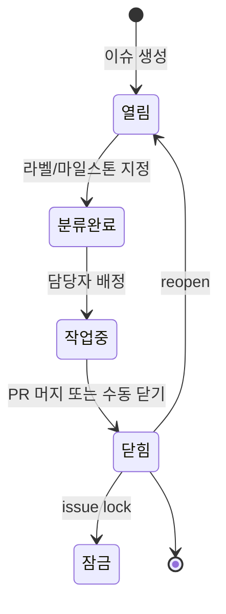
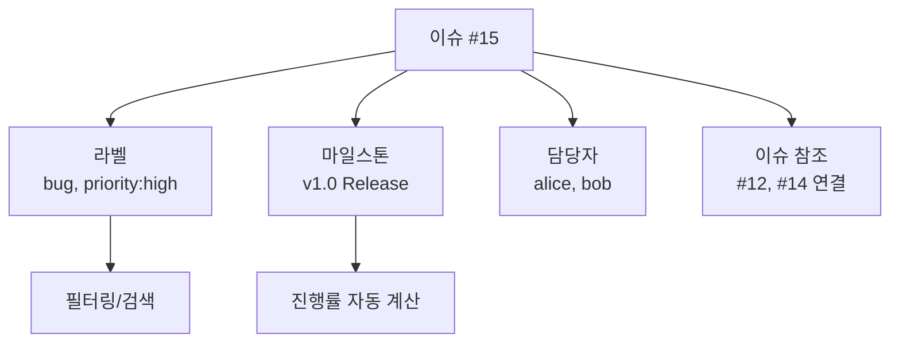
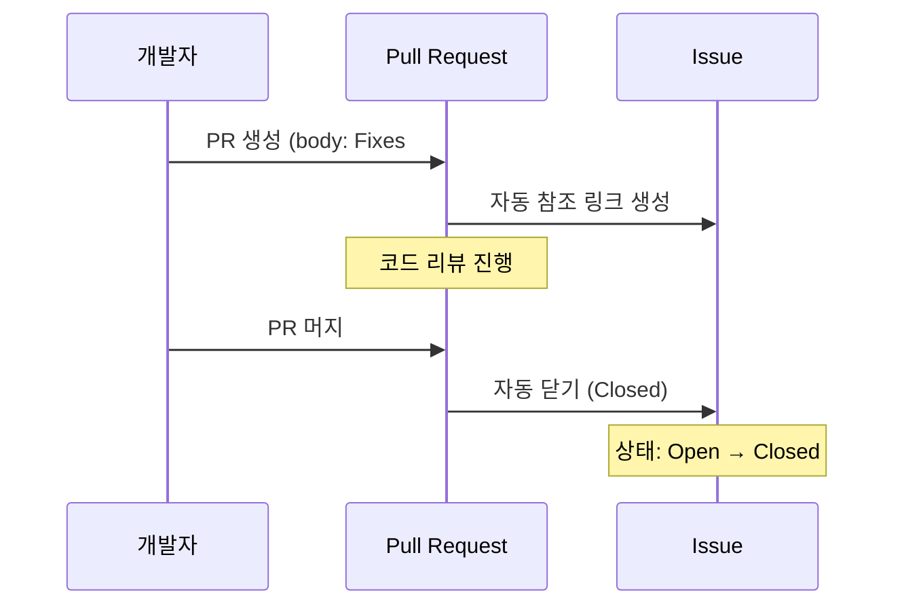
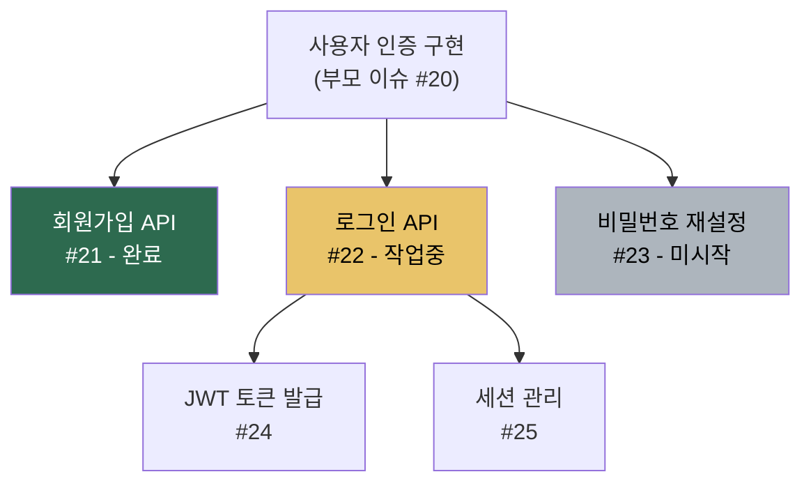

# Issues 활용

> 이슈 작성, 라벨, 마일스톤, Assignee, 이슈 참조

## 개요

코드를 작성하다 보면 버그를 발견하고, 새 기능 아이디어가 떠오르고, 해야 할 일이 쌓입니다. 이런 것들을 머릿속에만 담아두면 금방 잊어버리죠. **GitHub Issues**는 이 모든 것을 체계적으로 기록하고 추적하는 도구입니다. 이번 섹션에서는 이슈를 만들고, 분류하고, 관리하는 방법을 배웁니다.

**선수 지식**: [오픈소스 기여](../06-pull-request/04-open-source.md)에서 이슈를 접한 경험
**학습 목표**:
- 효과적인 이슈를 작성할 수 있다
- 라벨, 마일스톤, 담당자로 이슈를 체계적으로 분류한다
- 이슈 참조(`#123`)와 자동 닫기를 활용한다
- 하위 이슈(Sub-issues)로 큰 작업을 나눌 수 있다

## 왜 알아야 할까?

"로그인 버그 있음" — 이런 메모를 포스트잇에 적어본 적 있나요? 혼자 할 때는 괜찮지만, 팀이 커지면 "누가 담당이지?", "언제까지 고쳐야 해?", "이거 아직 안 했어?"라는 질문이 끊이지 않습니다.

GitHub Issues는 **프로젝트의 할 일 목록이자 소통 창구**입니다. 이슈 하나에 담당자, 마감일, 분류가 모두 담기니까 팀 전체가 현재 상황을 한눈에 파악할 수 있어요.

> 📊 **그림 1**: 이슈의 생명주기 — 생성부터 완료까지




## 핵심 개념

### 개념 1: 이슈 만들기

> 💡 **비유**: 이슈는 **접수 창구의 접수 번호**와 같습니다. 민원을 접수하면 번호를 받고, 담당자가 배정되고, 처리 상태를 추적할 수 있죠. GitHub 이슈도 마찬가지입니다 — 번호(`#123`)가 부여되고, 담당자가 배정되고, 열림/닫힘 상태로 추적됩니다.

```bash
# 기본 이슈 생성
gh issue create \
  --title "로그인 페이지에서 비밀번호 오류 메시지가 표시되지 않음" \
  --body "## 버그 설명
로그인 시 잘못된 비밀번호를 입력해도 오류 메시지가 나타나지 않습니다.

## 재현 방법
1. 로그인 페이지 접속
2. 잘못된 비밀번호 입력
3. 로그인 버튼 클릭
4. → 아무 반응 없음 (오류 메시지 없음)

## 기대 동작
'비밀번호가 올바르지 않습니다' 메시지가 표시되어야 합니다."
```

```output
Creating issue in user/my-project

https://github.com/user/my-project/issues/15
```

**좋은 이슈 제목의 조건**:
- **구체적으로**: "버그 있음" (X) → "로그인 페이지에서 비밀번호 오류 메시지 미표시" (O)
- **행동 중심으로**: 무엇이 문제이고, 무엇이 필요한지 한눈에 보이게
- **접두사 활용**: `[Bug]`, `[Feature]`, `[Docs]` 등으로 분류

### 개념 2: 라벨(Label) — 이슈 분류하기

> 💡 **비유**: 라벨은 **도서관의 분류 스티커**입니다. 소설에는 빨간 스티커, 과학책에는 파란 스티커를 붙이면 쉽게 찾을 수 있듯, 이슈에도 라벨을 붙여 빠르게 분류할 수 있습니다.

> 📊 **그림 2**: 이슈 구성 요소 — 라벨, 마일스톤, 담당자의 관계




GitHub는 기본 라벨을 제공하고, 커스텀 라벨도 만들 수 있습니다:

| 기본 라벨 | 용도 |
|-----------|------|
| `bug` | 버그 리포트 |
| `enhancement` | 기능 개선/추가 |
| `documentation` | 문서 관련 |
| `good first issue` | 신규 기여자용 쉬운 작업 |
| `help wanted` | 도움이 필요한 이슈 |
| `duplicate` | 중복 이슈 |
| `wontfix` | 수정하지 않을 이슈 |

```bash
# 이슈 생성 시 라벨 지정
gh issue create --title "다크 모드 지원" --label "enhancement"

# 기존 이슈에 라벨 추가/제거
gh issue edit 15 --add-label "bug,priority:high"
gh issue edit 15 --remove-label "wontfix"

# 라벨별 이슈 목록 보기
gh issue list --label "bug"
gh issue list --label "bug" --label "priority:high"
```

> 🔥 **실무 팁**: 팀에서 **우선순위 라벨** 체계를 만들어두면 유용합니다. 예: `priority:critical` (빨간색), `priority:high` (주황색), `priority:medium` (노란색), `priority:low` (초록색). 이슈 목록에서 한눈에 중요도를 파악할 수 있어요.

### 개념 3: 마일스톤(Milestone) — 목표 관리

마일스톤은 이슈들을 **하나의 목표(릴리스, 스프린트 등)**로 묶는 기능입니다. 마일스톤에 포함된 이슈의 완료율이 자동으로 계산됩니다.

```bash
# 마일스톤 생성 (웹에서: Issues → Milestones → New milestone)
# CLI에서는 gh api를 사용
gh api repos/{owner}/{repo}/milestones \
  --method POST \
  -f title="v1.0 Release" \
  -f description="첫 번째 정식 릴리스" \
  -f due_on="2026-03-01T00:00:00Z"

# 이슈에 마일스톤 연결
gh issue create \
  --title "사용자 인증 구현" \
  --milestone "v1.0 Release"

# 마일스톤별 이슈 보기
gh issue list --milestone "v1.0 Release"
```

마일스톤에는 **제목**, **설명**, **마감일(선택)**을 설정할 수 있습니다. 이슈나 PR이 닫히면 마일스톤의 진행률이 자동으로 올라가요.

### 개념 4: 담당자(Assignee)와 이슈 참조

**담당자 지정** — 누가 이 작업을 할 것인지 명확히 합니다:

```bash
# 본인에게 이슈 할당
gh issue edit 15 --add-assignee "@me"

# 다른 사람에게 할당 (최대 10명)
gh issue edit 15 --add-assignee "alice,bob"
```

**이슈 참조** — 이슈 번호(`#`)로 서로 연결합니다:

커밋 메시지, PR, 다른 이슈의 댓글에서 `#15`라고 쓰면 자동으로 링크가 생깁니다. 특별한 키워드를 사용하면 PR 머지 시 이슈가 자동으로 닫힙니다:

> 📊 **그림 3**: PR과 이슈의 자동 닫기 흐름




| 키워드 | 동작 |
|--------|------|
| `Closes #15` | PR 머지 시 이슈 자동 닫기 |
| `Fixes #15` | 위와 동일 |
| `Resolves #15` | 위와 동일 |
| `#15` (키워드 없이) | 이슈 참조만 (닫지 않음) |

```bash
# PR에서 이슈 자동 닫기 예시
gh pr create \
  --title "Fix password error message" \
  --body "로그인 시 비밀번호 오류 메시지가 표시되도록 수정했습니다.

Fixes #15"
```

### 개념 5: 핀(Pin)과 이슈 관리

중요한 이슈를 목록 상단에 고정할 수 있습니다:

```bash
# 이슈 고정 (최대 3개)
gh issue pin 15

# 고정 해제
gh issue unpin 15

# 이슈 닫기/열기
gh issue close 15
gh issue reopen 15

# 이슈 잠금 (더 이상 댓글 불가)
gh issue lock 15

# 이슈를 다른 저장소로 이동
gh issue transfer 15 owner/other-repo

# 이슈 댓글
gh issue comment 15 --body "이 작업은 다음 스프린트로 넘깁니다."
```

### 개념 6: 하위 이슈(Sub-issues)

큰 작업은 하위 이슈로 쪼개면 관리가 쉬워집니다. 2025년에 정식 출시된 이 기능은 이전의 체크리스트(tasklist)를 대체합니다.

- 부모 이슈 하나에 **최대 100개**의 하위 이슈 연결 가능
- **최대 8단계** 중첩 가능
- 하위 이슈의 진행률이 부모 이슈에 자동 표시

> 📊 **그림 4**: 하위 이슈 계층 구조 예시




> 💡 **알고 계셨나요?**: 하위 이슈는 부모 이슈의 **Projects와 Milestones를 자동으로 상속**합니다. 즉, 부모가 "v1.0 Release" 마일스톤에 속하면, 하위 이슈도 자동으로 같은 마일스톤에 포함돼요.

## 실습: 이슈 관리 워크플로우

```bash
# 1. 버그 이슈 생성
gh issue create \
  --title "[Bug] 다크 모드에서 텍스트가 안 보임" \
  --body "다크 모드 활성화 시 텍스트 색상이 배경과 같아 안 보입니다." \
  --label "bug,priority:high" \
  --assignee "@me" \
  --milestone "v1.0 Release"

# 2. 기능 이슈 생성
gh issue create \
  --title "[Feature] 사용자 프로필 이미지 업로드" \
  --body "프로필 설정에서 이미지를 업로드할 수 있어야 합니다." \
  --label "enhancement"

# 3. 이슈 목록 다양하게 조회
gh issue list                         # 전체 열린 이슈
gh issue list --label "bug"           # 버그만
gh issue list --assignee "@me"        # 나에게 할당된 것
gh issue list --milestone "v1.0 Release"  # 마일스톤별
gh issue list --state closed          # 닫힌 이슈

# 4. 이슈 상세 보기
gh issue view 16
```

```output
[Bug] 다크 모드에서 텍스트가 안 보임 #16
Open • user opened about 1 minute ago • 0 comments

  다크 모드 활성화 시 텍스트 색상이 배경과 같아 안 보입니다.

Labels: bug, priority:high
Assignees: user
Milestone: v1.0 Release (25% complete)
```

## 더 깊이 알아보기

### GitHub Issues의 진화

GitHub Issues는 2008년 GitHub 출시 때부터 함께한 핵심 기능입니다. 초기에는 단순한 버그 트래커에 불과했지만, 라벨, 마일스톤, 담당자가 추가되면서 프로젝트 관리 도구로 발전했어요.

2022년에는 **GitHub Projects v2**가 출시되면서 이슈가 프로젝트 보드와 긴밀하게 통합되었습니다. 그리고 2025년에는 **이슈 타입(Issue Types)**, **하위 이슈(Sub-issues)**, **고급 검색(Advanced Search)**이 정식 출시되면서, GitHub Issues 역사상 가장 큰 업데이트가 이루어졌습니다. 이 변화로 프로젝트 항목 제한도 기존 1,200개에서 **50,000개**로 대폭 늘어났어요.

> 💡 **알고 계셨나요?**: 2025년에 도입된 **이슈 타입(Issue Types)**은 조직(Organization) 수준에서 관리됩니다. 기본 타입은 `Task`, `Bug`, `Feature` 세 가지이며, `Research`, `Epic` 같은 커스텀 타입도 추가할 수 있어요. 라벨과 달리 이슈 하나에 타입은 **하나만** 지정 가능합니다.

## 흔한 오해와 팁

> ⚠️ **흔한 오해**: "이슈는 버그 리포트 전용이다" — 아닙니다! 이슈는 버그뿐 아니라 **기능 요청, 개선 제안, 질문, 토론, 문서 작업** 등 모든 유형의 작업을 추적하는 데 사용됩니다. 다만 순수한 질문이나 토론은 [Discussions](./03-discussions-wiki.md)가 더 적합할 수 있어요.

> 🔥 **실무 팁**: 이슈를 닫을 때 **왜 닫는지 한 줄 설명**을 남기세요. "해결됨", "중복 — #23 참고", "재현 불가 — 추가 정보 필요" 등 이유를 남기면 나중에 같은 이슈가 다시 올라왔을 때 빠르게 대응할 수 있습니다.

> 🔥 **실무 팁**: `gh issue list`에 `--search` 옵션을 활용하면 강력한 검색이 가능합니다. `gh issue list --search "is:open label:bug sort:created-desc"` 처럼 GitHub 검색 문법을 그대로 사용할 수 있어요.

## 핵심 정리

| 개념 | 설명 |
|------|------|
| Issue | 버그, 기능 요청, 작업 등을 추적하는 단위 |
| 라벨(Label) | 이슈를 분류하는 색상 태그 |
| 마일스톤(Milestone) | 이슈들을 묶는 목표/기한 (진행률 자동 계산) |
| 담당자(Assignee) | 이슈 책임자 (최대 10명) |
| `#123` 참조 | 이슈/PR 번호로 자동 링크 |
| `Closes #123` | PR 머지 시 이슈 자동 닫기 |
| 핀(Pin) | 중요 이슈를 목록 상단에 고정 (최대 3개) |
| 하위 이슈 | 큰 이슈를 작은 작업으로 분할 (최대 100개, 8단계) |
| 이슈 타입 | Task, Bug, Feature 등 조직 수준 분류 (2025~) |

## 다음 섹션 미리보기

이슈를 만들고 관리하는 법을 배웠으니, 이제 이 이슈들을 **시각적으로 관리하는 도구**를 배울 차례입니다. [Projects 보드](./02-projects.md)에서는 GitHub Projects v2의 칸반 보드, 테이블 뷰, 타임라인 뷰와 커스텀 필드를 활용해 프로젝트를 체계적으로 관리하는 방법을 알아봅니다.

## 참고 자료

- [GitHub Docs — Issues 소개](https://docs.github.com/en/issues/tracking-your-work-with-issues/about-issues) - 이슈 공식 가이드
- [GitHub Docs — 하위 이슈](https://docs.github.com/en/issues/tracking-your-work-with-issues/using-issues/adding-sub-issues) - Sub-issues 공식 문서
- [GitHub Docs — 이슈 타입 관리](https://docs.github.com/en/issues/tracking-your-work-with-issues/using-issues/managing-issue-types-in-an-organization) - Issue Types 공식 가이드
- [GitHub Docs — 이슈 필터링과 검색](https://docs.github.com/en/issues/tracking-your-work-with-issues/using-issues/filtering-and-searching-issues-and-pull-requests) - 고급 검색 문법
