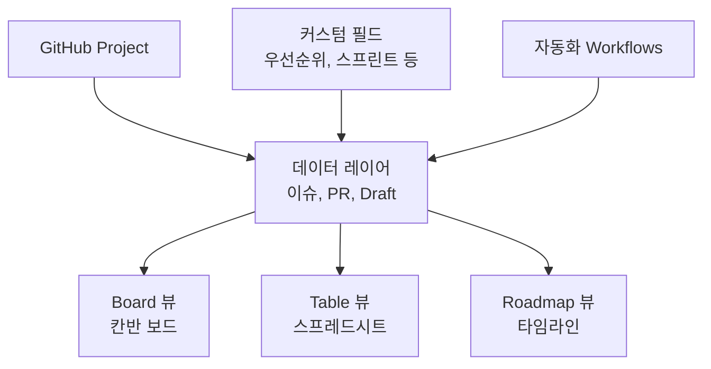
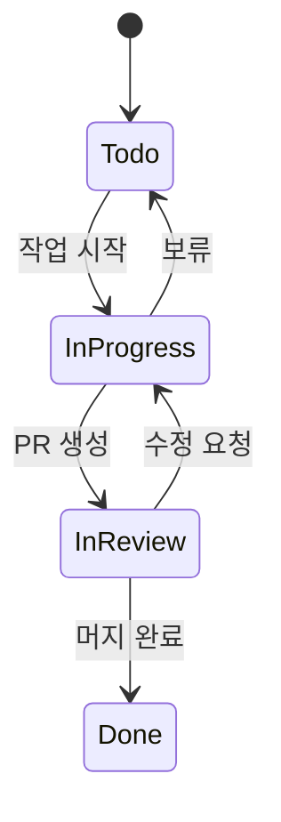
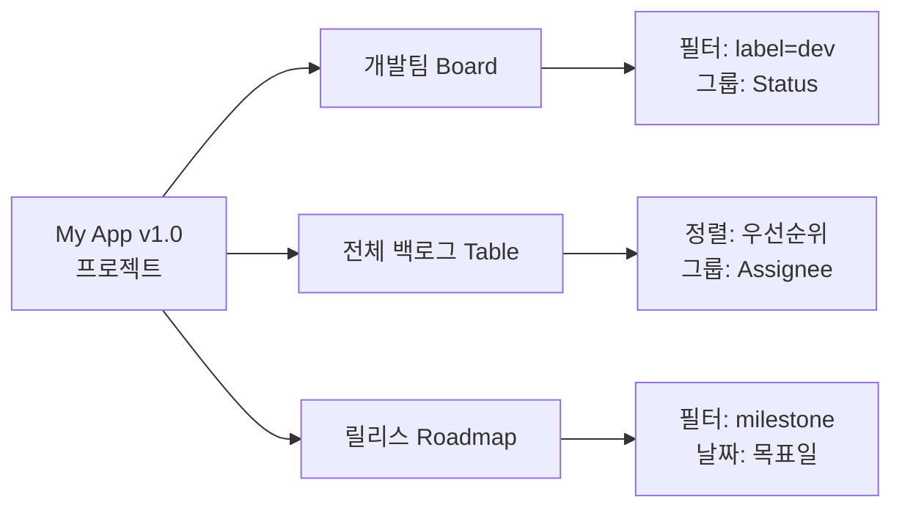
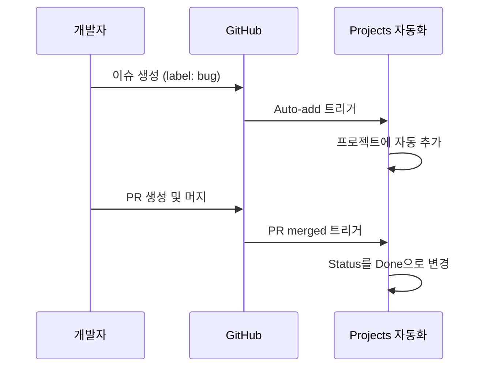

# Projects 보드

> 칸반 보드, 자동화, 타임라인 뷰, 커스텀 필드

## 개요

이슈를 만들고 라벨을 붙이는 것만으로는 프로젝트의 전체 그림을 보기 어렵습니다. "지금 진행 중인 작업이 뭐지?", "이번 주에 뭘 끝내야 하지?", "전체 일정은 어떻게 되지?" — 이런 질문에 답하려면 **GitHub Projects**가 필요해요. 이번 섹션에서는 이슈들을 칸반 보드, 테이블, 타임라인으로 시각화하고 관리하는 방법을 배웁니다.

**선수 지식**: [Issues 활용](./01-issues.md)에서 배운 이슈 생성과 분류
**학습 목표**:
- GitHub Projects v2를 생성하고 이슈를 추가할 수 있다
- 보드(Board), 테이블(Table), 로드맵(Roadmap) 세 가지 뷰를 활용한다
- 커스텀 필드를 만들어 프로젝트를 세분화한다
- 내장 자동화(Workflow)를 설정한다

## 왜 알아야 할까?

이슈가 10개일 때는 목록만으로 충분하지만, 50개, 100개가 되면 이야기가 달라집니다. **칸반 보드**로 진행 상태를 시각화하고, **타임라인**으로 일정을 관리하면 팀 전체가 같은 그림을 공유할 수 있어요. GitHub Projects는 Jira나 Trello 같은 전문 도구를 대체할 수 있을 만큼 강력해졌습니다.

## 핵심 개념

### 개념 1: GitHub Projects v2란?

> 💡 **비유**: GitHub Projects는 **만능 화이트보드**와 같습니다. 포스트잇(이슈)을 칸반 보드에 붙여서 상태를 관리할 수도 있고, 같은 포스트잇을 스프레드시트(테이블)로 정리할 수도 있고, 타임라인에 배치해서 일정을 볼 수도 있어요. 하나의 데이터를 여러 방식으로 볼 수 있다는 게 핵심입니다.

> 📊 **그림 1**: GitHub Projects v2의 구조 — 하나의 데이터, 여러 뷰




GitHub Projects v2의 핵심 특징:

| 특징 | 설명 |
|------|------|
| **여러 저장소 통합** | 하나의 프로젝트에 여러 저장소의 이슈/PR 포함 가능 |
| **3가지 뷰** | Board(칸반), Table(스프레드시트), Roadmap(타임라인) |
| **커스텀 필드** | 우선순위, 스프린트, 예상 시간 등 자유롭게 추가 |
| **내장 자동화** | 이슈 닫으면 자동으로 "Done"으로 이동 |
| **필터링 & 그룹핑** | 담당자, 라벨, 상태 등으로 자유롭게 분류 |

```bash
# 프로젝트 생성
gh project create --title "My App v1.0" --owner "@me"

# 프로젝트 목록 보기
gh project list

# 프로젝트에 이슈 추가
gh project item-add 1 --url https://github.com/user/repo/issues/15
```

### 개념 2: 세 가지 뷰

**1) Board (칸반 보드)**

> 💡 **비유**: 칸반 보드는 **세탁물 정리 바구니**와 같습니다. "세탁 전", "세탁 중", "완료" 바구니를 놓고, 빨래(이슈)를 진행 상태에 따라 옮기는 거예요.

가장 인기 있는 뷰입니다. 이슈를 **카드**로 표시하고, 상태별 **컬럼**(Todo → In Progress → Done)에 배치합니다. 카드를 드래그 앤 드롭으로 옮기면 상태가 자동으로 바뀌어요.

> 📊 **그림 2**: Board 뷰의 이슈 상태 흐름




**2) Table (테이블)**

스프레드시트 형태로 이슈를 한 줄씩 보여줍니다. 각 열이 필드(상태, 담당자, 우선순위 등)에 해당해요. **정렬, 그룹핑, 필터**가 가능해서 데이터를 빠르게 분석할 때 유용합니다.

**3) Roadmap (타임라인)**

간트 차트 스타일의 타임라인입니다. 이슈에 **날짜 필드**가 있으면 시간축 위에 배치되어 **일정 계획과 진행 상황**을 시각적으로 파악할 수 있어요. 월, 분기, 연 단위로 줌 조절이 가능합니다.

**같은 프로젝트에 여러 뷰를 만들 수 있습니다**:

- "개발팀 Board" — 개발 이슈만 칸반으로
- "전체 백로그 Table" — 모든 이슈를 우선순위별로 정렬
- "릴리스 Roadmap" — 마일스톤별 타임라인

> 📊 **그림 3**: 같은 프로젝트, 목적별 다른 뷰 활용




### 개념 3: 커스텀 필드

기본 필드(Status, Assignees, Labels 등) 외에 **프로젝트에 맞는 필드**를 추가할 수 있습니다:

| 필드 타입 | 예시 | 용도 |
|-----------|------|------|
| **Text** | 메모, 참고 사항 | 자유 텍스트 입력 |
| **Number** | 스토리 포인트, 예상 시간 | 숫자 값 |
| **Date** | 목표 날짜, 시작일 | 날짜 선택 (Roadmap에 활용) |
| **Single Select** | 우선순위 (Low/Medium/High) | 드롭다운 선택 |
| **Iteration** | Sprint 1, Sprint 2 | 기간 기반 반복 주기 |

프로젝트 설정 → Custom fields에서 추가할 수 있습니다.

**Iteration 필드**는 스프린트 관리에 특히 유용합니다. 시작일과 기간(예: 2주)을 설정하면 반복 주기가 자동으로 생성되고, 각 이슈를 해당 스프린트에 배정할 수 있어요.

### 개념 4: 내장 자동화(Workflows)

수동으로 카드를 옮기는 건 번거롭죠. GitHub Projects는 **내장 자동화**를 제공합니다:

| 자동화 | 동작 |
|--------|------|
| **Item closed** | 이슈/PR이 닫히면 Status를 "Done"으로 변경 |
| **Pull request merged** | PR이 머지되면 Status를 "Done"으로 변경 |
| **Auto-add** | 조건에 맞는 이슈가 생성되면 자동으로 프로젝트에 추가 |
| **Auto-archive** | 조건에 맞는 항목을 자동으로 아카이브 |
| **Item added** | 프로젝트에 추가될 때 필드 값 자동 설정 |

기본으로 처음 두 가지(닫기 → Done, 머지 → Done)가 활성화되어 있습니다.

> 📊 **그림 4**: 내장 자동화 워크플로우 동작 흐름




**Auto-add 설정 예시**:
- `label:bug`인 이슈가 생성되면 자동으로 프로젝트에 추가
- 특정 저장소의 모든 이슈를 자동 추가

> ⚠️ **흔한 오해**: "Auto-add는 기존 이슈에도 적용된다" — 아닙니다. Auto-add는 **새로 생성되거나 업데이트된 이슈**에만 적용됩니다. 기존 이슈를 추가하려면 수동으로 넣거나 필터 기능을 활용해야 해요.

### 개념 5: 인사이트(Insights)

프로젝트에 내장된 **차트 기능**으로 진행 상황을 시각화할 수 있습니다:

- **Burn up 차트**: 시간에 따른 완료/미완료 항목 추적
- **커스텀 차트**: 필드별로 그룹화하여 분포 확인

## 실습: 프로젝트 보드 만들기

```bash
# 1. 프로젝트 생성
gh project create --title "My App v1.0" --owner "@me"

# 2. 이슈 여러 개 만들기
gh issue create --title "로그인 기능 구현" --label "enhancement"
gh issue create --title "회원가입 폼 구현" --label "enhancement"
gh issue create --title "비밀번호 재설정 기능" --label "enhancement"
gh issue create --title "다크 모드 버그 수정" --label "bug"

# 3. 프로젝트에 이슈 추가
gh project item-add 1 --url https://github.com/user/repo/issues/1
gh project item-add 1 --url https://github.com/user/repo/issues/2
gh project item-add 1 --url https://github.com/user/repo/issues/3
gh project item-add 1 --url https://github.com/user/repo/issues/4

# 4. 프로젝트 항목 확인
gh project item-list 1
```

```output
TYPE   TITLE                       NUMBER  REPOSITORY       STATUS
Issue  로그인 기능 구현             #1      user/repo        Todo
Issue  회원가입 폼 구현             #2      user/repo        Todo
Issue  비밀번호 재설정 기능         #3      user/repo        Todo
Issue  다크 모드 버그 수정          #4      user/repo        Todo
```

```bash
# 5. 브라우저에서 프로젝트 보드 열기
gh project view 1 --web
```

웹에서 Board 뷰로 전환하면 모든 이슈가 "Todo" 컬럼에 있는 것을 확인할 수 있습니다. 이슈를 "In Progress"로 드래그하면 상태가 자동으로 바뀝니다.

## 더 깊이 알아보기

### GitHub Projects의 진화

GitHub Projects의 전신은 2016년경 출시된 **Projects (classic)**이었습니다. 단순한 칸반 보드였는데, 기능이 제한적이라 많은 팀이 Trello나 Jira를 함께 사용했어요.

2021년 GitHub Universe에서 **Projects v2**가 발표되었고, 2022년 정식 출시되었습니다. 커스텀 필드, 여러 뷰, 자동화가 추가되면서 독립적인 프로젝트 관리 도구로 자리잡았죠. 2025년에는 하위 이슈와 이슈 타입의 통합으로 더욱 강력해졌고, 프로젝트 항목 제한이 1,200개에서 **50,000개**로 대폭 늘어났습니다.

> 💡 **알고 계셨나요?**: GitHub Projects v2에서는 **Draft 항목**을 만들 수 있습니다. 아직 이슈로 만들기 전인 아이디어를 메모처럼 프로젝트에 넣어두고, 나중에 정식 이슈로 전환할 수 있어요.

## 흔한 오해와 팁

> 🔥 **실무 팁**: **여러 뷰를 만들어 활용**하세요. 같은 프로젝트를 "일일 스탠드업용 Board", "백로그 관리용 Table", "경영진 보고용 Roadmap"으로 각각 만들면 상황에 맞는 시각화가 가능합니다.

> 🔥 **실무 팁**: 프로젝트 **템플릿**을 활용하세요. 조직에서 자주 사용하는 프로젝트 구조(필드, 뷰, 자동화)를 템플릿으로 저장해두면 새 프로젝트를 빠르게 시작할 수 있습니다.

> 🔥 **실무 팁**: Iteration 필드로 **스프린트 계획**을 하세요. 2주 단위로 Iteration을 설정하고, 각 이슈를 해당 스프린트에 배정하면 별도 도구 없이도 애자일 스프린트 관리가 가능합니다.

## 핵심 정리

| 개념 | 설명 |
|------|------|
| GitHub Projects v2 | 이슈/PR을 시각적으로 관리하는 프로젝트 도구 |
| Board 뷰 | 칸반 보드 — 카드를 드래그 앤 드롭으로 상태 관리 |
| Table 뷰 | 스프레드시트 — 정렬, 그룹핑, 필터링에 최적 |
| Roadmap 뷰 | 타임라인 — 날짜 기반 일정 시각화 |
| 커스텀 필드 | Text, Number, Date, Single Select, Iteration |
| 내장 자동화 | 이슈 닫기 → Done, Auto-add, Auto-archive |
| Insights | 프로젝트 진행 상황 차트 |
| `gh project create` | CLI에서 프로젝트 생성 |

## 다음 섹션 미리보기

Projects로 이슈를 시각적으로 관리하는 법을 배웠습니다. 하지만 프로젝트에는 코드와 이슈 외에도 **커뮤니티 소통과 문서화**가 필요하죠. [Discussions와 Wiki](./03-discussions-wiki.md)에서는 GitHub의 포럼 기능인 Discussions와 문서 관리 도구인 Wiki를 활용하는 방법을 알아봅니다.

## 참고 자료

- [GitHub Docs — Projects 소개](https://docs.github.com/en/issues/planning-and-tracking-with-projects/learning-about-projects/about-projects) - Projects v2 공식 가이드
- [GitHub Docs — Projects 빠른 시작](https://docs.github.com/en/issues/planning-and-tracking-with-projects/learning-about-projects/quickstart-for-projects) - 프로젝트 생성부터 설정까지
- [GitHub Docs — 뷰 레이아웃 변경](https://docs.github.com/en/issues/planning-and-tracking-with-projects/customizing-views-in-your-project/changing-the-layout-of-a-view) - Board/Table/Roadmap 전환
- [GitHub Docs — 내장 자동화](https://docs.github.com/en/issues/planning-and-tracking-with-projects/automating-your-project/using-the-built-in-automations) - Workflow 설정 가이드
- [GitHub Docs — Projects 모범 사례](https://docs.github.com/en/issues/planning-and-tracking-with-projects/learning-about-projects/best-practices-for-projects) - 효과적인 프로젝트 관리 팁
