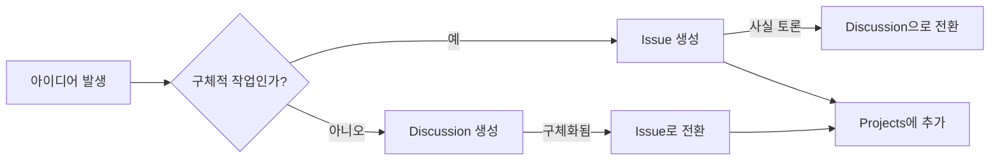
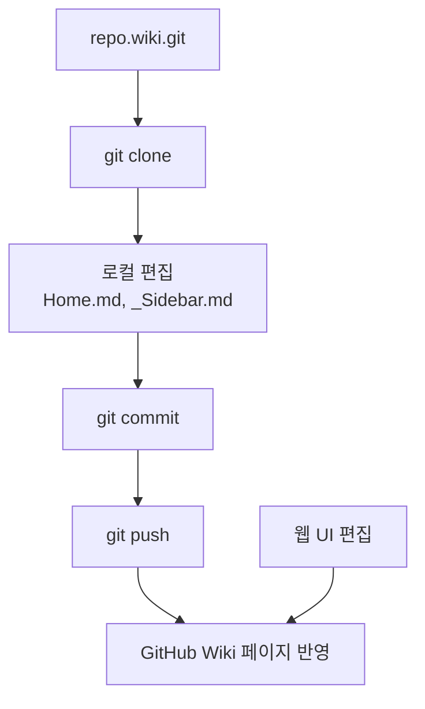
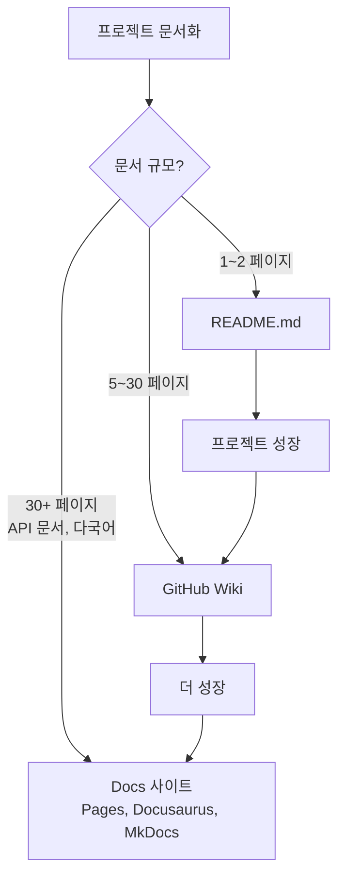

# Discussions와 Wiki

> 커뮤니티 소통, Q&A, 문서 관리

## 개요

이슈는 **할 일**을 추적하는 데 최적이지만, "이 기능 어떻게 생각하세요?", "이 에러 겪어본 분 있나요?" 같은 **대화**에는 어울리지 않아요. 이런 소통에는 **Discussions**가 적합하고, 프로젝트의 공식 **문서화**에는 **Wiki**가 필요합니다. 이번 섹션에서는 이 두 도구를 배웁니다.

**선수 지식**: [Projects 보드](./02-projects.md)에서 배운 프로젝트 관리 기본
**학습 목표**:
- Discussions의 카테고리와 형식을 이해하고 활용한다
- Q&A 형식에서 답변을 수락(mark as answer)하는 법을 안다
- Wiki를 만들고 로컬에서 편집하는 방법을 안다
- Issues, Discussions, Wiki의 용도 차이를 이해한다

## 왜 알아야 할까?

오픈소스 프로젝트를 운영하면 이슈 트래커에 버그 리포트뿐 아니라 질문, 아이디어, 토론이 뒤섞여 들어옵니다. 이러면 정작 버그를 찾기 어려워지죠. **Discussions**로 대화를 분리하면 이슈 트래커를 깔끔하게 유지할 수 있습니다.

또한 프로젝트가 커지면 README 하나로는 부족합니다. 설치 가이드, API 문서, FAQ — 이런 것들을 체계적으로 정리할 **Wiki**가 필요해요.

## 핵심 개념

### 개념 1: GitHub Discussions — 커뮤니티 포럼

> 💡 **비유**: Discussions는 프로젝트 전용 **게시판**과 같습니다. 이슈가 "접수 창구"(구체적 작업 요청)라면, Discussions는 "커뮤니티 라운지"(자유로운 대화, 질문, 아이디어 공유)예요.

Discussions는 저장소 Settings → Features → Discussions에서 활성화할 수 있습니다.

**기본 카테고리와 형식**:

| 카테고리 | 형식 | 설명 |
|----------|------|------|
| **Announcements** | 공지 | 메인테이너만 게시 가능, 모두 댓글 가능 |
| **General** | 자유 | 프로젝트 관련 모든 대화 |
| **Ideas** | 자유 | 기능 제안, 개선 아이디어 |
| **Polls** | 투표 | 커뮤니티 의견 수렴 (최대 8개 선택지) |
| **Q&A** | 질의응답 | 답변을 "수락"으로 표시 가능 |
| **Show and tell** | 자유 | 자신의 프로젝트나 성과 공유 |

> 🔥 **실무 팁**: **Q&A 카테고리**는 매우 유용합니다. 질문에 대한 답변을 "Accept answer"로 표시하면, 같은 질문이 나왔을 때 검색으로 빠르게 답을 찾을 수 있어요. 스택오버플로우처럼요!

**Discussions 주요 기능**:

- **고정(Pin)**: 중요한 게시글을 상단에 고정 (전체 또는 카테고리별)
- **라벨**: 이슈처럼 라벨로 분류 가능
- **잠금(Lock)**: 더 이상 댓글을 받지 않음
- **이슈로 전환**: 대화에서 구체적인 작업이 나오면 이슈로 변환
- **이동(Transfer)**: 다른 저장소의 Discussions로 이동

```bash
# Discussions는 gh CLI에서 직접 생성하는 명령이 제한적이지만,
# 브라우저에서 바로 열 수 있습니다
gh browse --repo user/repo -- /discussions

# 이슈를 Discussion으로 전환하는 것은 웹 UI에서 가능:
# 이슈 페이지 → 사이드바 하단 → "Convert to discussion"
```

### 개념 2: 이슈 vs Discussions — 언제 무엇을 쓸까?

> 📊 **그림 1**: 이슈와 Discussions 간 전환 흐름




이 둘의 구분이 헷갈릴 수 있어요. 핵심 기준은 **"구체적인 작업이 있는가?"**입니다:

| 기준 | Issues | Discussions |
|------|--------|-------------|
| **목적** | 구체적 작업 추적 | 대화, 질문, 아이디어 |
| **상태** | Open / Closed | Open / Closed (+ 답변 수락) |
| **예시** | "로그인 버그 수정", "다크 모드 구현" | "이 기능 어떻게 생각하세요?", "설치 오류 도와주세요" |
| **담당자** | 할당 가능 | 할당 불가 |
| **프로젝트** | Projects에 추가 가능 | 추가 불가 |
| **전환** | Discussion으로 변환 가능 | 이슈로 변환 가능 |

> 💡 **알고 계셨나요?**: Discussions에서 나온 아이디어가 구체화되면 **이슈로 전환**할 수 있습니다. 반대로 이슈로 올라온 질문이 사실 토론인 경우에도 **Discussion으로 전환** 가능해요. 유연하게 왔다 갔다 할 수 있습니다.

### 개념 3: GitHub Wiki — 프로젝트 문서화

> 📊 **그림 2**: Wiki의 Git 기반 편집 흐름




> 💡 **비유**: Wiki는 프로젝트의 **백과사전**입니다. README가 책의 "표지와 서문"이라면, Wiki는 "전체 목차와 챕터"에 해당해요. 설치 가이드, 사용법, API 문서, FAQ 등을 체계적으로 정리할 수 있습니다.

Wiki는 저장소와 별도의 **Git 저장소**로 관리됩니다. 웹에서 편집할 수도 있고, 로컬에 clone해서 편집할 수도 있어요.

**Wiki 활성화 및 첫 페이지 만들기**:

1. 저장소 → Settings → Features → Wikis 체크
2. 저장소 → Wiki 탭 → "Create the first page" 클릭
3. 마크다운으로 내용 작성 → Save Page

**로컬에서 Wiki 편집하기**:

```bash
# Wiki 저장소 clone (별도의 Git 저장소)
git clone https://github.com/user/repo.wiki.git
cd repo.wiki

# 파일 구조 확인
ls
```

```output
Home.md
```

```bash
# 새 페이지 추가
echo "# 설치 가이드

## macOS
brew install our-tool

## Windows
winget install our-tool" > Installation.md

# 사이드바 네비게이션 추가
echo "## 목차
- [홈](Home)
- [설치 가이드](Installation)
- [사용법](Usage)
- [FAQ](FAQ)" > _Sidebar.md

# 커밋 & 푸시
git add .
git commit -m "Add installation guide and sidebar"
git push
```

**Wiki의 특수 파일**:

| 파일 | 용도 |
|------|------|
| `Home.md` | Wiki 메인 페이지 |
| `_Sidebar.md` | 모든 페이지에 표시되는 사이드바 네비게이션 |
| `_Footer.md` | 모든 페이지 하단에 표시되는 푸터 |

> ⚠️ **흔한 오해**: "Wiki는 웹에서만 편집할 수 있다" — 아닙니다! Wiki는 별도의 Git 저장소이므로, `git clone`으로 로컬에 가져와서 에디터에서 편집하고 push할 수 있어요. 여러 페이지를 한꺼번에 수정할 때 훨씬 편합니다.

### 개념 4: Wiki vs README vs Docs 사이트

> 📊 **그림 3**: 프로젝트 규모별 문서화 도구 선택




문서를 어디에 둘지 고민된다면:

| 도구 | 적합한 경우 |
|------|------------|
| **README.md** | 프로젝트 소개, 빠른 시작 가이드 (1~2페이지) |
| **Wiki** | 중간 규모 문서, 설치/사용법/FAQ (5~30페이지) |
| **Docs 사이트** | 대규모 공식 문서, API 레퍼런스, 다국어 지원 (GitHub Pages, Docusaurus, MkDocs 등) |

소규모 프로젝트에서는 README + Wiki면 충분합니다. 프로젝트가 성장하면 전용 문서 사이트를 고려하세요.

## 실습: Discussions와 Wiki 설정하기

```bash
# 1. Discussions 활성화 (웹 UI에서)
# 저장소 → Settings → Features → Discussions 체크

# 2. 브라우저에서 Discussions 열기
gh browse -- /discussions

# 3. Wiki 저장소 clone & 페이지 추가
git clone https://github.com/user/repo.wiki.git
cd repo.wiki

# 4. Home 페이지 작성
echo "# My Project Wiki

프로젝트에 오신 것을 환영합니다!

## 빠른 링크
- [설치 가이드](Installation)
- [사용법](Usage)
- [FAQ](FAQ)
- [기여 방법](Contributing)" > Home.md

# 5. 사이드바 추가
echo "**Navigation**
- [Home](Home)
- [Installation](Installation)
- [Usage](Usage)
- [FAQ](FAQ)" > _Sidebar.md

# 6. 푸시
git add . && git commit -m "Setup wiki structure" && git push
```

## 더 깊이 알아보기

### Discussions의 탄생

GitHub Discussions는 2020년 12월 베타로 출시되어 2021년에 정식 출시되었습니다. 그 이전에는 이슈 트래커가 버그, 기능 요청, 질문, 토론을 모두 담아야 했는데, 이러다 보니 이슈 목록이 점점 어지러워지는 문제가 있었어요.

Discussions가 만들어진 핵심 이유는 **"이슈 트래커는 작업 추적에, 대화는 대화 전용 공간에"**라는 분리 원칙이었습니다. 현재 수많은 오픈소스 프로젝트가 지원 질문과 커뮤니티 토론을 Discussions에서 처리하고 있어요.

한편 **GitHub Wiki**는 GitHub 초기(2010년경)부터 존재한 기능으로, 내부적으로 **Gollum**이라는 Git 기반 위키 엔진을 사용합니다. 위키 자체가 Git 저장소이기 때문에 버전 관리가 되고, clone/push가 가능한 거예요.

> 💡 **알고 계셨나요?**: GitHub Discussions는 **조직(Organization) 수준**에서도 활성화할 수 있습니다. 이 경우 특정 저장소를 "소스 저장소"로 지정하면, 조직 전체의 Discussions가 한 곳에 모여요. 여러 저장소를 관리하는 팀에게 유용합니다.

## 흔한 오해와 팁

> ⚠️ **흔한 오해**: "Wiki는 아무나 편집할 수 있다" — 기본 설정에서는 저장소에 **push 권한이 있는 사람**만 Wiki를 편집할 수 있습니다. 공개 저장소에서 "누구나 편집 가능"으로 바꿀 수도 있지만, 이 경우 스팸 방지에 주의해야 합니다.

> 🔥 **실무 팁**: Discussions의 **Announcements 카테고리**를 활용하세요. 릴리스 공지, 중요 변경 사항, 마이그레이션 안내 등 **메인테이너만 작성**할 수 있는 공식 채널로 사용하면 좋습니다.

> 🔥 **실무 팁**: 자주 묻는 질문이 반복된다면, Q&A Discussions에서 "수락된 답변"이 있는 게시글을 **고정(Pin)**해두세요. 새 사용자가 같은 질문을 올리기 전에 확인할 수 있습니다.

## 핵심 정리

| 개념 | 설명 |
|------|------|
| Discussions | 프로젝트 전용 커뮤니티 포럼 |
| Q&A 카테고리 | 답변 수락 가능한 질의응답 형식 |
| Announcements | 메인테이너만 게시 가능한 공지 채널 |
| Polls | 커뮤니티 투표 (최대 8개 선택지) |
| Wiki | Git 기반 프로젝트 문서 시스템 |
| `_Sidebar.md` | Wiki 네비게이션 사이드바 |
| 이슈 ↔ Discussion 전환 | 서로 변환 가능 |
| Wiki clone | `git clone user/repo.wiki.git`으로 로컬 편집 |

## 다음 섹션 미리보기

이슈를 만들고, 프로젝트로 관리하고, 커뮤니티와 소통하는 법까지 배웠습니다. 마지막으로 이 모든 과정을 **자동화하고 표준화**하는 방법을 알아볼 차례예요. [템플릿과 자동화](./04-templates.md)에서는 이슈/PR 템플릿(YAML 폼 포함), CONTRIBUTING.md 작성법, 그리고 GitHub Actions를 활용한 자동화를 배웁니다.

## 참고 자료

- [GitHub Docs — Discussions 소개](https://docs.github.com/en/discussions/collaborating-with-your-community-using-discussions/about-discussions) - Discussions 공식 가이드
- [GitHub Docs — Discussions 빠른 시작](https://docs.github.com/en/discussions/quickstart) - 활성화부터 사용까지
- [GitHub Docs — Wiki 페이지 추가/편집](https://docs.github.com/en/communities/documenting-your-project-with-wikis/adding-or-editing-wiki-pages) - Wiki 공식 가이드
- [GitHub Docs — Wiki 사이드바/푸터](https://docs.github.com/en/communities/documenting-your-project-with-wikis/creating-a-footer-or-sidebar-for-your-wiki) - Wiki 네비게이션 설정
