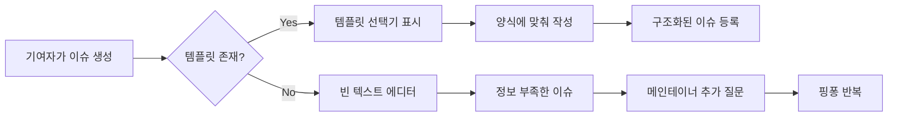
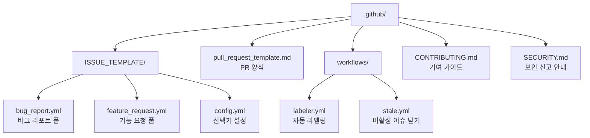
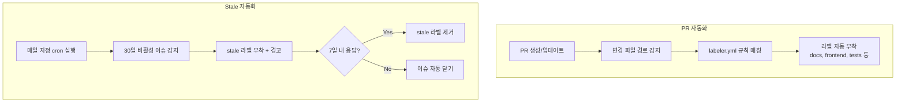

# 템플릿과 자동화

> Issue/PR 템플릿, CONTRIBUTING.md, CODEOWNERS

## 개요

매번 이슈를 올릴 때마다 "뭘 적어야 하지?" 고민하고, PR 설명이 "수정함"으로 끝나는 경험 — 해보셨죠? **템플릿**을 만들어두면 이런 고민이 사라집니다. 이번 섹션에서는 이슈/PR 템플릿, 기여 가이드라인(CONTRIBUTING.md), 그리고 GitHub Actions를 활용한 자동화까지 배웁니다.

**선수 지식**: [Discussions와 Wiki](./03-discussions-wiki.md)에서 배운 커뮤니티 도구, [Markdown 작성법](../05-github-start/04-markdown.md)
**학습 목표**:
- YAML 이슈 폼을 만들 수 있다
- PR 템플릿을 설정할 수 있다
- CONTRIBUTING.md를 작성하여 기여 가이드를 제공한다
- GitHub Actions로 이슈/PR 관련 자동화를 구성한다

## 왜 알아야 할까?

오픈소스 프로젝트에서 "버그가 있어요"라고만 쓴 이슈를 받으면, 메인테이너는 "어떤 버그요? 재현 방법은요? 어떤 환경이에요?"라고 되물어야 합니다. 이런 핑퐁을 줄이려면 **양식을 미리 만들어두는 게** 가장 효과적이에요.

템플릿은 기여자의 시간도 아끼고, 메인테이너의 시간도 아낍니다. **팀의 소통 비용을 줄이는 가장 쉬운 방법**이죠.

> 📊 **그림 1**: 이슈 생성 흐름 — 템플릿이 있을 때와 없을 때




## 핵심 개념

### 개념 1: 이슈 템플릿 — 마크다운 vs YAML 폼

> 💡 **비유**: 이슈 템플릿은 **병원 접수 양식**과 같습니다. 환자가 빈 종이에 자유롭게 쓰는 것보다, "증상은?", "언제부터?", "알레르기는?" 같은 양식이 있으면 의사가 빠르게 파악할 수 있죠. 이슈 템플릿도 마찬가지로, 필요한 정보를 미리 정해두면 문제를 빠르게 이해할 수 있습니다.

GitHub은 두 가지 방식의 이슈 템플릿을 지원합니다:

| 방식 | 파일 형식 | 장점 | 단점 |
|------|-----------|------|------|
| **마크다운 템플릿** | `.md` | 간단, 자유로운 편집 | 유효성 검증 없음 |
| **YAML 이슈 폼** | `.yml` | 구조화된 입력, 필수 필드 | 형식이 고정됨 |

**마크다운 템플릿** (`.github/ISSUE_TEMPLATE/bug_report.md`):

```markdown
---
name: Bug Report
about: 버그를 리포트해주세요
title: '[Bug] '
labels: bug
assignees: ''
---

## 버그 설명
어떤 문제가 발생했나요?

## 재현 방법
1. ...
2. ...

## 기대 동작
어떻게 동작해야 하나요?

## 환경 정보
- OS: [예: macOS 14.0]
- 브라우저: [예: Chrome 120]
```

**YAML 이슈 폼** (`.github/ISSUE_TEMPLATE/bug_report.yml`):

```yaml
name: Bug Report
description: 버그를 리포트해주세요
title: "[Bug]: "
labels: ["bug", "triage"]
assignees:
  - octocat
body:
  - type: markdown
    attributes:
      value: |
        버그 리포트를 작성해주셔서 감사합니다!

  - type: textarea
    id: description
    attributes:
      label: 버그 설명
      description: 어떤 문제가 발생했나요?
      placeholder: 가능한 자세히 설명해주세요
    validations:
      required: true

  - type: textarea
    id: steps
    attributes:
      label: 재현 방법
      description: 버그를 재현하는 단계를 알려주세요
      value: |
        1.
        2.
        3.
    validations:
      required: true

  - type: dropdown
    id: os
    attributes:
      label: 운영체제
      options:
        - macOS
        - Windows
        - Linux
    validations:
      required: true

  - type: checkboxes
    id: terms
    attributes:
      label: 확인 사항
      options:
        - label: 중복 이슈를 검색했습니다
          required: true
        - label: 최신 버전에서 확인했습니다
```

YAML 폼은 마크다운 템플릿보다 **훨씬 강력**합니다. 드롭다운, 체크박스, 필수 필드 검증까지 가능하거든요.

> 🔥 **실무 팁**: 2021년에 도입된 YAML 이슈 폼은 마크다운 템플릿의 진화 버전입니다. 새 프로젝트에서는 **YAML 폼을 추천**합니다. 구조화된 입력으로 정보 누락을 방지할 수 있어요.

**YAML 폼의 입력 타입**:

| 타입 | 용도 |
|------|------|
| `markdown` | 안내 텍스트 (입력 안 됨, 표시만) |
| `textarea` | 여러 줄 텍스트 입력 |
| `input` | 한 줄 텍스트 입력 |
| `dropdown` | 드롭다운 선택 (`multiple: true`로 다중 선택 가능) |
| `checkboxes` | 체크박스 목록 (각각 필수 지정 가능) |

### 개념 2: 템플릿 선택기(Template Chooser) 설정

> 📊 **그림 2**: .github 디렉토리 구조와 각 파일의 역할




여러 템플릿이 있을 때 빈 이슈를 막고, 외부 링크를 추가할 수 있습니다.

`.github/ISSUE_TEMPLATE/config.yml`:

```yaml
blank_issues_enabled: false
contact_links:
  - name: 보안 취약점 신고
    url: https://example.com/security
    about: 보안 문제는 이슈 대신 여기로 신고해주세요
  - name: 질문 & 도움
    url: https://github.com/user/repo/discussions
    about: 사용법 질문은 Discussions에서 해주세요
```

- `blank_issues_enabled: false` — 템플릿 없이 빈 이슈 생성을 차단합니다
- `contact_links` — 이슈 대신 외부 링크(보안 신고, Discussions 등)로 안내합니다

> 💡 **비유**: 템플릿 선택기는 **은행 번호표 기계**와 같습니다. 창구에 가면 "예금", "대출", "상담" 중에 선택하라고 하죠. 마찬가지로 이슈를 만들 때 "버그 리포트", "기능 요청", "문서 개선" 중 선택하게 하면 올바른 양식으로 안내됩니다.

### 개념 3: PR 템플릿

PR 템플릿은 [PR 워크플로우](../06-pull-request/01-pr-workflow.md)에서 간략히 다뤘지만, 여기서 더 자세히 알아봅시다.

`.github/pull_request_template.md`:

```markdown
## 변경 사항
<!-- 무엇을 변경했는지 간단히 설명해주세요 -->

## 변경 유형
- [ ] 버그 수정 (Bug fix)
- [ ] 새 기능 (New feature)
- [ ] 기존 기능 변경 (Breaking change)
- [ ] 문서 업데이트 (Documentation)

## 테스트
- [ ] 로컬에서 테스트 완료
- [ ] 기존 테스트 통과 확인
- [ ] 새 테스트 추가 (해당 시)

## 관련 이슈
<!-- Closes #이슈번호 -->

## 체크리스트
- [ ] 코딩 스타일 가이드를 따랐습니다
- [ ] 셀프 리뷰를 했습니다
- [ ] 필요한 경우 문서를 업데이트했습니다
```

> ⚠️ **흔한 오해**: "PR 템플릿도 YAML 폼으로 만들 수 있다" — 아닙니다. PR 템플릿은 **마크다운만** 지원합니다. YAML 폼은 이슈 템플릿에서만 사용 가능해요.

### 개념 4: CONTRIBUTING.md — 기여 가이드

CONTRIBUTING.md는 **"이 프로젝트에 어떻게 기여하면 되나요?"**에 대한 공식 안내서입니다. 이 파일이 있으면 새 이슈나 PR을 만들 때 GitHub이 자동으로 링크를 보여줍니다.

좋은 CONTRIBUTING.md에 포함할 내용:

```markdown
# Contributing Guide

프로젝트에 기여해주셔서 감사합니다! 🎉

## 시작하기

### 개발 환경 설정
1. 저장소를 fork합니다
2. 로컬에 clone합니다: `git clone ...`
3. 의존성을 설치합니다: `npm install`
4. 개발 서버를 실행합니다: `npm run dev`

## 기여 방법

### 버그 리포트
- Issue 탭에서 "Bug Report" 템플릿을 사용해주세요
- 재현 방법을 최대한 자세히 작성해주세요

### 기능 제안
- Issue 탭에서 "Feature Request" 템플릿을 사용해주세요
- 큰 변경은 먼저 이슈로 논의해주세요

### Pull Request
1. `feature/` 또는 `fix/` 접두사로 브랜치를 만드세요
2. 커밋 메시지는 Conventional Commits를 따릅니다
3. PR 템플릿을 채워주세요
4. 테스트를 추가하고 기존 테스트가 통과하는지 확인하세요

## 코드 스타일
- ESLint 설정을 따릅니다: `npm run lint`
- Prettier로 포맷팅합니다: `npm run format`

## 행동 강령
[Code of Conduct](CODE_OF_CONDUCT.md)를 읽고 따라주세요.
```

**조직 전체 기본 파일** — `.github` 저장소(조직의 특수 저장소)에 넣으면 조직 내 모든 저장소에 기본으로 적용됩니다:

| 파일 | 용도 |
|------|------|
| `CONTRIBUTING.md` | 기여 가이드 |
| `CODE_OF_CONDUCT.md` | 행동 강령 |
| `SECURITY.md` | 보안 취약점 신고 안내 |
| `SUPPORT.md` | 지원/질문 채널 안내 |
| `FUNDING.yml` | GitHub Sponsors 설정 |

### 개념 5: GitHub Actions로 자동화

> 📊 **그림 3**: GitHub Actions 자동화 흐름 — 라벨링과 Stale 관리




이슈와 PR 관련 반복 작업을 자동화할 수 있습니다.

**1) 자동 라벨링** — PR에서 변경된 파일 경로에 따라 라벨 자동 부착:

```yaml
# .github/workflows/labeler.yml
name: Labeler
on:
  pull_request_target:
    types: [opened, synchronize]
jobs:
  label:
    runs-on: ubuntu-latest
    steps:
      - uses: actions/labeler@v5
        with:
          repo-token: "${{ secrets.GITHUB_TOKEN }}"
```

```yaml
# .github/labeler.yml (라벨 규칙)
documentation:
  - changed-files:
    - any-glob-to-any-file: 'docs/**'
frontend:
  - changed-files:
    - any-glob-to-any-file: 'src/frontend/**'
tests:
  - changed-files:
    - any-glob-to-any-file: '**/*.test.*'
```

**2) 비활성 이슈 자동 닫기(Stale)**:

```yaml
# .github/workflows/stale.yml
name: Close Stale Issues
on:
  schedule:
    - cron: '0 0 * * *'
jobs:
  stale:
    runs-on: ubuntu-latest
    steps:
      - uses: actions/stale@v9
        with:
          stale-issue-message: >
            이 이슈가 30일간 비활성 상태입니다.
            7일 내에 업데이트가 없으면 자동으로 닫힙니다.
          days-before-stale: 30
          days-before-close: 7
          stale-issue-label: 'stale'
```

> 🔥 **실무 팁**: `actions/stale`을 사용할 때 `exempt-issue-labels`로 특정 라벨을 제외하세요. 예: `exempt-issue-labels: "priority:high,keep-open"` — 중요한 이슈가 실수로 닫히는 것을 방지합니다.

## 실습: 이슈 템플릿 설정하기

```bash
# 1. 템플릿 디렉토리 생성
mkdir -p .github/ISSUE_TEMPLATE

# 2. YAML 이슈 폼 생성 (에디터에서 작성)
# .github/ISSUE_TEMPLATE/bug_report.yml 파일 작성 (위 예시 참고)

# 3. 기능 요청 템플릿도 추가
# .github/ISSUE_TEMPLATE/feature_request.yml

# 4. 템플릿 선택기 설정
# .github/ISSUE_TEMPLATE/config.yml 파일 작성 (위 예시 참고)

# 5. PR 템플릿 생성
# .github/pull_request_template.md 파일 작성

# 6. 커밋 & 푸시
git add .github/
git commit -m "Add issue/PR templates and config"
git push
```

```bash
# 7. 새 이슈를 만들어보면 템플릿 선택 화면이 나타남
gh browse -- /issues/new/choose
```

## 더 깊이 알아보기

### 이슈 템플릿의 역사

GitHub 이슈 템플릿은 2016년에 마크다운 방식으로 처음 도입되었습니다. 프로젝트 루트에 `ISSUE_TEMPLATE.md` 파일 하나만 둘 수 있었죠. 이후 `.github/ISSUE_TEMPLATE/` 디렉토리를 지원하면서 여러 템플릿을 만들 수 있게 되었습니다.

2021년에는 **YAML 이슈 폼**이 베타로 출시되면서 큰 변화가 있었어요. 자유 텍스트 대신 **구조화된 입력 필드**(드롭다운, 체크박스, 필수 항목 등)를 사용할 수 있게 된 거죠. 2025년에는 이슈 타입(Issue Types)과의 연동(`type` 필드)이 추가되어, 템플릿에서 바로 이슈 타입을 지정할 수 있게 되었습니다.

> 💡 **알고 계셨나요?**: GitHub은 누군가 새 이슈를 만들려고 할 때, 저장소에 CONTRIBUTING.md가 있으면 **자동으로 안내 배너**를 보여줍니다. "기여하기 전에 가이드를 읽어주세요"라는 메시지와 함께요. 이 작은 장치가 불필요한 이슈를 크게 줄여줍니다.

## 흔한 오해와 팁

> ⚠️ **흔한 오해**: "YAML 이슈 폼에서 마크다운을 자유롭게 쓸 수 있다" — `markdown` 타입은 **안내 텍스트를 보여주는 용도**이지, 사용자가 입력하는 필드가 아닙니다. 사용자 입력은 `textarea`, `input`, `dropdown`, `checkboxes` 타입을 사용하세요.

> 🔥 **실무 팁**: 보안 취약점 리포트는 이슈 대신 **별도 채널**로 안내하세요. `config.yml`의 `contact_links`에 보안 신고 페이지를 추가하고, `SECURITY.md` 파일도 만들어두면 됩니다. 보안 취약점이 공개 이슈에 올라가면 악용될 수 있거든요.

> 🔥 **실무 팁**: 최소한 **Bug Report**와 **Feature Request** 두 가지 템플릿은 만들어두세요. 그리고 `blank_issues_enabled: false`로 빈 이슈를 차단하면, 정보가 부족한 이슈를 크게 줄일 수 있습니다.

## 핵심 정리

| 개념 | 설명 |
|------|------|
| 마크다운 템플릿 | `.md` 파일 — 간단, 자유 형식 |
| YAML 이슈 폼 | `.yml` 파일 — 구조화 입력, 필수 필드 검증 |
| PR 템플릿 | `.github/pull_request_template.md` — 마크다운만 지원 |
| config.yml | 빈 이슈 차단, 외부 링크 추가 |
| CONTRIBUTING.md | 기여 가이드라인 (GitHub이 자동 안내) |
| SECURITY.md | 보안 취약점 신고 안내 |
| `actions/labeler` | PR 파일 경로 기반 자동 라벨링 |
| `actions/stale` | 비활성 이슈/PR 자동 닫기 |
| CODEOWNERS | 파일별 자동 리뷰어 배정 |

## 다음 섹션 미리보기

Ch7에서 GitHub 프로젝트 관리의 모든 것을 배웠습니다 — 이슈 관리, 프로젝트 보드, 커뮤니티 소통, 템플릿과 자동화까지! Part 3(GitHub 협업)가 끝났네요. 다음 챕터 [Ch8. Rebase와 고급 브랜치 전략](../08-advanced-branch/01-rebase.md)에서는 **Rebase**, **Interactive Rebase**, **Cherry-pick** 등 Git의 고급 기능을 다루며, 히스토리를 깔끔하게 다듬는 기술을 배웁니다.

## 참고 자료

- [GitHub Docs — 이슈 폼 문법](https://docs.github.com/en/communities/using-templates-to-encourage-useful-issues-and-pull-requests/syntax-for-issue-forms) - YAML 이슈 폼 공식 가이드
- [GitHub Docs — 이슈 템플릿 설정](https://docs.github.com/en/communities/using-templates-to-encourage-useful-issues-and-pull-requests/configuring-issue-templates-for-your-repository) - 템플릿 설정 가이드
- [GitHub Docs — 기여 가이드라인 설정](https://docs.github.com/en/communities/setting-up-your-project-for-healthy-contributions/setting-guidelines-for-repository-contributors) - CONTRIBUTING.md 가이드
- [actions/labeler](https://github.com/actions/labeler) - 자동 라벨링 액션
- [actions/stale](https://github.com/actions/stale) - 비활성 이슈 관리 액션
