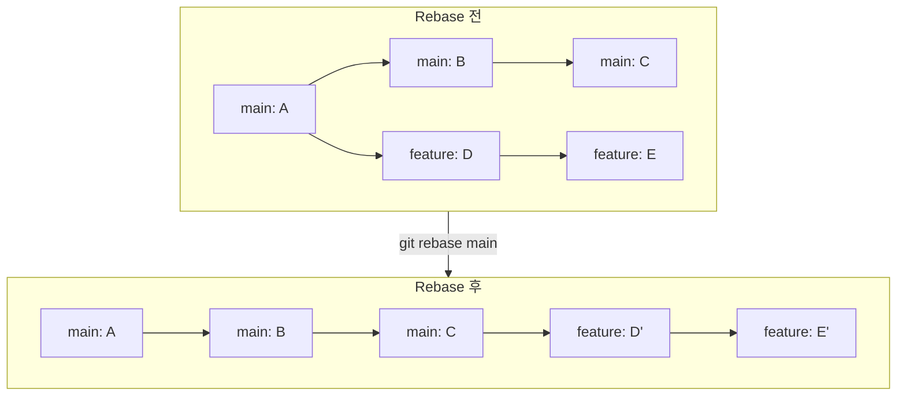
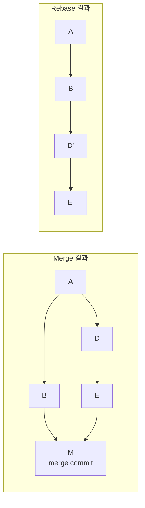
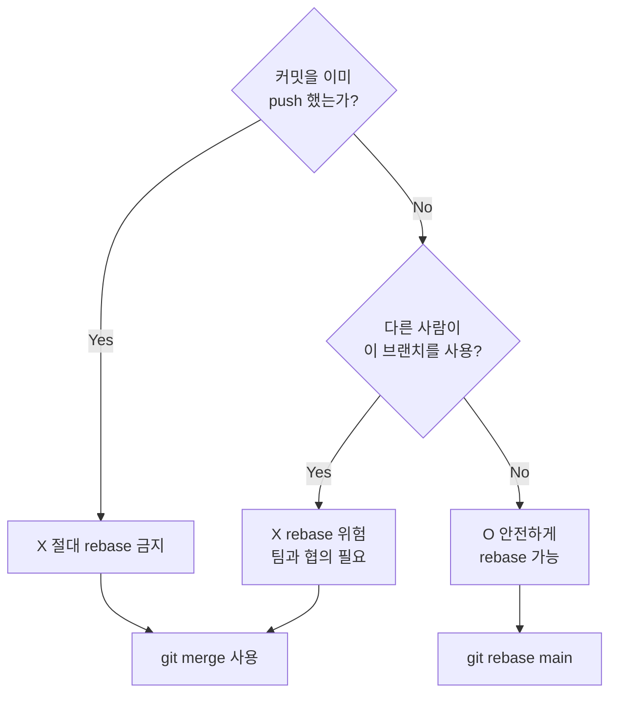
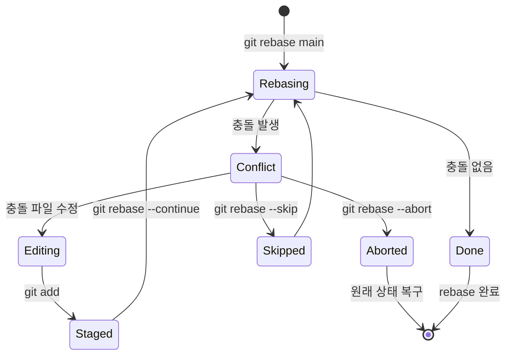
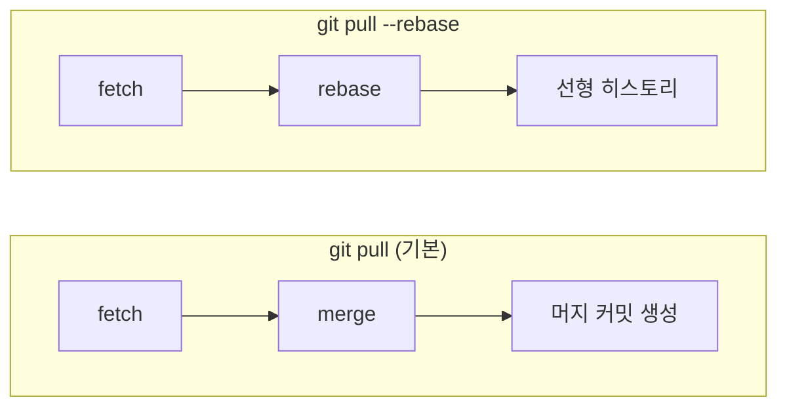

# Rebase 기초

> rebase vs merge, 리베이스 원리, 언제 사용해야 하는가

## 개요

[브랜치 병합](../03-branch/03-merge.md)에서 merge를 배웠습니다. 하지만 Git에는 브랜치를 합치는 **또 다른 방법**이 있어요 — 바로 **rebase**입니다. merge가 "두 길을 합류시키는 것"이라면, rebase는 "내 길을 들어서 다른 길 끝에 이어 붙이는 것"입니다. 이번 섹션에서는 rebase의 원리와 merge와의 차이, 그리고 언제 무엇을 써야 하는지를 배웁니다.

**선수 지식**: [브랜치 병합](../03-branch/03-merge.md), [PR 관리의 Merge 전략](../06-pull-request/03-pr-management.md)
**학습 목표**:
- rebase가 내부적으로 어떻게 동작하는지 이해한다
- merge와 rebase의 차이를 명확히 구분한다
- rebase의 황금 규칙을 알고 지킨다
- 충돌 발생 시 rebase를 해결하거나 중단할 수 있다

## 왜 알아야 할까?

`git log`를 봤을 때 `Merge branch 'main' into feature-x`라는 커밋이 수십 개 보이면 어떤 느낌이 드시나요? 히스토리가 복잡해져서 실제 변경 사항을 찾기 어려워지죠. rebase를 사용하면 이런 **머지 커밋 없이 깔끔한 일직선 히스토리**를 만들 수 있습니다. 많은 팀에서 "로컬 작업은 rebase로, 공유 브랜치는 merge로"라는 원칙을 따르고 있어요.

## 핵심 개념

### 개념 1: Rebase란?

> 💡 **비유**: rebase는 **기차 노선 재배치**와 같습니다. 원래 A역에서 갈라진 지선을 운행하고 있었는데, 본선이 B역까지 연장되었습니다. rebase는 지선의 시작점을 A역에서 B역으로 옮기는 것이에요. 지선의 열차(커밋)는 그대로인데, 출발점만 바뀌는 거죠.

**Rebase의 내부 동작**:

`git rebase main`을 실행하면 Git은 이렇게 동작합니다:

1. 현재 브랜치와 `main`의 **공통 조상**을 찾는다
2. 현재 브랜치의 커밋들을 **임시 영역에 저장**한다 (패치로 뽑아둠)
3. 현재 브랜치를 `main`의 끝으로 **이동**한다
4. 저장해둔 커밋들을 **하나씩 다시 적용**한다

> 📊 **그림 1**: Rebase 내부 동작 — 커밋을 떼어내 새 베이스 위에 다시 적용




결과적으로 마치 `main`의 최신 상태에서 처음부터 작업한 것처럼 보입니다.

> **중요**: 다시 적용된 커밋은 내용은 같지만 **커밋 해시가 완전히 달라집니다**. 새로운 커밋이 만들어지는 거예요.

### 개념 2: Merge vs Rebase 비교

**Merge** — 두 브랜치를 합치면서 **머지 커밋**을 생성:

```bash
git switch main
git merge feature
```

> **main**: A → B → C → **M (merge commit)**
> **feature**: A → B → D → E ↗

**Rebase** — feature의 커밋을 main 위에 **다시 적용**:

```bash
git switch feature
git rebase main
```

> **main**: A → B → C → **D' → E'** (feature가 main 위로 이동)

| 항목 | Merge | Rebase |
|------|-------|--------|
| 히스토리 | 비선형 (가지가 보임) | 선형 (일직선) |
| 머지 커밋 | 생성됨 | 없음 |
| 원래 커밋 해시 | 보존됨 | 변경됨 (새 해시) |
| 충돌 해결 | 한 번에 | 커밋마다 한 번씩 |
| 안전성 | 히스토리 변경 없음 | 히스토리를 다시 씀 |

> 📊 **그림 2**: Merge vs Rebase — 히스토리 형태 비교




```bash
# merge 결과의 히스토리
git log --oneline --graph
```

```output
*   a1b2c3d (HEAD -> main) Merge branch 'feature'
|\
| * e4f5g6h Add feature B
| * h7i8j9k Add feature A
|/
* k0l1m2n Previous commit
```

```bash
# rebase 후 머지한 히스토리 (fast-forward)
git log --oneline --graph
```

```output
* e4f5g6h (HEAD -> main) Add feature B
* h7i8j9k Add feature A
* k0l1m2n Previous commit
```

### 개념 3: Rebase 실행하기

```bash
# 1. feature 브랜치에서 작업
git switch feature
# ... 작업 & 커밋 ...

# 2. main의 최신 변경을 가져와서 rebase
git fetch origin
git rebase origin/main
```

```output
Successfully rebased and updated refs/heads/feature.
```

```bash
# 3. rebase 후 fast-forward merge가 가능해짐
git switch main
git merge feature
```

```output
Updating k0l1m2n..e4f5g6h
Fast-forward
 src/feature.js | 10 ++++++++++
 1 file changed, 10 insertions(+)
```

### 개념 4: 황금 규칙 — 절대 하면 안 되는 것

> 📊 **그림 3**: Rebase 안전 판단 플로우 — push 여부가 핵심




> ⚠️ **Rebase의 황금 규칙**: **이미 공유된(push된) 커밋은 절대 rebase하지 마세요.**

왜 위험할까요?

1. rebase는 커밋 해시를 **변경**합니다
2. 다른 사람이 원래 해시를 기반으로 작업하고 있었다면, 히스토리가 **갈라집니다**
3. 이를 해결하려면 강제 머지가 필요하고, **중복 커밋**과 혼란이 발생합니다

```bash
# ⚠️ 절대 하지 마세요!
git rebase main    # 이미 push된 브랜치에서
git push --force   # 강제 푸시로 덮어쓰기
```

```bash
# ✅ 안전한 사용: 아직 push하지 않은 로컬 커밋에만 rebase
git rebase main    # 로컬 전용 브랜치에서
git push -u origin feature   # 첫 push
```

> 🔥 **실무 팁**: rebase 후 push가 필요할 때는 `--force` 대신 `--force-with-lease`를 사용하세요. 다른 사람이 그 사이에 push한 변경이 있으면 거부되어 안전합니다.

```bash
# ⚠️ 위험 — 다른 사람의 변경을 덮어쓸 수 있음
git push --force

# ✅ 안전 — 다른 사람의 push가 있었으면 거부됨
git push --force-with-lease
```

### 개념 5: Rebase 중 충돌 해결

> 📊 **그림 4**: Rebase 충돌 해결 흐름 — 세 가지 선택지




merge는 충돌을 한 번에 해결하지만, rebase는 **커밋마다** 충돌이 발생할 수 있습니다.

```bash
git rebase main
```

```error
CONFLICT (content): Merge conflict in src/config.js
error: could not apply a1b2c3d... Update config
```

```bash
# 1. 충돌 파일 확인
git status

# 2. 에디터에서 충돌 해결 (<<<<<<< 마커 제거)

# 3. 해결된 파일 스테이징
git add src/config.js

# 4. rebase 계속 진행
git rebase --continue

# 또는: 이 커밋 건너뛰기
git rebase --skip

# 또는: rebase 전체 취소 (원래 상태로 복구)
git rebase --abort
```

> 🔥 **실무 팁**: `git rerere`(reuse recorded resolution)를 활성화하면, 한 번 해결한 충돌을 Git이 기억해서 다음에 **자동으로 해결**합니다.

```bash
# rerere 활성화 (한 번만 설정)
git config --global rerere.enabled true
```

### 개념 6: git pull --rebase

> 📊 **그림 5**: git pull의 두 가지 모드 비교




`git pull`은 기본적으로 `fetch + merge`입니다. `--rebase` 옵션을 쓰면 `fetch + rebase`로 동작해서 불필요한 머지 커밋을 피할 수 있어요.

```bash
# 일회성 사용
git pull --rebase origin main

# 기본값으로 설정 (권장)
git config --global pull.rebase true
```

이렇게 설정하면 `git pull`만 해도 자동으로 rebase가 적용됩니다.

## 실습: Rebase 직접 해보기

```bash
# 1. main에서 시작
git switch main
echo "main change" >> file.txt && git add file.txt && git commit -m "Main: add line"

# 2. feature 브랜치 생성 & 커밋
git switch -c feature/rebase-test
echo "feature A" >> feature.txt && git add feature.txt && git commit -m "Feature: add A"
echo "feature B" >> feature.txt && git add feature.txt && git commit -m "Feature: add B"

# 3. main에 다른 커밋 추가 (시뮬레이션)
git switch main
echo "another main change" >> file.txt && git add file.txt && git commit -m "Main: another change"

# 4. feature를 main 위로 rebase
git switch feature/rebase-test
git rebase main
```

```output
Successfully rebased and updated refs/heads/feature/rebase-test.
```

```bash
# 5. 히스토리 확인 — 깔끔한 일직선!
git log --oneline --graph
```

```output
* b2c3d4e (HEAD -> feature/rebase-test) Feature: add B
* a1b2c3d Feature: add A
* e4f5g6h (main) Main: another change
* h7i8j9k Main: add line
```

## 더 깊이 알아보기

### Rebase 논쟁의 역사

"rebase vs merge" 논쟁은 Git 커뮤니티에서 가장 오래된 토론 중 하나입니다. Linus Torvalds 본인은 **"로컬 정리에는 rebase, 통합 기록에는 merge"**를 권장했어요.

흥미로운 점은, Subversion이나 CVS 같은 이전 세대 버전 관리 도구에서는 히스토리를 고치는 것이 **불가능**했습니다. Git이 "히스토리는 다듬어서 의미 있게 만들어야 한다"는 철학을 제시한 것은 당시로서는 혁명적이었죠. 이 철학이 바로 rebase라는 기능에 담겨 있습니다.

### --onto 플래그

`git rebase --onto`는 커밋의 시작점을 세밀하게 지정할 수 있는 고급 기능입니다:

```bash
# feature-B가 feature-A에서 갈라졌는데, main 위로 옮기고 싶을 때
git rebase --onto main feature-A feature-B
```

이렇게 하면 feature-B의 커밋 중 feature-A 이후에 만들어진 것만 main 위로 이동합니다.

## 흔한 오해와 팁

> ⚠️ **흔한 오해**: "rebase가 merge보다 항상 좋다" — 상황에 따라 다릅니다. 개인 브랜치 정리에는 rebase가 적합하지만, **공유 브랜치에서는 merge가 안전**합니다. rebase는 히스토리를 다시 쓰기 때문에, 팀이 동의한 규칙 안에서만 사용하세요.

> 🔥 **실무 팁**: rebase가 꼬였다면 **`git rebase --abort`**로 언제든 원래 상태로 돌아갈 수 있습니다. 그래도 불안하다면, rebase 전에 `git branch backup`으로 백업 브랜치를 만들어두세요.

> 🔥 **실무 팁**: rebase가 정말 잘못되었다면 **`git reflog`**가 구명줄입니다. reflog는 HEAD의 모든 이동 기록을 90일간 보관하므로, rebase 이전 시점으로 `git reset --hard <reflog-entry>`로 복구할 수 있어요. reflog는 [Ch9에서](../09-history-internals/02-reflog.md) 자세히 다룹니다.

## 핵심 정리

| 개념 | 설명 |
|------|------|
| Rebase | 커밋을 다른 베이스 위에 다시 적용 — 선형 히스토리 |
| Merge | 두 브랜치를 합치면서 머지 커밋 생성 — 비선형 히스토리 |
| 황금 규칙 | 이미 push된 커밋은 절대 rebase 금지 |
| `git rebase main` | 현재 브랜치를 main 위로 이동 |
| `git rebase --abort` | rebase 취소, 원래 상태로 복구 |
| `git rebase --continue` | 충돌 해결 후 rebase 계속 |
| `--force-with-lease` | rebase 후 안전한 강제 푸시 |
| `git pull --rebase` | pull 시 merge 대신 rebase 사용 |
| `git rebase --onto` | 커밋 범위를 세밀하게 이동 |

## 다음 섹션 미리보기

rebase의 기본을 배웠으니, 이제 그 **진짜 힘**을 볼 차례입니다. [Interactive Rebase](./02-interactive-rebase.md)에서는 커밋을 합치고(squash), 메시지를 수정하고(reword), 순서를 바꾸고, 커밋을 쪼개는 등 **히스토리를 자유자재로 다듬는 기술**을 배웁니다.

## 참고 자료

- [Pro Git Book — Rebasing](https://git-scm.com/book/en/v2/Git-Branching-Rebasing) - rebase의 원리와 사용법
- [Git 공식 문서 — git-rebase](https://git-scm.com/docs/git-rebase) - rebase 명령어 레퍼런스
- [Atlassian — Merging vs. Rebasing](https://www.atlassian.com/git/tutorials/merging-vs-rebasing) - merge와 rebase 비교 가이드
- [GitHub Docs — 충돌 해결 (rebase)](https://docs.github.com/en/get-started/using-git/resolving-merge-conflicts-after-a-git-rebase) - rebase 충돌 해결 공식 가이드
