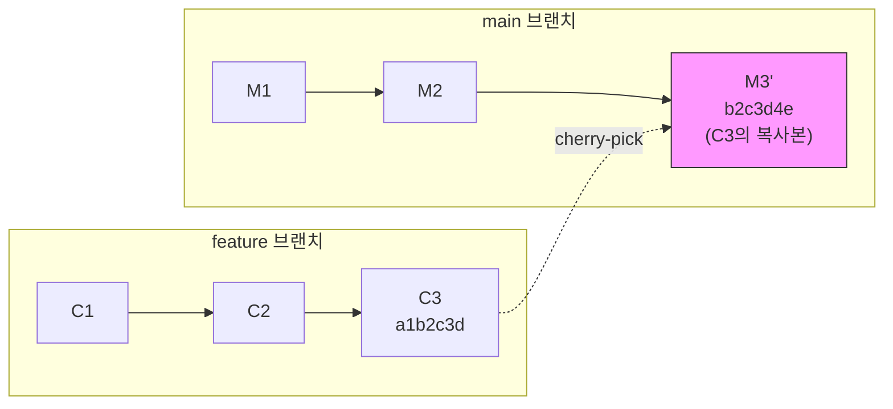
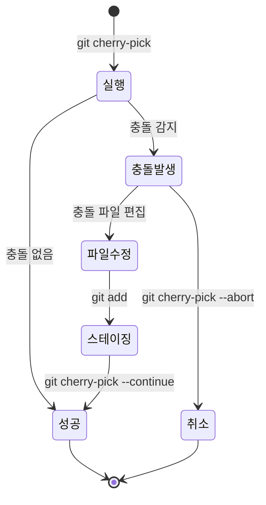
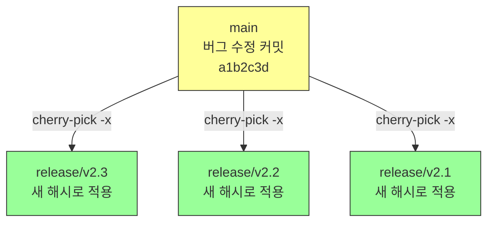
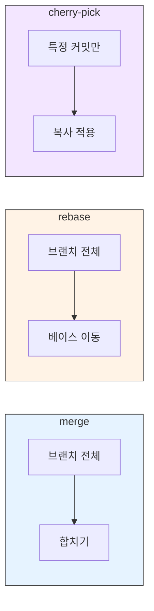

# Cherry-pick

> 특정 커밋만 가져오기, 충돌 처리, 활용 시나리오

## 개요

merge는 브랜치 전체를 합치고, rebase는 브랜치를 옮깁니다. 하지만 때로는 **딱 하나의 커밋만** 가져오고 싶을 때가 있어요. "main에 있는 버그 수정 커밋을 release 브랜치에도 적용하고 싶다" — 이런 상황에서 **cherry-pick**을 사용합니다.

**선수 지식**: [Interactive Rebase](./02-interactive-rebase.md)에서 배운 히스토리 편집 개념
**학습 목표**:
- cherry-pick의 개념과 동작 원리를 이해한다
- 단일/범위 cherry-pick을 실행할 수 있다
- 충돌 발생 시 해결하거나 중단할 수 있다
- cherry-pick이 적합한 상황과 위험을 안다

## 왜 알아야 할까?

프로덕션에서 긴급 버그가 발견되었습니다. 수정은 `main`에 이미 커밋되었는데, release 브랜치에도 적용해야 합니다. 이때 release 브랜치에 main을 통째로 merge하면 아직 준비 안 된 기능까지 들어갈 수 있어요. **cherry-pick은 원하는 커밋만 정확히 골라 적용**하는 수술 같은 도구입니다.

## 핵심 개념

### 개념 1: Cherry-pick이란?

> 💡 **비유**: cherry-pick은 **뷔페에서 원하는 음식만 골라 담기**와 같습니다. 코스 요리(merge — 전체 브랜치)가 아니라, 뷔페에서 딱 먹고 싶은 것(특정 커밋)만 접시에 담는 거예요.

cherry-pick은 특정 커밋의 **변경 사항(diff)을 복사해서** 현재 브랜치에 **새 커밋으로 적용**합니다. 원래 커밋은 그대로 남아 있고, 새 커밋은 **다른 해시**를 갖습니다.

> 📊 **그림 1**: Cherry-pick의 동작 원리 — 커밋 복사와 새 해시 생성




```bash
# 기본 cherry-pick
git cherry-pick a1b2c3d
```

```output
[main b2c3d4e] Fix critical security vulnerability
 Date: Sat Feb 15 10:30:00 2026 +0900
 1 file changed, 5 insertions(+), 2 deletions(-)
```

### 개념 2: 다양한 Cherry-pick 방법

```bash
# 단일 커밋
git cherry-pick a1b2c3d

# 여러 커밋 (개별 지정)
git cherry-pick a1b2c3d e4f5g6h i7j8k9l

# 범위 cherry-pick (A 이후 ~ B까지, A는 제외)
git cherry-pick a1b2c3d..i7j8k9l

# 범위 cherry-pick (A 포함 ~ B까지)
git cherry-pick a1b2c3d^..i7j8k9l
```

> ⚠️ **주의**: 범위 문법에서 `A..B`는 A를 **제외**합니다. A도 포함하려면 `A^..B`를 사용하세요.

**주요 옵션**:

| 옵션 | 설명 |
|------|------|
| `-x` | 커밋 메시지에 원본 해시 추적 정보 추가 |
| `-n` / `--no-commit` | 커밋하지 않고 변경 사항만 스테이징에 적용 |
| `-e` / `--edit` | 커밋 메시지 편집 |
| `-s` / `--signoff` | Signed-off-by 줄 추가 |
| `--abort` | cherry-pick 취소, 원래 상태로 복구 |
| `--continue` | 충돌 해결 후 계속 |
| `--skip` | 현재 커밋 건너뛰기 |

### 개념 3: -x 플래그 — 추적성 확보

공유 저장소에서 cherry-pick할 때는 **반드시 `-x` 옵션**을 사용하세요:

```bash
git cherry-pick -x a1b2c3d
```

커밋 메시지에 다음이 자동으로 추가됩니다:

```output
Fix critical security vulnerability

(cherry picked from commit a1b2c3d4e5f6g7h8i9j0k1l2m3n4o5p)
```

이렇게 하면 나중에 "이 커밋이 어디서 왔는지" 추적할 수 있습니다.

### 개념 4: --no-commit — 여러 변경을 하나로

여러 cherry-pick을 하나의 커밋으로 합치고 싶을 때:

```bash
# 커밋하지 않고 변경만 적용
git cherry-pick -n a1b2c3d
git cherry-pick -n e4f5g6h

# 하나의 커밋으로 합쳐서 커밋
git commit -m "Backport: security fixes for v2.3"
```

릴리스 브랜치에 여러 핫픽스를 깔끔하게 적용할 때 유용합니다.

### 개념 5: 충돌 해결

> 📊 **그림 2**: Cherry-pick 충돌 해결 흐름




cherry-pick도 merge처럼 충돌이 발생할 수 있습니다:

```bash
git cherry-pick a1b2c3d
```

```error
error: could not apply a1b2c3d... Fix configuration
hint: After resolving the conflicts, mark the corrected paths
hint: with 'git add <paths>' or 'git rm <paths>'
hint: and commit the result with 'git cherry-pick --continue'
```

```bash
# 1. 충돌 파일 확인
git status

# 2. 에디터에서 충돌 해결

# 3. 해결 후 스테이징
git add src/config.js

# 4. cherry-pick 계속
git cherry-pick --continue

# 또는 취소
git cherry-pick --abort
```

### 개념 6: 활용 시나리오

> 📊 **그림 3**: 핫픽스 백포팅 — 하나의 커밋을 여러 릴리스 브랜치에 적용




**1) 핫픽스 백포팅**

```bash
# main에서 버그 수정
git switch main
# ... 수정 & 커밋 (해시: a1b2c3d)

# release 브랜치에 같은 수정 적용
git switch release/v2.3
git cherry-pick -x a1b2c3d

# 다른 release 브랜치에도
git switch release/v2.2
git cherry-pick -x a1b2c3d
```

**2) 폐기된 브랜치에서 유용한 커밋 구출**

```bash
# 실험 브랜치는 폐기하지만, 유틸 함수만 살리고 싶을 때
git log --oneline experiment-branch
```

```output
c3d4e5f Experiment failed
b2c3d4e Add useful utility function    # 이것만 가져오기
a1b2c3d Initial experiment
```

```bash
git switch main
git cherry-pick b2c3d4e
```

**3) 다른 팀의 특정 수정 가져오기**

```bash
# 팀 B의 브랜치에서 공통 라이브러리 수정만 가져오기
git cherry-pick -x <team-b-fix-hash>
```

### 개념 7: Cherry-pick의 위험성

cherry-pick은 강력하지만 **남용하면 문제**가 생깁니다:

> ⚠️ **중복 커밋**: cherry-pick은 **새 해시의 커밋**을 만듭니다. 원본 브랜치를 나중에 merge하면 같은 변경이 두 번 기록될 수 있어요.

> ⚠️ **의존성 누락**: 커밋 B가 커밋 A에 의존하는데 B만 cherry-pick하면 문제가 발생합니다. 항상 의존 관계를 확인하세요.

> ⚠️ **파편화된 히스토리**: cherry-pick을 많이 쓸수록 히스토리가 파편화됩니다. merge나 rebase가 가능하면 그쪽이 더 좋습니다.

| 대안 | 적합한 상황 |
|------|------------|
| **merge** | 브랜치의 변경 사항 대부분이 필요할 때 |
| **rebase** | 브랜치 전체를 새 베이스로 옮길 때 |
| **cherry-pick** | 특정 커밋만 선별적으로 필요할 때 |

> 📊 **그림 4**: merge vs rebase vs cherry-pick 비교




## 실습: 핫픽스 Cherry-pick

```bash
# 1. 시뮬레이션: main에 기능 + 버그 수정이 섞여 있음
git switch main
echo "new feature" > feature.js && git add . && git commit -m "Add new feature"
echo "bug fix" > hotfix.js && git add . && git commit -m "Fix critical bug"
echo "another feature" > feature2.js && git add . && git commit -m "Add another feature"

# 2. 버그 수정 커밋 해시 확인
git log --oneline -3
```

```output
c3d4e5f (HEAD -> main) Add another feature
b2c3d4e Fix critical bug              # 이 커밋만 필요!
a1b2c3d Add new feature
```

```bash
# 3. release 브랜치에 버그 수정만 적용
git switch release/v1.0
git cherry-pick -x b2c3d4e
```

```output
[release/v1.0 d4e5f6g] Fix critical bug
 Date: Sat Feb 15 11:00:00 2026 +0900
 1 file changed, 1 insertion(+)
 create mode 100644 hotfix.js
```

```bash
# 4. 적용 확인
git log --oneline -2
```

```output
d4e5f6g (HEAD -> release/v1.0) Fix critical bug
e5f6g7h Previous release commit
```

## 더 깊이 알아보기

### Cherry-pick의 역사와 이름의 유래

"cherry-pick"이라는 용어는 **"나무에서 가장 좋은 체리만 골라 따기"**라는 영어 관용구에서 왔습니다. 전체가 아닌 최선의 것만 선택한다는 뜻이죠.

이 기능은 Git 이전의 버전 관리 도구(SVN, Perforce)에도 있었지만, Git의 **콘텐츠 주소 지정 저장소(content-addressable storage)** 덕분에 훨씬 안정적이고 빠르게 동작합니다.

Microsoft의 Raymond Chen은 cherry-pick의 위험성에 대해 유명한 시리즈를 쓴 적이 있는데, 핵심 메시지는 "cherry-pick의 관계는 **머릿속에만** 존재하고, 커밋 그래프에는 기록되지 않는다"는 것이었습니다. 이래서 `-x` 옵션으로 **메시지에라도** 기록을 남기는 것이 중요합니다.

> 💡 **알고 계셨나요?**: Git에서 cherry-pick은 내부적으로 **3-way merge의 특수한 형태**로 구현되어 있습니다. 원래 커밋의 부모를 "공통 조상"으로, 원래 커밋을 "theirs"로, 현재 HEAD를 "ours"로 사용하는 거예요. 그래서 충돌 해결 방식도 merge와 동일합니다.

## 흔한 오해와 팁

> ⚠️ **흔한 오해**: "cherry-pick이면 뭐든 가져올 수 있다" — 커밋이 이전 커밋에 의존하는 경우, 의존하는 커밋 없이 cherry-pick하면 **충돌이 나거나 불완전한 코드**가 됩니다. cherry-pick 전에 항상 의존 관계를 확인하세요.

> 🔥 **실무 팁**: cherry-pick 전에 **working tree가 깨끗한지** 확인하세요 (`git status`). 미커밋 변경이 있는 상태에서 cherry-pick하면 혼란스러운 상태가 됩니다.

> 🔥 **실무 팁**: cherry-pick을 많이 하고 있다면, **워크플로우를 재검토**하세요. cherry-pick이 자주 필요하다는 건 브랜치 전략이 최적이 아닐 수 있다는 신호입니다. merge나 rebase로 해결할 수 있는지 먼저 고려하세요.

## 핵심 정리

| 개념 | 설명 |
|------|------|
| Cherry-pick | 특정 커밋의 변경을 현재 브랜치에 새 커밋으로 복사 |
| `git cherry-pick <hash>` | 단일 커밋 cherry-pick |
| `git cherry-pick -x` | 원본 커밋 추적 정보 추가 (권장) |
| `git cherry-pick -n` | 커밋 없이 변경만 적용 (여러 개 합칠 때) |
| `A^..B` 범위 | A 포함 ~ B까지 cherry-pick |
| `--abort` | cherry-pick 취소 |
| `--continue` | 충돌 해결 후 계속 |
| 핫픽스 백포팅 | 가장 대표적인 활용 시나리오 |

## 다음 섹션 미리보기

rebase, interactive rebase, cherry-pick까지 — Git의 고급 브랜치 기술을 모두 배웠습니다! 마지막으로 이 기술들을 **팀 차원에서 어떻게 조합할 것인가**를 알아볼 차례예요. [워크플로우 전략](./04-workflow-strategies.md)에서는 Git Flow, GitHub Flow, Trunk-Based Development를 비교하고, 팀에 맞는 브랜치 전략을 선택하는 법을 배웁니다.

## 참고 자료

- [Git 공식 문서 — git-cherry-pick](https://git-scm.com/docs/git-cherry-pick) - cherry-pick 명령어 레퍼런스
- [Atlassian — Git Cherry Pick](https://www.atlassian.com/git/tutorials/cherry-pick) - cherry-pick 튜토리얼
- [Raymond Chen — Stop cherry-picking, start merging](https://devblogs.microsoft.com/oldnewthing/20180312-00/?p=98215) - cherry-pick의 위험성에 대한 심층 분석
- [GitLab Docs — Cherry-pick](https://docs.gitlab.com/topics/git/cherry_pick/) - cherry-pick 활용 가이드
