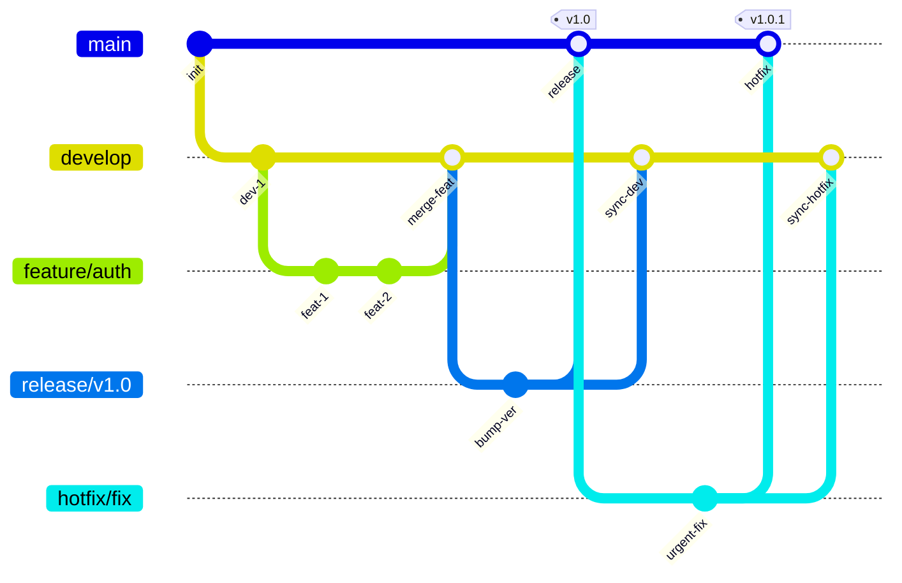
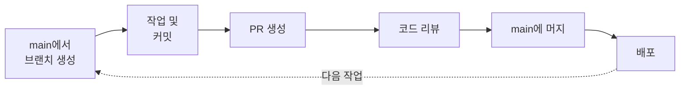
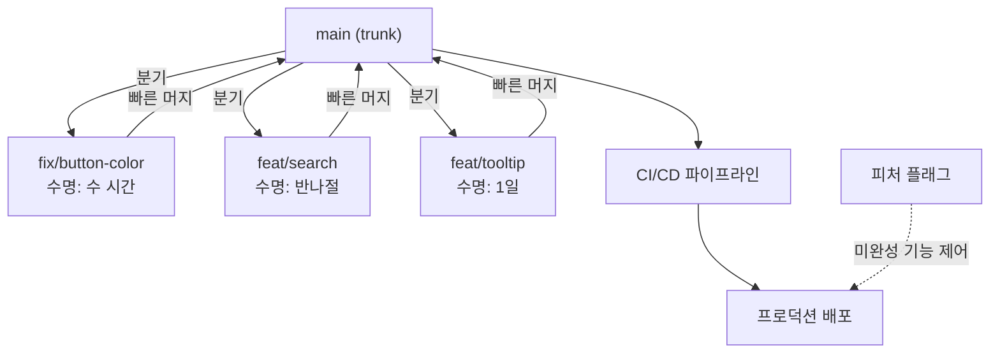
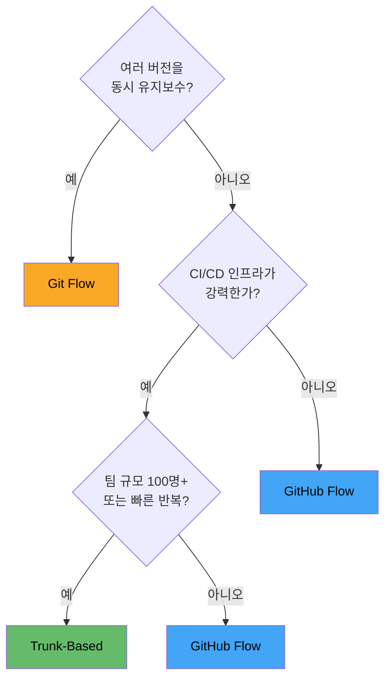

# 워크플로우 전략

> Git Flow, GitHub Flow, Trunk-Based Development 비교

## 개요

Git 도구를 익혔다면 이제 **"팀에서 어떻게 사용할 것인가?"**라는 질문에 답할 차례입니다. 같은 Git을 사용해도 팀마다 브랜치 전략이 다릅니다. 이번 섹션에서는 가장 널리 사용되는 세 가지 워크플로우 — **Git Flow**, **GitHub Flow**, **Trunk-Based Development** — 를 비교하고, 프로젝트에 맞는 전략을 선택하는 기준을 배웁니다.

**선수 지식**: [Cherry-pick](./03-cherry-pick.md)까지의 고급 브랜치 기술, [PR 워크플로우](../06-pull-request/01-pr-workflow.md)
**학습 목표**:
- Git Flow, GitHub Flow, Trunk-Based Development의 차이를 이해한다
- 각 전략의 장단점과 적합한 상황을 판별한다
- 팀과 프로젝트에 맞는 워크플로우를 선택할 수 있다
- 최근 업계 트렌드를 파악한다

## 왜 알아야 할까?

워크플로우 없이 "각자 알아서 브랜치 만들고 머지하자"라고 하면 어떻게 될까요? 누군가는 `main`에 직접 푸시하고, 누군가는 feature 브랜치를 쓰고, 릴리스는 언제 하는지 아무도 모릅니다. 브랜치 전략은 팀의 **교통 규칙**이에요. 규칙이 있어야 충돌 없이 협업할 수 있습니다.

## 핵심 개념

### 개념 1: Git Flow

> 💡 **비유**: Git Flow는 **공장의 생산 라인**과 같습니다. 연구개발(feature), 품질검사(release), 긴급수리(hotfix), 조립라인(develop), 완성품 창고(main) — 각 단계마다 전용 라인이 있어 체계적이지만 복잡합니다.

2010년 Vincent Driessen이 발표한 이 모델은 **5가지 브랜치 타입**을 사용합니다:

| 브랜치 | 역할 | 수명 |
|--------|------|------|
| `main` | 프로덕션 코드 (릴리스된 코드만) | 영구 |
| `develop` | 다음 릴리스 개발 통합 | 영구 |
| `feature/*` | 새 기능 개발 | 임시 (develop에 머지 후 삭제) |
| `release/*` | 릴리스 준비 (버그 수정, 버전 업) | 임시 (main + develop에 머지 후 삭제) |
| `hotfix/*` | 긴급 프로덕션 수정 | 임시 (main + develop에 머지 후 삭제) |

**전형적인 흐름**:

> 📊 **그림 1**: Git Flow 브랜치 흐름 — 5가지 브랜치의 분기와 머지 관계




**feature**: develop에서 분기 → 작업 → develop에 머지
**release**: develop에서 분기 → QA → main + develop에 머지 → 태그
**hotfix**: main에서 분기 → 수정 → main + develop에 머지 → 태그

```bash
# Git Flow 예시: 기능 개발
git switch develop
git switch -c feature/user-auth
# ... 작업 & 커밋 ...
git switch develop
git merge --no-ff feature/user-auth
git branch -d feature/user-auth

# Git Flow 예시: 릴리스
git switch develop
git switch -c release/v1.0
# ... 버그 수정, 버전 번호 업데이트 ...
git switch main
git merge --no-ff release/v1.0
git tag -a v1.0 -m "Version 1.0"
git switch develop
git merge --no-ff release/v1.0
git branch -d release/v1.0
```

**장점**: 릴리스 주기가 명확, 여러 버전 동시 유지보수 가능
**단점**: 복잡, 느린 릴리스 주기, 장기 feature 브랜치로 인한 대형 머지 충돌

### 개념 2: GitHub Flow

> 💡 **비유**: GitHub Flow는 **카페 주문 시스템**과 같습니다. 주문(feature 브랜치) → 만들기(커밋) → 검수(PR 리뷰) → 서빙(main에 머지). 단순하고 빠릅니다.

GitHub이 만든 이 전략은 **극도로 단순**합니다:

| 브랜치 | 역할 | 수명 |
|--------|------|------|
| `main` | 항상 배포 가능한 상태 | 영구 |
| `feature/*` | 모든 변경 (기능, 수정, 문서 등) | 임시 (수 시간 ~ 수 일) |

**전체 흐름**:

> 📊 **그림 2**: GitHub Flow — 단순한 6단계 사이클




1. `main`에서 브랜치 생성
2. 작업 & 커밋
3. PR 생성
4. 코드 리뷰
5. `main`에 머지
6. 배포

```bash
# GitHub Flow — 이미 익숙하죠?
git switch -c feature/dark-mode
# ... 작업 & 커밋 ...
git push -u origin feature/dark-mode
gh pr create --title "Add dark mode"
# 리뷰 후 머지
gh pr merge --squash --delete-branch
```

**장점**: 간단, 빠른 배포 주기, 배우기 쉬움
**단점**: 여러 릴리스 버전 동시 관리 어려움, main이 항상 배포 가능해야 함 (강한 CI/CD 필요)

### 개념 3: Trunk-Based Development

> 💡 **비유**: Trunk-Based Development는 **하나의 고속도로에 모두가 합류하는 것**과 같습니다. 사이드 도로(브랜치)를 만들더라도 하루 안에 고속도로로 돌아와야 해요. 모두가 같은 길 위에 있으니 방향이 틀어질 일이 없습니다.

가장 급진적이면서 가장 단순한 전략입니다:

| 브랜치 | 역할 | 수명 |
|--------|------|------|
| `main` (trunk) | 유일한 진실의 원천 | 영구 |
| 짧은 브랜치 (선택) | 변경 단위 | 매우 짧음 (**24시간 이내**) |

**핵심 원칙**:
- 개발자는 **하루에 최소 한 번** main에 커밋/머지
- 브랜치를 만들어도 **1~2일 내에 머지**
- 미완성 기능은 **피처 플래그(feature flag)**로 제어
- **강력한 자동화 테스트**와 CI/CD가 필수

> 📊 **그림 3**: Trunk-Based Development — 짧은 브랜치와 빠른 머지




```bash
# Trunk-Based: 짧은 브랜치
git switch -c fix/button-color
# 30분 작업
git add . && git commit -m "Fix button color in dark mode"
git push -u origin fix/button-color
gh pr create --title "Fix button color"
# 빠르게 리뷰 후 머지 — 브랜치 수명: 수 시간
gh pr merge --squash --delete-branch
```

**장점**: 최소 충돌, 빠른 피드백, 대규모 팀에서도 검증됨 (Google 35,000+ 개발자)
**단점**: 강한 CI/CD 인프라 필수, 피처 플래그 관리 필요, 문화적 전환 필요

### 개념 4: 전략 비교

> 📊 **그림 4**: 세 가지 전략의 복잡도와 배포 속도 비교


| 기준 | Git Flow | GitHub Flow | Trunk-Based |
|------|----------|-------------|-------------|
| **복잡도** | 높음 | 낮음 | 낮음 |
| **릴리스 방식** | 계획된 릴리스 | 지속적 배포 | 지속적 배포 |
| **다중 버전 지원** | 가능 | 어려움 | 어려움 (피처 플래그) |
| **브랜치 수명** | 장기 (주~월) | 중기 (일~주) | 단기 (시간~일) |
| **CI/CD 필수도** | 선택 | 권장 | 필수 |
| **팀 규모** | 중~대 | 소~중 | 모든 규모 |
| **적합한 프로젝트** | 모바일 앱, 데스크톱 | 웹 SaaS, 오픈소스 | 고속 개발 팀 |

### 개념 5: 우리 팀은 어떤 전략을?

> 📊 **그림 5**: 팀 상황별 워크플로우 선택 가이드




| 상황 | 추천 전략 |
|------|-----------|
| 모바일 앱 (앱스토어 릴리스) | **Git Flow** |
| 웹 SaaS 서비스 | **GitHub Flow** 또는 **Trunk-Based** |
| 오픈소스 프로젝트 | **GitHub Flow** |
| 100명+ 대규모 팀 | **Trunk-Based** |
| 임베디드/펌웨어 | **Git Flow** |
| 스타트업 (빠른 반복) | **Trunk-Based** 또는 **GitHub Flow** |
| 여러 버전 동시 유지보수 | **Git Flow** 또는 **GitLab Flow** |

## 실습: 전략별 브랜치 구조 체험

```bash
# === GitHub Flow (가장 간단) ===
git switch main
git switch -c feature/github-flow-test
echo "feature" > feature.js && git add . && git commit -m "Add feature"
git switch main
git merge feature/github-flow-test
git branch -d feature/github-flow-test

# === Git Flow 스타일 ===
# develop 브랜치 생성
git switch -c develop
git switch -c feature/git-flow-test
echo "feature" > feature.js && git add . && git commit -m "Add feature"
git switch develop
git merge --no-ff feature/git-flow-test
git branch -d feature/git-flow-test

# release 브랜치
git switch -c release/v1.0
echo "1.0.0" > version.txt && git add . && git commit -m "Bump version to 1.0.0"
git switch main
git merge --no-ff release/v1.0
git tag -a v1.0 -m "Release 1.0"
git switch develop
git merge --no-ff release/v1.0
git branch -d release/v1.0
```

## 더 깊이 알아보기

### 브랜치 전략의 역사

**2005년**: Git이 탄생했지만, 표준화된 워크플로우는 없었습니다.
**2010년 1월**: Vincent Driessen이 **Git Flow**를 발표. 첫 번째 체계적 브랜치 모델로 폭발적 인기.
**2011년**: GitHub이 **GitHub Flow**를 대안으로 제시. "Git Flow는 너무 복잡하다"는 반응.
**2014년**: GitLab이 **GitLab Flow**를 발표. 환경 브랜치 개념 추가.
**2020년 3월**: Driessen 본인이 원래 글에 **"반성의 노트"**를 추가. "웹 앱에는 더 단순한 워크플로우가 적합하다. Git Flow는 여러 버전을 유지해야 하는 소프트웨어에 적합하다"라고 인정.

> 💡 **알고 계셨나요?**: DORA(DevOps Research and Assessment) 보고서는 2015년부터 매년 소프트웨어 전달 성과를 연구하는데, **Trunk-Based Development가 엘리트 성과 팀과 일관되게 상관관계가 있다**는 결과를 보여줍니다. Google, Meta, Amazon, Netflix 등이 이 방식을 사용하고 있어요.

### 2025-2026 트렌드

- **Trunk-Based로의 이동**: 업계는 점점 단순한 브랜치 전략으로 수렴 중
- **피처 플래그의 일상화**: LaunchDarkly, Unleash 등의 도구로 배포와 릴리스를 분리
- **스택 PR**: Graphite, Git의 `--update-refs` 등으로 여러 작은 PR을 체인으로 관리
- **AI 테스트 자동화**: 트렁크 기반 개발을 더 안전하게 만드는 AI 기반 테스트 생성 도구 등장

## 흔한 오해와 팁

> ⚠️ **흔한 오해**: "Git Flow가 표준이다" — Git Flow는 2010년에 발표된 **하나의 제안**이지 표준이 아닙니다. Git Flow의 창시자 본인도 2020년에 "웹 앱에는 더 단순한 전략이 적합하다"고 말했어요. 프로젝트 특성에 맞는 전략을 선택하세요.

> ⚠️ **흔한 오해**: "Trunk-Based는 소규모 팀만 가능하다" — Google은 35,000명 이상의 개발자가 하나의 트렁크에서 작업합니다. 핵심은 팀 규모가 아니라 **자동화 테스트와 CI/CD 인프라**입니다.

> 🔥 **실무 팁**: **전략을 문서화**하세요. 어떤 전략이든 팀 전체가 이해하고 동의해야 합니다. CONTRIBUTING.md에 브랜치 전략을 명시하고, 신규 팀원이 바로 따를 수 있게 만드세요.

> 🔥 **실무 팁**: 한 가지 전략을 완벽하게 따르기보다, **팀에 맞게 변형**하는 것이 현실적입니다. 예: "기본은 GitHub Flow지만, 릴리스 시즌에만 release 브랜치를 사용" — 이런 하이브리드가 실무에서 많습니다.

## 핵심 정리

| 전략 | 핵심 | 적합한 프로젝트 |
|------|------|---------------|
| Git Flow | 5가지 브랜치 타입, 계획된 릴리스 | 모바일 앱, 다중 버전 소프트웨어 |
| GitHub Flow | main + feature 브랜치, 지속적 배포 | 웹 SaaS, 오픈소스 |
| Trunk-Based | 짧은 브랜치, 피처 플래그, 강한 CI/CD | 고속 개발, 대규모 팀 |

## 다음 섹션 미리보기

Ch8에서 rebase, interactive rebase, cherry-pick, 그리고 팀 워크플로우까지 고급 브랜치 전략을 모두 배웠습니다! 다음 챕터 [Ch9. 히스토리 관리와 Git 내부](../09-history-internals/01-stash.md)에서는 **stash**, **reflog**, **reset 심화** 등 Git의 히스토리 관리 고급 기능과, Git이 내부적으로 어떻게 동작하는지를 알아봅니다.

## 참고 자료

- [Vincent Driessen — A successful Git branching model](https://nvie.com/posts/a-successful-git-branching-model/) - Git Flow 원문 (2020 반성의 노트 포함)
- [GitHub Docs — GitHub Flow](https://docs.github.com/en/get-started/using-github/github-flow) - GitHub Flow 공식 가이드
- [trunkbaseddevelopment.com](https://trunkbaseddevelopment.com/) - Trunk-Based Development 전문 리소스
- [Atlassian — Git 워크플로우 비교](https://www.atlassian.com/git/tutorials/comparing-workflows/gitflow-workflow) - Git Flow, Forking, 중앙집중 워크플로우 비교
