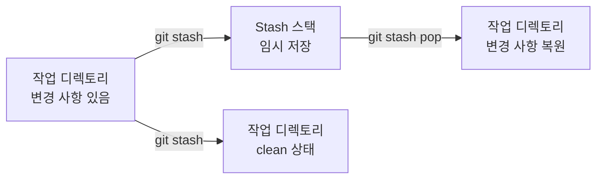
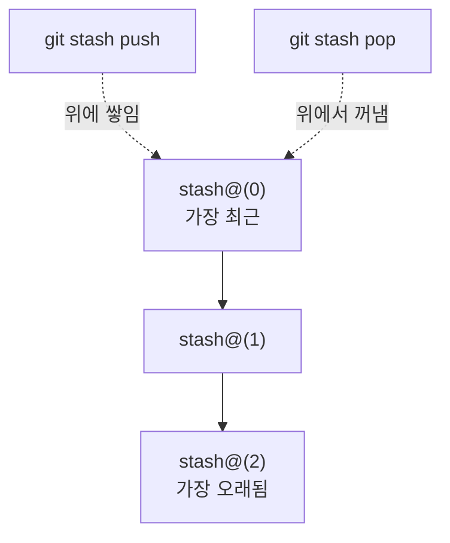
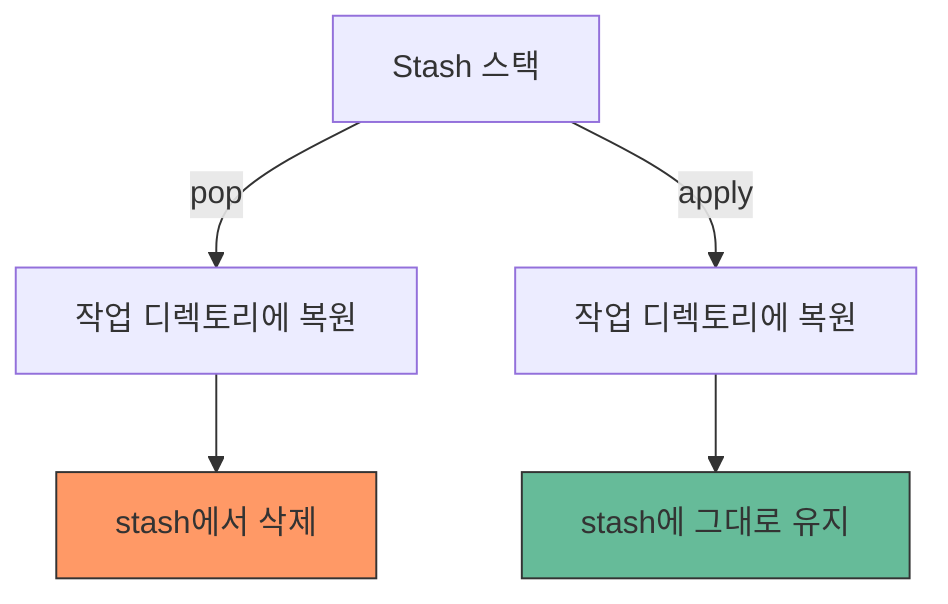
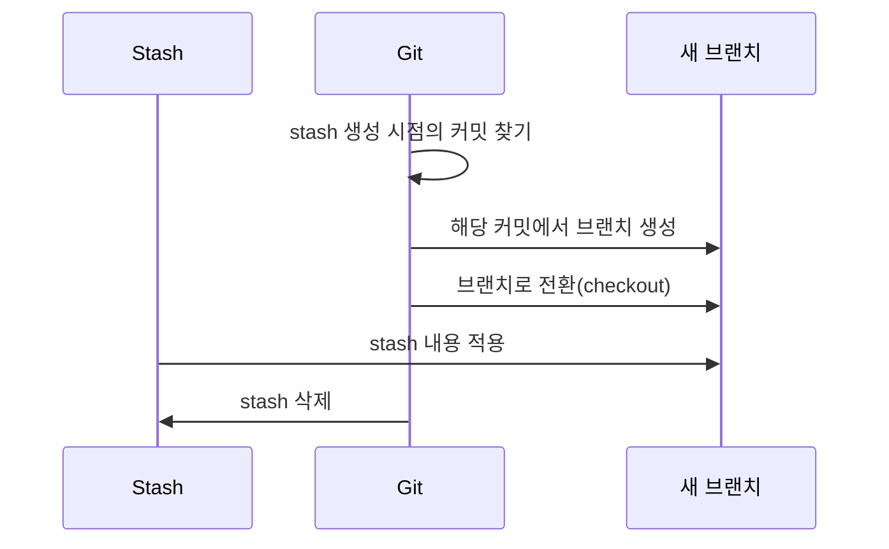
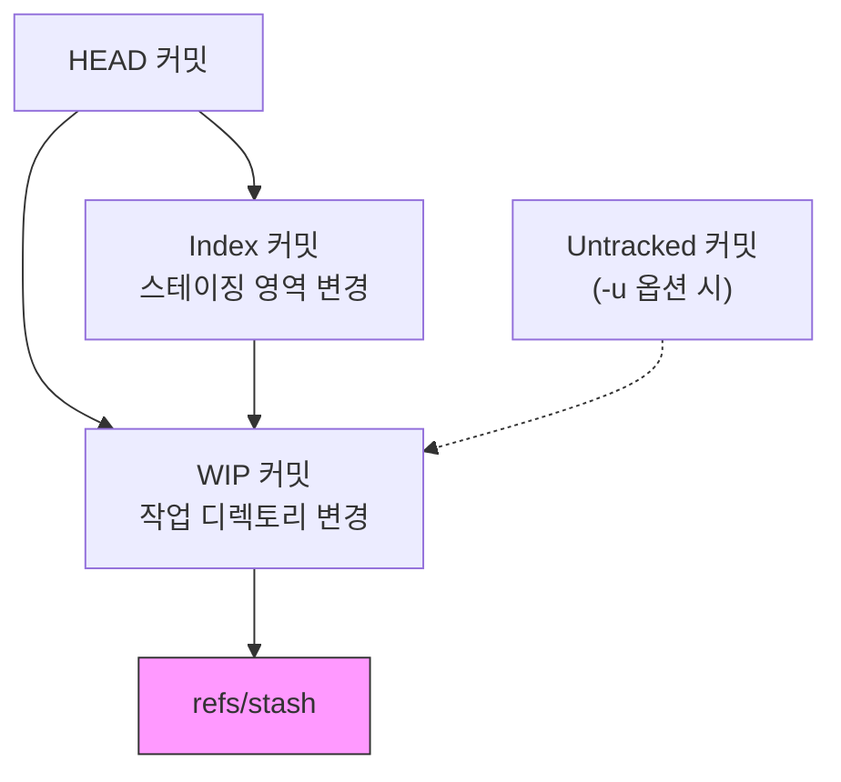

# Stash

> 작업 임시 저장, pop, apply, drop, 브랜치로 변환

## 개요

코드를 한창 수정하고 있는데 갑자기 "긴급 버그 좀 고쳐주세요!"라는 요청이 들어온 적 있으신가요? 아직 커밋할 만큼 완성되지 않은 코드를 어떻게 해야 할까요? 이런 상황에서 Git **stash**가 구원자가 됩니다. 이번 섹션에서는 작업을 임시로 보관하고, 필요할 때 다시 꺼내 쓰는 방법을 배웁니다.

**선수 지식**: [커밋의 기본](../01-git-start/04-commit-basics.md), [브랜치 생성과 전환](../03-branch/02-create-switch.md), [워크플로우 전략](../08-advanced-branch/04-workflow-strategies.md)
**학습 목표**:
- stash의 개념과 동작 원리를 이해한다
- stash push, pop, apply, drop 명령어를 구분하여 사용한다
- 여러 stash를 관리하고 특정 stash를 선택할 수 있다
- stash를 새 브랜치로 변환하는 방법을 안다

## 왜 알아야 할까?

> 📊 **그림 1**: Stash의 기본 동작 흐름




개발하다 보면 **"지금 하던 작업을 잠깐 치워두고 다른 일을 해야 하는"** 순간이 정말 자주 옵니다. 긴급 핫픽스, 동료의 PR 리뷰를 위한 브랜치 전환, 갑자기 생각난 실험 — 이런 상황에서 "아직 미완성이라 커밋하기 싫은데..."라고 느끼셨다면, stash가 딱 맞는 도구입니다.

## 핵심 개념

### 개념 1: Stash란?

> 💡 **비유**: stash는 **작업 중인 책상을 서랍에 임시로 넣어두는 것**입니다. 지금 펼쳐놓은 서류(수정한 파일들)와 메모(스테이징한 파일들)를 서랍에 넣고, 깨끗한 책상에서 다른 일을 합니다. 다 끝나면 서랍을 열어 이전 상태를 그대로 꺼내오면 되죠.

`git stash`는 **작업 디렉토리와 스테이징 영역의 변경 사항을 임시 스택에 저장**하고, 작업 디렉토리를 마지막 커밋 상태(clean state)로 되돌립니다.

```bash
# 현재 작업 상태 확인
git status
```

```output
On branch feature/login
Changes not staged for commit:
  modified:   src/auth.js
  modified:   src/utils.js
```

```bash
# 변경 사항을 임시 저장 (stash에 넣기)
git stash
```

```output
Saved working directory and index state WIP on feature/login: a1b2c3d Add login form
```

```bash
# 이제 작업 디렉토리가 깨끗합니다
git status
```

```output
On branch feature/login
nothing to commit, working tree clean
```

### 개념 2: stash push — 메시지와 함께 저장하기

`git stash`의 정식 명령은 `git stash push`입니다. `-m` 옵션으로 설명을 달면 나중에 어떤 작업이었는지 알아보기 쉽습니다.

```bash
# 메시지와 함께 stash (권장!)
git stash push -m "로그인 폼 유효성 검사 작업 중"
```

```output
Saved working directory and index state On feature/login: 로그인 폼 유효성 검사 작업 중
```

> 🔥 **실무 팁**: 메시지 없이 `git stash`만 하면 "WIP on branch: commit-msg"로 저장됩니다. stash가 쌓이면 어떤 게 뭔지 알 수 없게 되니, **반드시 `-m`으로 설명을 달아두세요**.

**특정 파일만 stash하기** (Git 2.13+):

```bash
# 특정 파일만 stash
git stash push -m "auth 관련 변경만" src/auth.js src/middleware.js

# 패치 모드: 변경 사항 중 일부만 대화형으로 선택
git stash push -p -m "부분 저장"
```

### 개념 3: stash 목록 보기

```bash
# stash 목록 확인
git stash list
```

```output
stash@{0}: On feature/login: 로그인 폼 유효성 검사 작업 중
stash@{1}: WIP on main: e4f5g6h Fix typo in README
stash@{2}: On feature/api: API 에러 핸들링 개선 중
```

stash는 **스택(LIFO)** 구조입니다. 가장 최근에 넣은 것이 `stash@{0}`이에요.

> 📊 **그림 2**: Stash 스택(LIFO) 구조




```bash
# 특정 stash의 변경 내용 확인
git stash show stash@{0}
```

```output
 src/auth.js  | 15 +++++++++------
 src/utils.js |  3 +++
 2 files changed, 12 insertions(+), 6 deletions(-)
```

```bash
# 변경 내용을 diff 형태로 자세히 보기
git stash show -p stash@{0}
```

### 개념 4: pop vs apply — 꺼내쓰기

stash에서 작업을 복원하는 방법은 두 가지입니다:

| 명령어 | 동작 | 비유 |
|--------|------|------|
| `git stash pop` | 복원 + **stash에서 삭제** | 서랍에서 꺼내고 서랍을 비움 |
| `git stash apply` | 복원 + **stash에 유지** | 서랍에서 복사해오고 원본은 그대로 |

> 📊 **그림 3**: pop vs apply 동작 비교




```bash
# 가장 최근 stash를 복원하고 삭제
git stash pop
```

```output
On branch feature/login
Changes not staged for commit:
  modified:   src/auth.js
  modified:   src/utils.js

Dropped refs/stash@{0} (a1b2c3d4e5f6...)
```

```bash
# 가장 최근 stash를 복원하되 stash는 유지
git stash apply

# 특정 stash를 지정하여 복원
git stash apply stash@{2}
```

> ⚠️ **흔한 오해**: "pop은 항상 안전하다" — pop 중에 **충돌**이 발생하면 stash가 삭제되지 않습니다. 충돌을 해결한 뒤 수동으로 `git stash drop`을 해야 해요. 안전하게 하려면 `apply`로 먼저 확인하고, 문제없으면 `drop`하는 방법도 좋습니다.

### 개념 5: drop과 clear — 정리하기

```bash
# 특정 stash 삭제
git stash drop stash@{1}
```

```output
Dropped stash@{1} (e4f5g6h7i8j9...)
```

```bash
# ⚠️ 주의: 모든 stash를 한꺼번에 삭제 (되돌릴 수 없음!)
git stash clear
```

### 개념 6: stash를 브랜치로 변환하기

stash를 저장한 이후 원래 브랜치에 변경이 많이 생겨서 pop할 때 충돌이 걱정된다면? stash를 **새 브랜치로 변환**하면 깔끔합니다.

```bash
# stash를 새 브랜치로 만들기
git stash branch feature/stash-recovery stash@{0}
```

```output
Switched to a new branch 'feature/stash-recovery'
On branch feature/stash-recovery
Changes not staged for commit:
  modified:   src/auth.js
  modified:   src/utils.js

Dropped stash@{0} (a1b2c3d4e5f6...)
```

이 명령은 다음을 한 번에 수행합니다:

> 📊 **그림 4**: stash branch 변환 과정



1. stash를 **만들었던 시점의 커밋**에서 새 브랜치 생성
2. stash 내용을 적용
3. 성공하면 해당 stash 삭제

충돌 걱정 없이 안전하게 복원할 수 있어서 매우 유용합니다.

## 실습: 직접 해보기

```bash
# 1. 실습 준비
mkdir stash-practice && cd stash-practice
git init

# 2. 초기 파일 생성과 커밋
echo "# Stash Practice" > README.md
echo "console.log('hello');" > app.js
git add . && git commit -m "Initial commit"

# 3. 작업 중인 상태 만들기
echo "console.log('new feature');" >> app.js
echo "body { margin: 0; }" > style.css
git add style.css

# 4. 현재 상태 확인 (스테이징된 파일 + 수정된 파일)
git status
```

```output
Changes to be committed:
  new file:   style.css
Changes not staged for commit:
  modified:   app.js
```

```bash
# 5. 메시지와 함께 stash
git stash push -m "UI 개선 작업 중"

# 6. 깨끗한 상태에서 긴급 수정
echo "// hotfix: 보안 패치" >> app.js
git add app.js && git commit -m "Hotfix: 보안 패치"

# 7. stash 목록 확인
git stash list

# 8. 원래 작업 복원
git stash pop

# 9. 모든 변경 사항이 돌아왔는지 확인
git status
```

## 더 깊이 알아보기

### Stash의 내부 구조

stash는 사실 **특별한 커밋**입니다. `git stash`를 실행하면 Git은 내부적으로 2~3개의 커밋을 만듭니다:

- **WIP 커밋**: 작업 디렉토리의 변경 사항
- **Index 커밋**: 스테이징 영역의 변경 사항
- **Untracked 커밋** (`-u` 옵션 시): 추적되지 않는 파일

이 커밋들은 `refs/stash`라는 특별한 ref에 저장됩니다. 일반 브랜치 히스토리에는 나타나지 않지만, Git의 객체 데이터베이스에 실제 커밋으로 존재하죠.

> 📊 **그림 5**: Stash 내부 커밋 구조




### 추적되지 않는 파일과 무시된 파일

기본적으로 `git stash`는 **추적 중인 파일의 변경 사항만** 저장합니다.

```bash
# 추적되지 않는(untracked) 새 파일도 포함
git stash push -u -m "새 파일 포함"

# .gitignore로 무시된 파일까지 포함 (빌드 결과물 등)
git stash push -a -m "무시된 파일까지 전부"
```

| 옵션 | 포함 범위 |
|------|----------|
| (기본) | 추적 중인 파일의 변경만 |
| `-u` / `--include-untracked` | + 추적되지 않는 새 파일 |
| `-a` / `--all` | + .gitignore로 무시된 파일까지 |

### `git stash`의 탄생

`git stash` 명령은 2007년 Git 1.5.3에서 처음 등장했습니다. 처음에는 `git stash save`라는 문법을 사용했는데, Git 2.16(2018년)부터 `git stash push`가 정식 문법이 되었어요. `save`는 여전히 동작하지만 **deprecated(사용 중단 예정)**입니다. 파일 단위 stash(`git stash push -- file`)는 `push` 문법에서만 가능하므로, `push`를 쓰는 것이 좋습니다.

> 💡 **알고 계셨나요?**: "stash"라는 단어는 영어로 "숨겨두다, 보관하다"라는 뜻입니다. 귀중품을 안전한 곳에 숨겨두듯, 소중한 작업을 임시로 안전하게 보관한다는 의미에서 이름이 지어졌습니다.

## 흔한 오해와 팁

> ⚠️ **흔한 오해**: "stash는 커밋 대신 쓰는 것이다" — stash는 **임시 보관**용이지 장기 저장용이 아닙니다. 오래 두면 어떤 작업이었는지 잊기 쉽고, `git stash clear`로 한꺼번에 날아갈 수 있어요. 어느 정도 완성된 작업은 **WIP 커밋**(`git commit -m "WIP: 작업 중"`)으로 남기는 것이 더 안전합니다.

> 🔥 **실무 팁**: stash가 3개 이상 쌓이기 시작하면 **작업 범위가 너무 넓다는 신호**입니다. 하나의 stash를 처리하고 나서 다음 작업으로 넘어가세요. "나중에 꺼내야지"하고 stash만 쌓다 보면, 결국 대부분 `clear`로 날리게 됩니다.

> 🔥 **실무 팁**: `git stash pop`에서 충돌이 발생하면 당황하지 마세요. stash 내용은 삭제되지 않고 남아 있습니다. 충돌을 해결하고 `git stash drop`으로 정리하면 됩니다. 아니면 처음부터 `apply` → 확인 → `drop` 패턴을 사용하세요.

## 핵심 정리

| 명령어 | 설명 |
|--------|------|
| `git stash` / `git stash push` | 변경 사항을 임시 저장 |
| `git stash push -m "설명"` | 메시지와 함께 저장 (권장) |
| `git stash push -u` | 추적되지 않는 파일도 포함 |
| `git stash list` | 저장된 stash 목록 보기 |
| `git stash show stash@{n}` | 특정 stash의 변경 내용 확인 |
| `git stash pop` | 최근 stash 복원 + 삭제 |
| `git stash apply` | 최근 stash 복원 (삭제 안 함) |
| `git stash drop stash@{n}` | 특정 stash 삭제 |
| `git stash clear` | 모든 stash 삭제 |
| `git stash branch <name>` | stash를 새 브랜치로 변환 |

## 다음 섹션 미리보기

stash로 작업을 임시 보관하는 방법을 배웠습니다. 그런데 만약 `git reset --hard`를 잘못 실행해서 커밋을 날려버렸다면? 다음 섹션 [Reflog와 복구](./02-reflog.md)에서는 Git의 **숨겨진 안전망** — reflog를 이용해 잃어버린 커밋을 되살리는 방법을 배웁니다.

## 참고 자료

- [Pro Git Book — Stashing and Cleaning](https://git-scm.com/book/en/v2/Git-Tools-Stashing-and-Cleaning) - stash의 모든 것을 다루는 공식 가이드
- [Git 공식 문서 — git-stash](https://git-scm.com/docs/git-stash) - 명령어 레퍼런스
- [Atlassian — Git Stash](https://www.atlassian.com/git/tutorials/saving-changes/git-stash) - 실용적인 예제와 함께 설명
