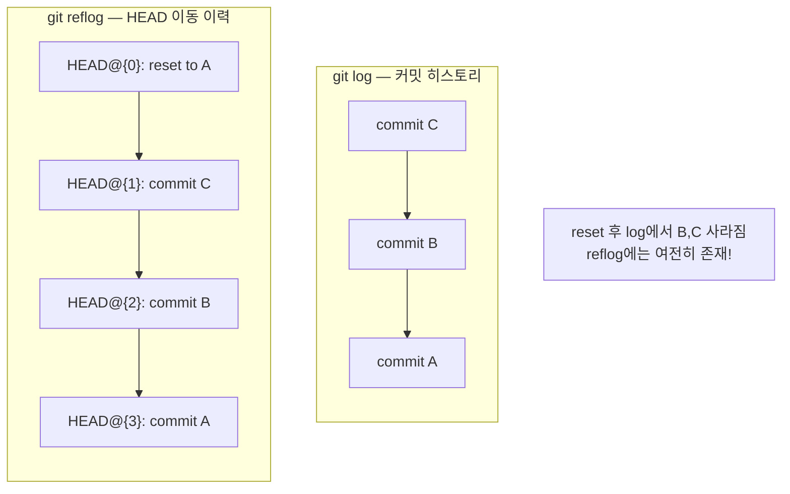
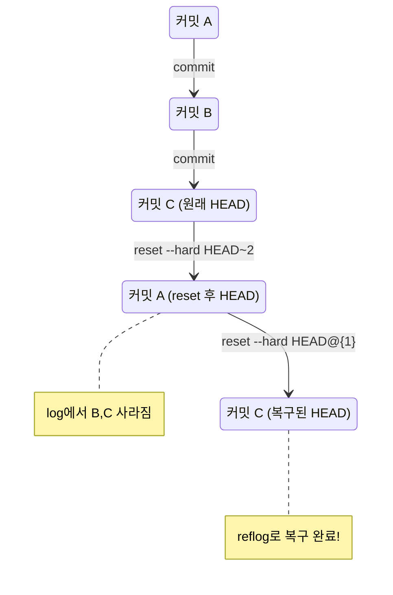
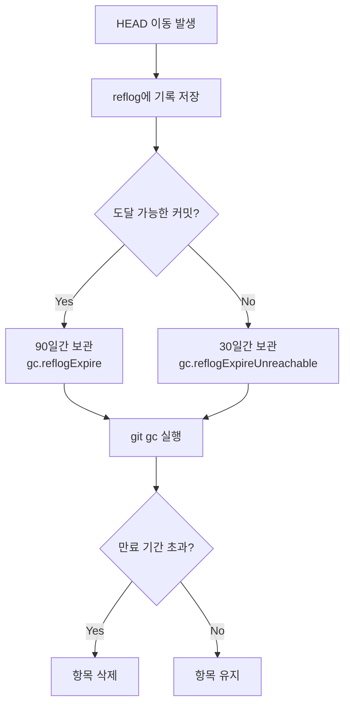

# Reflog와 복구

> HEAD 이력 추적, 잃어버린 커밋 복구, 실수 되돌리기

## 개요

"아, 방금 `reset --hard` 해버렸는데 커밋이 다 날아갔어!" — 이런 절망적인 상황을 경험해본 적 있으신가요? 놀랍게도, Git에는 이런 실수를 구해줄 **숨겨진 안전망**이 있습니다. 바로 **reflog**입니다. 이번 섹션에서는 reflog로 HEAD의 이동 이력을 추적하고, 잃어버린 커밋을 복구하는 방법을 배웁니다.

**선수 지식**: [Stash](./01-stash.md), [되돌리기 기초](../02-file-history/04-undo-basics.md)
**학습 목표**:
- reflog가 무엇이고 어떻게 동작하는지 이해한다
- reflog를 사용해 잃어버린 커밋을 찾는다
- 삭제된 브랜치를 복구한다
- 잘못된 rebase나 reset을 되돌린다

## 왜 알아야 할까?

Git을 사용하다 보면 실수는 반드시 일어납니다. `git reset --hard`로 커밋을 날리거나, `git rebase`가 예상과 다르게 동작하거나, 실수로 브랜치를 삭제하기도 하죠. 이런 순간에 **"Git은 거의 아무것도 잃어버리지 않는다"**는 사실을 알면 큰 위안이 됩니다. reflog는 Git의 **블랙박스 레코더**와 같아서, HEAD가 움직인 모든 기록을 남깁니다.

## 핵심 개념

### 개념 1: Reflog란?

> 💡 **비유**: reflog는 **CCTV 녹화 기록**과 같습니다. 건물(저장소) 안에서 사람(HEAD)이 어디를 이동했는지 시간순으로 기록됩니다. 무언가 사라졌을 때 CCTV를 되감아 보면 "아, 그때 거기 있었구나!"를 알 수 있는 것처럼, reflog를 보면 HEAD가 언제 어디에 있었는지 추적할 수 있습니다.

**reflog** = **ref**erence **log**. Git의 참조(HEAD, 브랜치 등)가 변경될 때마다 기록을 남기는 **로컬 이력 로그**입니다.

> 📊 **그림 1**: Reflog의 동작 원리 — HEAD가 이동할 때마다 기록이 쌓입니다


```bash
# HEAD의 이동 이력 보기
git reflog
```

```output
a1b2c3d (HEAD -> main) HEAD@{0}: commit: Add new feature
e4f5g6h HEAD@{1}: checkout: moving from feature to main
h7i8j9k HEAD@{2}: commit: WIP: login form
k0l1m2n HEAD@{3}: checkout: moving from main to feature
e4f5g6h HEAD@{4}: reset: moving to HEAD~2
p3q4r5s HEAD@{5}: commit: Delete important file
t6u7v8w HEAD@{6}: commit: Add important file
```

각 줄의 의미:
- `HEAD@{0}` — 현재 HEAD 위치 (가장 최근)
- `HEAD@{1}` — 한 단계 전 HEAD 위치
- 어떤 **동작**(commit, checkout, reset, rebase 등)으로 이동했는지도 기록됩니다

### 개념 2: Reflog vs Log의 차이

`git log`와 `git reflog`는 완전히 다릅니다:

| 항목 | `git log` | `git reflog` |
|------|-----------|--------------|
| 보여주는 것 | 커밋의 **부모-자식 관계** (히스토리) | HEAD가 **이동한 순서** (행동 이력) |
| 범위 | 현재 브랜치에서 도달 가능한 커밋 | HEAD가 가리켰던 **모든 커밋** |
| 삭제된 커밋 | 보이지 않음 | **보임!** |
| 공유 여부 | `push`로 공유됨 | **로컬 전용** (다른 사람에게 없음) |
| 유효 기간 | 영구 | 기본 90일 (만료됨) |

> 📊 **그림 2**: git log vs git reflog — 같은 저장소를 서로 다른 관점으로 봅니다




> **핵심**: `git log`에서 사라진 커밋도 `git reflog`에서는 찾을 수 있습니다!

### 개념 3: 잃어버린 커밋 복구하기

**시나리오**: `git reset --hard HEAD~3`으로 최근 3개 커밋을 실수로 날렸습니다.

> 📊 **그림 3**: 잃어버린 커밋 복구 흐름 — reflog로 되감기




```bash
# 1. reflog에서 reset 직전 상태 찾기
git reflog
```

```output
a1b2c3d (HEAD -> main) HEAD@{0}: reset: moving to HEAD~3
f8g9h0i HEAD@{1}: commit: 세 번째 중요한 커밋
j1k2l3m HEAD@{2}: commit: 두 번째 중요한 커밋
n4o5p6q HEAD@{3}: commit: 첫 번째 중요한 커밋
```

```bash
# 2. reset 직전의 커밋으로 복구
git reset --hard HEAD@{1}
```

```output
HEAD is now at f8g9h0i 세 번째 중요한 커밋
```

```bash
# 3. 복구 확인
git log --oneline -5
```

```output
f8g9h0i (HEAD -> main) 세 번째 중요한 커밋
j1k2l3m 두 번째 중요한 커밋
n4o5p6q 첫 번째 중요한 커밋
...
```

3개의 커밋이 모두 돌아왔습니다!

### 개념 4: 삭제된 브랜치 복구하기

**시나리오**: 실수로 `git branch -D feature/important`를 실행해서 브랜치를 삭제했습니다.

```bash
# 1. reflog에서 해당 브랜치의 마지막 커밋 찾기
git reflog | grep "feature/important"
```

```output
h7i8j9k HEAD@{5}: checkout: moving from feature/important to main
a9b0c1d HEAD@{8}: commit: Add crucial feature (feature/important)
```

```bash
# 2. 해당 커밋에서 브랜치 다시 생성
git branch feature/important h7i8j9k
```

```output
# 브랜치가 복구되었습니다!
```

```bash
# 3. 복구된 브랜치 확인
git log --oneline feature/important -3
```

### 개념 5: 잘못된 Rebase 되돌리기

**시나리오**: rebase를 했는데 결과가 엉망이 되었습니다.

```bash
# 1. reflog에서 rebase 시작 직전 찾기
git reflog
```

```output
d4e5f6g (HEAD -> feature) HEAD@{0}: rebase (finish): returning to refs/heads/feature
c3d4e5f HEAD@{1}: rebase (pick): Update API endpoint
b2c3d4e HEAD@{2}: rebase (start): checkout main
a1b2c3d HEAD@{3}: commit: Original last commit before rebase
```

```bash
# 2. rebase 시작 직전으로 복구
git reset --hard HEAD@{3}
```

rebase 전 상태로 완전히 돌아갔습니다!

> 🔥 **실무 팁**: 위험한 작업(rebase, reset, merge) 전에 `git reflog`의 현재 HEAD를 메모해두면 복구가 더 쉽습니다. 혹은 임시 태그를 만들어두세요: `git tag BACKUP-before-rebase`

### 개념 6: reflog의 다양한 옵션

```bash
# 시간 형식으로 보기
git reflog --date=relative
```

```output
a1b2c3d HEAD@{2 minutes ago}: commit: Add feature
e4f5g6h HEAD@{1 hour ago}: checkout: moving from feature to main
```

```bash
# 시간 기반으로 참조하기
git diff HEAD@{yesterday} HEAD
git diff HEAD@{2.hours.ago} HEAD

# 특정 브랜치의 reflog 보기
git reflog show feature/login

# reflog 항목 수 제한
git reflog -10
```

## 실습: 직접 해보기

```bash
# 1. 실습 준비
mkdir reflog-practice && cd reflog-practice
git init

# 2. 커밋 3개 만들기
echo "v1" > file.txt && git add . && git commit -m "버전 1"
echo "v2" > file.txt && git add . && git commit -m "버전 2"
echo "v3" > file.txt && git add . && git commit -m "버전 3"

# 3. 현재 히스토리 확인
git log --oneline
```

```output
c3c3c3c (HEAD -> main) 버전 3
b2b2b2b 버전 2
a1a1a1a 버전 1
```

```bash
# 4. 실수로 reset --hard! (최근 2개 커밋 날리기)
git reset --hard HEAD~2

# 5. git log에서는 커밋이 사라짐
git log --oneline
```

```output
a1a1a1a (HEAD -> main) 버전 1
```

```bash
# 6. reflog에서 찾기 — 여기 있다!
git reflog
```

```output
a1a1a1a (HEAD -> main) HEAD@{0}: reset: moving to HEAD~2
c3c3c3c HEAD@{1}: commit: 버전 3
b2b2b2b HEAD@{2}: commit: 버전 2
a1a1a1a HEAD@{3}: commit (initial): 버전 1
```

```bash
# 7. 복구!
git reset --hard HEAD@{1}

# 8. 성공 확인
git log --oneline
```

```output
c3c3c3c (HEAD -> main) 버전 3
b2b2b2b 버전 2
a1a1a1a 버전 1
```

## 더 깊이 알아보기

### Reflog의 만료 시간

> 📊 **그림 4**: Reflog 항목의 생명주기 — gc에 의해 만료됩니다




reflog 기록은 영원하지 않습니다. Git은 `git gc` (garbage collection) 실행 시 오래된 reflog 항목을 정리합니다.

| 설정 | 기본값 | 설명 |
|------|--------|------|
| `gc.reflogExpire` | **90일** | 도달 가능한(reachable) 항목의 만료 기간 |
| `gc.reflogExpireUnreachable` | **30일** | 도달 불가능한(unreachable) 항목의 만료 기간 |

```bash
# reflog 만료 기간 확인
git config gc.reflogExpire

# 만료 기간 변경 (예: 180일)
git config gc.reflogExpire 180.days

# reflog를 만료시키지 않기 (주의: 저장소 크기 증가)
git config gc.reflogExpire never
```

> 💡 **알고 계셨나요?**: reflog는 **로컬 전용**입니다. `git clone`으로 저장소를 복제하면 reflog는 비어 있어요. 그래서 팀원이 실수로 force push한 것을 reflog로 복구하려면, **push 전 상태가 있는 로컬 저장소**에서 작업해야 합니다.

### `git fsck`로 고아 커밋 찾기

reflog에서도 찾을 수 없을 때 (만료되었거나 `reflog expire`를 실행한 경우), 최후의 수단이 있습니다:

```bash
# 어디에도 연결되지 않은 "고아" 커밋(dangling commit) 찾기
git fsck --unreachable --no-reflogs
```

```output
unreachable commit a1b2c3d4e5f6g7h8i9j0...
unreachable commit k1l2m3n4o5p6q7r8s9t0...
```

```bash
# 해당 커밋 내용 확인
git show a1b2c3d4e5f6g7h8i9j0
```

### Reflog 탄생 비화

reflog는 Git 초기에는 없던 기능이었습니다. 2006년 Junio C Hamano(Git의 현재 메인테이너)가 Git 1.1에서 도입했는데요, 당시 개발자들이 `reset --hard`로 작업을 날리는 사고가 빈번했기 때문입니다. reflog 덕분에 "Git에서는 데이터를 잃기가 정말 어렵다"라는 평판이 생겼고, 이는 Git이 다른 버전 관리 시스템보다 신뢰받는 큰 이유 중 하나가 되었습니다.

## 흔한 오해와 팁

> ⚠️ **흔한 오해**: "reset --hard 하면 커밋이 완전히 사라진다" — 아닙니다! Git의 객체 데이터베이스에는 여전히 존재합니다. reflog로 찾아서 복구할 수 있어요. 다만, `git gc`가 실행되고 만료 기간이 지나면 **진짜** 사라질 수 있습니다.

> ⚠️ **흔한 오해**: "reflog는 원격 저장소에서도 볼 수 있다" — reflog는 **순수 로컬** 기능입니다. `git push`로 공유되지 않아요. `clone`한 저장소에는 자신의 reflog만 있습니다.

> 🔥 **실무 팁**: 위험한 작업 전에 **임시 브랜치를 만들어두세요**: `git branch backup-before-rebase`. reflog보다 직관적이고, 다른 사람에게도 공유할 수 있습니다. 복구 후 삭제하면 됩니다.

> 🔥 **실무 팁**: `ORIG_HEAD`라는 특별한 참조도 있습니다. `merge`, `rebase`, `reset` 같은 위험한 작업 전에 Git이 자동으로 HEAD 위치를 `ORIG_HEAD`에 저장해요. `git reset --hard ORIG_HEAD`로 직전 상태로 빠르게 돌아갈 수 있습니다.

## 핵심 정리

| 명령어 | 설명 |
|--------|------|
| `git reflog` | HEAD 이동 이력 보기 |
| `git reflog show <branch>` | 특정 브랜치의 reflog 보기 |
| `git reflog --date=relative` | 시간 기반으로 표시 |
| `git reset --hard HEAD@{n}` | n번째 이전 상태로 복구 |
| `git branch <name> HEAD@{n}` | 과거 시점에서 브랜치 생성 |
| `git reset --hard ORIG_HEAD` | 직전 위험 작업 되돌리기 |
| `git fsck --unreachable` | 고아 커밋 찾기 (최후 수단) |

## 다음 섹션 미리보기

reflog로 잃어버린 커밋을 살리는 법을 배웠습니다. 그런데 `git reset`에는 `--soft`, `--mixed`, `--hard` 세 가지 모드가 있는데, 정확히 뭐가 다를까요? 다음 섹션 [Reset 심화](./03-reset-deep.md)에서는 reset의 세 가지 모드를 완전히 이해하고, revert, checkout과의 차이까지 명확히 정리합니다.

## 참고 자료

- [Pro Git Book — Maintenance and Data Recovery](https://git-scm.com/book/en/v2/Git-Internals-Maintenance-and-Data-Recovery) - reflog를 활용한 데이터 복구
- [Git 공식 문서 — git-reflog](https://git-scm.com/docs/git-reflog) - 명령어 레퍼런스
- [GitHub Blog — How to undo (almost) anything with Git](https://github.blog/open-source/git/how-to-undo-almost-anything-with-git/) - 다양한 실수 복구 시나리오
- [Atlassian — Git Reflog](https://www.atlassian.com/git/tutorials/rewriting-history/git-reflog) - reflog 실용 가이드
