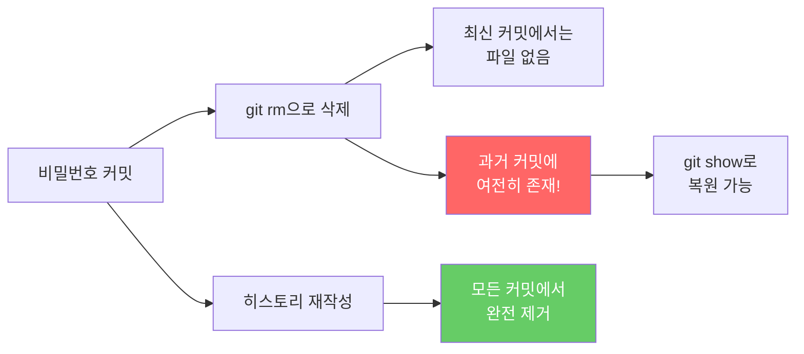
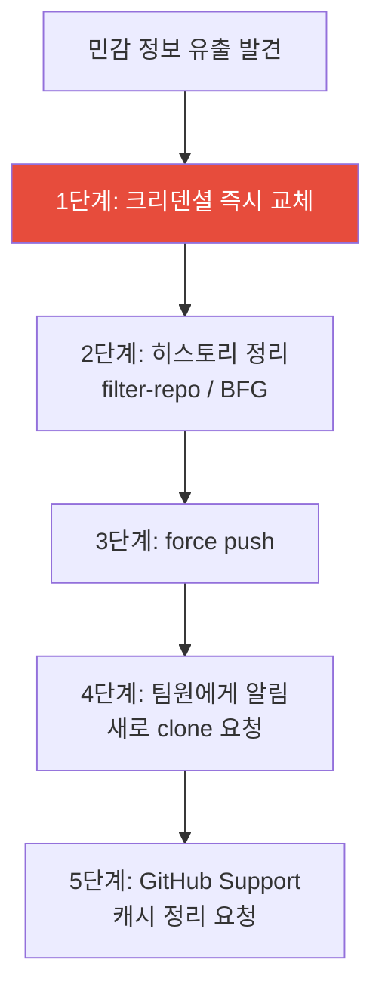
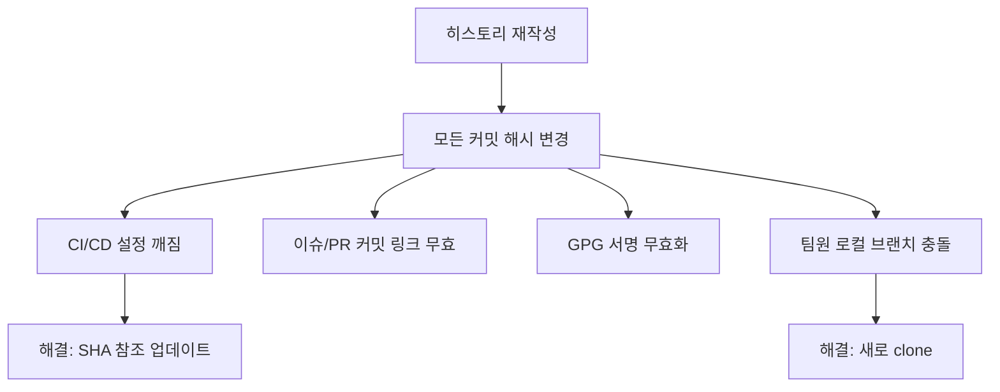

# 히스토리 재작성

> filter-repo, BFG Cleaner, 민감 정보 제거, 대용량 파일 정리

## 개요

"실수로 비밀번호를 커밋해버렸어!" — 개발자라면 누구나 한 번쯤 겪는 아찔한 순간이죠. 파일을 삭제하고 새로 커밋해도, 과거 히스토리에는 여전히 비밀번호가 남아 있습니다. 이번 섹션에서는 Git 히스토리 전체를 재작성하여 **민감 정보를 완전히 제거**하거나, **대용량 파일을 정리**하는 방법을 배웁니다.

**선수 지식**: [Reset 심화](./03-reset-deep.md), [Reflog와 복구](./02-reflog.md)
**학습 목표**:
- git-filter-repo로 히스토리를 재작성하는 방법을 익힌다
- BFG Repo-Cleaner로 빠르게 대용량 파일과 민감 정보를 제거한다
- 히스토리 재작성의 위험성과 팀 협업 시 주의사항을 이해한다
- 민감 정보 유출 시 대응 절차를 숙지한다

## 왜 알아야 할까?

Git은 모든 것을 기억합니다. 파일을 삭제해도 과거 커밋에서 `git show`로 되살릴 수 있죠. 이것은 장점이기도 하지만, **민감 정보(비밀번호, API 키, 인증서)**가 한 번이라도 커밋되면 심각한 보안 위협이 됩니다. 또한 실수로 커밋된 **대용량 파일(빌드 결과물, 동영상)**은 저장소 크기를 영원히 부풀립니다. 이런 문제를 해결하려면 히스토리 자체를 다시 써야 합니다.

## 핵심 개념

### 개념 1: 왜 단순 삭제로는 부족한가?

> 💡 **비유**: Git 히스토리는 **일기장**과 같습니다. 오늘 페이지에서 비밀번호를 지워도, 어제 페이지에는 여전히 적혀 있어요. 히스토리 재작성은 일기장의 **모든 페이지를 다시 쓰는 것** — 과거의 기록까지 완전히 바꾸는 작업입니다.

> 📊 **그림 1**: 단순 삭제 vs 히스토리 재작성 — 왜 삭제만으로는 부족한가




```bash
# 이렇게 파일을 삭제하고 커밋해도...
git rm config/secrets.yml
git commit -m "비밀번호 파일 삭제"

# 과거 히스토리에서 여전히 볼 수 있습니다!
git log --all --full-history -- config/secrets.yml
git show abc1234:config/secrets.yml
```

```output
DB_PASSWORD=super_secret_123
API_KEY=sk-live-abcdef123456
```

### 개념 2: git-filter-repo — 공식 권장 도구

`git-filter-repo`는 Git 프로젝트와 GitHub이 **공식 권장**하는 히스토리 재작성 도구입니다. 예전에 사용하던 `git filter-branch`는 느리고 위험해서 **deprecated(사용 중단 예정)** 상태예요.

> 💡 **비유**: `filter-branch`가 수동으로 일기장을 다시 쓰는 것이라면, `filter-repo`는 **자동 편집 소프트웨어**입니다. 10~100배 빠르고, 실수 방지 장치도 내장되어 있죠.

**설치**:

```bash
# macOS (Homebrew)
brew install git-filter-repo

# pip / pipx (크로스 플랫폼)
pipx install git-filter-repo

# Windows (Scoop)
scoop install git-filter-repo
```

**특정 파일을 히스토리에서 완전 제거**:

```bash
# ⚠️ 반드시 새로 clone한 저장소에서 실행하세요!
git clone https://github.com/user/repo.git
cd repo

# 특정 파일을 모든 커밋에서 제거
git filter-repo --invert-paths --path config/secrets.yml
```

**텍스트 치환으로 민감 정보 마스킹**:

```bash
# 1. 치환할 문자열 목록 파일 만들기
# replacements.txt 내용:
# super_secret_123
# sk-live-abcdef123456
# regex:password\s*=\s*.*==>password=REDACTED

# 2. 히스토리 전체에서 해당 문자열을 ***REMOVED***로 치환
git filter-repo --replace-text replacements.txt
```

**대용량 파일 제거**:

```bash
# 10MB 이상의 모든 파일(blob)을 히스토리에서 제거
git filter-repo --strip-blobs-bigger-than 10M

# 특정 확장자의 파일 제거
git filter-repo --invert-paths --path-glob '*.zip'
```

**변경 사항 분석** (실행 전 미리 확인):

```bash
# 저장소 분석 — 가장 큰 파일, 경로별 크기 등 리포트 생성
git filter-repo --analyze

# 분석 결과 확인
ls .git/filter-repo/analysis/
```

> **중요**: `git filter-repo`는 **새로 clone한 저장소에서만 실행**됩니다. 기존 작업 중인 저장소에서는 동작을 거부해요. 이것은 실수를 방지하기 위한 안전장치입니다.

### 개념 3: BFG Repo-Cleaner — 간편하고 빠른 대안

**BFG Repo-Cleaner**는 Java 기반 도구로, `filter-repo`보다 **옵션이 단순**해서 "빨리 하나만 제거하고 싶다"는 경우에 편리합니다.

```bash
# BFG는 mirror clone에서 실행
git clone --mirror https://github.com/user/repo.git
cd repo.git

# 100MB 이상 파일을 히스토리에서 제거
bfg --strip-blobs-bigger-than 100M

# 특정 파일 삭제
bfg --delete-files id_rsa

# 민감 텍스트 치환
bfg --replace-text passwords.txt
```

**BFG 실행 후 정리** (필수!):

```bash
# reflog 만료 + 가비지 컬렉션으로 실제 삭제
git reflog expire --expire=now --all && git gc --prune=now --aggressive

# 원격에 반영
git push
```

> ⚠️ **주의**: BFG는 **최신 커밋(HEAD)은 절대 수정하지 않습니다**. 현재 파일에서 비밀번호를 먼저 제거하고, 커밋한 뒤에 BFG를 실행해야 해요.

### git-filter-repo vs BFG 비교

| 항목 | git-filter-repo | BFG Repo-Cleaner |
|------|----------------|------------------|
| 추천 기관 | Git 공식 + GitHub | 커뮤니티 (널리 사용) |
| 언어/요구사항 | Python | Java 7+ |
| 유연성 | 매우 높음 (콜백, 정규식 등) | 단순하고 직관적 |
| 최신 커밋 보호 | 없음 (모든 커밋 재작성) | HEAD 커밋은 보호 |
| 속도 | 매우 빠름 | filter-branch 대비 10~720배 |
| 설치 | `brew install` / `pipx install` | JAR 다운로드 |

### 개념 4: 민감 정보 유출 시 대응 절차

비밀번호나 API 키가 GitHub에 push된 것을 발견했다면, 이 순서로 대응하세요:

> 📊 **그림 2**: 민감 정보 유출 시 대응 절차




**1단계: 즉시 크리덴셜 교체** (가장 중요!)

```bash
# 유출된 비밀번호/API 키를 즉시 교체하세요
# Git 히스토리를 정리하는 것보다 이것이 먼저입니다!
# push된 순간 이미 노출된 것으로 간주하세요
```

**2단계: 히스토리 정리**

```bash
# 새로 clone
git clone https://github.com/user/repo.git && cd repo

# 민감 파일 제거
git filter-repo --invert-paths --path .env

# 강제 push
git push --force --all
git push --force --tags
```

**3단계: 팀원 알림 및 동기화**

```bash
# 모든 팀원이 기존 로컬 저장소를 삭제하고 새로 clone해야 합니다
# 기존 clone에서 pull하면 정리한 히스토리가 다시 오염될 수 있습니다!
```

**4단계: GitHub 서버 캐시 정리**

GitHub에서는 force push 후에도 캐시에 데이터가 남을 수 있습니다. [GitHub Support](https://support.github.com/)에 연락하여 서버 측 가비지 컬렉션을 요청할 수 있습니다.

## 실습: 직접 해보기

```bash
# 1. 실습 저장소 만들기
mkdir filter-practice && cd filter-practice
git init

# 2. 일반 파일과 "실수로" 비밀번호 파일 만들기
echo "# My Project" > README.md
echo "DB_PASSWORD=super_secret_123" > .env
git add . && git commit -m "Initial commit"

# 3. 추가 커밋 몇 개
echo "feature code" > app.js
git add . && git commit -m "Add app"
echo "more code" >> app.js
git add . && git commit -m "Update app"

# 4. .env 를 삭제하고 커밋 (하지만 히스토리에는 남아 있음)
git rm .env
echo ".env" >> .gitignore
git add . && git commit -m "Remove .env and add gitignore"

# 5. 히스토리에서 .env 확인
git log --all --oneline -- .env
```

```output
a1b2c3d Initial commit
```

```bash
# 6. git filter-repo로 완전 제거
git filter-repo --invert-paths --path .env --force

# 7. 확인 — 히스토리에서 완전히 사라짐
git log --all --oneline -- .env
```

```output
# (아무 출력 없음 — 완전히 제거됨!)
```

## 더 깊이 알아보기

### filter-branch의 몰락

`git filter-branch`는 Git 초기부터 있던 히스토리 재작성 도구였지만, 여러 문제가 있었습니다:

- **극도로 느림**: 대형 저장소에서 수 시간 소요
- **위험한 기본 동작**: 의도치 않은 변경이 쉽게 발생
- **복잡한 문법**: 셸 스크립트 지식 필요

2019년 Elijah Newren이 Python으로 `git-filter-repo`를 개발하여 이 모든 문제를 해결했습니다. Git 공식 문서에서도 `filter-branch` 페이지 상단에 "**이 명령어 대신 git-filter-repo를 사용하세요**"라는 경고가 있을 정도입니다.

> 💡 **알고 계셨나요?**: GitHub은 2024년부터 민감 데이터 제거 시 `git-filter-repo`에 `--sensitive-data-removal` 플래그를 사용하도록 공식 가이드를 업데이트했습니다. 이 플래그는 GitHub Support와의 연동을 원활하게 해주는 메타데이터를 생성합니다.

### 히스토리 재작성의 파급 효과

히스토리를 재작성하면 변경 시점 이후의 **모든 커밋 해시가 바뀝니다**. 이로 인해:

> 📊 **그림 3**: 히스토리 재작성의 파급 효과




- CI/CD 파이프라인에서 특정 커밋 SHA를 참조하는 설정이 깨짐
- 이슈나 PR에서 커밋 링크가 유효하지 않게 됨
- GPG/SSH 서명된 커밋의 서명이 무효화됨
- 팀원의 로컬 브랜치와 충돌 발생

### 예방이 최선의 방어

히스토리를 다시 쓰는 것보다 **처음부터 실수를 막는 것**이 훨씬 낫습니다:

```bash
# .gitignore에 민감 파일 등록
echo ".env" >> .gitignore
echo "*.pem" >> .gitignore

# pre-commit 훅으로 비밀번호 커밋 차단
# (detect-secrets, gitleaks, TruffleHog 등 도구 활용)
```

GitHub의 **Secret Scanning** 기능은 push된 코드에서 알려진 API 키 패턴을 자동으로 감지하여 경고합니다.

## 흔한 오해와 팁

> ⚠️ **흔한 오해**: "파일을 삭제하고 커밋하면 비밀번호가 안전하다" — 절대 아닙니다! `git log`와 `git show`로 과거 커밋의 모든 내용을 볼 수 있습니다. 히스토리 재작성 없이는 완전한 제거가 불가능합니다.

> ⚠️ **흔한 오해**: "로컬에서만 커밋했으니 괜찮다" — push하지 않았다면 원격에는 안전하지만, 로컬 히스토리에는 남아 있습니다. `git reset --hard`와 `git gc`로 정리하거나, 간단히 `git filter-repo`를 사용하세요.

> 🔥 **실무 팁**: 비밀번호가 push된 것을 발견하면, **히스토리 정리보다 크리덴셜 교체가 먼저**입니다. push된 순간 누군가 이미 봤을 수 있어요. 키를 즉시 교체하고 나서 히스토리를 정리하세요.

> 🔥 **실무 팁**: `git filter-repo --analyze`를 먼저 실행하면 저장소에서 가장 큰 파일 목록과 경로별 크기를 한눈에 볼 수 있습니다. 무엇을 정리해야 하는지 파악한 뒤 작업하세요.

## 핵심 정리

| 도구/명령어 | 용도 |
|-------------|------|
| `git filter-repo --invert-paths --path <file>` | 특정 파일을 히스토리에서 완전 제거 |
| `git filter-repo --replace-text <file>` | 텍스트 패턴을 히스토리 전체에서 치환 |
| `git filter-repo --strip-blobs-bigger-than <size>` | 대용량 파일 제거 |
| `git filter-repo --analyze` | 저장소 분석 (실행 전 확인) |
| `bfg --strip-blobs-bigger-than <size>` | BFG로 대용량 파일 제거 |
| `bfg --replace-text <file>` | BFG로 민감 텍스트 치환 |
| `bfg --delete-files <name>` | BFG로 특정 파일 삭제 |

## 다음 섹션 미리보기

히스토리를 재작성하는 도구들을 배우면서, "커밋 해시", "blob", "tree" 같은 용어가 자주 등장했죠. 다음 섹션 [Git 내부 구조](./05-git-internals.md)에서는 Git이 내부적으로 **어떻게 데이터를 저장하고 관리하는지** — 객체, 참조, DAG, 팩파일의 세계를 탐험합니다.

## 참고 자료

- [git-filter-repo — GitHub Repository](https://github.com/newren/git-filter-repo) - 공식 저장소와 설치 가이드
- [GitHub Docs — Removing sensitive data from a repository](https://docs.github.com/en/authentication/keeping-your-account-and-data-secure/removing-sensitive-data-from-a-repository) - GitHub 공식 가이드
- [BFG Repo-Cleaner](https://rtyley.github.io/bfg-repo-cleaner/) - BFG 공식 사이트
- [Pro Git Book — Rewriting History](https://git-scm.com/book/en/v2/Git-Tools-Rewriting-History) - 히스토리 재작성 기본 개념
- [Git 공식 문서 — git-filter-branch (deprecated)](https://git-scm.com/docs/git-filter-branch) - filter-branch에서 filter-repo로의 전환 안내
