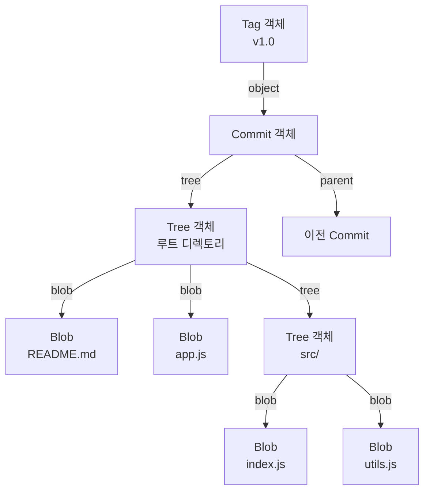
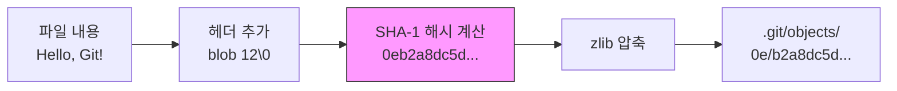
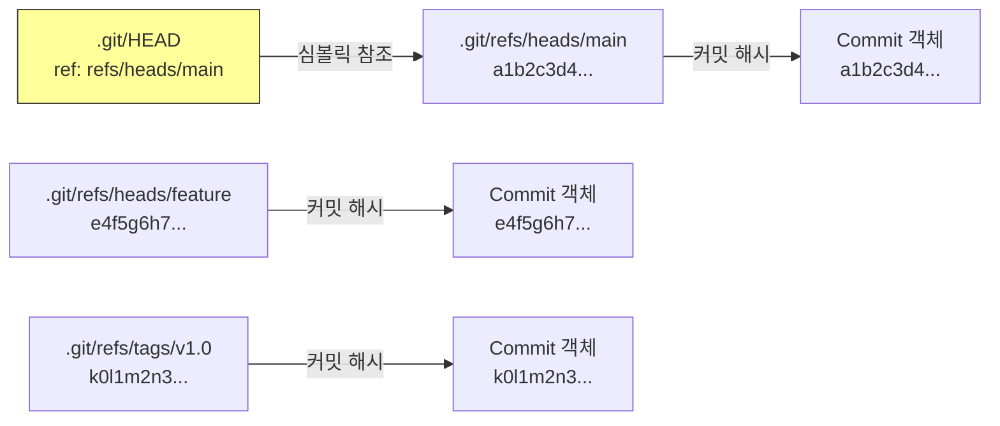
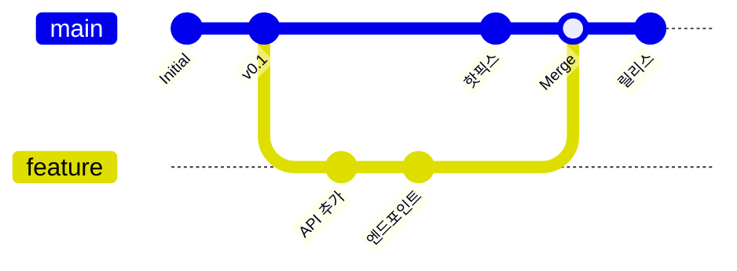
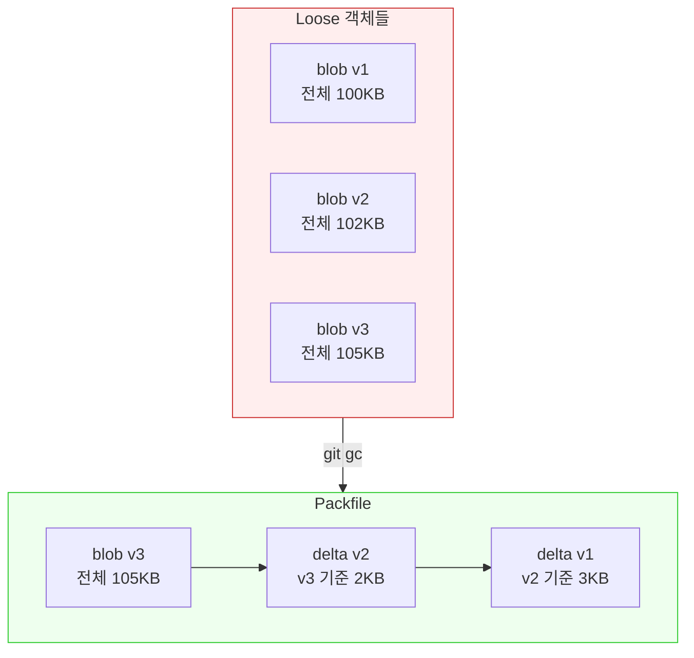

# Git 내부 구조

> 객체(blob/tree/commit), refs, HEAD, DAG, packfile

## 개요

지금까지 Git의 다양한 명령어를 배웠습니다. 그런데 `git add`를 하면 내부에서 정확히 무슨 일이 일어날까요? 커밋은 어디에 저장되고, 브랜치는 실제로 무엇일까요? 이번 섹션에서는 Git의 **내부 구조**를 탐험합니다. "마법의 뚜껑을 열고 안을 들여다보는" 시간이에요. 내부를 이해하면 Git의 모든 명령어가 **왜 그렇게 동작하는지** 자연스럽게 이해됩니다.

**선수 지식**: [히스토리 재작성](./04-history-rewrite.md)까지의 Ch9 전체 내용
**학습 목표**:
- Git의 4가지 객체 타입(blob, tree, commit, tag)을 이해한다
- SHA 해시가 어떻게 만들어지는지 안다
- refs와 HEAD의 실체를 파악한다
- DAG(방향성 비순환 그래프)로 커밋 히스토리를 이해한다
- packfile과 가비지 컬렉션의 동작을 안다

## 왜 알아야 할까?

"Git은 어렵다"는 말을 자주 듣죠. 하지만 놀랍게도, Git의 내부 구조는 **매우 단순**합니다. 단 4가지 객체 타입과 몇 개의 텍스트 파일로 모든 것이 작동해요. 내부를 이해하면 "왜 rebase가 커밋 해시를 바꾸는지", "왜 브랜치가 가볍다고 하는지", "삭제한 커밋이 왜 복구 가능한지"가 모두 명쾌해집니다.

## 핵심 개념

### 개념 1: .git 디렉토리 — Git의 심장

> 💡 **비유**: `.git` 디렉토리는 **도서관의 서고**와 같습니다. 모든 책(파일), 목록(히스토리), 카드 인덱스(참조)가 이 안에 보관되어 있어요. 작업 디렉토리는 열람실이고, `.git`은 실제 저장 공간입니다.

`git init`을 실행하면 생기는 `.git` 디렉토리의 핵심 구조:

| 경로 | 역할 |
|------|------|
| `.git/objects/` | 모든 Git 객체 저장소 (blob, tree, commit, tag) |
| `.git/refs/` | 브랜치, 태그 등의 참조 포인터 |
| `.git/HEAD` | 현재 체크아웃된 브랜치/커밋 |
| `.git/index` | 스테이징 영역 (바이너리 파일) |
| `.git/logs/` | reflog 데이터 |
| `.git/config` | 저장소별 설정 |
| `.git/hooks/` | 훅 스크립트 |

### 개념 2: Git의 4가지 객체

Git은 모든 것을 **4가지 객체 타입**으로 저장합니다:

> 💡 **비유**: Git의 객체 시스템을 **택배 시스템**에 비유하면:
> - **Blob** = 상자 안의 물건 (파일 내용 자체)
> - **Tree** = 상자의 라벨 (어떤 물건이 어디에 있는지 목록)
> - **Commit** = 배송 전표 (누가, 언제, 무엇을 보냈는지 기록)
> - **Tag** = VIP 스티커 (특별히 중요한 배송에 붙이는 표시)

> 📊 **그림 1**: Git 객체 간의 관계 — commit이 tree를 가리키고, tree가 blob과 하위 tree를 가리키는 구조




**Blob** — 파일 내용 저장:

```bash
# 파일 내용을 blob 객체로 직접 만들어보기
echo "Hello, Git!" | git hash-object --stdin
```

```output
0eb2a8dc5d3a8fc7e7fdf1e8f46cb1f9cf00767a
```

blob에는 **파일 이름이 없습니다**. 순수하게 파일 내용만 저장해요. 같은 내용의 파일이 10개 있어도 blob은 **하나**만 존재합니다.

**Tree** — 디렉토리 구조:

```bash
# 커밋의 트리 객체 확인
git cat-file -p HEAD^{tree}
```

```output
100644 blob a1b2c3d... README.md
100644 blob e4f5g6h... app.js
040000 tree h7i8j9k... src
```

tree는 "이 디렉토리에는 어떤 파일(blob)과 하위 디렉토리(tree)가 있는지"를 기록합니다.

**Commit** — 스냅샷 + 메타데이터:

```bash
# 커밋 객체의 내용 보기
git cat-file -p HEAD
```

```output
tree a1b2c3d4e5f6g7h8i9j0k1l2m3n4o5p6q7r8s9t0
parent e4f5g6h7i8j9k0l1m2n3o4p5q6r7s8t9u0v1w2x3
author Jason <jason@email.com> 1707984000 +0900
committer Jason <jason@email.com> 1707984000 +0900

Add new feature
```

커밋은 다음을 포함합니다:
- **tree**: 해당 시점의 전체 디렉토리 스냅샷을 가리키는 포인터
- **parent**: 이전 커밋(들)을 가리키는 포인터 (머지 커밋은 2개 이상)
- **author/committer**: 작성자와 커밋한 사람
- **message**: 커밋 메시지

**Tag (annotated)** — 특별한 표시:

```bash
git cat-file -p v1.0
```

```output
object a1b2c3d4e5f6...
type commit
tag v1.0
tagger Jason <jason@email.com> 1707984000 +0900

Release version 1.0
```

### 개념 3: SHA 해시 — 콘텐츠 주소 시스템

Git은 모든 객체를 **SHA-1 해시**로 식별합니다. 해시는 이렇게 만들어져요:

```bash
# Git이 내부적으로 하는 일을 직접 해보면:
# 형식: "{타입} {바이트수}\0{내용}" → SHA-1 해시
printf 'blob 12\0Hello, Git!' | shasum
```

```output
0eb2a8dc5d3a8fc7e7fdf1e8f46cb1f9cf00767a  -
```

같은 내용은 **항상 같은 해시**를 생성합니다. 이것이 Git의 무결성 검증 원리예요. 파일이 1비트라도 바뀌면 해시가 완전히 달라지므로, 데이터 손상을 즉시 감지할 수 있습니다.

**객체 저장 위치**:

해시 `0eb2a8dc5d...`인 객체는 `.git/objects/0e/b2a8dc5d...`에 저장됩니다 (첫 2글자 = 디렉토리, 나머지 38글자 = 파일명). zlib으로 압축됩니다.

> 📊 **그림 2**: SHA 해시 생성과 객체 저장 과정




> 💡 **알고 계셨나요?**: Git은 현재 SHA-1을 사용하지만, **SHA-256으로의 전환을 준비하고 있습니다**. Git 2.29부터 `git init --object-format=sha256`으로 SHA-256 저장소를 만들 수 있고, **Git 3.0(2026년 말 목표)**에서는 SHA-256이 새 저장소의 기본값이 될 예정입니다. 기존 SHA-1 저장소와의 호환성도 계속 유지됩니다.

### 개념 4: Refs — 사람이 읽을 수 있는 포인터

40자리 해시를 일일이 기억할 수 없으니, Git은 **refs(참조)**를 사용합니다:

```bash
# 브랜치는 사실 커밋 해시를 담은 텍스트 파일!
cat .git/refs/heads/main
```

```output
a1b2c3d4e5f6g7h8i9j0k1l2m3n4o5p6q7r8s9t0
```

브랜치의 실체는 이게 전부입니다 — 커밋 해시 하나를 담은 **41바이트짜리 텍스트 파일**. 이것이 "Git의 브랜치는 가볍다"라고 하는 이유에요.

> 📊 **그림 3**: HEAD, 브랜치, 커밋의 참조 체인 — 포인터가 포인터를 가리키는 구조




**HEAD — 현재 위치**:

```bash
# HEAD는 보통 브랜치를 가리키는 심볼릭 참조
cat .git/HEAD
```

```output
ref: refs/heads/main
```

```bash
# Detached HEAD일 때는 커밋 해시를 직접 가리킴
git checkout abc1234
cat .git/HEAD
```

```output
abc1234567890abcdef1234567890abcdef123456
```

> ⚠️ **흔한 오해**: "브랜치를 만들면 파일이 복사된다" — 전혀 아닙니다! 브랜치를 만들면 41바이트짜리 텍스트 파일 하나가 생길 뿐이에요. 모든 파일 데이터는 objects에 한 번만 저장됩니다.

### 개념 5: DAG — 커밋의 그래프 구조

Git의 커밋 히스토리는 **DAG(Directed Acyclic Graph, 방향성 비순환 그래프)**입니다.

> 💡 **비유**: DAG는 **가계도**와 같습니다. 자식은 부모를 가리키지만(방향성), 자기 자신의 조상이 될 수는 없죠(비순환). 커밋도 마찬가지 — 부모 커밋을 가리키지만, 순환 구조는 불가능합니다.

| 커밋 유형 | 부모 수 | 설명 |
|-----------|--------|------|
| 루트 커밋 | 0 | 첫 번째 커밋 (부모 없음) |
| 일반 커밋 | 1 | 대부분의 커밋 |
| 머지 커밋 | 2+ | 브랜치 합류 지점 |

```bash
# DAG 시각화
git log --oneline --graph --all
```

```output
*   a1b2c3d (HEAD -> main) Merge branch 'feature'
|\
| * e4f5g6h Add new API
| * h7i8j9k Create endpoint
|/
* k0l1m2n Previous commit
* n3o4p5q Initial commit
```

DAG 구조 덕분에 Git은 "이 커밋에서 저 커밋까지 도달할 수 있는가?"를 효율적으로 판단할 수 있고, 이것이 fast-forward 판단, merge-base 계산 등의 기반이 됩니다.

> 📊 **그림 4**: Git 커밋 히스토리의 DAG 구조 — 브랜치 분기와 머지




### 개념 6: Packfile — 효율적인 저장

매 파일마다 개별 객체(loose object)로 저장하면 공간 낭비가 심합니다. Git은 **packfile**로 이를 해결합니다.

```bash
# 저장소의 객체 통계 확인
git count-objects -v
```

```output
count: 25                    # 느슨한(loose) 객체 수
size: 120                    # loose 객체 크기 (KB)
in-pack: 3840                # packfile 안의 객체 수
packs: 2                     # packfile 개수
size-pack: 8420              # packfile 크기 (KB)
```

**Packfile의 핵심 원리 — 델타 압축**:

같은 파일의 v1, v2, v3이 있다면, v3의 전체 내용을 저장하고 v2와 v1은 **"v3과의 차이점"**만 저장합니다. 이 "델타 체인" 덕분에 수천 개의 파일 버전도 매우 작은 공간에 들어갑니다.

> 📊 **그림 5**: Packfile 델타 압축 — loose 객체에서 packfile로의 변환




```bash
# 수동으로 가비지 컬렉션 실행 (loose → packfile 변환)
git gc

# packfile 내용 확인
git verify-pack -v .git/objects/pack/*.idx | head -10
```

**가비지 컬렉션(GC)**:

Git은 정기적으로 `git gc`를 자동 실행하여:
1. loose 객체를 packfile로 묶고
2. 도달 불가능한(unreachable) 오래된 객체를 삭제하고
3. reflog 만료 항목을 정리합니다

| GC 설정 | 기본값 | 의미 |
|---------|--------|------|
| `gc.auto` | 6,700 | loose 객체가 이 수를 넘으면 자동 GC |
| `gc.autoPackLimit` | 50 | packfile이 이 수를 넘으면 자동 repack |
| `gc.pruneExpire` | 2주 | 이보다 오래된 unreachable 객체 삭제 |

## 실습: 직접 해보기

```bash
# 1. 새 저장소에서 Git 내부 탐험
mkdir internals-lab && cd internals-lab
git init

# 2. 첫 파일 만들기
echo "Hello, Git internals!" > hello.txt
git add hello.txt

# 3. blob 객체가 만들어졌는지 확인
find .git/objects -type f | head -5

# 4. 해당 blob의 내용 보기
git cat-file -t $(git hash-object hello.txt)
git cat-file -p $(git hash-object hello.txt)
```

```output
blob
Hello, Git internals!
```

```bash
# 5. 커밋하고 tree와 commit 객체 확인
git commit -m "First commit"
git cat-file -p HEAD       # commit 객체
git cat-file -p HEAD^{tree}  # tree 객체
```

```output
tree b3c4d5e6f7...
author Jason <jason@email.com> 1707984000 +0900
committer Jason <jason@email.com> 1707984000 +0900

First commit
```

```bash
# 6. 브랜치의 실체 확인
cat .git/HEAD
cat .git/refs/heads/main

# 7. 두 번째 커밋 후 DAG 구조 확인
echo "Update" >> hello.txt
git add . && git commit -m "Second commit"
git log --oneline --graph
```

## 더 깊이 알아보기

### Linus Torvalds와 Git의 설계 철학

2005년 Linus Torvalds는 Git을 설계할 때 핵심 원칙을 세웠습니다:

1. **콘텐츠 주소 지정(Content-addressable)**: 파일 이름이 아니라 **내용의 해시**로 식별
2. **불변성(Immutability)**: 한번 만들어진 객체는 절대 변하지 않음
3. **분산(Distribution)**: 모든 클론이 전체 히스토리를 가짐

Linus는 "Git은 파일 시스템이다. 버전 관리 시스템은 그 위에 올린 것"이라고 말했습니다. 실제로 Git의 내부 구조는 **키-값 저장소(key-value store)**에 가깝습니다. 해시가 키이고, 압축된 객체 데이터가 값이죠.

> 💡 **알고 계셨나요?**: Git의 초기 코드는 Linus가 **단 2주 만에** 작성했습니다. 첫 번째 커밋(2005년 4월 7일)부터 자체 호스팅(Git으로 Git을 관리)까지 단 4일밖에 걸리지 않았어요. 이 놀라운 속도는 내부 구조의 단순함 덕분이었습니다.

### Git 3.0과 미래의 변화

Git은 2026년 말 **Git 3.0** 릴리스를 목표로 큰 변화를 준비하고 있습니다:

- **SHA-256 기본값 전환**: 새로 만드는 저장소의 기본 해시가 SHA-1에서 SHA-256으로 변경
- **Reftable 기본값 전환**: refs 저장 방식이 텍스트 파일에서 바이너리 reftable 형식으로 변경. 대규모 저장소에서 수 배 이상 빨라집니다
- **Rust 코드 도입**: Git 2.49부터 Rust FFI가 도입되어 점진적으로 코드베이스가 현대화되고 있습니다

기존 SHA-1 저장소와의 호환성은 계속 유지되므로, 기존 프로젝트가 갑자기 깨질 걱정은 없습니다.

## 흔한 오해와 팁

> ⚠️ **흔한 오해**: "Git은 파일의 '변경 사항(diff)'을 저장한다" — 아닙니다! Git은 매 커밋마다 **전체 스냅샷(snapshot)**을 저장합니다. 변하지 않은 파일은 이전 blob을 재참조하고, 변한 파일만 새 blob이 만들어져요. diff는 저장이 아니라 **비교 시 계산**되는 겁니다.

> ⚠️ **흔한 오해**: "큰 파일을 커밋하면 히스토리가 무거워진다" — 부분적으로 맞지만, packfile의 델타 압축 덕분에 **비슷한 파일은 효율적으로 압축**됩니다. 다만 바이너리 파일(이미지, 동영상)은 델타 압축 효과가 적어서, 이런 파일에는 [Git LFS](../12-troubleshooting/02-large-repos.md)를 사용하세요.

> 🔥 **실무 팁**: `git cat-file -p`는 Git 내부를 탐험하는 **만능 열쇠**입니다. 커밋, 트리, blob, 태그 — 어떤 객체든 이 명령으로 내용을 볼 수 있어요. 문제 해결 시 "이 커밋에 실제로 뭐가 들어있지?"를 확인하는 데 유용합니다.

> 🔥 **실무 팁**: `git fsck` 명령으로 저장소의 무결성을 검사할 수 있습니다. 객체가 손상되거나 연결이 끊어진 "고아 객체"를 찾아줘요. 저장소가 이상하게 동작한다면 `git fsck --full`을 한번 실행해보세요.

## 핵심 정리

| 개념 | 설명 |
|------|------|
| **Blob** | 파일 내용만 저장 (이름 없음) |
| **Tree** | 디렉토리 구조 (blob/tree의 목록) |
| **Commit** | 스냅샷(tree) + 부모 + 메타데이터 |
| **Tag** | 특정 객체에 이름표 붙이기 |
| **SHA 해시** | `{타입} {크기}\0{내용}` → SHA-1 (40자) |
| **Refs** | 해시를 담은 텍스트 파일 (브랜치, 태그) |
| **HEAD** | 현재 위치를 가리키는 심볼릭 참조 |
| **DAG** | 커밋의 방향성 비순환 그래프 구조 |
| **Packfile** | 델타 압축으로 객체를 효율적으로 저장 |
| **GC** | 오래된 객체 정리 + packfile 최적화 |

## 다음 섹션 미리보기

Ch9에서 Git의 고급 히스토리 관리와 내부 구조를 모두 살펴봤습니다! 다음 챕터 [Ch10. GitHub Actions와 자동화](../10-github-actions/01-actions-intro.md)에서는 Git의 세계를 넘어 **CI/CD 자동화**의 영역으로 들어갑니다. 코드를 push하면 자동으로 테스트하고 배포하는 워크플로우를 만들어보겠습니다.

## 참고 자료

- [Pro Git Book — Git Internals](https://git-scm.com/book/en/v2/Git-Internals-Plumbing-and-Porcelain) - Git 내부를 가장 잘 설명한 챕터
- [Pro Git Book — Git Objects](https://git-scm.com/book/en/v2/Git-Internals-Git-Objects) - 4가지 객체 타입 상세 설명
- [Git 공식 문서 — gitrepository-layout](https://git-scm.com/docs/gitrepository-layout) - .git 디렉토리 구조 레퍼런스
- [Git 공식 문서 — hash-function-transition](https://git-scm.com/docs/hash-function-transition) - SHA-256 전환 계획
- [Git for Computer Scientists](https://eagain.net/articles/git-for-computer-scientists/) - DAG 관점에서 본 Git (간결한 명문)
