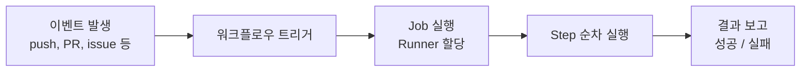
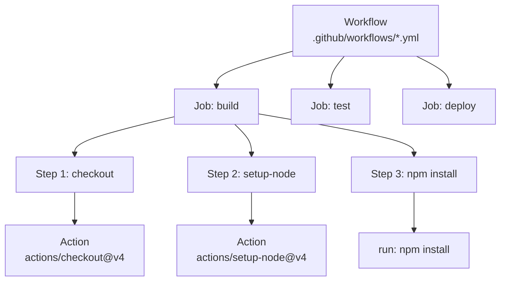
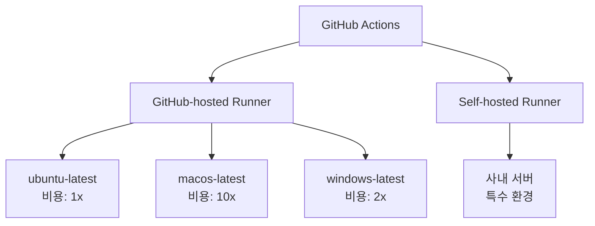
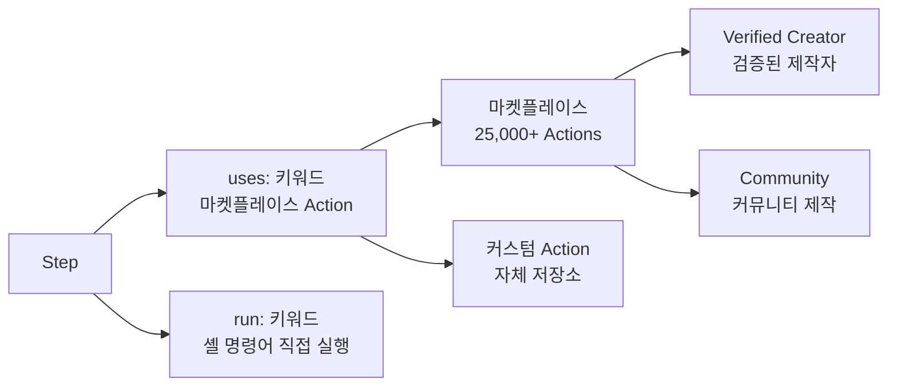

# Actions 시작하기

> workflow, job, step 개념, 마켓플레이스

## 개요

지금까지 Git으로 코드를 관리하고, GitHub로 협업하는 방법을 배웠습니다. 그런데 코드를 push할 때마다 "테스트 돌려야지...", "린트 체크해야지...", "배포해야지..." 이런 반복 작업을 매번 수동으로 하고 계신가요? 이번 섹션부터는 이 모든 것을 **자동으로** 처리하는 방법을 배웁니다.

**선수 지식**: [PR 워크플로우](../06-pull-request/01-pr-workflow.md), [템플릿과 자동화](../07-issues-projects/04-templates.md)에서 본 GitHub Actions 맛보기
**학습 목표**:
- GitHub Actions의 핵심 개념(Workflow, Job, Step, Action)을 이해한다
- 첫 번째 워크플로우를 직접 만들어본다
- Actions 마켓플레이스에서 원하는 Action을 찾아 사용한다

## 왜 알아야 할까?

[워크플로우 전략](../08-advanced-branch/04-workflow-strategies.md)에서 "GitHub Flow에는 CI/CD가 권장되고, Trunk-Based Development에는 **필수**"라고 배웠죠? 그 CI/CD를 가장 쉽게 구축하는 도구가 바로 **GitHub Actions**입니다. 코드 저장소 안에서 바로 자동화를 설정할 수 있으니, 별도의 CI 서버를 구축하거나 외부 서비스를 연동할 필요가 없거든요.

## 핵심 개념

### 개념 1: GitHub Actions란?

> 📊 **그림 1**: GitHub Actions의 이벤트 기반 자동화 흐름




> 💡 **비유**: GitHub Actions는 **자동 반응 로봇**입니다. "누군가 코드를 push하면 테스트를 실행해줘", "PR이 올라오면 린트를 체크해줘"처럼 **이벤트와 할 일을 정해두면**, 로봇이 알아서 실행합니다. 마치 스마트홈에서 "문이 열리면 불을 켜줘"라고 설정하는 것과 같죠.

GitHub Actions는 GitHub에 **내장된 CI/CD 및 자동화 플랫폼**입니다. 코드 push, PR 생성, 이슈 등록 같은 **이벤트**가 발생하면, 미리 정의한 **작업(워크플로우)**을 자동으로 실행합니다.

[템플릿과 자동화](../07-issues-projects/04-templates.md)에서 이미 라벨링과 비활성 이슈 자동 닫기를 경험해보셨는데요, 이번 챕터에서는 이를 체계적으로 배워봅니다.

### 개념 2: 핵심 구조 — 4가지 구성 요소

> 📊 **그림 2**: GitHub Actions의 4계층 구조




GitHub Actions는 4개의 계층으로 이루어져 있습니다:

> 💡 **비유**: 공장의 **자동화 라인**을 떠올려보세요.
> - **Workflow**(워크플로우) → 전체 생산 라인 설계도
> - **Job**(잡) → 각 작업 스테이션 (조립대, 도장실, 검수대...)
> - **Step**(스텝) → 각 스테이션에서 하는 개별 작업 (나사 조이기, 페인트 칠하기...)
> - **Action**(액션) → 작업에 사용하는 도구 (드라이버, 스프레이건...)

| 구성 요소 | 역할 | 정의 위치 |
|-----------|------|-----------|
| **Workflow** | 전체 자동화 프로세스 | `.github/workflows/*.yml` |
| **Job** | 독립적 실행 단위 (러너 1개 사용) | workflow 안의 `jobs:` |
| **Step** | 순차 실행되는 개별 작업 | job 안의 `steps:` |
| **Action** | 재사용 가능한 도구/명령 | `uses:` 또는 `run:` |

첫 번째 워크플로우를 직접 만들어볼까요?

```yaml
# .github/workflows/hello.yml
name: Hello World  # 워크플로우 이름

on: [push]  # 트리거: push할 때마다 실행

jobs:
  greet:  # Job 이름
    runs-on: ubuntu-latest  # 실행 환경 (Runner)
    steps:  # 순서대로 실행할 단계들
      - name: Say Hello  # Step 이름
        run: echo "Hello, GitHub Actions!"  # 셸 명령어 실행

      - name: Show Date
        run: date
```

```output
Hello, GitHub Actions!
Sat Feb 15 12:00:00 UTC 2026
```

이 간단한 예제에 모든 핵심이 담겨 있습니다:

1. **`on: [push]`** — push 이벤트가 발생하면 실행
2. **`jobs.greet`** — "greet"이라는 Job 정의
3. **`runs-on: ubuntu-latest`** — Ubuntu 가상머신에서 실행
4. **`steps`** — 두 개의 Step이 순서대로 실행

### 개념 3: Runner — 워크플로우가 실행되는 곳

> 📊 **그림 3**: Runner 종류와 실행 환경




**Runner**는 워크플로우가 실행되는 서버(가상머신)입니다. GitHub이 제공하는 것과 직접 운영하는 것이 있습니다.

| Runner 종류 | 설명 | 사용 예 |
|-------------|------|---------|
| **GitHub-hosted** | GitHub이 관리하는 VM | `ubuntu-latest`, `windows-latest`, `macos-latest` |
| **Self-hosted** | 직접 운영하는 서버 | 특수 하드웨어, 사내망 접근 필요 시 |
| **Larger runners** | GitHub 관리 고사양 VM | 대규모 빌드, GPU 작업 |

```yaml
jobs:
  test-linux:
    runs-on: ubuntu-latest     # 가장 많이 사용 (비용 효율적)
  test-mac:
    runs-on: macos-latest      # macOS 전용 빌드
  test-windows:
    runs-on: windows-latest    # Windows 전용 빌드
```

> 💡 **알고 계셨나요?**: GitHub-hosted runner는 **매번 새로운 VM**에서 실행됩니다. 이전 실행의 흔적이 남지 않는 "깨끗한 환경"이죠. 이 덕분에 "내 PC에서는 되는데..."라는 문제를 방지할 수 있습니다.

### 개념 4: Actions 마켓플레이스

> 📊 **그림 4**: Step에서 Action을 사용하는 두 가지 방식




모든 것을 직접 만들 필요는 없습니다. **마켓플레이스**에는 25,000개 이상의 Action이 있습니다.

```yaml
steps:
  # 마켓플레이스 Action 사용 — uses 키워드
  - uses: actions/checkout@v4       # 저장소 코드 체크아웃
  - uses: actions/setup-node@v4    # Node.js 설치
    with:
      node-version: '20'           # 매개변수 전달

  # 직접 명령어 실행 — run 키워드
  - run: npm install
  - run: npm test
```

자주 쓰는 공식 Action들을 알아볼까요?

| Action | 용도 | 예시 |
|--------|------|------|
| `actions/checkout@v4` | 저장소 코드 가져오기 | 거의 모든 워크플로우에서 사용 |
| `actions/setup-node@v4` | Node.js 환경 설정 | 버전 지정, 캐싱 지원 |
| `actions/setup-python@v5` | Python 환경 설정 | 버전 지정, pip 캐싱 |
| `actions/upload-artifact@v4` | 빌드 결과 업로드 | 로그, 빌드 파일 저장 |
| `actions/cache@v4` | 의존성 캐싱 | 빌드 시간 단축 |
| `actions/labeler@v5` | PR 자동 라벨링 | 파일 경로 기반 라벨 |

> ⚠️ **흔한 오해**: "마켓플레이스의 Action은 모두 안전하다" — 아닙니다! 마켓플레이스 Action은 **서드파티 코드**를 실행하는 것입니다. 반드시 **Verified Creator** 배지를 확인하고, 버전을 **커밋 SHA**로 고정하는 것이 보안 모범 사례입니다.

```yaml
# ⚠️ 보안 취약 — 태그는 변경될 수 있음
- uses: some-action@v1

# ✅ 보안 모범 사례 — SHA로 고정
- uses: some-action@a1b2c3d4e5f6...
```

### 개념 5: 무료 사용량과 비용

GitHub Actions는 공개 저장소에서 **완전 무료**입니다! 비공개 저장소는 월간 한도가 있어요:

| 플랜 | 월간 무료 시간 | 스토리지 |
|------|---------------|----------|
| **Free** | 2,000분 | 500MB |
| **Pro** | 3,000분 | 1GB |
| **Team** | 3,000분 | 2GB |
| **Enterprise** | 50,000분 | 50GB |

> 🔥 **실무 팁**: macOS runner는 Linux 대비 **10배** 비용이 듭니다 (1분 = 10분으로 계산). 가능하면 Linux runner를 사용하고, macOS는 꼭 필요한 빌드에만 사용하세요.

## 실습: 첫 번째 워크플로우 만들기

```bash
# 1. 워크플로우 디렉토리 생성
mkdir -p .github/workflows

# 2. 워크플로우 파일 만들기
cat > .github/workflows/ci.yml << 'EOF'
name: CI

on:
  push:
    branches: [main]
  pull_request:
    branches: [main]

jobs:
  build:
    runs-on: ubuntu-latest
    steps:
      - name: Checkout code
        uses: actions/checkout@v4

      - name: Show project info
        run: |
          echo "Repository: ${{ github.repository }}"
          echo "Branch: ${{ github.ref_name }}"
          echo "Commit: ${{ github.sha }}"
          echo "Actor: ${{ github.actor }}"

      - name: List files
        run: ls -la

      - name: Run a simple test
        run: echo "All tests passed!"
EOF

# 3. 커밋하고 push하면 자동 실행!
git add .github/workflows/ci.yml
git commit -m "ci: add first GitHub Actions workflow"
git push
```

push 후 GitHub 저장소의 **Actions** 탭에서 실행 결과를 확인할 수 있습니다.

```bash
# GitHub CLI로도 워크플로우 실행 확인 가능
gh run list
```

```output
STATUS  TITLE                  WORKFLOW  BRANCH  EVENT  ID          ELAPSED  AGE
✓       ci: add first GA...   CI        main    push   1234567890  15s      1m
```

```bash
# 특정 실행의 상세 로그 보기
gh run view 1234567890 --log
```

## 더 깊이 알아보기

### GitHub Actions의 탄생

GitHub Actions는 **2018년 10월 GitHub Universe**에서 처음 발표되었습니다. 당시에는 HCL(HashiCorp Configuration Language) 문법을 사용했는데, 2019년 8월 **YAML 문법으로 전면 전환**하면서 대중적인 인기를 얻기 시작했습니다.

그 전까지 GitHub 사용자들은 CI/CD를 위해 **Jenkins**, **Travis CI**, **CircleCI** 같은 외부 서비스를 연동해야 했습니다. GitHub Actions의 등장은 "코드와 자동화가 한 지붕 아래"라는 혁명을 가져왔죠. 2024년에는 CI/CD 시장에서 **가장 인기 있는 도구**로 자리잡았고, 2025년에는 ARM64 Linux runner GA, GPU runner 등 다양한 러너 옵션이 추가되어 하루 **7,100만 개** 이상의 Job을 처리하고 있습니다.

### 다른 CI/CD 도구와 비교

| 특징 | GitHub Actions | Jenkins | GitLab CI | CircleCI |
|------|---------------|---------|-----------|----------|
| **설정** | YAML (간편) | Groovy (복잡) | YAML | YAML |
| **호스팅** | GitHub 내장 | 자체 설치 | GitLab 내장 | SaaS |
| **마켓플레이스** | 25,000+ Actions | 1,800+ 플러그인 | 제한적 | Orbs |
| **무료 범위** | 공개 저장소 무제한 | 무료 (자체 서버) | 400분/월 | 6,000분/월 |
| **학습 난이도** | 낮음 | 높음 | 중간 | 중간 |

## 흔한 오해와 팁

> ⚠️ **흔한 오해**: "GitHub Actions = CI/CD 전용 도구" — 사실 Actions는 CI/CD 외에도 이슈 자동 라벨링, 릴리스 자동화, 코드 품질 체크, 번역 동기화, Slack 알림 등 **모든 GitHub 이벤트 기반 자동화**에 사용할 수 있습니다.

> 🔥 **실무 팁**: 워크플로우 파일은 반드시 `.github/workflows/` 디렉토리에 있어야 합니다. 이 경로를 벗어나면 GitHub가 인식하지 못해요. 파일 확장자도 `.yml` 또는 `.yaml`만 가능합니다.

> 💡 **알고 계셨나요?**: GitHub Actions는 내부적으로 **Azure Pipelines** 기술을 기반으로 만들어졌습니다. Microsoft가 GitHub를 인수(2018년)한 후, Azure DevOps 팀의 기술력이 합쳐진 결과물이죠.

## 핵심 정리

| 개념 | 설명 |
|------|------|
| **Workflow** | `.github/workflows/*.yml`에 정의하는 자동화 프로세스 |
| **Job** | 하나의 Runner에서 실행되는 독립 작업 단위 |
| **Step** | Job 안에서 순서대로 실행되는 개별 작업 |
| **Action** | 재사용 가능한 도구 (`uses:` 키워드로 사용) |
| **Runner** | 워크플로우가 실행되는 서버 (ubuntu, macos, windows) |
| **마켓플레이스** | 25,000+ Action 저장소 |
| **`on:`** | 워크플로우 트리거 (push, PR, schedule 등) |
| **`runs-on:`** | 실행 환경(Runner) 지정 |

## 다음 섹션 미리보기

첫 번째 워크플로우를 만들어봤으니, 이제 YAML 문법을 좀 더 깊이 배울 차례입니다. [워크플로우 작성](./02-workflow-yaml.md)에서는 트리거 조건을 세밀하게 설정하고, 환경 변수와 시크릿을 관리하며, 조건부 실행과 매트릭스 전략까지 다룹니다.

## 참고 자료

- [GitHub Docs — GitHub Actions 이해하기](https://docs.github.com/ko/actions/about-github-actions/understanding-github-actions) - 공식 소개와 핵심 개념 정리
- [GitHub Docs — 워크플로우 빠른 시작](https://docs.github.com/ko/actions/writing-workflows/quickstart) - 첫 워크플로우 만들기 가이드
- [GitHub Actions Marketplace](https://github.com/marketplace?type=actions) - 25,000+ Action 탐색
- [GitHub Docs — 사용량 한도](https://docs.github.com/ko/billing/managing-billing-for-your-products/managing-billing-for-github-actions/about-billing-for-github-actions) - 플랜별 무료 사용량 안내
- [Pro Git Book — GitHub과 CI](https://git-scm.com/book/en/v2/GitHub-Scripting-GitHub) - Git 관점에서의 GitHub 자동화
