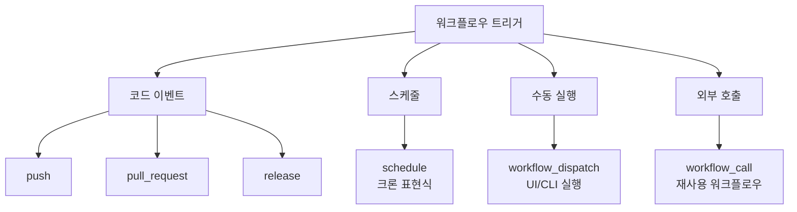
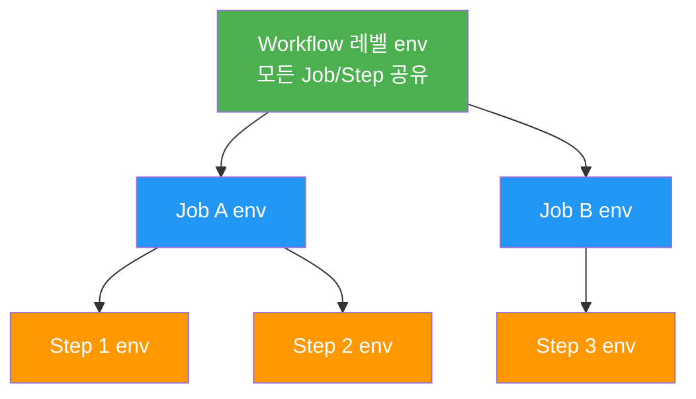
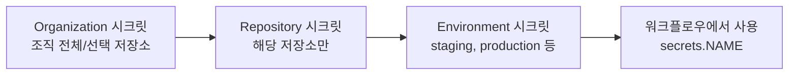
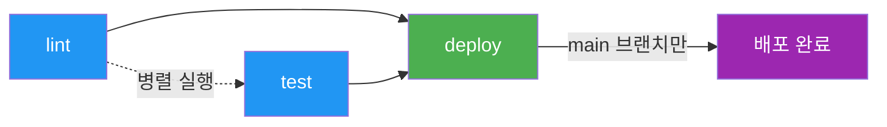

# 워크플로우 작성

> YAML 문법, 트리거(on), 환경변수, 시크릿

## 개요

첫 번째 워크플로우를 만들어봤으니, 이제 YAML 문법을 제대로 이해하고 워크플로우를 자유자재로 작성할 차례입니다. 트리거 조건 설정부터 환경 변수, 시크릿 관리까지 — 워크플로우의 "설계 문법"을 배워봅시다.

**선수 지식**: [Actions 시작하기](./01-actions-intro.md)의 Workflow/Job/Step/Action 개념
**학습 목표**:
- YAML 문법의 기본을 이해하고 워크플로우 파일을 읽고 쓸 수 있다
- 다양한 트리거(on) 이벤트를 상황에 맞게 설정한다
- 환경 변수와 시크릿을 안전하게 사용한다
- 표현식(expressions)과 컨텍스트(contexts)를 활용한다

## 왜 알아야 할까?

워크플로우 YAML 파일을 "대충 복붙"해서 쓰면 언젠가 벽에 부딪힙니다. "왜 이 워크플로우가 실행되지 않지?", "시크릿은 어디에 넣지?", "특정 브랜치에서만 실행하고 싶은데..." — 이런 질문에 답하려면 YAML 문법과 워크플로우 설정을 체계적으로 알아야 합니다.

## 핵심 개념

### 개념 1: YAML 기본 문법

> 💡 **비유**: YAML은 **들여쓰기로 구조를 표현하는 메모장**입니다. 중괄호(`{}`) 대신 **공백 들여쓰기**로 계층을 나타내고, JSON보다 사람이 읽기 편하죠. 마치 Word 문서의 들여쓰기 목록처럼 직관적입니다.

YAML에서 꼭 알아야 할 규칙을 정리합니다:

```yaml
# 1. 키-값 쌍
name: My Workflow
version: 1

# 2. 리스트 (하이픈 + 공백)
branches:
  - main
  - develop

# 3. 인라인 리스트 (대괄호)
branches: [main, develop]

# 4. 중첩 (공백 2칸 들여쓰기)
jobs:
  build:
    runs-on: ubuntu-latest
    steps:
      - name: Step 1
        run: echo "hello"

# 5. 여러 줄 문자열 — 파이프(|)
run: |
  echo "첫 번째 줄"
  echo "두 번째 줄"
  npm install

# 6. 한 줄로 접기 — 꺾쇠(>)
description: >
  이 문장은 한 줄로
  합쳐집니다.
```

> ⚠️ **흔한 오해**: "탭도 들여쓰기에 쓸 수 있다" — **절대 안 됩니다!** YAML은 **공백(스페이스)만** 허용합니다. 탭을 쓰면 파싱 에러가 나요. 에디터에서 탭을 공백 2칸으로 변환하도록 설정하세요.

### 개념 2: 트리거(on) — 언제 실행할까?

`on:` 키워드로 워크플로우가 실행되는 **조건**을 정합니다. 이것이 워크플로우의 출발점이에요.

> 📊 **그림 1**: GitHub Actions 트리거 유형 분류




**기본 이벤트 트리거:**

```yaml
# 단일 이벤트
on: push

# 복수 이벤트
on: [push, pull_request]

# 이벤트 + 조건 (특정 브랜치, 경로)
on:
  push:
    branches: [main, develop]       # 이 브랜치에 push할 때만
    paths:
      - 'src/**'                    # src 폴더 변경 시에만
      - '!src/**/*.md'              # 단, md 파일 변경은 제외(!)

  pull_request:
    branches: [main]
    types: [opened, synchronize]    # PR 생성/업데이트 시
```

**스케줄 트리거 (크론):**

```yaml
on:
  schedule:
    # 매일 자정(UTC)에 실행
    - cron: '0 0 * * *'
    # 매주 월요일 오전 9시(KST = UTC+9 → UTC 0시)
    - cron: '0 0 * * 1'
```

```yaml
# 크론 표현식 형식
# ┌───────── 분 (0-59)
# │ ┌─────── 시 (0-23)
# │ │ ┌───── 일 (1-31)
# │ │ │ ┌─── 월 (1-12)
# │ │ │ │ ┌─ 요일 (0-6, 0=일요일)
# * * * * *
```

**수동 트리거 (workflow_dispatch):**

```yaml
on:
  workflow_dispatch:
    inputs:
      environment:
        description: '배포 환경 선택'
        required: true
        default: 'staging'
        type: choice
        options:
          - staging
          - production
      debug:
        description: '디버그 모드'
        required: false
        type: boolean
```

```bash
# GitHub CLI로 수동 실행
gh workflow run deploy.yml -f environment=staging -f debug=true
```

주요 트리거를 정리합니다:

| 트리거 | 설명 | 용도 |
|--------|------|------|
| `push` | 브랜치에 push | CI 빌드/테스트 |
| `pull_request` | PR 생성/업데이트 | PR 검증 |
| `schedule` | 크론 스케줄 (60일 미활동 시 자동 비활성화) | 정기 작업, 야간 빌드 |
| `workflow_dispatch` | 수동 실행 | 배포, 긴급 작업 |
| `release` | 릴리스 생성 | 릴리스 자동화 |
| `issues` | 이슈 생성/수정 | 이슈 자동 분류 |
| `workflow_call` | 다른 워크플로우에서 호출 | 재사용 가능 워크플로우 |

### 개념 3: 환경 변수

환경 변수는 **3가지 레벨**에서 설정할 수 있습니다:

> 📊 **그림 2**: 환경 변수 스코프 계층 — 상위가 하위를 포함하며, 하위가 상위를 덮어씁니다




```yaml
# 1. 워크플로우 레벨 — 모든 Job/Step에서 사용 가능
env:
  NODE_ENV: production
  APP_NAME: my-app

jobs:
  build:
    runs-on: ubuntu-latest
    # 2. Job 레벨 — 해당 Job의 모든 Step에서 사용 가능
    env:
      DATABASE_URL: postgres://localhost/test

    steps:
      # 3. Step 레벨 — 해당 Step에서만 사용 가능
      - name: Build
        env:
          API_KEY: ${{ secrets.API_KEY }}
        run: echo "Building $APP_NAME"
```

GitHub이 자동으로 제공하는 **기본 환경 변수**도 있습니다:

| 변수 | 설명 | 예시 값 |
|------|------|---------|
| `GITHUB_REPOSITORY` | 저장소 이름 | `owner/repo` |
| `GITHUB_REF_NAME` | 브랜치/태그 이름 | `main`, `v1.0.0` |
| `GITHUB_SHA` | 커밋 해시 | `a1b2c3d4...` |
| `GITHUB_ACTOR` | 실행 트리거한 사용자 | `username` |
| `GITHUB_RUN_NUMBER` | 실행 번호 (순번) | `42` |
| `RUNNER_OS` | Runner OS | `Linux`, `macOS`, `Windows` |

### 개념 4: 시크릿(Secrets) 관리

API 키, 비밀번호, 토큰 같은 민감 정보는 **절대 코드에 직접 넣으면 안 됩니다**. GitHub Secrets를 사용하세요.

```bash
# GitHub CLI로 시크릿 설정
gh secret set API_KEY --body "sk-1234567890abcdef"

# 시크릿 목록 확인
gh secret list
```

```output
NAME       UPDATED
API_KEY    2026-02-15
DEPLOY_TOKEN  2026-02-10
```

```yaml
# 워크플로우에서 시크릿 사용
steps:
  - name: Deploy
    env:
      API_KEY: ${{ secrets.API_KEY }}
    run: ./deploy.sh

  - name: Login to Docker Hub
    uses: docker/login-action@v3
    with:
      username: ${{ secrets.DOCKER_USERNAME }}
      password: ${{ secrets.DOCKER_PASSWORD }}
```

> ⚠️ **흔한 오해**: "시크릿을 echo하면 값이 보인다" — GitHub Actions는 로그에서 시크릿 값을 자동으로 **`***`로 마스킹**합니다. 하지만 시크릿을 파일에 쓰거나 base64 인코딩하면 마스킹이 우회될 수 있으니 주의하세요!

시크릿 관리 계층:

> 📊 **그림 3**: 시크릿 관리 계층 — 범위가 넓은 순서




| 레벨 | 범위 | 설정 방법 |
|------|------|-----------|
| **Repository** | 해당 저장소만 | Settings → Secrets |
| **Environment** | 특정 환경만 (staging, prod) | Settings → Environments |
| **Organization** | 조직의 모든/선택 저장소 | Org Settings → Secrets |

> 🔥 **실무 팁**: `GITHUB_TOKEN`은 GitHub이 **자동으로 생성**하는 특별한 시크릿입니다. `${{ secrets.GITHUB_TOKEN }}`으로 바로 사용 가능하며, 별도 설정이 필요 없습니다. 저장소 내에서 이슈 생성, PR 코멘트, 릴리스 작성 등에 충분한 권한을 가집니다.

### 개념 5: 표현식(Expressions)과 컨텍스트(Contexts)

`${{ }}` 문법으로 동적 값을 사용할 수 있습니다:

```yaml
jobs:
  deploy:
    runs-on: ubuntu-latest
    # 조건부 실행 — main 브랜치 push일 때만 배포
    if: github.ref == 'refs/heads/main' && github.event_name == 'push'

    steps:
      - name: Show info
        run: |
          echo "Repo: ${{ github.repository }}"
          echo "Actor: ${{ github.actor }}"
          echo "Event: ${{ github.event_name }}"
          echo "Run #${{ github.run_number }}"

      # 이전 Step 결과에 따라 조건부 실행
      - name: Notify on failure
        if: failure()
        run: echo "Something went wrong!"

      # 항상 실행 (정리 작업 등)
      - name: Cleanup
        if: always()
        run: echo "Cleaning up..."
```

주요 상태 함수:

| 함수 | 설명 |
|------|------|
| `success()` | 이전 Step이 모두 성공 (기본값) |
| `failure()` | 이전 Step 중 하나라도 실패 |
| `always()` | 성공/실패 관계없이 항상 실행 |
| `cancelled()` | 워크플로우가 취소됨 |

### 개념 6: Job 간 의존관계

기본적으로 Job은 **병렬 실행**됩니다. `needs` 키워드로 순서를 지정합니다:

```yaml
jobs:
  lint:
    runs-on: ubuntu-latest
    steps:
      - uses: actions/checkout@v4
      - run: npm run lint

  test:
    runs-on: ubuntu-latest
    steps:
      - uses: actions/checkout@v4
      - run: npm test

  deploy:
    runs-on: ubuntu-latest
    needs: [lint, test]  # lint와 test가 모두 성공한 후에만 실행
    if: github.ref == 'refs/heads/main'
    steps:
      - run: echo "Deploying..."
```

위 예제의 실행 순서:

1. **lint**와 **test**가 **동시에**(병렬) 실행
2. 둘 다 성공하면 **deploy** 실행
3. 하나라도 실패하면 deploy는 **스킵**

> 📊 **그림 4**: Job 의존관계 실행 흐름 — needs로 순서 제어




## 실습: 실전 워크플로우 만들기

Node.js 프로젝트를 위한 실전 CI 워크플로우를 만들어봅시다:

```yaml
# .github/workflows/ci.yml
name: CI Pipeline

on:
  push:
    branches: [main, develop]
    paths-ignore:
      - '*.md'          # 문서 변경은 CI 건너뛰기
      - 'docs/**'
  pull_request:
    branches: [main]

env:
  NODE_VERSION: '20'

jobs:
  lint:
    name: Code Quality
    runs-on: ubuntu-latest
    steps:
      - uses: actions/checkout@v4
      - uses: actions/setup-node@v4
        with:
          node-version: ${{ env.NODE_VERSION }}
          cache: 'npm'
      - run: npm ci
      - run: npm run lint

  test:
    name: Tests
    runs-on: ubuntu-latest
    steps:
      - uses: actions/checkout@v4
      - uses: actions/setup-node@v4
        with:
          node-version: ${{ env.NODE_VERSION }}
          cache: 'npm'
      - run: npm ci
      - run: npm test

  build:
    name: Build
    runs-on: ubuntu-latest
    needs: [lint, test]
    steps:
      - uses: actions/checkout@v4
      - uses: actions/setup-node@v4
        with:
          node-version: ${{ env.NODE_VERSION }}
          cache: 'npm'
      - run: npm ci
      - run: npm run build
      - uses: actions/upload-artifact@v4
        with:
          name: build-output
          path: dist/
```

## 더 깊이 알아보기

### YAML의 탄생과 이름의 유래

YAML은 2001년 **Clark Evans**, **Ingy döt Net**, **Oren Ben-Kiki**가 만들었습니다. 원래 이름은 "Yet Another Markup Language"였는데, 이후 "**YAML Ain't Markup Language**"로 변경되었죠 — 재귀적 약어(recursive acronym)입니다! 마크업 언어가 아니라 **데이터 직렬화 형식**이라는 점을 강조하기 위해서였습니다.

GitHub Actions가 처음 HCL 대신 YAML을 선택한 것은 탁월한 결정이었습니다. YAML은 이미 Docker Compose, Kubernetes, Ansible 등에서 널리 쓰이고 있어 개발자들에게 친숙했거든요.

### YAML Anchors — 4년 만에 추가된 기능

2025년 9월, 커뮤니티의 4년간의 요청 끝에 GitHub Actions에 **YAML Anchors**가 추가되었습니다. 앵커(`&`)로 정의하고 별칭(`*`)으로 참조하면 반복을 줄일 수 있습니다:

```yaml
env: &common-env
  NODE_VERSION: '20'
  CI: true

jobs:
  build:
    steps:
      - run: echo "build"
        env: *common-env  # 앵커 참조로 중복 제거
```

단, merge key(`<<:`)는 아직 지원되지 않으며, 같은 파일 내에서만 참조 가능합니다.

## 흔한 오해와 팁

> ⚠️ **흔한 오해**: "`on: pull_request`와 `on: pull_request_target`은 같다" — 아닙니다! `pull_request`는 **포크의 코드**에서 실행되지만, `pull_request_target`은 **베이스 브랜치의 코드**에서 실행됩니다. 시크릿 접근 권한이 다르니 보안에 주의하세요.

> 🔥 **실무 팁**: `paths-ignore`를 활용하세요. README나 문서만 수정했는데 전체 CI가 돌아가면 시간/비용 낭비입니다. `'*.md'`, `'docs/**'` 같은 패턴으로 불필요한 실행을 줄일 수 있습니다.

> 💡 **알고 계셨나요?**: `workflow_dispatch` 트리거에 `inputs`를 정의하면, GitHub UI에서 **드롭다운, 텍스트 입력, 체크박스** 같은 폼이 자동 생성됩니다. 마치 웹 애플리케이션 폼처럼요!

## 핵심 정리

| 개념 | 설명 |
|------|------|
| **YAML 기본** | 공백 들여쓰기(탭 금지!), 키-값, 리스트, 여러 줄(`\|`, `>`) |
| **트리거(on)** | push, pull_request, schedule, workflow_dispatch 등 |
| **paths / paths-ignore** | 특정 파일/경로 변경 시만 실행 또는 제외 |
| **env** | 워크플로우/Job/Step 3단계 환경 변수 |
| **secrets** | `${{ secrets.NAME }}`으로 민감 정보 안전하게 사용 |
| **GITHUB_TOKEN** | GitHub 자동 생성 토큰 (별도 설정 불필요) |
| **표현식** | `${{ }}` 안에서 동적 값, 조건부 실행 |
| **needs** | Job 간 의존관계 설정 (순차 실행) |
| **if** | 조건부 실행 (`success()`, `failure()`, `always()`) |

## 다음 섹션 미리보기

YAML 문법과 워크플로우 설정을 배웠으니, 이제 실전에서 가장 많이 쓰이는 CI 파이프라인을 구축해볼 차례입니다. [빌드와 테스트 자동화](./03-ci.md)에서는 매트릭스 빌드로 여러 환경을 동시에 테스트하고, 캐싱으로 빌드 속도를 높이는 방법을 배웁니다.

## 참고 자료

- [GitHub Docs — 워크플로우 트리거 이벤트](https://docs.github.com/ko/actions/writing-workflows/choosing-when-your-workflow-runs/events-that-trigger-workflows) - 모든 트리거 이벤트 목록
- [GitHub Docs — 워크플로우 문법](https://docs.github.com/ko/actions/writing-workflows/workflow-syntax-for-github-actions) - YAML 문법 전체 레퍼런스
- [GitHub Docs — 시크릿 사용](https://docs.github.com/ko/actions/security-for-github-actions/security-guides/using-secrets-in-github-actions) - 시크릿 관리 가이드
- [GitHub Docs — 환경 변수](https://docs.github.com/ko/actions/writing-workflows/choosing-what-your-workflow-does/store-information-in-variables) - 기본/커스텀 환경 변수
- [YAML 공식 사이트](https://yaml.org/) - YAML 스펙과 예제
