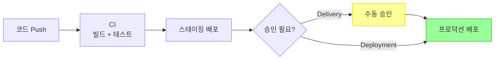
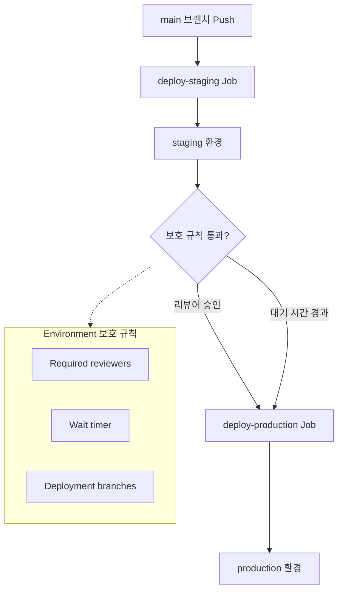
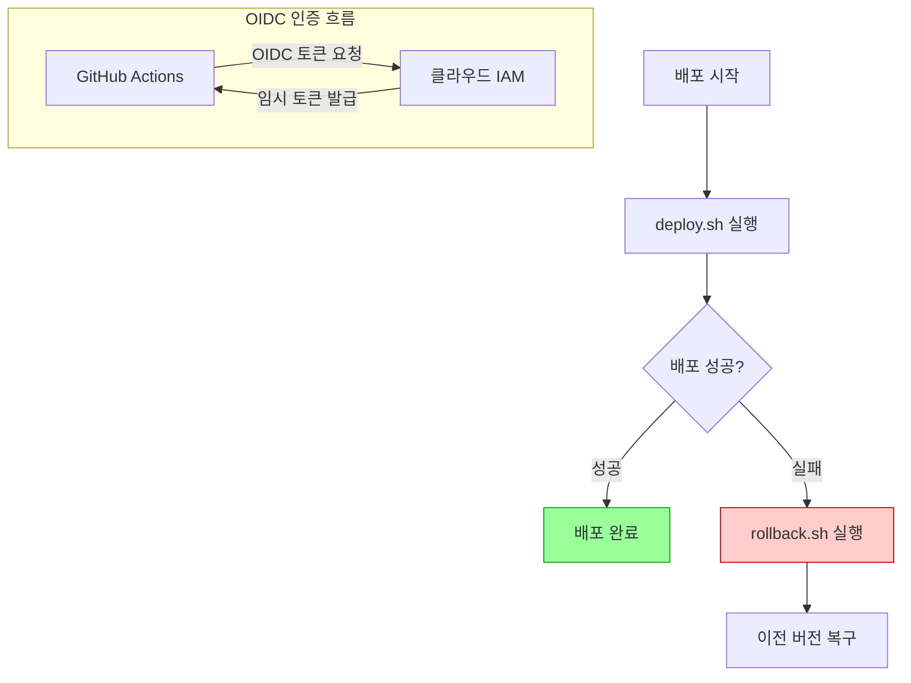
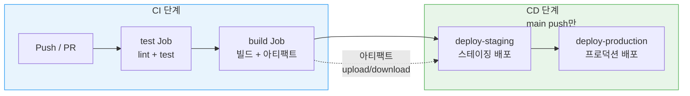

# 배포 자동화

> CD 파이프라인, 환경 분리, 자동 릴리스, 아티팩트

## 개요

CI로 코드 품질을 자동 검증하는 법을 배웠습니다. 그런데 테스트를 통과한 코드를 매번 수동으로 배포하고 계신가요? 이번 섹션에서는 코드가 main 브랜치에 병합되면 **자동으로 배포**되는 CD 파이프라인을 구축합니다.

**선수 지식**: [빌드와 테스트 자동화](./03-ci.md)의 CI 파이프라인, 아티팩트
**학습 목표**:
- CD(Continuous Delivery/Deployment)의 개념과 차이를 이해한다
- GitHub Environments로 배포 환경을 분리한다
- 자동 릴리스를 만들고 관리한다
- 실전 CD 파이프라인을 구축한다

## 왜 알아야 할까?

코드를 머지한 후 "서버 접속 → 빌드 → 배포 → 확인"을 매번 수동으로 한다면, 시간도 오래 걸리고 실수할 가능성도 높습니다. CD를 도입하면 **코드를 머지하는 순간 배포까지 자동으로 완료**됩니다. [워크플로우 전략](../08-advanced-branch/04-workflow-strategies.md)에서 Trunk-Based Development에 "강한 CI/CD가 필수"라고 했던 이유가 바로 이것입니다.

## 핵심 개념

### 개념 1: CD란?

> 📊 **그림 1**: Continuous Delivery vs Continuous Deployment 흐름 비교




> 💡 **비유**: CI가 **자동 품질 검사관**이라면, CD는 **자동 배송 시스템**입니다. 검사를 통과한 제품을 자동으로 포장하고, 트럭에 실어 고객에게 배달하는 거죠.

CD는 두 가지 의미로 쓰입니다:

| 용어 | 설명 | 자동화 범위 |
|------|------|-------------|
| **Continuous Delivery** (지속적 전달) | 배포 **준비**까지 자동화, 최종 배포는 수동 승인 | CI → 빌드 → 스테이징 → (승인) → 프로덕션 |
| **Continuous Deployment** (지속적 배포) | 배포까지 **완전 자동화** | CI → 빌드 → 스테이징 → 프로덕션 (자동) |

> ⚠️ **흔한 오해**: "Continuous Delivery와 Continuous Deployment는 같다" — 아닙니다! Delivery는 프로덕션 배포 전 **사람의 승인**이 필요하고, Deployment는 **완전 자동**입니다. 대부분의 팀은 Continuous Delivery로 시작해서 신뢰가 쌓이면 Deployment로 전환합니다.

### 개념 2: GitHub Environments — 배포 환경 분리

> 📊 **그림 2**: GitHub Environments를 활용한 배포 환경 분리




실제 서비스에서는 **스테이징**(테스트) 환경에서 먼저 확인한 후 **프로덕션**(실제 서비스)에 배포합니다.

GitHub Environments는 이런 환경 분리를 지원합니다:

```yaml
# .github/workflows/deploy.yml
name: Deploy

on:
  push:
    branches: [main]

jobs:
  deploy-staging:
    runs-on: ubuntu-latest
    environment:
      name: staging              # 스테이징 환경
      url: https://staging.example.com
    steps:
      - uses: actions/checkout@v4
      - run: npm ci && npm run build
      - name: Deploy to Staging
        env:
          DEPLOY_KEY: ${{ secrets.STAGING_DEPLOY_KEY }}
        run: ./scripts/deploy.sh staging

  deploy-production:
    runs-on: ubuntu-latest
    needs: deploy-staging         # 스테이징 성공 후에만
    environment:
      name: production           # 프로덕션 환경
      url: https://example.com
    steps:
      - uses: actions/checkout@v4
      - run: npm ci && npm run build
      - name: Deploy to Production
        env:
          DEPLOY_KEY: ${{ secrets.PROD_DEPLOY_KEY }}
        run: ./scripts/deploy.sh production
```

Environment 보호 규칙 (Settings → Environments에서 설정):

| 보호 규칙 | 설명 |
|-----------|------|
| **Required reviewers** | 지정된 사람(최대 6명)이 승인해야 배포 진행 |
| **Wait timer** | 지정된 시간(1~43,200분)만큼 대기 후 배포 |
| **Deployment branches** | 특정 브랜치에서만 배포 허용 |

배포 워크플로우에서는 **동시 실행 제어**도 중요합니다:

```yaml
concurrency:
  group: deploy-production
  cancel-in-progress: false  # ⚠️ 배포 중에는 절대 취소하지 않기!
```

> 🔥 **실무 팁**: 프로덕션 환경에는 반드시 **Required reviewers**를 설정하세요. 아무리 CI가 통과해도, 사람의 눈으로 한 번 더 확인하는 안전장치가 필요합니다. `concurrency`에서 `cancel-in-progress: false`로 설정하여 진행 중인 배포가 취소되지 않도록 하세요.

### 개념 3: 자동 릴리스

코드가 특정 태그와 함께 push되면 자동으로 GitHub Release를 만들 수 있습니다.

```yaml
# .github/workflows/release.yml
name: Release

on:
  push:
    tags:
      - 'v*.*.*'  # v1.0.0 같은 태그가 push되면 실행

jobs:
  release:
    runs-on: ubuntu-latest
    permissions:
      contents: write   # 릴리스 생성 권한

    steps:
      - uses: actions/checkout@v4
        with:
          fetch-depth: 0  # 전체 히스토리 (태그 비교용)

      - name: Setup Node.js
        uses: actions/setup-node@v4
        with:
          node-version: '20'
          cache: 'npm'

      - run: npm ci
      - run: npm run build

      # 빌드 결과를 릴리스 아티팩트로 압축
      - name: Create archive
        run: tar -czf dist.tar.gz dist/

      # GitHub Release 생성
      - name: Create Release
        uses: softprops/action-gh-release@v2
        with:
          generate_release_notes: true  # 자동 릴리스 노트
          files: dist.tar.gz           # 첨부 파일
```

```bash
# 태그를 만들고 push하면 자동으로 릴리스 생성!
git tag v1.0.0
git push origin v1.0.0
```

```bash
# GitHub CLI로 릴리스 확인
gh release list
```

```output
TITLE    TAG      PUBLISHED
v1.0.0   v1.0.0   about 1 minute ago
```

릴리스를 [커밋 메시지 컨벤션](../11-team-tools/02-commit-convention.md)과 연결하면 더 강력해집니다. Conventional Commits를 사용하면 `feat:` → 마이너 버전, `fix:` → 패치 버전으로 **자동 버전 관리**도 가능합니다.

### 개념 4: 배포 대상별 실전 예제

**Vercel 배포 (Next.js / React):**

```yaml
# Vercel은 GitHub 연동만으로 자동 배포가 가능하지만,
# 더 세밀한 제어가 필요할 때 Actions를 사용합니다
jobs:
  deploy:
    runs-on: ubuntu-latest
    steps:
      - uses: actions/checkout@v4
      - uses: amondnet/vercel-action@v25
        with:
          vercel-token: ${{ secrets.VERCEL_TOKEN }}
          vercel-org-id: ${{ secrets.VERCEL_ORG_ID }}
          vercel-project-id: ${{ secrets.VERCEL_PROJECT_ID }}
          vercel-args: '--prod'
```

**Docker 이미지 빌드 & 배포:**

```yaml
jobs:
  docker:
    runs-on: ubuntu-latest
    permissions:
      packages: write   # GitHub Packages 푸시 권한

    steps:
      - uses: actions/checkout@v4

      - name: Login to GitHub Container Registry
        uses: docker/login-action@v3
        with:
          registry: ghcr.io
          username: ${{ github.actor }}
          password: ${{ secrets.GITHUB_TOKEN }}

      - name: Build and Push
        uses: docker/build-push-action@v6
        with:
          push: true
          tags: |
            ghcr.io/${{ github.repository }}:latest
            ghcr.io/${{ github.repository }}:${{ github.sha }}
```

### 개념 5: 배포 안전 장치

> 📊 **그림 3**: 배포 안전 장치 — 롤백과 OIDC 인증 흐름




배포에서 가장 중요한 것은 **안전**입니다:

**1) 롤백 전략:**

```yaml
steps:
  - name: Deploy
    id: deploy
    run: ./deploy.sh
    continue-on-error: true

  - name: Rollback on failure
    if: steps.deploy.outcome == 'failure'
    run: |
      echo "⚠️ 배포 실패! 이전 버전으로 롤백합니다..."
      ./rollback.sh
```

**2) 권한 최소화 (Least Privilege):**

```yaml
permissions:
  contents: read       # 코드 읽기만
  packages: write      # 패키지 push만
  # 필요한 권한만 명시적으로 부여
```

> ⚠️ **흔한 오해**: "GITHUB_TOKEN으로 모든 것을 할 수 있다" — 기본적으로 GITHUB_TOKEN의 권한은 제한되어 있습니다. 2023년부터 새 저장소의 기본 토큰 권한이 **read-only**로 변경되었어요. 필요한 권한을 `permissions:` 블록에 명시적으로 선언하는 것이 보안 모범 사례입니다.

**3) OIDC로 클라우드 배포 (시크릿 없이!):**

```yaml
permissions:
  id-token: write      # OIDC 토큰 발급

steps:
  - name: Configure AWS Credentials
    uses: aws-actions/configure-aws-credentials@v4
    with:
      role-to-assume: arn:aws:iam::123456789012:role/my-github-role
      aws-region: ap-northeast-2    # 서울 리전

  - name: Deploy to S3
    run: aws s3 sync dist/ s3://my-bucket/
```

> 🔥 **실무 팁**: AWS, Azure, GCP 모두 **OIDC(OpenID Connect)**를 지원합니다. 시크릿에 장기 자격 증명을 저장하는 대신, OIDC로 **임시 토큰**을 발급받으면 보안이 훨씬 강화됩니다.

## 실습: 완전한 CI/CD 파이프라인

> 📊 **그림 4**: 완전한 CI/CD 파이프라인 구조




CI와 CD를 결합한 완전한 파이프라인을 만들어봅시다:

```yaml
# .github/workflows/cicd.yml
name: CI/CD Pipeline

on:
  push:
    branches: [main]
  pull_request:
    branches: [main]

jobs:
  # 1. CI — 모든 push/PR에서 실행
  test:
    runs-on: ubuntu-latest
    steps:
      - uses: actions/checkout@v4
      - uses: actions/setup-node@v4
        with:
          node-version: '20'
          cache: 'npm'
      - run: npm ci
      - run: npm run lint
      - run: npm test

  build:
    runs-on: ubuntu-latest
    needs: test
    steps:
      - uses: actions/checkout@v4
      - uses: actions/setup-node@v4
        with:
          node-version: '20'
          cache: 'npm'
      - run: npm ci
      - run: npm run build
      - uses: actions/upload-artifact@v4
        with:
          name: build
          path: dist/

  # 2. CD — main 브랜치 push에서만 실행
  deploy-staging:
    if: github.event_name == 'push' && github.ref == 'refs/heads/main'
    needs: build
    runs-on: ubuntu-latest
    environment:
      name: staging
      url: https://staging.example.com
    steps:
      - uses: actions/download-artifact@v4
        with:
          name: build
          path: dist/
      - run: echo "🚀 Deploying to staging..."

  deploy-production:
    needs: deploy-staging
    runs-on: ubuntu-latest
    environment:
      name: production
      url: https://example.com
    steps:
      - uses: actions/download-artifact@v4
        with:
          name: build
          path: dist/
      - run: echo "🚀 Deploying to production..."
```

## 더 깊이 알아보기

### CD의 역사

CD 개념은 2010년 **Jez Humble**과 **David Farley**의 저서 *"Continuous Delivery"*에서 체계화되었습니다. 이 책은 소프트웨어 배포를 "두려운 이벤트"에서 "일상적인 활동"으로 바꿔야 한다고 주장했죠.

2013년 **Netflix**가 자체 CD 도구 **Spinnaker**를 공개하면서 "하루 수백 번 배포"라는 개념이 현실이 되었습니다. 이후 Amazon은 **평균 11.7초에 한 번** 프로덕션 배포를 한다고 발표했죠. GitHub Actions의 등장으로 이런 수준의 CD가 개인 개발자에게도 접근 가능해졌습니다.

## 흔한 오해와 팁

> ⚠️ **흔한 오해**: "CD를 도입하면 바로 프로덕션에 자동 배포해야 한다" — 아닙니다! 대부분의 팀은 **Continuous Delivery**(수동 승인 후 배포)로 시작합니다. 자동화에 대한 신뢰가 쌓이면 그때 Continuous Deployment로 전환하세요.

> 🔥 **실무 팁**: 배포 워크플로우에서는 `actions/download-artifact`를 활용하세요. CI에서 빌드한 결과를 CD에서 다시 빌드할 필요 없이, 아티팩트를 그대로 다운로드하여 배포하면 **빌드 일관성**도 보장되고 **시간도 절약**됩니다.

> 💡 **알고 계셨나요?**: GitHub에서 Environment 배포 승인을 요청하면, 지정된 리뷰어에게 **이메일 알림**이 갑니다. 리뷰어가 GitHub에서 "Approve" 버튼을 클릭해야 배포가 진행돼요. 마치 PR 리뷰와 비슷한 경험이죠.

## 핵심 정리

| 개념 | 설명 |
|------|------|
| **Continuous Delivery** | 배포 준비까지 자동, 최종 배포는 수동 승인 |
| **Continuous Deployment** | 배포까지 완전 자동 |
| **Environment** | staging, production 등 배포 환경 분리 |
| **보호 규칙** | 필수 리뷰어, 대기 시간, 허용 브랜치 |
| **자동 릴리스** | 태그 push → GitHub Release 자동 생성 |
| **OIDC** | 시크릿 없이 클라우드 인증 (임시 토큰) |
| **permissions** | 최소 권한 원칙으로 토큰 권한 제한 |
| **롤백** | 배포 실패 시 이전 버전으로 자동 복구 |

## 다음 섹션 미리보기

CI/CD 파이프라인을 완성했습니다! 마지막으로 가장 쉽고 즐거운 배포 — 정적 웹사이트 배포를 해볼까요? [GitHub Pages](./05-pages.md)에서는 블로그, 포트폴리오, 프로젝트 문서를 무료로 호스팅하고, Actions와 연동하여 자동 배포하는 방법을 배웁니다.

## 참고 자료

- [GitHub Docs — Environments](https://docs.github.com/ko/actions/managing-workflow-runs-and-deployments/managing-deployments/managing-environments-for-deployment) - 환경 설정과 보호 규칙
- [GitHub Docs — OIDC](https://docs.github.com/ko/actions/security-for-github-actions/security-hardening-your-deployments/about-security-hardening-with-openid-connect) - OIDC 기반 클라우드 인증
- [GitHub Docs — 자동 릴리스 노트](https://docs.github.com/ko/repositories/releasing-projects-on-github/automatically-generated-release-notes) - 릴리스 노트 자동 생성
- [Jez Humble — Continuous Delivery](https://continuousdelivery.com/) - CD 개념의 원전
- [GitHub Actions Security Hardening](https://docs.github.com/ko/actions/security-for-github-actions/security-hardening-your-deployments) - 배포 보안 강화 가이드
