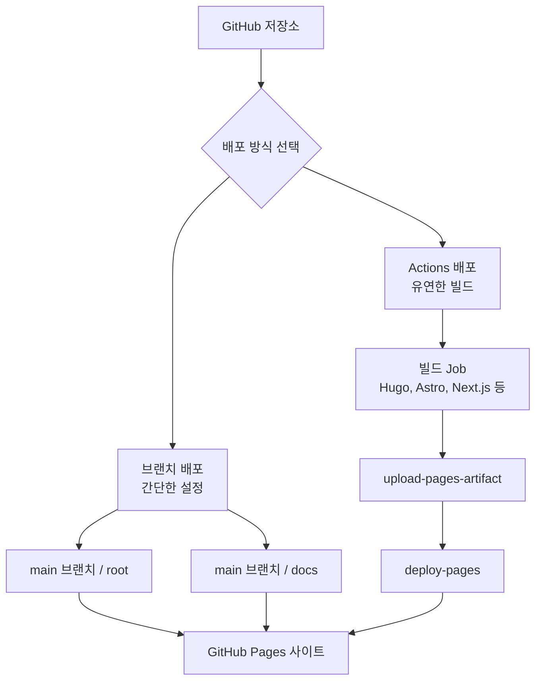
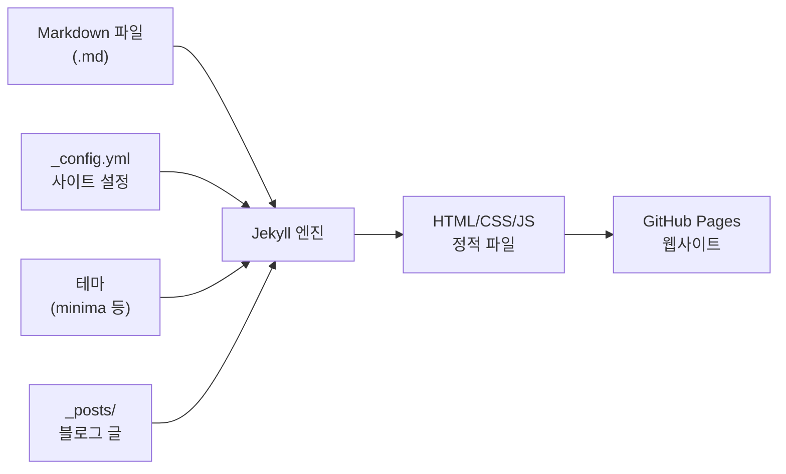
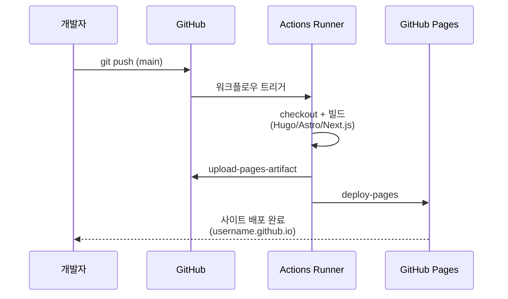
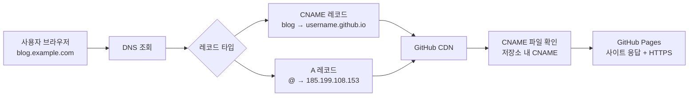

# GitHub Pages

> 정적 사이트 배포, Jekyll, 커스텀 도메인, Actions 연동

## 개요

CI/CD 파이프라인을 구축했으니, 이번에는 GitHub에서 제공하는 **무료 웹 호스팅** 서비스인 GitHub Pages를 배워봅시다. 블로그, 포트폴리오, 프로젝트 문서 사이트를 코드 push만으로 자동 배포할 수 있습니다.

**선수 지식**: [배포 자동화](./04-cd.md)의 CD 개념, [Markdown 작성법](../05-github-start/04-markdown.md)
**학습 목표**:
- GitHub Pages의 개념과 설정 방법을 이해한다
- Jekyll 기반 사이트를 만들고 배포한다
- 커스텀 도메인을 연결한다
- GitHub Actions로 정적 사이트를 자동 배포한다

## 왜 알아야 할까?

개발자에게 **자신만의 웹사이트**는 거의 필수입니다. 포트폴리오, 기술 블로그, 오픈소스 프로젝트 문서 — 이런 사이트를 별도 서버 없이, 무료로, Git push만으로 운영할 수 있다면 얼마나 좋을까요? GitHub Pages가 바로 그 해답입니다.

## 핵심 개념

### 개념 1: GitHub Pages란?

> 💡 **비유**: GitHub Pages는 **자동 전시관**입니다. 저장소에 작품(HTML, CSS, JS 파일)을 넣어두면, GitHub가 자동으로 전시관(웹사이트)을 열어주는 거죠. 별도의 건물(서버)을 빌릴 필요가 없습니다.

GitHub Pages는 GitHub 저장소의 파일을 **정적 웹사이트**로 호스팅하는 서비스입니다. HTML, CSS, JavaScript 파일을 올리면 자동으로 웹사이트가 됩니다.

| 특징 | 내용 |
|------|------|
| **비용** | 완전 무료 |
| **도메인** | `username.github.io` (커스텀 도메인 가능) |
| **HTTPS** | 자동 지원 (Let's Encrypt) |
| **용량** | 저장소당 1GB, 트래픽 월 100GB |
| **빌드** | Jekyll 내장, Actions로 모든 도구 사용 가능 |

### 개념 2: Pages 사이트 종류

GitHub Pages에는 두 가지 종류가 있습니다:

| 종류 | 저장소 이름 | URL | 용도 |
|------|------------|-----|------|
| **User/Org 사이트** | `username.github.io` | `https://username.github.io` | 개인/조직 대표 사이트 |
| **프로젝트 사이트** | 아무 이름 | `https://username.github.io/repo-name` | 프로젝트별 문서 사이트 |

### 개념 3: 배포 소스 설정

> 📊 **그림 1**: GitHub Pages 배포 방식 비교




GitHub Pages의 배포 소스를 설정하는 방법은 두 가지입니다:

**방법 1: 브랜치에서 배포** (간단)

저장소 Settings → Pages에서:
- Source: **Deploy from a branch**
- Branch: `main` (또는 `gh-pages`)
- Folder: `/ (root)` 또는 `/docs`

```bash
# docs 폴더에 정적 파일 배치
mkdir docs
echo "<h1>Hello, GitHub Pages!</h1>" > docs/index.html
git add docs/
git commit -m "docs: add GitHub Pages site"
git push
```

**방법 2: GitHub Actions로 배포** (유연)

저장소 Settings → Pages에서:
- Source: **GitHub Actions**

이 방법은 Jekyll뿐 아니라 Hugo, Next.js, Astro 등 **어떤 정적 사이트 생성기**든 사용할 수 있습니다.

### 개념 4: Jekyll — GitHub의 기본 정적 사이트 생성기

> 💡 **비유**: Jekyll은 **자동 제본기**입니다. 마크다운(원고)을 넣으면 예쁜 웹사이트(책)로 만들어줍니다. 디자인(테마)도 골라서 입힐 수 있죠.

Jekyll은 Markdown 파일을 HTML 웹사이트로 변환하는 도구입니다. GitHub Pages에 **내장**되어 있어서 별도 설치 없이 사용할 수 있습니다.

> 📊 **그림 2**: Jekyll 빌드 파이프라인




```bash
# Jekyll 사이트 기본 구조
mkdir my-blog && cd my-blog
git init

# _config.yml — 사이트 설정
cat > _config.yml << 'EOF'
title: "나의 기술 블로그"
description: "개발 경험과 배운 것들을 기록합니다"
theme: minima
url: "https://username.github.io"
baseurl: ""

# 한국어 설정
lang: ko
timezone: Asia/Seoul
EOF

# index.md — 메인 페이지
cat > index.md << 'EOF'
---
layout: home
title: Home
---

안녕하세요! 기술 블로그에 오신 것을 환영합니다.
EOF

# _posts/ — 블로그 글 (파일명 형식 중요!)
mkdir _posts
cat > _posts/2026-02-15-first-post.md << 'EOF'
---
layout: post
title: "첫 번째 블로그 글"
date: 2026-02-15
categories: blog
---

GitHub Pages로 만든 첫 번째 글입니다!

## Git을 배운 이야기

Git을 배우면서 가장 인상 깊었던 것은...
EOF
```

```bash
# push하면 자동으로 Jekyll 빌드 & 배포!
git add .
git commit -m "feat: initialize Jekyll blog"
git push
```

> ⚠️ **흔한 오해**: "Jekyll 블로그 글 파일명은 아무렇게나 해도 된다" — 반드시 `YYYY-MM-DD-title.md` 형식이어야 합니다. 이 규칙을 어기면 Jekyll이 포스트로 인식하지 못해요.

### 개념 5: GitHub Actions로 정적 사이트 배포

> 📊 **그림 3**: Actions 기반 Pages 배포 흐름




Jekyll 외의 도구(Hugo, Next.js, Astro 등)를 쓰고 싶다면 Actions를 사용합니다:

**Hugo 사이트 배포 예제:**

```yaml
# .github/workflows/pages.yml
name: Deploy to GitHub Pages

on:
  push:
    branches: [main]

permissions:
  contents: read
  pages: write
  id-token: write

concurrency:
  group: "pages"
  cancel-in-progress: false  # 배포 중 취소 방지

jobs:
  build:
    runs-on: ubuntu-latest
    steps:
      - uses: actions/checkout@v4
        with:
          submodules: true       # Hugo 테마 (서브모듈)

      - name: Setup Hugo
        uses: peaceiris/actions-hugo@v3
        with:
          hugo-version: 'latest'
          extended: true

      - name: Build
        run: hugo --minify

      - name: Upload artifact
        uses: actions/upload-pages-artifact@v4
        with:
          path: ./public

  deploy:
    needs: build
    runs-on: ubuntu-latest
    environment:
      name: github-pages
      url: ${{ steps.deployment.outputs.page_url }}
    steps:
      - name: Deploy to GitHub Pages
        id: deployment
        uses: actions/deploy-pages@v4
```

**Astro/Next.js/Vite 등 Node.js 기반 배포:**

```yaml
jobs:
  build:
    runs-on: ubuntu-latest
    steps:
      - uses: actions/checkout@v4
      - uses: actions/setup-node@v4
        with:
          node-version: '20'
          cache: 'npm'
      - run: npm ci
      - run: npm run build    # dist/ 또는 out/ 생성

      - uses: actions/upload-pages-artifact@v4
        with:
          path: ./dist         # 빌드 출력 디렉토리

  deploy:
    needs: build
    runs-on: ubuntu-latest
    environment:
      name: github-pages
      url: ${{ steps.deployment.outputs.page_url }}
    permissions:
      pages: write
      id-token: write
    steps:
      - uses: actions/deploy-pages@v4
        id: deployment
```

### 개념 6: 커스텀 도메인

> 📊 **그림 4**: 커스텀 도메인 연결 구조




`username.github.io` 대신 자신만의 도메인을 연결할 수 있습니다:

```bash
# 1. CNAME 파일 생성 (저장소 루트 또는 빌드 출력에)
echo "blog.example.com" > CNAME
git add CNAME
git commit -m "docs: add custom domain"
git push
```

DNS 설정 (도메인 관리 페이지에서):

| 레코드 타입 | 호스트 | 값 |
|------------|--------|-----|
| **CNAME** | `blog` | `username.github.io` |
| **A** (apex 도메인) | `@` | `185.199.108.153` |
| **A** | `@` | `185.199.109.153` |
| **A** | `@` | `185.199.110.153` |
| **A** | `@` | `185.199.111.153` |

```bash
# DNS 설정 확인
dig blog.example.com +short
```

```output
username.github.io.
185.199.108.153
```

저장소 Settings → Pages → Custom domain에서 도메인을 입력하고, **Enforce HTTPS**를 체크하면 자동으로 SSL 인증서가 발급됩니다.

> 🔥 **실무 팁**: 커스텀 도메인을 설정할 때 **CNAME 파일**을 꼭 저장소에 추가하세요. 이 파일이 없으면 배포할 때마다 커스텀 도메인 설정이 초기화될 수 있습니다.

## 실습: 포트폴리오 사이트 만들기

간단한 포트폴리오 사이트를 만들어봅시다:

```bash
# 1. 저장소 생성
gh repo create username.github.io --public --clone
cd username.github.io

# 2. 간단한 HTML 페이지
cat > index.html << 'EOF'
<!DOCTYPE html>
<html lang="ko">
<head>
  <meta charset="UTF-8">
  <meta name="viewport" content="width=device-width, initial-scale=1.0">
  <title>포트폴리오</title>
  <style>
    body { font-family: system-ui; max-width: 800px; margin: 0 auto; padding: 2rem; }
    h1 { color: #333; }
    .project { border: 1px solid #ddd; border-radius: 8px; padding: 1rem; margin: 1rem 0; }
  </style>
</head>
<body>
  <h1>안녕하세요! 👋</h1>
  <p>저는 Git을 사랑하는 개발자입니다.</p>

  <h2>프로젝트</h2>
  <div class="project">
    <h3>프로젝트 1</h3>
    <p>설명이 들어갑니다.</p>
  </div>
</body>
</html>
EOF

# 3. 배포!
git add index.html
git commit -m "feat: create portfolio site"
git push
```

1~2분 후 `https://username.github.io`에서 사이트를 확인할 수 있습니다!

```bash
# 배포 상태 확인
gh api repos/{owner}/username.github.io/pages --jq '.status'
```

```output
built
```

## 더 깊이 알아보기

### GitHub Pages의 역사

GitHub Pages는 **2008년** GitHub 초창기부터 제공된 서비스입니다. 공동 창업자 **Tom Preston-Werner**가 직접 만든 **Jekyll**(2008)을 GitHub Pages의 기본 빌드 도구로 채택했죠. Tom은 "블로깅은 해커처럼(Blogging Like a Hacker)"이라는 글에서 복잡한 CMS 대신 정적 사이트 생성기를 쓰자고 제안했는데, 이것이 정적 사이트 생성기 붐의 시작이었습니다.

2022년 GitHub은 Pages에 **GitHub Actions 배포**를 공식 지원하면서, Jekyll 외에도 Hugo, Next.js, Astro 등 어떤 도구든 사용할 수 있게 되었습니다. 이 변화로 GitHub Pages는 "Jekyll 전용"에서 "범용 정적 호스팅"으로 거듭났습니다.

### 정적 사이트 생성기 비교

| 도구 | 언어 | 빌드 속도 | 특징 |
|------|------|-----------|------|
| **Jekyll** | Ruby | 보통 | GitHub 내장, 블로그 특화 |
| **Hugo** | Go | 매우 빠름 | 대규모 사이트에 적합 |
| **Astro** | JS | 빠름 | 아일랜드 아키텍처, 최신 트렌드 |
| **Next.js** | JS | 보통 | 정적 내보내기 + React |
| **Docusaurus** | JS | 보통 | 문서 사이트 특화 (Meta) |

## 흔한 오해와 팁

> ⚠️ **흔한 오해**: "GitHub Pages는 서버 사이드 코드도 실행할 수 있다" — 아닙니다! GitHub Pages는 **정적 파일만** 호스팅합니다. PHP, Python, Node.js 서버 코드는 실행할 수 없어요. API가 필요하면 별도 서버나 서버리스 함수를 사용해야 합니다.

> 🔥 **실무 팁**: 프로젝트 문서 사이트를 만들 때는 **Docusaurus**(Meta) 또는 **VitePress**(Vue)를 추천합니다. 마크다운으로 문서를 작성하면 검색, 버전 관리, 다국어 지원이 자동으로 제공되거든요.

> 💡 **알고 계셨나요?**: GitHub Pages는 CDN(Content Delivery Network)을 통해 전 세계에 배포됩니다. 한국에서도 빠르게 접속할 수 있는 이유죠. 무료 서비스치고는 성능이 매우 좋습니다. 단, 브랜치 기반 배포는 **시간당 10회** 빌드 제한이 있습니다 (Actions 배포에는 이 제한이 없습니다).

## 핵심 정리

| 개념 | 설명 |
|------|------|
| **GitHub Pages** | GitHub 저장소 기반 무료 정적 사이트 호스팅 |
| **User 사이트** | `username.github.io` 저장소 → 대표 사이트 |
| **프로젝트 사이트** | 일반 저장소 → `username.github.io/repo` |
| **Jekyll** | GitHub 내장 정적 사이트 생성기 (Markdown → HTML) |
| **배포 소스** | 브랜치 배포 (간단) vs Actions 배포 (유연) |
| **커스텀 도메인** | CNAME 레코드 + CNAME 파일로 설정 |
| **HTTPS** | Let's Encrypt 자동 인증서 (무료) |
| **actions/deploy-pages** | Actions에서 Pages로 배포하는 공식 Action |

## 다음 섹션 미리보기

Ch10에서 GitHub Actions와 자동화의 세계를 탐험했습니다! CI/CD 파이프라인부터 GitHub Pages까지 — 이제 코드를 push하면 알아서 테스트하고, 빌드하고, 배포하는 워크플로우를 만들 수 있게 되었죠. 다음 챕터 [Ch11. 팀 협업과 도구](../11-team-tools/01-branch-naming.md)에서는 팀에서 Git을 효과적으로 사용하기 위한 **컨벤션, 문화, 도구**를 배웁니다. 브랜치 네이밍 규칙부터 GUI 도구 활용까지, 실무에서 바로 적용할 수 있는 내용입니다.

## 참고 자료

- [GitHub Docs — GitHub Pages](https://docs.github.com/ko/pages) - 공식 문서 전체 가이드
- [GitHub Docs — Actions로 Pages 배포](https://docs.github.com/ko/pages/getting-started-with-github-pages/configuring-a-publishing-source-for-your-github-pages-site) - Actions 배포 소스 설정
- [Jekyll 공식 문서](https://jekyllrb.com/docs/) - Jekyll 설정과 사용법
- [GitHub Docs — 커스텀 도메인](https://docs.github.com/ko/pages/configuring-a-custom-domain-for-your-github-pages-site) - DNS 설정 가이드
- [Tom Preston-Werner — Blogging Like a Hacker](https://tom.preston-werner.com/2008/11/17/blogging-like-a-hacker.html) - Jekyll 탄생의 원점
