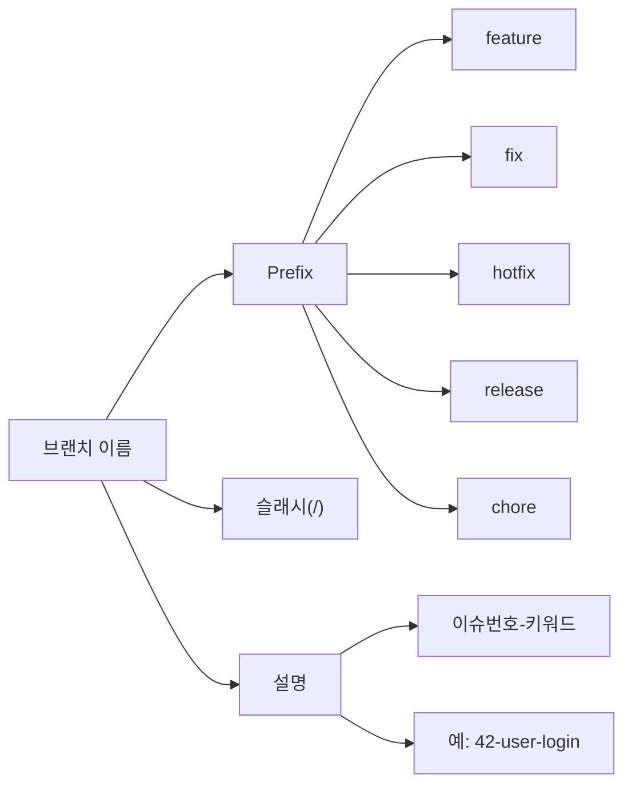
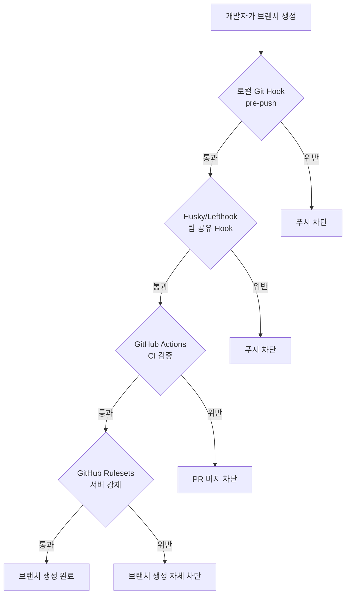
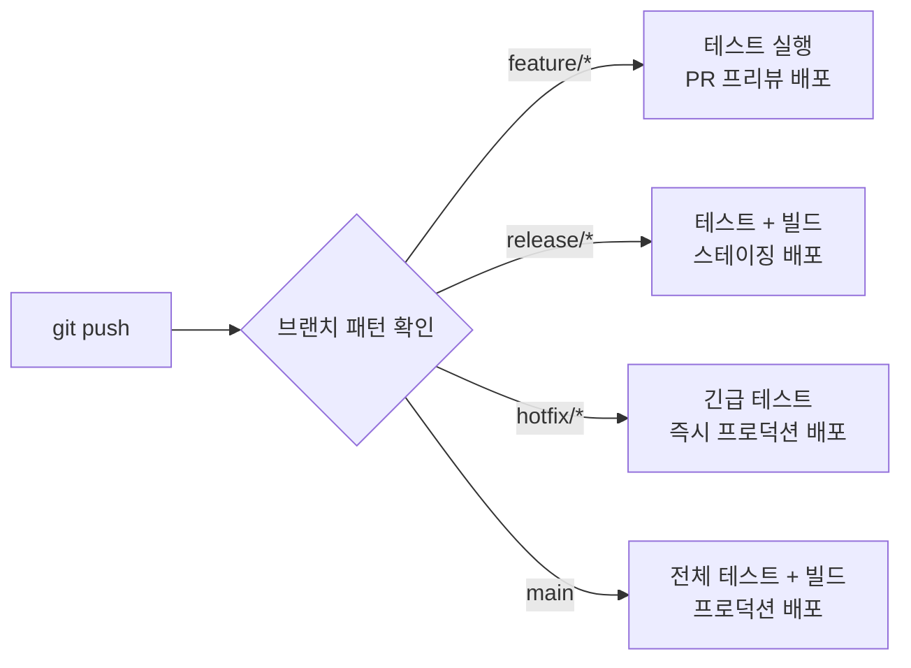

# 브랜치 네이밍 컨벤션

> 팀 브랜치 규칙, prefix 전략, 자동 검증

## 개요

혼자 개발할 때는 `test`, `my-branch`, `asdf` 같은 이름을 써도 문제가 없죠. 하지만 팀에서 이런 브랜치가 10개, 20개 쌓이면 어떤 브랜치가 무슨 작업인지 알 수 없게 됩니다. 이번 섹션에서는 팀에서 브랜치를 **체계적으로 관리**하기 위한 네이밍 규칙을 배웁니다.

**선수 지식**: [워크플로우 전략](../08-advanced-branch/04-workflow-strategies.md)에서 배운 Git Flow, GitHub Flow, Trunk-Based Development
**학습 목표**:
- 브랜치 네이밍 컨벤션의 필요성을 이해한다
- prefix 기반 네이밍 전략을 프로젝트에 적용할 수 있다
- Git Hook과 CI로 브랜치 이름을 자동 검증할 수 있다

## 왜 알아야 할까?

"이 브랜치 뭐 하는 거예요?" — 팀 채팅방에서 이 질문이 반복된다면, 브랜치 네이밍 규칙이 없다는 신호입니다. 좋은 브랜치 이름은 **코드를 읽지 않아도** 무슨 작업인지 알려줍니다.

실제로 대부분의 기업과 오픈소스 프로젝트에서는 브랜치 네이밍 규칙을 CONTRIBUTING.md나 위키에 명시합니다. CI/CD 파이프라인에서도 브랜치 이름을 기반으로 자동화를 구성하는 경우가 많거든요. 예를 들어 `release/*` 브랜치만 스테이징 환경에 배포하고, `feature/*` 브랜치는 PR 생성 시 프리뷰 환경을 만드는 식이죠.

## 핵심 개념

### 개념 1: 브랜치 이름의 기본 규칙

> 💡 **비유**: 브랜치 이름은 **택배 송장의 품목명**과 같습니다. "물건" 대신 "삼성 갤럭시 S25 케이스(화이트)"라고 적어야 분류도 빠르고 추적도 쉽죠. 브랜치도 `my-branch` 대신 `feature/user-login`이라고 적어야 팀원 모두가 한눈에 파악할 수 있습니다.

Git에서 브랜치 이름에는 몇 가지 **기술적 제약**이 있습니다:

| 규칙 | 설명 | 예시 |
|------|------|------|
| 공백 불가 | 공백 대신 `-` 또는 `_` 사용 | `user login` ❌ → `user-login` ✅ |
| `..` 불가 | 연속 점 두 개 사용 불가 | `feature..login` ❌ |
| ASCII 제어 문자 불가 | 특수 문자 최소화 | `feature/로그인` ⚠️ (동작하지만 비권장) |
| `/`로 시작/끝 불가 | 슬래시는 중간에만 | `/feature` ❌, `feature/` ❌ |
| `.lock`으로 끝 불가 | Git 내부 파일과 충돌 | `main.lock` ❌ |
| `~`, `^`, `:`, `?`, `*`, `[` 불가 | Git 참조 구문과 충돌 | `feature~1` ❌ |
| 최대 길이 | **244바이트** (GitHub 기준, `refs/heads/` 11바이트 제외) | 파일시스템 255바이트 제한에서 유래 |

```bash
# 유효한 브랜치 이름 확인
git check-ref-format --branch "feature/user-login"
# → 정상이면 이름 출력, 오류면 에러 메시지
```

```bash
# 잘못된 브랜치 이름 확인
git check-ref-format --branch "feature..login"
```

```error
fatal: 'feature..login' is not a valid branch name
```

### 개념 2: Prefix 전략 — 이름만 보고 목적을 파악

> 📊 **그림 1**: 브랜치 이름의 구조 — prefix/이슈번호-설명




가장 널리 쓰이는 방식은 **슬래시(`/`)로 구분되는 prefix 패턴**입니다. [워크플로우 전략](../08-advanced-branch/04-workflow-strategies.md)에서 배운 Git Flow의 브랜치 타입과 자연스럽게 연결되죠.

**표준 prefix 패턴**:

| Prefix | 용도 | 예시 |
|--------|------|------|
| `feature/` | 새로운 기능 개발 | `feature/user-auth` |
| `bugfix/` 또는 `fix/` | 버그 수정 | `fix/login-validation` |
| `hotfix/` | 긴급 프로덕션 수정 | `hotfix/payment-crash` |
| `release/` | 릴리스 준비 | `release/2.1.0` |
| `chore/` | 빌드, 설정, 의존성 등 | `chore/update-eslint` |
| `docs/` | 문서 변경 | `docs/api-guide` |
| `refactor/` | 리팩토링 | `refactor/auth-module` |
| `test/` | 테스트 관련 | `test/e2e-login` |
| `experiment/` 또는 `spike/` | 실험/조사 | `experiment/new-db` |

```bash
# 실전 예시: prefix를 활용한 브랜치 생성
git switch -c feature/user-profile
git switch -c fix/cart-total-calculation
git switch -c hotfix/critical-security-patch
git switch -c release/3.0.0
```

**prefix의 숨은 장점 — 자동 그룹핑**:

```bash
# prefix별 브랜치 필터링
git branch --list "feature/*"
```

```output
  feature/dark-mode
  feature/user-auth
  feature/user-profile
```

```bash
# 모든 bugfix 브랜치 확인
git branch --list "fix/*"
```

```output
  fix/cart-total
  fix/login-validation
```

### 개념 3: 이슈 트래커 연동 — 번호를 이름에 담기

팀에서 GitHub Issues, Jira, Linear 같은 이슈 트래커를 쓴다면, **이슈 번호를 브랜치 이름에 포함**하는 것이 매우 효과적입니다. [Issues 활용](../07-issues-projects/01-issues.md)에서 배운 것처럼, 이슈 번호는 작업의 고유 식별자 역할을 합니다.

**이슈 연동 네이밍 패턴**:

| 패턴 | 예시 | 설명 |
|------|------|------|
| `prefix/이슈번호-설명` | `feature/42-user-login` | 가장 보편적 |
| `prefix/이슈번호` | `feature/42` | 간결하지만 설명 부족 |
| `사용자명/prefix/이슈번호-설명` | `kim/feature/42-login` | 담당자까지 표시 |
| `JIRA키-설명` | `PROJ-123-user-login` | Jira 연동 |

```bash
# GitHub Issues 연동 — 가장 추천하는 패턴
git switch -c feature/156-social-login

# Jira 연동
git switch -c PROJ-789-payment-refund

# 담당자 포함 (대규모 팀)
git switch -c park/feature/42-dark-mode
```

> 🔥 **실무 팁**: GitHub에서 이슈 페이지의 **"Create a branch"** 버튼을 사용하면, 이슈 번호와 제목이 자동으로 포함된 브랜치 이름이 생성됩니다. 직접 타이핑할 필요가 없어서 실수도 줄고 규칙도 자연스럽게 지켜지죠.

### 개념 4: 워크플로우별 네이밍 전략

[워크플로우 전략](../08-advanced-branch/04-workflow-strategies.md)에서 배운 세 가지 전략마다 브랜치 네이밍도 달라집니다:

**Git Flow 네이밍**:

| 브랜치 | 네이밍 규칙 | 예시 |
|--------|-------------|------|
| 메인 | `main` (또는 `master`) | `main` |
| 개발 통합 | `develop` | `develop` |
| 기능 | `feature/설명` | `feature/user-auth` |
| 릴리스 | `release/버전` | `release/2.1.0` |
| 핫픽스 | `hotfix/설명` | `hotfix/xss-patch` |

**GitHub Flow 네이밍** (더 간단):

| 브랜치 | 네이밍 규칙 | 예시 |
|--------|-------------|------|
| 메인 | `main` | `main` |
| 작업 | `prefix/설명` 또는 `설명` | `feature/dark-mode`, `fix-typo` |

**Trunk-Based Development** (가장 간단):

| 브랜치 | 네이밍 규칙 | 예시 |
|--------|-------------|------|
| 트렁크 | `main` | `main` |
| 단기 작업 | `사용자명/설명` | `kim/add-cache` |
| 릴리스 | `release/버전` | `release/3.0` |

### 개념 5: 좋은 이름 vs 나쁜 이름

실제 팀에서 볼 수 있는 예시를 비교해볼까요?

| ❌ 나쁜 이름 | ✅ 좋은 이름 | 이유 |
|-------------|-------------|------|
| `test` | `feature/42-user-profile-api` | 목적, 이슈 번호 포함 |
| `my-branch` | `fix/login-empty-email` | 어떤 버그인지 명확 |
| `new` | `feature/oauth-google-login` | 무엇이 새로운지 구체적 |
| `fix` | `hotfix/payment-timeout` | 무엇을 수정하는지 구체적 |
| `asdf` | `docs/readme-install-guide` | 의미 있는 이름 |
| `feature/implement-new-user-authentication-system-with-oauth2-and-jwt-token` | `feature/78-oauth-jwt-auth` | 적정 길이, 이슈 번호로 상세 내용은 이슈에서 확인 |

> ⚠️ **흔한 오해**: "브랜치 이름은 길수록 상세해서 좋다" — 아닙니다! 브랜치 이름이 너무 길면 터미널에서 다루기 불편하고, 일부 도구에서 잘리기도 합니다. **20~50자** 정도가 적당하며, 상세한 내용은 이슈 트래커에 적으세요. 이슈 번호를 포함하면 이름은 짧아도 충분합니다.

## 실습: 브랜치 네이밍 자동 검증

> 📊 **그림 2**: 브랜치 이름 검증의 4단계 방어선




규칙을 정했으면, 이제 **자동으로 지켜지게** 만들어야 합니다. 규칙을 문서에 적어두기만 하면 반드시 어기는 사람이 나타나거든요. Git Hook과 CI를 활용한 자동 검증 방법을 알아봅시다.

### 방법 1: Git Hook으로 로컬 검증

```bash
# .git/hooks/pre-push 파일 생성 (로컬 훅)
#!/bin/bash
# 브랜치 이름 규칙 검증 스크립트

BRANCH_NAME=$(git symbolic-ref --short HEAD)

# 허용되는 패턴 정의
VALID_PATTERN="^(feature|fix|bugfix|hotfix|release|chore|docs|refactor|test|experiment)/[a-z0-9._-]+$"

# main, develop 브랜치는 예외
if [[ "$BRANCH_NAME" == "main" || "$BRANCH_NAME" == "develop" ]]; then
  exit 0
fi

if [[ ! "$BRANCH_NAME" =~ $VALID_PATTERN ]]; then
  echo "❌ 브랜치 이름이 규칙에 맞지 않습니다: '$BRANCH_NAME'"
  echo ""
  echo "올바른 형식: <prefix>/<설명>"
  echo "허용 prefix: feature, fix, bugfix, hotfix, release, chore, docs, refactor, test, experiment"
  echo "예시: feature/user-login, fix/cart-total"
  echo ""
  echo "자세한 규칙은 CONTRIBUTING.md를 참고하세요."
  exit 1
fi
```

```bash
# 훅 파일에 실행 권한 부여
chmod +x .git/hooks/pre-push
```

하지만 로컬 Git Hook은 `.git/hooks/` 디렉토리에 있어서 **버전 관리가 안 됩니다**. 팀원마다 따로 설정해야 하죠. 이 문제를 해결하는 것이 **Husky**(Node.js 프로젝트)와 **Lefthook**(언어 무관, Go 기반)입니다.

### 방법 2: Husky로 팀 공유 가능한 Hook

```bash
# Husky 설치 (Node.js 프로젝트)
npm install --save-dev husky

# Husky 초기화
npx husky init
```

```bash
# .husky/pre-push 파일 생성
#!/bin/sh

BRANCH_NAME=$(git symbolic-ref --short HEAD)
VALID_PATTERN="^(feature|fix|bugfix|hotfix|release|chore|docs|refactor|test|experiment)/[a-z0-9._-]+$"

# main, develop은 예외
if [ "$BRANCH_NAME" = "main" ] || [ "$BRANCH_NAME" = "develop" ]; then
  exit 0
fi

if ! echo "$BRANCH_NAME" | grep -qE "$VALID_PATTERN"; then
  echo "❌ 브랜치 이름이 규칙에 맞지 않습니다: '$BRANCH_NAME'"
  echo "올바른 형식: <prefix>/<설명>"
  exit 1
fi
```

### 방법 3: GitHub Actions로 서버 검증

로컬 훅은 우회할 수 있지만, CI는 우회할 수 없습니다. [Actions 시작하기](../10-github-actions/01-actions-intro.md)에서 배운 것처럼, 워크플로우로 브랜치 이름을 검증해봅시다:

```yaml
# .github/workflows/branch-name-check.yml
name: Branch Name Check

on:
  pull_request:
    types: [opened, synchronize]

jobs:
  check-branch-name:
    runs-on: ubuntu-latest
    steps:
      - name: Check branch name
        run: |
          BRANCH_NAME="${{ github.head_ref }}"
          VALID_PATTERN="^(feature|fix|bugfix|hotfix|release|chore|docs|refactor|test|experiment)/[a-z0-9._-]+$"

          # main, develop은 예외
          if [[ "$BRANCH_NAME" == "main" || "$BRANCH_NAME" == "develop" ]]; then
            echo "✅ 기본 브랜치: $BRANCH_NAME"
            exit 0
          fi

          if [[ ! "$BRANCH_NAME" =~ $VALID_PATTERN ]]; then
            echo "❌ 브랜치 이름이 규칙에 맞지 않습니다: '$BRANCH_NAME'"
            echo ""
            echo "올바른 형식: <prefix>/<설명>"
            echo "허용 prefix: feature, fix, bugfix, hotfix, release,"
            echo "             chore, docs, refactor, test, experiment"
            exit 1
          fi

          echo "✅ 브랜치 이름 확인 완료: $BRANCH_NAME"
```

> 🔥 **실무 팁**: **Branch Protection Rule**과 함께 사용하면 완벽합니다. [빌드와 테스트 자동화](../10-github-actions/03-ci.md)에서 배운 것처럼, `check-branch-name` 작업을 Required Status Check으로 설정하면 규칙을 어긴 브랜치의 PR은 머지할 수 없습니다.

### 방법 4: GitHub Rulesets (최신 방식)

GitHub은 2023년부터 **Repository Rulesets**를 도입했습니다. 별도의 CI 없이 **브랜치 이름 패턴을 강제**할 수 있어요:

1. 저장소 → **Settings** → **Rules** → **Rulesets** → **New ruleset**
2. **Branch** 타입 선택
3. **Branch name pattern** 추가: `feature/*`, `fix/*`, `release/*`
4. 패턴에 맞지 않는 브랜치 생성 자체를 차단

이 방법은 서버 측에서 동작하므로 로컬 설정이 필요 없고, 모든 팀원에게 자동 적용됩니다.

## 더 깊이 알아보기

### 브랜치 네이밍의 역사

브랜치 네이밍 컨벤션은 **Git Flow**와 함께 대중화되었습니다. 2010년 Vincent Driessen이 "A successful Git branching model"을 발표하면서 `feature/`, `release/`, `hotfix/` 같은 prefix 패턴이 사실상 표준이 되었죠.

흥미로운 점은 Git 자체에는 **브랜치 이름에 대한 규약이 전혀 없다**는 것입니다. Git은 브랜치를 단지 **커밋을 가리키는 포인터**로 취급하기 때문에([Git 내부 구조](../09-history-internals/05-git-internals.md)에서 배운 것처럼), 이름은 순전히 사람을 위한 것이에요. 그래서 팀마다 규칙이 다르고, "유일한 정답"은 없습니다 — 중요한 건 **팀이 하나의 규칙에 합의하는 것**이죠.

> 💡 **알고 계셨나요?**: `main` 브랜치의 이름도 역사가 있습니다. Git은 원래 `master`라는 이름을 기본으로 사용했는데, 2020년 인종차별적 함의에 대한 논의 끝에 GitHub, GitLab 등이 기본 브랜치 이름을 `main`으로 변경했습니다. 현재 Git 2.28+에서는 `git config --global init.defaultBranch main`으로 기본 이름을 설정할 수 있습니다.

### CI/CD와의 연계

브랜치 이름은 단순한 식별자를 넘어 **CI/CD 파이프라인의 트리거** 역할을 합니다:

> 📊 **그림 3**: 브랜치 패턴별 CI/CD 파이프라인 자동 분기




| 브랜치 패턴 | CI/CD 동작 |
|------------|-----------|
| `feature/*` | 테스트 실행, PR 프리뷰 배포 |
| `release/*` | 테스트 + 스테이징 환경 배포 |
| `hotfix/*` | 긴급 테스트 + 즉시 배포 파이프라인 |
| `main` | 프로덕션 배포 |

[배포 자동화](../10-github-actions/04-cd.md)에서 배운 Environment와 결합하면, 브랜치 이름만으로 어디에 배포할지가 자동으로 결정됩니다.

## 흔한 오해와 팁

> ⚠️ **흔한 오해**: "prefix에 슬래시(`/`)를 쓰면 디렉토리가 생겨서 문제가 된다" — Git은 내부적으로 refs를 디렉토리 구조로 저장하기 때문에 `feature/login`과 `feature`라는 브랜치가 동시에 존재할 수는 없습니다. 하지만 `feature/a`와 `feature/b`는 문제없이 공존합니다. prefix 패턴을 사용하면서 **prefix 자체를 브랜치 이름으로 쓰지 않으면** 됩니다.

> 🔥 **실무 팁**: 브랜치 이름에 **소문자와 하이픈(`-`)만** 사용하는 것을 추천합니다. 대문자는 macOS에서 대소문자를 구분하지 않아 충돌이 생길 수 있고, 언더스코어(`_`)보다 하이픈이 URL에서 더 자연스럽습니다.

> 💡 **알고 계셨나요?**: GitHub의 **"Create a branch" 기능**은 이슈 제목에서 자동으로 브랜치 이름을 생성합니다. 한글 이슈 제목도 영문으로 변환해주고, 특수 문자도 자동으로 제거합니다. 이슈 기반 개발 흐름에서 매우 편리한 기능이에요.

## 핵심 정리

| 개념 | 설명 |
|------|------|
| **Prefix 패턴** | `feature/`, `fix/`, `hotfix/` 등으로 브랜치 목적 표시 |
| **이슈 번호 포함** | `feature/42-user-login` — 추적과 자동화에 유리 |
| **Git 제약** | 공백, `..`, 특수문자(`~^:?*[`) 사용 불가 |
| **로컬 검증** | Git Hook(`pre-push`) 또는 Husky로 푸시 전 검증 |
| **서버 검증** | GitHub Actions 또는 Rulesets로 강제 |
| **소문자 + 하이픈** | `feature/user-login` 형태가 가장 보편적 |
| **적정 길이** | 20~50자 권장, 상세 내용은 이슈 트래커에 |

## 다음 섹션 미리보기

브랜치 이름에 규칙이 필요하듯이, **커밋 메시지**에도 규칙이 필요합니다. 다음 섹션 [커밋 메시지 컨벤션](./02-commit-convention.md)에서는 Conventional Commits 규약, commitlint로 메시지 검증, 자동 Changelog 생성까지 — 커밋 메시지를 **자동화의 출발점**으로 만드는 방법을 배웁니다.

## 참고 자료

- [Git Docs — git-check-ref-format](https://git-scm.com/docs/git-check-ref-format) - 브랜치 이름 규칙 공식 문서
- [GitHub Docs — Managing Rulesets](https://docs.github.com/en/repositories/configuring-branches-and-merges-in-your-repository/managing-rulesets) - Repository Rulesets 가이드
- [A successful Git branching model](https://nvie.com/posts/a-successful-git-branching-model/) - Vincent Driessen의 Git Flow 원문 (prefix 패턴의 원조)
- [Conventional Branch Naming](https://dev.to/couchcamote/git-branching-name-convention-cch) - 브랜치 네이밍 패턴 가이드
