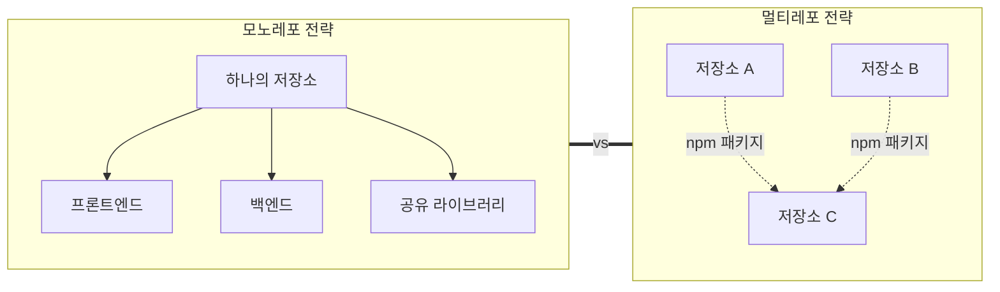
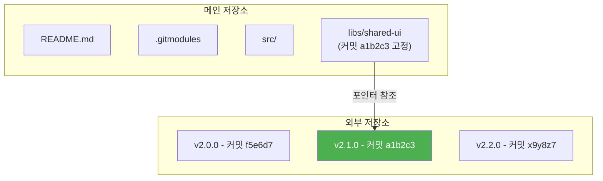
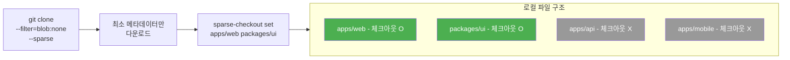
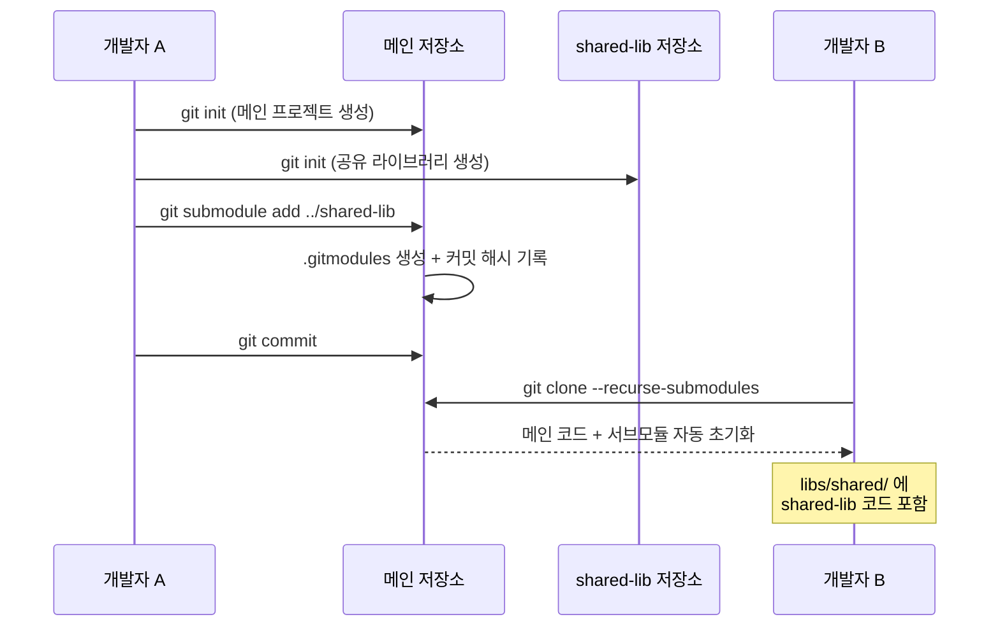

# 모노레포와 서브모듈

> monorepo vs multi-repo, submodule, subtree, 대규모 프로젝트

## 개요

프로젝트가 커지면 **"코드를 어떻게 구조화할 것인가?"**라는 질문이 생깁니다. 프론트엔드, 백엔드, 공통 라이브러리를 하나의 저장소에 넣을까, 각각 분리할까? 다른 팀의 라이브러리를 가져다 쓸 때 어떻게 관리할까? 이번 섹션에서는 **모노레포**, **멀티레포**, **서브모듈**, **서브트리** — 대규모 프로젝트의 저장소 전략을 배웁니다.

**선수 지식**: [원격 저장소 개념](../04-remote/01-remote-concept.md), [clone과 fork](../04-remote/02-clone-fork.md)에서 배운 원격 저장소 관리
**학습 목표**:
- 모노레포와 멀티레포의 차이와 장단점을 이해한다
- Git submodule의 기본 명령어와 워크플로우를 사용할 수 있다
- Git subtree와 submodule의 차이를 판별할 수 있다
- 프로젝트에 적합한 저장소 전략을 선택할 수 있다

## 왜 알아야 할까?

> 📊 **그림 1**: 모노레포 vs 멀티레포 — 저장소 전략 개관




스타트업이 성장하면 코드베이스도 커집니다. 처음에는 하나의 저장소에 모든 코드를 넣었는데, 팀이 10명, 20명으로 늘면서 문제가 생기기 시작합니다 — CI가 느려지고, 관련 없는 변경 알림이 쏟아지고, 배포 단위가 모호해지죠. 반대로 저장소를 너무 잘게 나누면 공통 코드 동기화, 버전 관리, 의존성 문제가 생깁니다.

Google, Meta, Microsoft 같은 빅테크 기업들이 왜 모노레포를 선택했는지, 반대로 Netflix, Amazon이 왜 멀티레포를 선호하는지 — 각각의 이유를 이해하면 여러분의 프로젝트에도 올바른 선택을 할 수 있습니다.

## 핵심 개념

### 개념 1: 모노레포 vs 멀티레포

> 💡 **비유**: **모노레포**는 **대형 백화점**과 같습니다. 의류, 식품, 전자제품이 한 건물에 있어서 관리가 일원화되고, 고객(개발자)은 한 곳에서 모든 것을 찾을 수 있죠. **멀티레포**는 **전문 매장 거리**와 같습니다. 각 매장이 독립적으로 운영되어 자율성이 높지만, 건물 간 이동(저장소 간 의존성)이 필요합니다.

**모노레포(Monorepo)**: 여러 프로젝트를 **하나의 저장소**에 관리

```
my-company/                    ← 하나의 Git 저장소
├── apps/
│   ├── web/                   ← 프론트엔드
│   ├── api/                   ← 백엔드 API
│   └── mobile/                ← 모바일 앱
├── packages/
│   ├── ui/                    ← 공유 UI 컴포넌트
│   ├── utils/                 ← 공유 유틸리티
│   └── config/                ← 공유 설정
└── package.json
```

**멀티레포(Multi-repo)**: 프로젝트별 **별도 저장소**

```
my-company-web/                ← 별도 Git 저장소
my-company-api/                ← 별도 Git 저장소
my-company-mobile/             ← 별도 Git 저장소
my-company-ui-lib/             ← 별도 Git 저장소
my-company-utils/              ← 별도 Git 저장소
```

**비교**:

| 기준 | 모노레포 | 멀티레포 |
|------|---------|---------|
| **코드 공유** | 직접 import (즉시 반영) | npm/패키지 매니저로 버전 관리 |
| **CI/CD** | 변경된 부분만 빌드 필요 (복잡) | 저장소별 독립 파이프라인 (단순) |
| **의존성** | 항상 최신 (강제 동기화) | 각자 버전 선택 (유연) |
| **팀 자율성** | 전사 규칙 공유 (일관성 ↑) | 팀별 독립 운영 (자율성 ↑) |
| **저장소 크기** | 커질 수 있음 (성능 이슈) | 작고 가벼움 |
| **Atomic 커밋** | 여러 프로젝트를 한 커밋으로 | 각 프로젝트별 별도 커밋 |
| **대표 기업** | Google, Meta, Microsoft, Uber | Netflix, Amazon, Spotify |

> ⚠️ **흔한 오해**: "Google이 모노레포를 쓰니까 모노레포가 더 좋다" — 꼭 그렇지 않습니다! Google은 자체 빌드 도구(Bazel), 코드 검색 엔진(Code Search), 가상 파일시스템(CitC) 등 **모노레포를 위한 전용 인프라**를 보유하고 있어요. 이런 도구 없이 모노레포를 도입하면 오히려 더 불편해질 수 있습니다.

### 개념 2: 모노레포 도구

일반적인 Git으로도 모노레포를 운영할 수 있지만, **빌드 최적화와 의존성 관리**를 위해 전용 도구를 사용하면 훨씬 효율적입니다.

| 도구 | 특징 | 주요 기능 |
|------|------|----------|
| **Nx** (v22.4) | Nrwl 개발, 범용 | 파일 수준 영향 분석, 원격 캐싱, 코드 생성, AI 모드 |
| **Turborepo** (v2.3+) | Vercel 개발, Rust 기반 | 원격 캐싱, 파이프라인 정의, 빠른 성능 |
| **Lerna** (v8) | 원조 도구 (Nx가 관리) | npm 패키지 퍼블리싱에 특화 |
| **Bazel** | Google 개발, 대규모 | 다국어 지원, 재현 가능한 빌드 |
| **pnpm workspaces** | 패키지 매니저 내장 | 빠른 설치, 디스크 절약 |

```bash
# Turborepo로 모노레포 시작
npx create-turbo@latest my-monorepo

# 프로젝트 구조 확인
cd my-monorepo && ls
```

```output
apps/     packages/     turbo.json     package.json
```

```json
// turbo.json — 빌드 파이프라인 정의
{
  "pipeline": {
    "build": {
      "dependsOn": ["^build"],
      "outputs": ["dist/**"]
    },
    "test": {
      "dependsOn": ["build"]
    },
    "lint": {}
  }
}
```

```bash
# 변경된 패키지만 빌드 (핵심 기능!)
npx turbo run build --filter=...[HEAD~1]
```

**GitHub Actions에서 모노레포 최적화** — [워크플로우 작성](../10-github-actions/02-workflow-yaml.md)에서 배운 경로 필터와 결합:

```yaml
# 프론트엔드가 변경될 때만 프론트엔드 CI 실행
name: Frontend CI
on:
  push:
    paths:
      - 'apps/web/**'
      - 'packages/ui/**'
      - 'packages/utils/**'
```

### 개념 3: Git Submodule — 다른 저장소를 참조

> 💡 **비유**: 서브모듈은 **책 속의 참고 문헌**과 같습니다. 책 본문에 "자세한 내용은 Smith(2020) 참조"라고 적어두면, 독자는 해당 논문을 찾아볼 수 있죠. 서브모듈도 마찬가지 — 메인 저장소에 "이 디렉토리는 다른 저장소를 참조"라고 기록해두고, 필요할 때 해당 저장소를 가져옵니다.

서브모듈은 **하나의 Git 저장소 안에 다른 Git 저장소**를 포함하는 기능입니다. 메인 프로젝트가 외부 라이브러리를 **특정 버전**으로 고정해서 사용할 때 유용합니다.

> 📊 **그림 2**: Git Submodule의 참조 구조




```bash
# 서브모듈 추가
git submodule add https://github.com/team/shared-ui.git libs/shared-ui
```

```output
Cloning into '/Users/you/project/libs/shared-ui'...
remote: Enumerating objects: 156, done.
remote: Counting objects: 100% (156/156), done.
```

```bash
# .gitmodules 파일이 자동 생성됨
cat .gitmodules
```

```output
[submodule "libs/shared-ui"]
	path = libs/shared-ui
	url = https://github.com/team/shared-ui.git
```

```bash
# 현재 서브모듈 상태 확인
git submodule status
```

```output
 a1b2c3d4e5f6 libs/shared-ui (v2.1.0)
```

**서브모듈 주요 명령어**:

| 명령어 | 설명 |
|--------|------|
| `git submodule add <url> <path>` | 서브모듈 추가 |
| `git submodule init` | 서브모듈 설정 초기화 (clone 후) |
| `git submodule update` | 서브모듈을 기록된 커밋으로 체크아웃 |
| `git submodule update --init --recursive` | 초기화 + 업데이트 (한 번에) |
| `git submodule update --remote` | 서브모듈을 원격 최신 커밋으로 업데이트 |
| `git submodule foreach <command>` | 모든 서브모듈에 명령 실행 |
| `git submodule deinit <path>` | 서브모듈 비활성화 |
| `git submodule sync` | URL 변경 후 동기화 |

**서브모듈이 있는 저장소 clone**:

```bash
# 방법 1: clone 후 초기화
git clone https://github.com/team/main-project.git
cd main-project
git submodule update --init --recursive

# 방법 2: clone 시 한 번에 (추천)
git clone --recurse-submodules https://github.com/team/main-project.git
```

**서브모듈 업데이트**:

```bash
# 서브모듈의 최신 커밋 가져오기
cd libs/shared-ui
git fetch
git switch main
git pull

# 상위 프로젝트로 돌아와서 변경 기록
cd ../..
git add libs/shared-ui
git commit -m "chore: shared-ui 서브모듈을 v2.2.0으로 업데이트"
```

> ⚠️ **흔한 오해**: "서브모듈을 업데이트하면 자동으로 최신 버전이 반영된다" — 아닙니다! 서브모듈은 **특정 커밋에 고정**됩니다. `git submodule update`는 메인 저장소에 기록된 커밋으로 체크아웃할 뿐이에요. 최신 버전을 가져오려면 `--remote` 옵션이 필요하고, 상위 프로젝트에서 **새 커밋을 만들어야** 반영됩니다.

### 개념 4: Git Subtree — 코드를 직접 포함

> 📊 **그림 3**: Submodule(참조) vs Subtree(복사) 동작 방식


> 💡 **비유**: 서브모듈이 "참고 문헌 링크"라면, 서브트리는 **"전문 인용"**입니다. 다른 논문의 내용을 내 논문에 직접 포함시키는 것처럼, 다른 저장소의 코드를 내 저장소의 히스토리에 직접 병합합니다.

```bash
# 서브트리 추가
git subtree add --prefix=libs/shared-ui \
  https://github.com/team/shared-ui.git main --squash
```

```bash
# 서브트리 업데이트 (원격 변경 가져오기)
git subtree pull --prefix=libs/shared-ui \
  https://github.com/team/shared-ui.git main --squash
```

```bash
# 서브트리 변경 사항을 원격에 다시 푸시
git subtree push --prefix=libs/shared-ui \
  https://github.com/team/shared-ui.git main
```

**Submodule vs Subtree 비교**:

| 기준 | Submodule | Subtree |
|------|-----------|---------|
| **저장 방식** | 참조(포인터)만 저장 | 코드를 직접 복사 |
| **clone** | `--recurse-submodules` 필요 | 추가 설정 불필요 |
| **버전 고정** | 특정 커밋에 고정 | 가져온 시점의 코드 |
| **히스토리** | 분리 (서브모듈 자체 히스토리) | 통합 (메인 히스토리에 포함) |
| **오프라인** | 서브모듈 fetch 필요 | 이미 코드가 있음 |
| **학습 곡선** | 높음 (독특한 워크플로우) | 낮음 (merge와 비슷) |
| **양방향 동기화** | 독립 저장소로 push 가능 | push 가능하지만 복잡 |
| **적합한 상황** | 활발히 개발되는 외부 라이브러리 | 가끔 동기화하는 공유 코드 |

> 🔥 **실무 팁**: **"간단하면 subtree, 정밀하면 submodule"**이 좋은 기준입니다. 외부 라이브러리를 특정 버전에 고정하고 독립적으로 관리해야 하면 submodule, 공유 코드를 프로젝트에 직접 포함하고 단순하게 관리하고 싶으면 subtree가 적합합니다.

### 개념 5: sparse-checkout으로 모노레포 부분 체크아웃

[clone과 fork](../04-remote/02-clone-fork.md)에서 잠깐 언급했던 sparse-checkout을 본격적으로 다뤄봅시다. 모노레포가 수 GB에 달하면 전체를 체크아웃할 필요가 없거든요:

> 📊 **그림 5**: sparse-checkout으로 필요한 부분만 체크아웃




```bash
# 1. 부분 clone (blob 없이 트리만)
git clone --filter=blob:none --sparse \
  https://github.com/company/monorepo.git
cd monorepo

# 2. cone 모드로 필요한 디렉토리만 추가
git sparse-checkout set apps/web packages/ui

# 3. 작업 디렉토리 확인 — 선택한 폴더만 존재
ls
```

```output
apps/     packages/
```

```bash
# 4. 나중에 추가 디렉토리가 필요하면
git sparse-checkout add apps/api

# 5. sparse-checkout 패턴 확인
git sparse-checkout list
```

```output
apps/web
apps/api
packages/ui
```

## 실습: 서브모듈 워크플로우 체험

> 📊 **그림 4**: 서브모듈 워크플로우 — 추가부터 팀원 clone까지




```bash
# 1. 메인 프로젝트 생성
mkdir main-project && cd main-project
git init
echo "# Main Project" > README.md
git add . && git commit -m "chore: 메인 프로젝트 초기화"

# 2. 공유 라이브러리 저장소 생성 (별도 디렉토리)
cd ..
mkdir shared-lib && cd shared-lib
git init
echo "export const VERSION = '1.0.0';" > index.js
git add . && git commit -m "feat: 공유 라이브러리 v1.0.0"

# 3. 메인 프로젝트에 서브모듈로 추가
cd ../main-project
git submodule add ../shared-lib libs/shared
git commit -m "chore: shared-lib 서브모듈 추가"

# 4. 서브모듈 상태 확인
git submodule status
```

```output
 abc1234 libs/shared (heads/main)
```

```bash
# 5. 다른 개발자가 이 프로젝트를 clone하는 상황 시뮬레이션
cd ..
git clone --recurse-submodules main-project main-project-clone
cd main-project-clone/libs/shared
cat index.js
```

```output
export const VERSION = '1.0.0';
```

## 더 깊이 알아보기

### Google의 모노레포 이야기

Google은 세계 최대의 모노레포를 운영하고 있습니다. 2015년 기준으로 **20억 줄의 코드**가 하나의 저장소에 들어있었고, 4만 명 이상의 개발자가 하루에 **4만 5천 건의 커밋**을 합니다. 물론 Git이 아닌 자체 버전 관리 시스템 **Piper**를 사용하지만, 모노레포의 장점을 극대화한 사례죠.

흥미로운 점은 Google 내부에서도 모노레포에 대한 **반대 의견**이 있었다는 것입니다. 2016년 Rachel Potvin의 논문 "Why Google Stores Billions of Lines of Code in a Single Repository"에서는 모노레포의 장점과 함께 **단점**(빌드 시간, 도구 복잡성, 새 직원 온보딩)도 솔직하게 다루었습니다. "은탄환은 없다"는 소프트웨어 공학의 진리가 여기에도 적용되는 것이죠.

> 💡 **알고 계셨나요?**: Git submodule은 Git 1.5.3(2007년)에 처음 도입되었습니다. 처음에는 사용법이 매우 불편해서 "Git의 최대 실수"라는 비판도 있었죠. 하지만 이후 `git submodule update --init --recursive`, `git clone --recurse-submodules` 같은 편의 명령이 추가되면서 점차 개선되었습니다.

## 흔한 오해와 팁

> ⚠️ **흔한 오해**: "모노레포 = 모놀리식(monolithic)" — 전혀 다른 개념입니다! 모노레포는 **코드 저장** 방식이고, 모놀리식은 **아키텍처** 방식입니다. 모노레포 안에 마이크로서비스를 넣을 수도 있고, 멀티레포에 모놀리식 앱을 넣을 수도 있어요. Google, Meta, Uber의 모노레포에는 수천 개의 독립적인 마이크로서비스가 들어있습니다.

> 🔥 **실무 팁**: 서브모듈을 사용하는 프로젝트에서 가장 흔한 실수는 `git pull` 후 **서브모듈을 업데이트하지 않는 것**입니다. 다음 Git 설정을 추가하면 `git pull` 시 서브모듈도 자동 업데이트됩니다:

```bash
# submodule 자동 업데이트 설정
git config --global submodule.recurse true
```

> 🔥 **실무 팁**: Git v2.38부터 내장된 **Scalar** 명령은 대규모 저장소의 성능을 자동으로 최적화합니다. Microsoft가 Windows 개발을 위해 만든 도구가 Git 코어에 통합된 것이죠:

```bash
# Scalar로 대규모 저장소 clone (모든 최적화 자동 적용)
scalar clone https://github.com/org/large-repo.git

# 기존 저장소에 자동 유지보수 활성화
git maintenance start
```

## 핵심 정리

| 개념 | 설명 |
|------|------|
| **모노레포** | 여러 프로젝트를 하나의 저장소에 관리 |
| **멀티레포** | 프로젝트별 별도 저장소 |
| **모노레포 도구** | Nx, Turborepo, Lerna, Bazel |
| **Submodule** | 다른 저장소를 참조(포인터)로 포함 |
| **Subtree** | 다른 저장소의 코드를 직접 포함 |
| **sparse-checkout** | 모노레포에서 필요한 디렉토리만 체크아웃 |
| **git maintenance** | 대규모 저장소 자동 성능 최적화 |

## 다음 섹션 미리보기

지금까지 팀의 프로세스(네이밍, 커밋, 리뷰)와 구조(모노레포, 서브모듈)를 배웠습니다. 마지막 섹션 [GUI 도구 활용](./05-gui-tools.md)에서는 지금까지 CLI로 배운 모든 것을 **시각적으로** 다루는 GUI 도구를 살펴봅니다. VS Code, GitKraken, Fork — 어떤 도구가 어떤 상황에 적합한지, CLI와 GUI를 어떻게 조합하면 좋은지 알아봅시다.

## 참고 자료

- [Pro Git Book — Git Submodules](https://git-scm.com/book/en/v2/Git-Tools-Submodules) - 서브모듈 공식 가이드
- [Pro Git Book — Git Subtree](https://git-scm.com/book/en/v2/Git-Tools-Subtree-Merging) - 서브트리 가이드
- [Turborepo Docs](https://turbo.build/repo/docs) - Turborepo 공식 문서
- [Nx Docs](https://nx.dev) - Nx 공식 문서
- [Rachel Potvin — Why Google Stores Billions of Lines of Code in a Single Repository](https://research.google/pubs/pub45424/) - Google 모노레포 논문
- [GitHub Docs — sparse-checkout](https://git-scm.com/docs/git-sparse-checkout) - 부분 체크아웃 공식 문서
