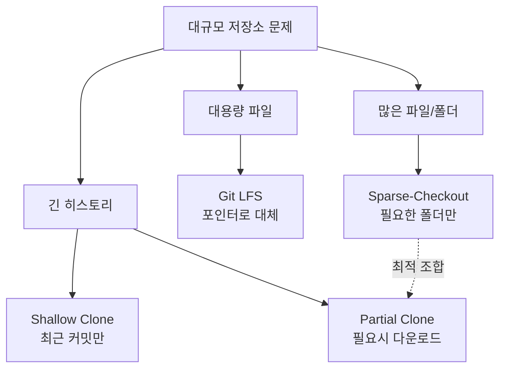
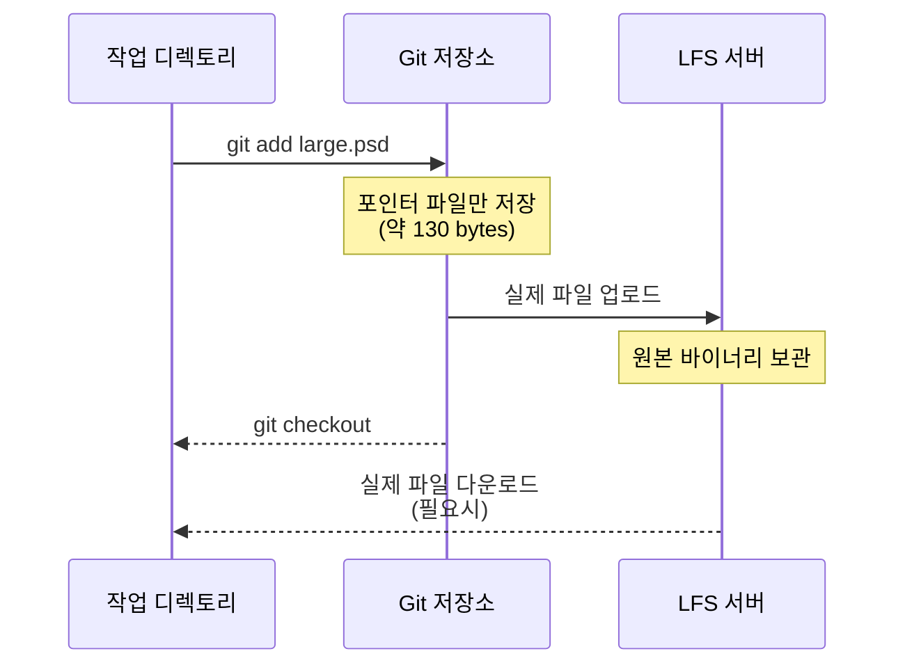
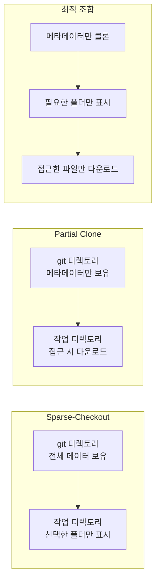
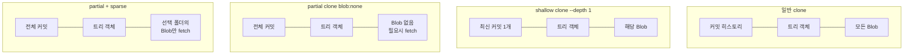

# 대규모 저장소 관리

> Git LFS, sparse-checkout, shallow clone, partial clone

## 개요

프로젝트가 성장하면 저장소도 커집니다. 수만 개의 파일, 수 GB의 히스토리, 대용량 바이너리 파일까지 — 일반적인 `git clone`으로는 몇십 분이 걸릴 수도 있죠. 이번 섹션에서는 대규모 저장소를 **빠르고 효율적으로** 다루는 네 가지 핵심 전략을 배웁니다.

**선수 지식**: [Git 내부 구조](../09-history-internals/05-git-internals.md)에서 배운 객체와 packfile 개념
**학습 목표**:
- Git LFS로 대용량 바이너리 파일을 효율적으로 관리할 수 있다
- sparse-checkout으로 필요한 디렉토리만 체크아웃할 수 있다
- shallow clone과 partial clone의 차이를 이해하고 적절히 활용할 수 있다

## 왜 알아야 할까?

> 📊 **그림 1**: 대규모 저장소 관리 전략 개관




Microsoft의 Windows 저장소는 **300GB**에 350만 개의 파일을 포함하고 있습니다. Google의 모노레포는 무려 **80TB 이상**이죠. 이런 규모에서 일반적인 Git 명령어는 사실상 사용 불가능합니다. 하지만 여러분의 프로젝트도 예외는 아닙니다 — 디자인 에셋, 빌드 아티팩트, ML 모델 파일이 쌓이면 어느 순간 `git clone`이 느려지기 시작합니다. 그때가 바로 이 도구들이 필요한 순간입니다.

## 핵심 개념

### 개념 1: Git LFS — 대용량 파일의 해결사

> 💡 **비유**: 일반 택배로 대형 가전을 보내면 비용도 높고 느리죠. 대형 화물은 **전용 물류 서비스**로 따로 보내고, 송장(포인터)만 일반 택배에 넣는 것이 Git LFS의 원리입니다.

Git LFS(Large File Storage)는 대용량 파일을 별도 서버에 저장하고, 저장소에는 가벼운 **포인터 파일**만 남깁니다.

> 📊 **그림 2**: Git LFS 동작 흐름




```bash
# Git LFS 설치
# macOS
brew install git-lfs

# Windows
winget install GitHub.GitLFS

# Linux (Ubuntu/Debian)
sudo apt install git-lfs
```

```bash
# LFS 초기화 (저장소별 한 번만)
git lfs install

# 대용량 파일 유형 등록
git lfs track "*.psd"
git lfs track "*.mp4"
git lfs track "*.zip"

# .gitattributes에 자동으로 추가됨
cat .gitattributes
```

```output
*.psd filter=lfs diff=lfs merge=lfs -text
*.mp4 filter=lfs diff=lfs merge=lfs -text
*.zip filter=lfs diff=lfs merge=lfs -text
```

```bash
# LFS로 추적 중인 파일 확인
git lfs ls-files

# 사용하지 않는 LFS 객체 정리
git lfs prune
```

> 🔥 **실무 팁**: 소스 코드나 텍스트 파일은 LFS로 추적하지 마세요. LFS는 diff가 불가능한 **바이너리 파일**(이미지, 동영상, 모델 파일 등)에만 사용하는 것이 좋습니다.

### 개념 2: Shallow Clone — 히스토리 없이 빠르게

> 💡 **비유**: 도서관에서 백과사전 전체를 빌리는 대신, **최신판 한 권만** 빌리는 것과 같습니다. 과거 역사는 필요할 때 나중에 가져오면 되니까요.

```bash
# 최근 커밋 1개만 클론 (가장 빠름)
git clone --depth 1 https://github.com/example/repo.git

# 최근 5개 커밋만 클론
git clone --depth 5 https://github.com/example/repo.git

# 특정 브랜치만 shallow clone
git clone --depth 1 --branch main --single-branch https://github.com/example/repo.git
```

**히스토리가 필요해지면:**

```bash
# 전체 히스토리 가져오기
git fetch --unshallow

# 점진적으로 깊이 확장
git fetch --deepen 10
```

| 저장소 | 일반 clone | `--depth 1` | 개선율 |
|--------|-----------|-------------|--------|
| Linux 커널 (7.5GB) | 6분 29초 | 46초 | 88% |
| Chromium (60.9GB) | 95분 | 6분 41초 | 93% |

### 개념 3: Sparse-Checkout — 필요한 폴더만 체크아웃

> 💡 **비유**: 대형 마트에 가서 과일 코너만 방문하는 것과 같습니다. 마트 전체를 돌아다닐 필요 없이, 필요한 코너만 쏙 들러서 장을 보는 거죠.

모노레포에서 자신이 담당하는 디렉토리만 체크아웃할 때 유용합니다.

```bash
# sparse-checkout 초기화 (cone 모드 권장)
git sparse-checkout init --cone

# 필요한 디렉토리만 설정
git sparse-checkout set frontend shared-libs

# 추가 디렉토리 포함
git sparse-checkout add docs

# 현재 설정 확인
git sparse-checkout list
```

```output
frontend
shared-libs
docs
```

```bash
# 전체 파일로 복원
git sparse-checkout disable
```

> ⚠️ **흔한 오해**: sparse-checkout은 파일을 **다운로드하지 않는 것이 아닙니다**. `.git` 안에는 전체 데이터가 있고, 작업 디렉토리에 보여줄 파일만 선택하는 것입니다. 진짜 다운로드를 줄이려면 partial clone과 함께 사용하세요.

> 📊 **그림 3**: Sparse-Checkout vs Partial Clone 비교




### 개념 4: Partial Clone — 필요할 때만 다운로드

```bash
# blob 없이 클론 (메타데이터만 다운로드)
git clone --filter=blob:none https://github.com/example/repo.git

# 5MB 이상 파일만 제외
git clone --filter=blob:limit=5m https://github.com/example/repo.git

# 최적 조합: partial clone + sparse-checkout
git clone --filter=blob:none --sparse https://github.com/example/repo.git
cd repo
git sparse-checkout set backend frontend
```

| 필터 | 효과 | 적합한 상황 |
|------|------|-------------|
| `blob:none` | 모든 파일 내용 제외, 필요시 다운로드 | 대형 모노레포 |
| `blob:limit=<크기>` | 지정 크기 이상만 제외 | 대용량 파일이 일부 있는 저장소 |
| `tree:0` | 디렉토리 트리도 제외 | 극단적 대역폭 절약 |

> 📊 **그림 4**: 클론 방식별 다운로드 범위




## 실습: 직접 해보기

```bash
# Git 공식 저장소로 shallow clone 실습
git clone --depth 1 https://github.com/git/git.git git-shallow
cd git-shallow

# 히스토리 확인 (1개 커밋만 보임)
git log --oneline
# → 최신 커밋 1개만 표시

# 히스토리 확장
git fetch --deepen 5
git log --oneline
# → 6개 커밋 표시

# sparse-checkout 실습
git sparse-checkout init --cone
git sparse-checkout set Documentation

# Documentation 폴더만 보이는지 확인
ls
```

## 더 깊이 알아보기

Microsoft는 Windows 저장소를 Git으로 관리하기 위해 **VFS for Git(구 GVFS)**을 개발했습니다. 이 프로젝트에서 나온 기술들이 후에 Git 본체에 통합되어 sparse-checkout의 cone 모드, partial clone, 그리고 **Scalar** 도구가 탄생했죠. Scalar는 이제 Git 2.38부터 공식 번들에 포함되어 있으며, `scalar clone` 한 줄로 대규모 저장소에 최적화된 설정을 자동 적용합니다.

Git 2.40에서는 `git maintenance` 명령어가 안정화되어, 백그라운드에서 자동으로 저장소 최적화(prefetch, commit-graph, incremental-repack 등)를 수행합니다.

```bash
# 백그라운드 자동 유지보수 시작
git maintenance start

# 유지보수 전략을 incremental로 설정 (대규모 저장소 권장)
git config maintenance.strategy incremental
```

## 흔한 오해와 팁

> ⚠️ **흔한 오해**: "shallow clone은 push할 수 없다" — Git 2.11부터 shallow clone에서도 push가 가능합니다. 단, 일부 원격 저장소 설정에서는 거부될 수 있으니 `git fetch --unshallow` 후 push하는 것이 안전합니다.

> 🔥 **실무 팁**: CI/CD 파이프라인에서는 `--depth 1`이 기본이어야 합니다. GitHub Actions에서는 `actions/checkout`의 `fetch-depth: 1`이 이미 기본값이에요.

> 💡 **알고 계셨나요?**: Git LFS는 GitHub에서 무료 계정 기준 **1GB 스토리지**와 월 **1GB 대역폭**을 제공합니다. 그 이상은 데이터 팩을 구매해야 합니다.

## 핵심 정리

| 도구 | 해결하는 문제 | 핵심 명령어 |
|------|-------------|------------|
| Git LFS | 대용량 바이너리 파일 | `git lfs track "*.psd"` |
| Shallow Clone | 느린 클론 속도 | `git clone --depth 1` |
| Sparse-Checkout | 불필요한 파일 체크아웃 | `git sparse-checkout set <dir>` |
| Partial Clone | 불필요한 다운로드 | `git clone --filter=blob:none` |
| Scalar | 종합 최적화 | `scalar clone <url>` |

## 다음 섹션 미리보기

대규모 저장소를 효율적으로 다루는 방법을 배웠습니다. 다음 섹션에서는 코드에 버그가 숨어 있을 때, [Bisect와 디버깅](./03-bisect-debug.md)에서 **git bisect**로 원인 커밋을 자동으로 찾아내는 디버깅 기법을 알아봅니다.

## 참고 자료

- [Git LFS 공식 사이트](https://git-lfs.com/) - 설치 가이드와 튜토리얼
- [Pro Git Book - Git Internals](https://git-scm.com/book/en/v2/Git-Internals-Plumbing-and-Porcelain) - Git 내부 동작 원리
- [Git Sparse-Checkout 문서](https://git-scm.com/docs/git-sparse-checkout) - 공식 sparse-checkout 레퍼런스
- [GitHub Blog - Get up to speed with partial clone](https://github.blog/open-source/git/get-up-to-speed-with-partial-clone-and-shallow-clone/) - partial clone 실전 가이드
