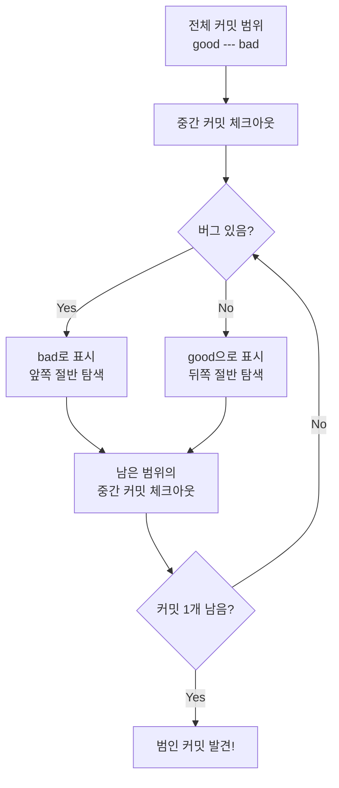
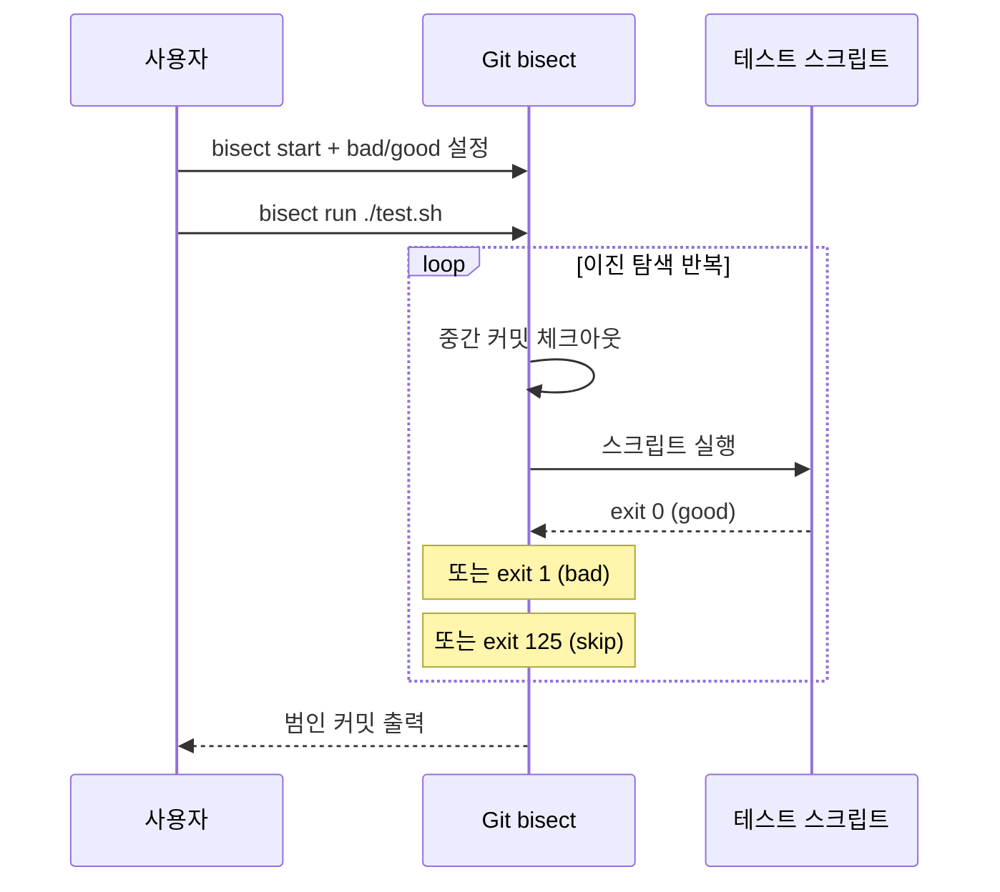
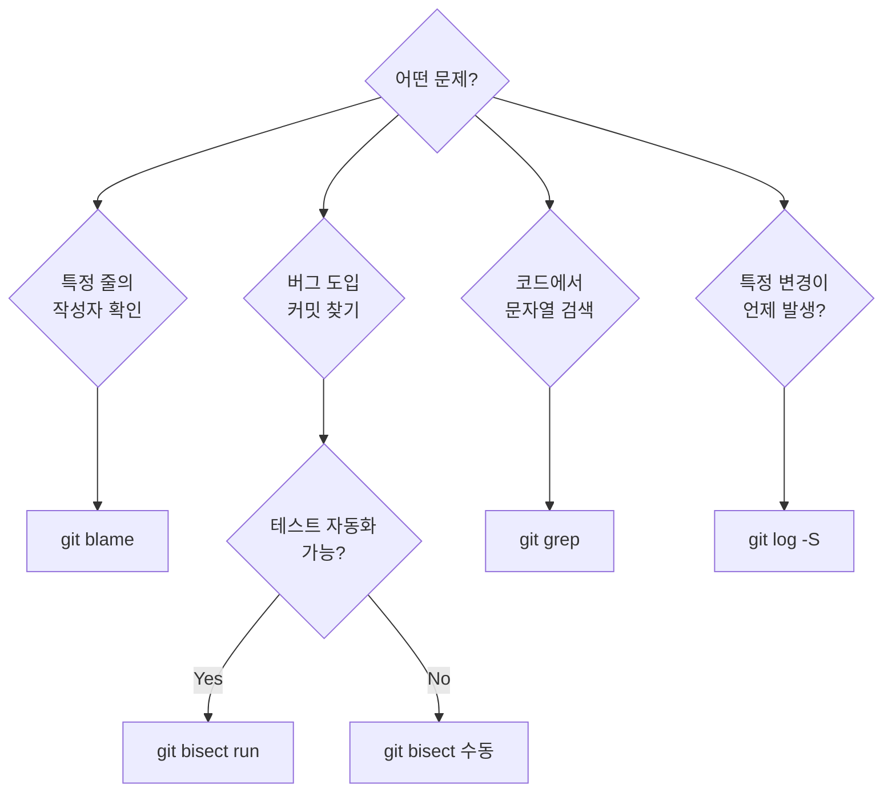

# Bisect와 디버깅

> git bisect로 버그 원점 찾기, 자동화 스크립트

## 개요

"어제까지는 됐는데, 오늘 갑자기 안 돼요." — 개발자라면 이런 상황을 자주 겪죠. 수백 개의 커밋 중 어디서 버그가 들어왔는지 하나하나 확인할 수는 없습니다. 이럴 때 **git bisect**가 **이진 탐색**으로 원인 커밋을 자동 찾아줍니다.

**선수 지식**: [히스토리 탐색](../02-file-history/03-log-exploration.md)에서 배운 git log와 blame 기본 사용법
**학습 목표**:
- git bisect로 버그를 도입한 커밋을 빠르게 찾을 수 있다
- bisect run으로 디버깅 과정을 완전 자동화할 수 있다
- git blame과 git grep을 활용한 코드 추적 기법을 익힌다

## 왜 알아야 할까?

1,000개의 커밋 중에서 버그 원인을 찾아야 한다면, 하나씩 확인하면 최대 1,000번이 필요합니다. 하지만 이진 탐색을 사용하면 단 **10번**만에 찾을 수 있죠 (log₂1000 ≈ 10). `git bisect`는 이 알고리즘을 Git에 적용한 것으로, **가장 과소평가된 디버깅 도구** 중 하나입니다.

## 핵심 개념

### 개념 1: git bisect — 이진 탐색으로 버그 사냥

> 💡 **비유**: 1,000페이지짜리 사전에서 단어를 찾는다고 상상해보세요. 첫 페이지부터 읽지 않고, 500페이지를 펼쳐서 "앞인지 뒤인지" 판단하죠. 그 다음은 250 또는 750... 이렇게 **절반씩 좁혀나가면** 단 10번 만에 찾을 수 있습니다. git bisect가 정확히 이 원리입니다.

> 📊 **그림 1**: git bisect 이진 탐색 과정 — 커밋 범위를 절반씩 좁혀나가는 흐름




```bash
# 1. bisect 시작
git bisect start

# 2. 현재 상태가 "나쁨" (버그 있음) 표시
git bisect bad

# 3. 버그가 없던 커밋을 "좋음"으로 표시
git bisect good v1.0.0
# 또는 커밋 해시 사용: git bisect good abc1234
```

```output
Bisecting: 50 revisions left to test after this (roughly 6 steps)
[d4e5f6a] Update user authentication module
```

```bash
# 4. Git이 체크아웃한 커밋에서 버그 확인
# 버그가 있으면:
git bisect bad
# 버그가 없으면:
git bisect good

# 5. 반복... Git이 범인을 찾아줌
```

```output
abc1234 is the first bad commit
commit abc1234
Author: developer@example.com
Date:   Mon Feb 10 14:30:00 2026

    Refactor login validation
```

```bash
# 6. 완료 후 원래 브랜치로 복귀
git bisect reset
```

### 개념 2: bisect run — 완전 자동화

> 📊 **그림 2**: bisect run 자동화 흐름 — 스크립트가 good/bad 판단을 대신 수행




수동으로 good/bad를 판단하는 대신, **테스트 스크립트**로 자동화할 수 있습니다.

```bash
# 테스트 스크립트 작성
cat > /tmp/test-bug.sh << 'EOF'
#!/bin/bash
# 테스트 실행 — 성공(exit 0) = good, 실패(exit 1) = bad
npm test -- --grep "login validation"
EOF
chmod +x /tmp/test-bug.sh

# bisect run으로 자동 탐색
git bisect start
git bisect bad HEAD
git bisect good v1.0.0
git bisect run /tmp/test-bug.sh
```

```output
running /tmp/test-bug.sh
...
abc1234 is the first bad commit
bisect run success
```

> 🔥 **실무 팁**: 스크립트의 exit 코드가 중요합니다. `0`은 good, `1~124`와 `126~127`은 bad, **`125`**는 "이 커밋은 테스트할 수 없으니 건너뛰기(skip)"를 의미합니다.

### 개념 3: bisect 고급 기능

**커스텀 용어 사용:**

```bash
# "good/bad" 대신 의미 있는 용어 사용
git bisect start --term-old fast --term-new slow
git bisect slow HEAD
git bisect fast v1.0.0
# 성능 저하의 원인 커밋 찾기에 유용
```

**실수 수정 — log와 replay:**

```bash
# 지금까지의 bisect 기록 확인
git bisect log

# 실수로 잘못 표시한 경우, 로그를 파일로 저장 후 수정
git bisect log > /tmp/bisect-log.txt
# 잘못된 줄을 편집한 후:
git bisect reset
git bisect replay /tmp/bisect-log.txt
```

**특정 커밋 건너뛰기:**

```bash
# 빌드가 깨진 커밋 건너뛰기
git bisect skip

# 범위 건너뛰기
git bisect skip v2.5..v2.6
```

### 개념 4: git blame — 줄 단위 추적

> 💡 **비유**: 공동 문서에서 "이 문장 누가 썼어?"를 확인하는 것과 같습니다. Google Docs의 수정 기록처럼, Git blame은 파일의 모든 줄에 대해 **누가, 언제, 어떤 커밋에서** 마지막으로 수정했는지 보여줍니다.

```bash
# 파일의 각 줄이 누구에 의해 수정되었는지 확인
git blame src/auth/login.js

# 특정 줄 범위만 확인
git blame -L 10,20 src/auth/login.js

# 코드 이동을 추적 (다른 파일에서 복사된 코드도 원본 추적)
git blame -C -C src/auth/login.js

# 공백 변경 무시
git blame -w src/auth/login.js
```

### 개념 5: git grep — 코드 검색

```bash
# 현재 코드에서 문자열 검색
git grep "TODO"

# 특정 커밋 시점에서 검색
git grep "deprecated" v2.0.0

# 함수 정의 찾기
git grep -n "function authenticate"

# 특정 파일 유형에서만 검색
git grep "API_KEY" -- "*.js" "*.ts"
```

### 개념 6: git log 디버깅 기법

```bash
# 특정 문자열이 추가/삭제된 커밋 찾기 (pickaxe)
git log -S "buggyFunction" --oneline

# 정규식으로 검색
git log -G "password\s*=" --oneline

# 특정 파일의 특정 함수 히스토리 추적
git log -L :authenticate:src/auth.js

# 특정 기간의 커밋만 확인
git log --after="2026-02-01" --before="2026-02-15" --oneline
```

## 실습: 직접 해보기

```bash
# bisect 실습용 저장소 만들기
mkdir bisect-lab && cd bisect-lab
git init

# 정상 커밋 5개 생성
for i in {1..5}; do
  echo "version $i" > app.txt
  echo "function login() { return true; }" > login.js
  git add -A && git commit -m "v$i: normal update"
done

# 버그 도입 (6번째 커밋)
echo "function login() { return false; }" > login.js
git add -A && git commit -m "v6: refactor login"

# 이후 정상 커밋 4개 추가 (버그는 그대로)
for i in {7..10}; do
  echo "version $i" >> app.txt
  git add -A && git commit -m "v$i: feature update"
done

# bisect로 버그 찾기
git bisect start
git bisect bad HEAD
git bisect good HEAD~9

# Git이 중간 커밋을 체크아웃함
# login.js 내용 확인 후 good/bad 판단
cat login.js
# "return false"면 → git bisect bad
# "return true"면 → git bisect good

# 반복하면 "v6: refactor login" 커밋을 찾아냄!
git bisect reset
```

## 더 깊이 알아보기

`git bisect`는 원래 셸 스크립트로 구현되어 있었습니다. 하지만 Git 2.40(2023년)에서 **C 언어로 완전히 재작성**되었죠. 이는 수년에 걸친 Google Summer of Code 학생들과 Git 기여자들의 노력 덕분입니다. C로 재작성된 bisect는 특히 Windows에서 성능이 크게 향상되었습니다.

bisect의 이진 탐색 아이디어 자체는 1946년 John Mauchly가 처음 제안했고, 프로그래밍에서 가장 기본적이면서도 강력한 알고리즘 중 하나입니다. Git이 이를 버전 관리에 적용한 것은 정말 영리한 발상이었죠.

## 흔한 오해와 팁

> ⚠️ **흔한 오해**: "bisect는 선형 히스토리에서만 동작한다" — 아닙니다. git bisect는 **머지 커밋이 있는 복잡한 DAG(방향성 비순환 그래프)**에서도 정확하게 동작합니다.

> 🔥 **실무 팁**: `git bisect run`에 전달하는 스크립트는 **빠를수록 좋습니다**. 전체 테스트 스위트 대신 관련 테스트만 실행하세요. 예: `npm test -- --grep "login"` 또는 `pytest tests/test_auth.py`

> 💡 **알고 계셨나요?**: `git log -S "문자열"` (pickaxe 옵션)은 해당 문자열이 **추가 또는 삭제된** 커밋만 보여줍니다. 단순히 해당 문자열이 포함된 커밋이 아니라, 그 문자열의 **등장 횟수가 변경된** 커밋을 찾는 것이어서 매우 정밀합니다.

## 핵심 정리

> 📊 **그림 3**: Git 디버깅 도구 선택 가이드 — 상황별 최적 도구




| 도구 | 용도 | 핵심 명령어 |
|------|------|------------|
| `git bisect` | 버그 도입 커밋 찾기 | `git bisect start` → `bad`/`good` 반복 |
| `git bisect run` | 자동화된 버그 탐색 | `git bisect run ./test.sh` |
| `git blame` | 줄 단위 수정 이력 | `git blame -L 10,20 file.js` |
| `git grep` | 코드 검색 | `git grep "pattern" -- "*.js"` |
| `git log -S` | 문자열 변경 커밋 검색 | `git log -S "buggy" --oneline` |
| `git log -L` | 함수 히스토리 추적 | `git log -L :func:file.js` |

## 다음 섹션 미리보기

디버깅 도구를 배웠으니, 다음 섹션에서는 Git의 [보안](./04-security.md) — 커밋 서명, 시크릿 스캐닝, Dependabot까지 코드를 안전하게 보호하는 방법을 알아봅니다.

## 참고 자료

- [Git 공식 문서 - git bisect](https://git-scm.com/docs/git-bisect) - bisect 전체 옵션 레퍼런스
- [Pro Git Book - Debugging with Git](https://git-scm.com/book/en/v2/Git-Tools-Debugging-with-Git) - bisect와 blame 상세 설명
- [Pro Git Book - Searching](https://git-scm.com/book/en/v2/Git-Tools-Searching) - git grep과 log 검색
- [Graphite - Git Bisect Debugging Guide](https://graphite.com/guides/git-bisect-debugging-guide) - 실전 bisect 활용 예제
