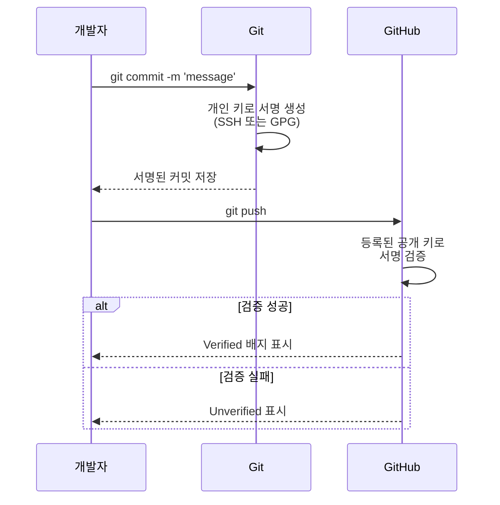
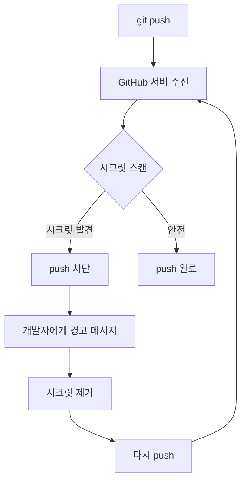
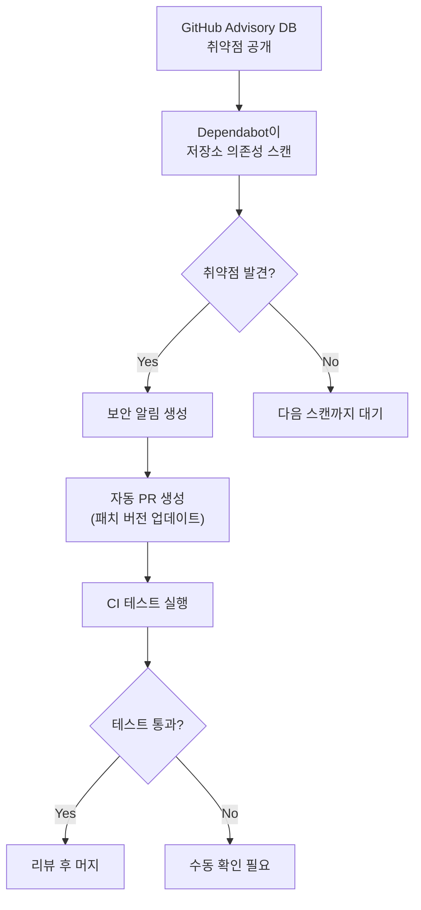
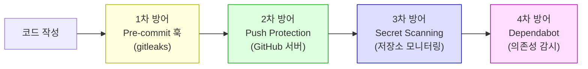

# 보안

> signed commits(GPG/SSH), secret scanning, Dependabot, .gitattributes

## 개요

코드를 안전하게 관리하는 것은 기능 개발만큼이나 중요합니다. Git 저장소에 실수로 API 키가 커밋되거나, 누군가 여러분의 이름으로 커밋을 위조하는 일이 실제로 일어나거든요. 이번 섹션에서는 **커밋 서명**, **시크릿 스캐닝**, **의존성 보안**까지 Git과 GitHub의 보안 기능을 종합적으로 다룹니다.

**선수 지식**: [SSH와 인증](../04-remote/05-auth.md)에서 배운 SSH 키 기본 개념
**학습 목표**:
- GPG 또는 SSH로 커밋에 서명하여 신원을 증명할 수 있다
- GitHub의 시크릿 스캐닝과 push protection을 활용할 수 있다
- Dependabot으로 의존성 취약점을 관리할 수 있다

## 왜 알아야 할까?

2025년 GitGuardian 보고서에 따르면, 전체 조직의 **85%**가 소스 코드에 평문 시크릿(비밀번호, API 키)이 포함되어 있었습니다. GitHub에서만 **1,300만 개 이상**의 API 자격 증명이 공개 저장소에 노출된 적이 있죠. 한번 커밋된 시크릿은 히스토리에 영구히 남아, 저장소를 삭제해도 fork나 클론을 통해 퍼질 수 있습니다.

## 핵심 개념

### 개념 1: 커밋 서명 — "이 커밋은 정말 내가 했다"

> 💡 **비유**: 계약서에 서명을 하는 것과 같습니다. `git config user.name`은 누구나 바꿀 수 있지만, GPG/SSH 서명은 **본인만** 할 수 있는 디지털 서명입니다. GitHub에서 "Verified" 배지가 뜨는 커밋이 바로 서명된 커밋이죠.

> 📊 **그림 1**: 커밋 서명과 검증 흐름




**SSH 서명 (간편한 방법, Git 2.34+):**

```bash
# 이미 SSH 키가 있다면 바로 사용 가능
# SSH 서명 모드 활성화
git config --global gpg.format ssh

# 서명에 사용할 SSH 키 지정
git config --global user.signingkey ~/.ssh/id_ed25519

# 모든 커밋에 자동 서명
git config --global commit.gpgsign true
```

```bash
# 서명된 커밋 생성 (자동 서명이 켜져 있으면 평소처럼)
git commit -m "Verified commit"

# 서명 확인
git log --show-signature -1
```

**GPG 서명 (전통적인 방법):**

```bash
# GPG 키 생성
gpg --full-gen-key
# RSA 4096비트, 본인 이메일 입력

# 키 ID 확인
gpg --list-secret-keys --keyid-format=long
```

```output
sec   rsa4096/ABC123DEF456 2026-02-16 [SC]
```

```bash
# Git에 GPG 키 등록
git config --global user.signingkey ABC123DEF456
git config --global commit.gpgsign true

# 공개 키를 GitHub에 등록
gpg --armor --export ABC123DEF456
# 출력된 키를 GitHub → Settings → SSH and GPG keys → New GPG key에 붙여넣기
```

> 🔥 **실무 팁**: SSH 서명이 GPG보다 설정이 훨씬 간단합니다. 이미 SSH 키를 사용 중이라면 SSH 서명을 추천합니다. GPG는 키 만료일 설정, 하위 키 관리 등 고급 기능이 필요할 때 사용하세요.

### 개념 2: GitHub Secret Scanning — 시크릿 유출 방지

> 💡 **비유**: 공항 보안 검색대를 생각해보세요. 짐을 부치기 전에 X선으로 위험물을 감지하듯, GitHub는 코드를 push하기 전에 시크릿을 감지하여 차단합니다.

> 📊 **그림 2**: GitHub Push Protection 동작 흐름




2025년부터 GitHub는 모든 공개 저장소에서 **push protection을 기본 활성화**했습니다.

```bash
# push protection에 의해 차단된 경우
git push origin main
```

```error
remote: error: GH001: Secret detected in commit abc1234
remote: — GitHub Personal Access Token found in config.js:15
remote:
remote: To push, remove the secret and try again.
remote: See https://docs.github.com/code-security/secret-scanning
```

```bash
# 시크릿 제거 후 재시도
git rm --cached config.js
echo "config.js" >> .gitignore
git commit -m "Remove config with secrets"
git push origin main
```

**시크릿이 이미 push된 경우 — 긴급 대응:**

```bash
# 1단계: 즉시 시크릿 폐기 (서비스 제공자에서)
# → API 키 재발급, 비밀번호 변경 등

# 2단계: 히스토리에서 시크릿 제거
pip install git-filter-repo
git filter-repo --path config.js --invert-paths

# ⚠️ 3단계: 강제 push (팀과 사전 조율 필수!)
git push --force-with-lease origin main
```

### 개념 3: Dependabot — 의존성 취약점 관리

GitHub의 Dependabot은 프로젝트의 의존성을 자동으로 모니터링하고, 보안 취약점이 발견되면 **자동으로 PR을 생성**합니다.

```yaml
# .github/dependabot.yml
version: 2
updates:
  # npm 의존성 자동 업데이트
  - package-ecosystem: "npm"
    directory: "/"
    schedule:
      interval: "weekly"
      day: "monday"
    labels:
      - "dependencies"
      - "security"
    commit-message:
      prefix: "chore(deps):"

  # Python 의존성
  - package-ecosystem: "pip"
    directory: "/"
    schedule:
      interval: "weekly"
```

```bash
# GitHub CLI로 보안 알림 확인
gh api repos/{owner}/{repo}/dependabot/alerts --jq '.[].security_advisory.summary'
```

> 💡 **알고 계셨나요?**: 2025년 기준 846,000개 이상의 저장소가 Dependabot을 사용하며, GitHub Advisory Database에는 28,000건 이상의 검토된 취약점 정보가 등록되어 있습니다. Dependabot은 30개 이상의 패키지 생태계를 지원합니다.

> 📊 **그림 4**: Dependabot 자동 보안 업데이트 워크플로




### 개념 4: .gitattributes로 파일 보안 관리

```bash
# .gitattributes 파일 생성
cat > .gitattributes << 'EOF'
# 줄바꿈 통일 (OS별 차이로 인한 보안 이슈 방지)
* text=auto
*.sh text eol=lf
*.bat text eol=crlf

# 바이너리 파일 명시 (diff에서 제외)
*.png binary
*.jpg binary
*.pdf binary

# LFS 추적 (대용량 파일)
*.mp4 filter=lfs diff=lfs merge=lfs -text
EOF
```

### 개념 5: Pre-commit 훅으로 로컬 보안 강화

```bash
# gitleaks 설치 (시크릿 탐지 도구)
# macOS
brew install gitleaks

# 저장소 스캔
gitleaks detect --source . --verbose

# pre-commit 훅으로 자동화
cat > .git/hooks/pre-commit << 'EOF'
#!/bin/bash
gitleaks detect --staged --verbose
if [ $? -ne 0 ]; then
  echo "시크릿이 감지되었습니다. 커밋이 차단됩니다."
  exit 1
fi
EOF
chmod +x .git/hooks/pre-commit
```

> ⚠️ **흔한 오해**: "pre-commit 훅만 있으면 안전하다" — 로컬 훅은 `--no-verify`로 우회할 수 있습니다. 반드시 **서버 측 보호(GitHub push protection)**와 함께 사용하세요. 방어는 한 겹이 아니라 여러 겹이어야 합니다.

> 📊 **그림 3**: 다계층 보안 방어 체계




## 실습: 직접 해보기

```bash
# SSH 커밋 서명 실습
mkdir security-lab && cd security-lab
git init

# SSH 서명 설정
git config gpg.format ssh
git config user.signingkey ~/.ssh/id_ed25519
git config commit.gpgsign true

# 서명된 커밋 생성
echo "Secure code" > app.js
git add app.js
git commit -m "First signed commit"

# 서명 확인
git log --show-signature -1

# .gitignore 보안 설정
cat > .gitignore << 'EOF'
.env
.env.local
*.key
*.pem
credentials.json
EOF

git add .gitignore
git commit -m "Add security gitignore rules"
```

## 더 깊이 알아보기

2025년 4월, GitHub는 기존 GitHub Advanced Security(GHAS)를 **두 개의 독립 제품**으로 분리했습니다. **GitHub Secret Protection**($19/월)은 시크릿 스캐닝과 push protection에 집중하고, **GitHub Code Security**($30/월)는 코드 스캔(SAST)과 Copilot Autofix를 제공합니다. 중요한 변화는 이제 Enterprise 플랜 없이도 Team 플랜에서 이 기능들을 구매할 수 있다는 것입니다.

GPG의 역사는 1991년 Phil Zimmermann이 만든 PGP(Pretty Good Privacy)로 거슬러 올라갑니다. PGP를 오픈소스로 재구현한 것이 GPG(GNU Privacy Guard)이며, Git은 이 시스템을 활용하여 커밋의 진위를 검증합니다. Git 2.34부터는 SSH 키로도 서명이 가능해져, 별도 도구 없이도 쉽게 커밋 서명을 시작할 수 있게 되었습니다.

## 흔한 오해와 팁

> ⚠️ **흔한 오해**: "비공개 저장소니까 시크릿을 커밋해도 괜찮다" — 비공개 저장소도 팀원 추가, fork, 미러링 등으로 노출될 수 있습니다. 시크릿은 항상 **환경 변수**나 **시크릿 매니저**를 통해 관리하세요.

> 🔥 **실무 팁**: GitHub Actions에서 시크릿을 사용할 때는 `${{ secrets.API_KEY }}`로 참조하세요. 이 값은 로그에 자동으로 마스킹되어 노출되지 않습니다.

> 💡 **알고 계셨나요?**: Git은 현재 SHA-1 해시를 사용하지만, **SHA-256**으로의 전환을 준비하고 있습니다. Git 3.0(2026년 말 예상)에서 SHA-256이 기본이 될 수 있으며, 이는 해시 충돌 공격에 대한 보안을 크게 강화합니다.

## 핵심 정리

| 기능 | 목적 | 설정 난이도 |
|------|------|-----------|
| SSH 서명 | 커밋 신원 증명 | 쉬움 (기존 키 재활용) |
| GPG 서명 | 커밋 신원 증명 (고급) | 보통 (키 생성 필요) |
| Secret Scanning | 시크릿 유출 감지 | 자동 (공개 저장소) |
| Push Protection | push 전 시크릿 차단 | 자동 (2025~) |
| Dependabot | 의존성 취약점 관리 | 쉬움 (YAML 설정) |
| Pre-commit 훅 | 로컬 보안 검사 | 보통 (도구 설치 필요) |

## 다음 섹션 미리보기

보안까지 다루었으니, 마지막 섹션에서는 [Git 생태계와 다음 단계](./05-ecosystem.md) — GitLab, Bitbucket 비교부터 Git 최신 동향, 그리고 이 튜토리얼 이후의 학습 로드맵까지 총정리합니다.

## 참고 자료

- [GitHub Docs - 커밋 서명](https://docs.github.com/en/authentication/managing-commit-signature-verification/signing-commits) - GPG/SSH 서명 공식 가이드
- [GitHub Docs - Secret Scanning](https://docs.github.com/en/code-security/secret-scanning) - 시크릿 스캐닝 설정과 활용
- [GitHub Docs - Dependabot](https://docs.github.com/en/code-security/dependabot) - Dependabot 전체 가이드
- [GitGuardian - State of Secrets Sprawl 2025](https://blog.gitguardian.com/the-state-of-secrets-sprawl-2025/) - 시크릿 유출 현황 리포트
