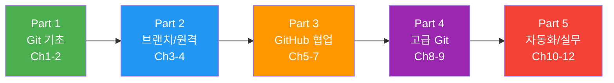

# 2026: Git 완전 정복

> 입문부터 실무까지, Git & GitHub A to Z — **12챕터 56섹션** 튜토리얼

## 학습 로드맵

> 자신의 수준에 맞는 Part부터 시작하세요.

| Part | 대상 | 핵심 키워드 |
|:----:|------|------------|
| **1** | Git이 처음인 분 | init, commit, diff, log, reset, tag |
| **2** | 혼자 Git은 쓰는 분 | branch, merge, remote, push, pull |
| **3** | 팀 협업을 시작하는 분 | GitHub, PR, 코드 리뷰, Issues |
| **4** | 히스토리를 다듬고 싶은 분 | rebase, cherry-pick, stash, reflog |
| **5** | 자동화와 실무 운영 | Actions, CI/CD, 컨벤션, 보안 |

---

## 목차

### Part 1: Git 기초 (Ch1-2, 입문)

**Ch1. Git 시작하기**
- [01. Git이란?](01-git-start/01-what-is-git.md) · [02. 설치와 초기 설정](01-git-start/02-install-setup.md) · [03. 첫 번째 저장소](01-git-start/03-first-repo.md) · [04. 커밋의 기본](01-git-start/04-commit-basics.md) · [05. 변경 추적과 커밋 메시지](01-git-start/05-diff-messages.md)

**Ch2. 파일과 히스토리 관리**
- [01. .gitignore](02-file-history/01-gitignore.md) · [02. 파일 상태 관리](02-file-history/02-file-operations.md) · [03. 히스토리 탐색](02-file-history/03-log-exploration.md) · [04. 되돌리기 기초](02-file-history/04-undo-basics.md) · [05. 태그](02-file-history/05-tags.md)

### Part 2: 브랜치와 원격 (Ch3-4, 초급)

**Ch3. 브랜치**
- [01. 브랜치란?](03-branch/01-branch-concept.md) · [02. 생성과 전환](03-branch/02-create-switch.md) · [03. 병합](03-branch/03-merge.md) · [04. 충돌 해결](03-branch/04-conflict.md) · [05. 브랜치 관리](03-branch/05-branch-management.md)

**Ch4. 원격 저장소**
- [01. 원격 저장소 개념](04-remote/01-remote-concept.md) · [02. clone과 fork](04-remote/02-clone-fork.md) · [03. push와 pull](04-remote/03-push-pull.md) · [04. fetch와 remote 관리](04-remote/04-fetch-remote.md) · [05. SSH와 인증](04-remote/05-auth.md)

### Part 3: GitHub 협업 (Ch5-7, 중급)

**Ch5. GitHub 시작하기**
- [01. 계정과 프로필](05-github-start/01-github-account.md) · [02. 저장소 만들기](05-github-start/02-create-repo.md) · [03. GitHub CLI](05-github-start/03-github-cli.md) · [04. Markdown](05-github-start/04-markdown.md)

**Ch6. Pull Request와 코드 리뷰**
- [01. PR 워크플로우](06-pull-request/01-pr-workflow.md) · [02. 코드 리뷰](06-pull-request/02-code-review.md) · [03. PR 관리](06-pull-request/03-pr-management.md) · [04. 오픈소스 기여](06-pull-request/04-open-source.md)

**Ch7. Issues와 프로젝트 관리**
- [01. Issues 활용](07-issues-projects/01-issues.md) · [02. Projects 보드](07-issues-projects/02-projects.md) · [03. Discussions와 Wiki](07-issues-projects/03-discussions-wiki.md) · [04. 템플릿과 자동화](07-issues-projects/04-templates.md)

### Part 4: 고급 Git (Ch8-9, 중상급)

**Ch8. Rebase와 고급 브랜치 전략**
- [01. Rebase 기초](08-advanced-branch/01-rebase.md) · [02. Interactive Rebase](08-advanced-branch/02-interactive-rebase.md) · [03. Cherry-pick](08-advanced-branch/03-cherry-pick.md) · [04. 워크플로우 전략](08-advanced-branch/04-workflow-strategies.md)

**Ch9. 히스토리 관리와 Git 내부**
- [01. Stash](09-history-internals/01-stash.md) · [02. Reflog와 복구](09-history-internals/02-reflog.md) · [03. Reset 심화](09-history-internals/03-reset-deep.md) · [04. 히스토리 재작성](09-history-internals/04-history-rewrite.md) · [05. Git 내부 구조](09-history-internals/05-git-internals.md)

### Part 5: 자동화와 실무 (Ch10-12, 실무~전문가)

**Ch10. GitHub Actions와 자동화**
- [01. Actions 시작](10-github-actions/01-actions-intro.md) · [02. 워크플로우 작성](10-github-actions/02-workflow-yaml.md) · [03. CI](10-github-actions/03-ci.md) · [04. CD](10-github-actions/04-cd.md) · [05. GitHub Pages](10-github-actions/05-pages.md)

**Ch11. 팀 협업과 도구**
- [01. 브랜치 네이밍](11-team-tools/01-branch-naming.md) · [02. 커밋 컨벤션](11-team-tools/02-commit-convention.md) · [03. 코드 리뷰 문화](11-team-tools/03-review-culture.md) · [04. 모노레포와 서브모듈](11-team-tools/04-monorepo-submodule.md) · [05. GUI 도구](11-team-tools/05-gui-tools.md)

**Ch12. 트러블슈팅과 생태계**
- [01. 흔한 실수와 해결](12-troubleshooting/01-common-mistakes.md) · [02. 대규모 저장소](12-troubleshooting/02-large-repos.md) · [03. Bisect](12-troubleshooting/03-bisect-debug.md) · [04. 보안](12-troubleshooting/04-security.md) · [05. Git 생태계](12-troubleshooting/05-ecosystem.md)

---

**Resources**: [공식 문서](resources/essential-papers.md) · [실습 프로젝트](resources/datasets.md) · [Git 도구](resources/tools.md)

**참고**: [Pro Git Book](https://git-scm.com/book/en/v2) · [Git Docs](https://git-scm.com/docs) · [GitHub Docs](https://docs.github.com) · [GitHub Skills](https://skills.github.com)

**기술 기준**: Git 2.40+ · gh 2.x+ · macOS/Windows/Linux

## 라이선스

[GPL-3.0 License](LICENSE)
